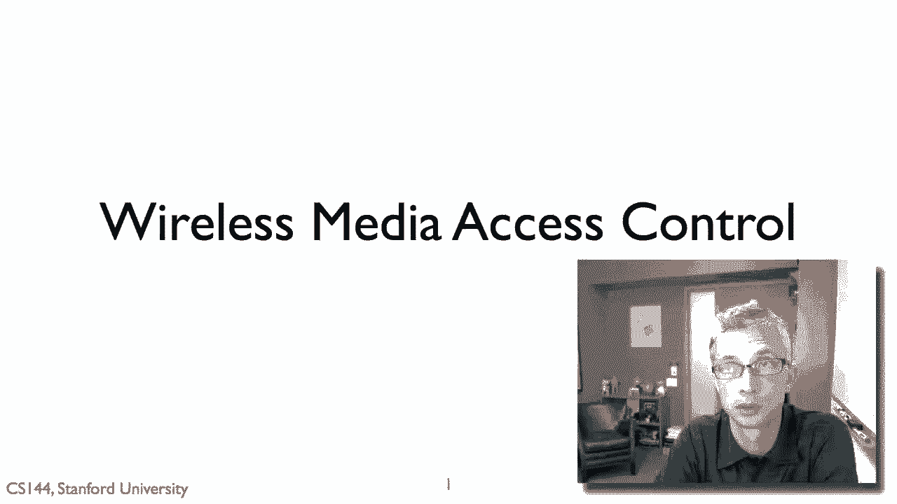
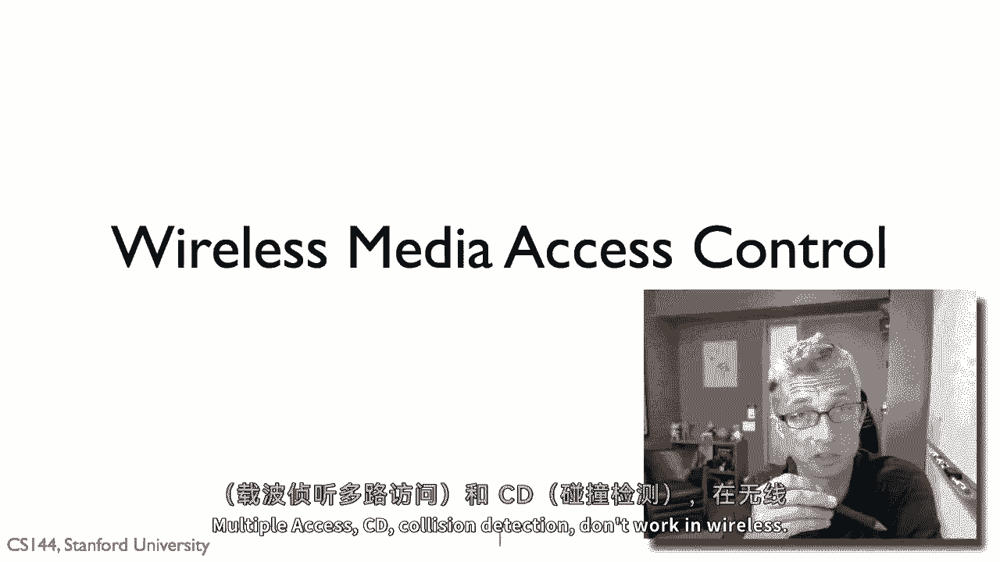
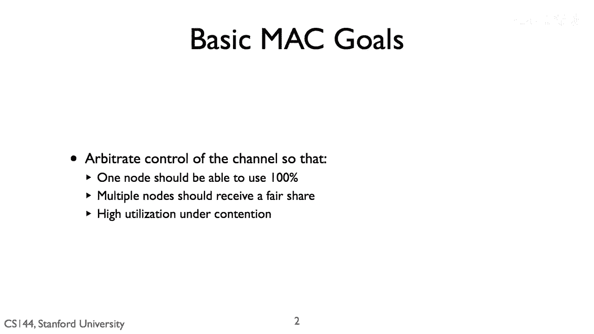
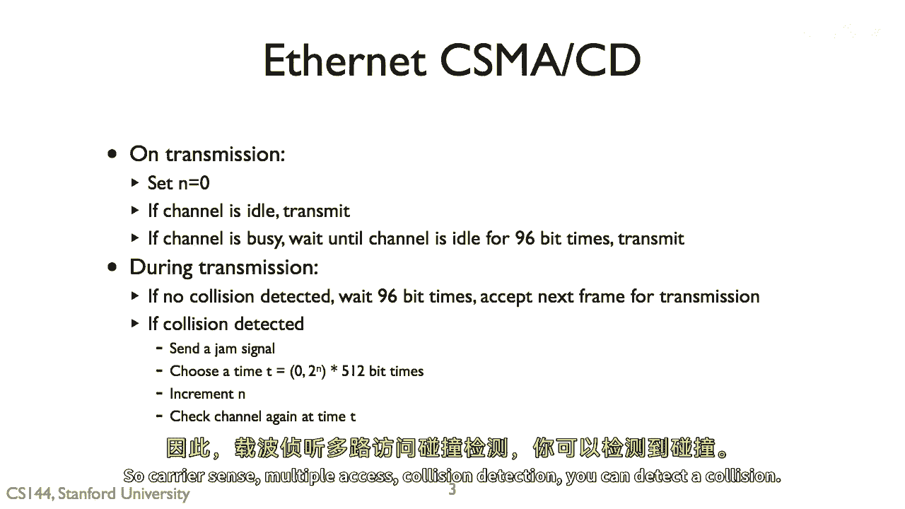
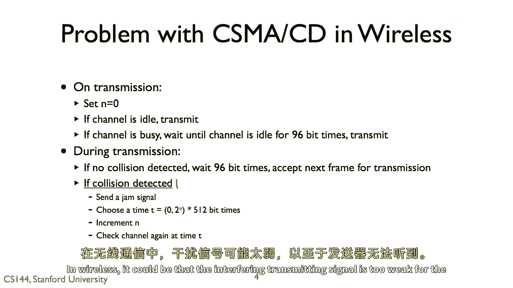
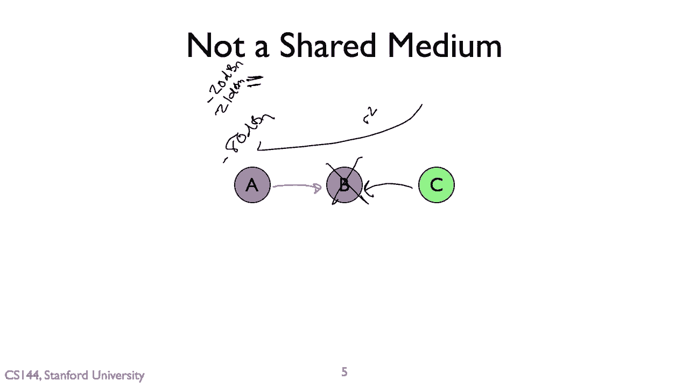

# 📡 课程 P102：无线网络中的媒体访问控制原理

在本节课中，我们将要学习无线网络中的媒体访问控制（MAC）原理，并探讨为何在有线网络中行之有效的经典算法（如CSMA/CD）在无线环境中会失效。

---

## 🎯 媒体访问控制协议的目标

上一节我们介绍了课程主题，本节中我们来看看媒体访问控制协议的基本目标。其核心目标有三项，但无法同时完全实现，需要在它们之间做出权衡。

以下是三项核心目标：
1.  **独占性**：如果只有一个节点希望传输数据，它应当能够占用信道的全部容量。
2.  **公平性**：如果有多个节点试图传输，它们应当各自获得信道的公平份额。
3.  **高效性**：当大量节点竞争信道时，信道应得到充分利用。例如，若每个节点仅能获得千分之一的信道容量，则效率低下。

---

## 🔌 回顾有线网络：CSMA/CD

在深入无线网络之前，我们先回顾一下有线以太网中使用的经典协议：**载波侦听多路访问/碰撞检测（CSMA/CD）**。

其工作流程可以概括为以下步骤：
1.  节点准备发送数据时，首先侦听信道是否空闲（通过检测线缆电压）。
2.  若信道忙，则持续等待直至空闲，并再等待一个96位的时间（即帧间间隙）。
3.  开始传输数据，并在传输过程中持续侦听。
4.  **碰撞检测**：若发送方检测到线缆上的电压信号与其自身发送的信号不符，则判定发生碰撞。
5.  一旦检测到碰撞，立即停止发送，并发送一个阻塞信号以通知所有节点。
6.  执行**指数退避**算法，等待一段随机时间后，重新尝试发送。

这个协议的核心在于发送方能够**实时检测到碰撞**，因为有线信道中信号衰减很小，发送方和接收方对信道状态的感知基本一致。

---

## ❓ 为何CSMA/CD在无线网络中失效？

上一节我们介绍了CSMA/CD的工作原理，本节中我们来看看它在无线环境中面临的根本挑战。问题正出在“碰撞检测”这一步。

在无线网络中，发送方**可能无法检测到发生在接收方的碰撞**。主要原因在于信号随距离急剧衰减，以及发送方自身强大信号的遮蔽效应。

考虑以下场景：
*   节点A正在向节点B发送数据。
*   同时，远处的节点C也开始向节点B发送数据。
*   在节点B处，来自A和C的信号相互干扰，发生碰撞，导致B无法正确接收。
*   然而，对于发送方A而言，节点C的信号由于距离远而非常微弱，加之A自身正在发射强信号，因此A**完全无法感知到C信号的存在**，自然也就无法检测到这次碰撞。

用公式描述信号衰减：信号强度通常与距离的平方成反比（`强度 ∝ 1 / 距离²`）。因此，远距离信号在发送方处可能弱到无法识别。

所以，**CSMA/CD依赖的“边发边听”碰撞检测机制在无线网络中不适用**。

---

## 💎 课程总结

本节课中我们一起学习了：
1.  媒体访问控制协议的三个核心目标：**独占性**、**公平性**和**高效性**。
2.  有线网络中的经典协议**CSMA/CD**的工作流程，其关键在于发送方能实时检测碰撞。
3.  **CSMA/CD在无线网络中失效的根本原因**：由于信号衰减和自身信号遮蔽，发送方无法可靠检测到发生在接收端的碰撞。

理解这一差异是设计有效无线MAC协议（如CSMA/CA）的重要基础。