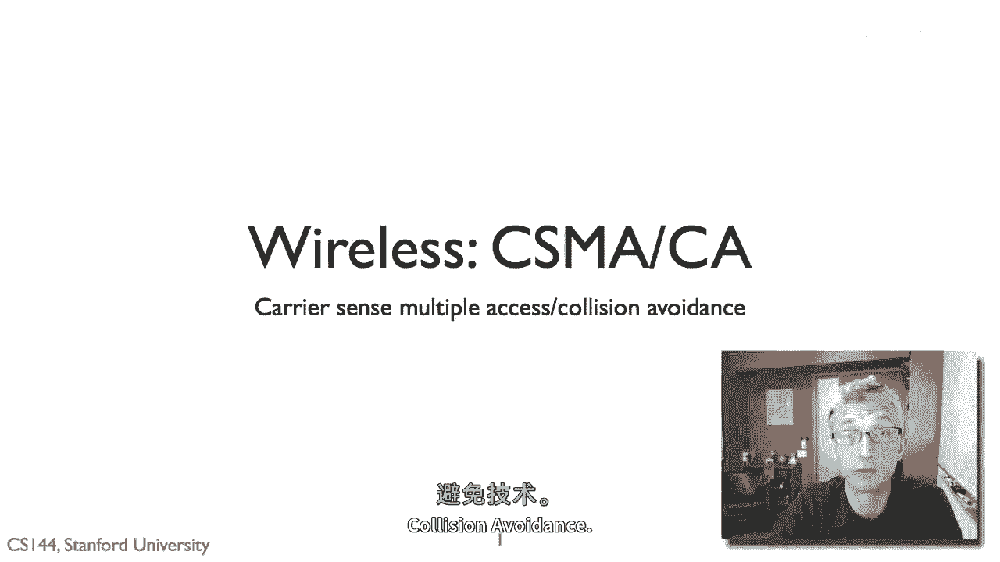

# P103：p102 7-9 Wireless - Principles CSMACA - 加加zero - BV1qotgeXE8D

所以，在这个视频中，我将谈论CSM（碰撞避免）传输器发送多个访问的机制。

这是一种在无线网络中使用的MAC协议或算法。因此，为了无线网络能够检测到碰撞，它需要了解包是否碰撞，或者是否成功送达，因为在无线网络中，由于信号强度的衰减，你不能在接收器处检测到碰撞。

因为你不能直接观察接收器，你需要从接收器那里获取反馈，了解发生了什么，因此，这种机制通常通过链路层确认来实现，所以，想法是，如果，例如，A正在传输一个包，一个数据包给B，如果B成功接收这个包。

那么它会做，发送一个确认包，这个确认包可以非常短，发生在链路层，它不跨越网络的多个跳点，它是直接使用无线以太网在A和B之间，所以，这个的优势是，如果A开始传输，例如，一个数据包给B。

但同时C也在传输数据包，并且两个包碰撞了，那么B不会发送确认，也没有成功接收任何包，它不发送确认，A知道它可能需要重新传输，或者可能需要重新传输，当然，AXE不是完美的，所以可能会发生碰撞，所以。

A可能会做一些不必要的重新传输，但一般来说，A需要B的反馈来知道数据是否成功送达，如果这些非常罕见，那么，就像无线以太网一样，非常罕见一个包不碰撞，但仍然没有成功送达，你可能不需要确认，但是。

由于无线信号强度随时间变化很大，并且数据位错误很常见，这意味着你想要一些积极的反馈。

所以使用linclaacknowledgements，嗯，CA-CA（碰撞避免）机制就是这样工作的，所以，想法是你开始以一个随机的初始后退步，它可以非常小，例如，如果通道空闲，你感知到本地通道。

然后在后退步后传输，所以，基本思想是听，如果通道空闲，然后传输，如果你没有听到确认包，如果你没有收到确认，然后再次后退并重试，以便再次传输，如果你听到数据包被确认，那么你就可以发送下一个数据包。

这是基本的载波感知多址碰撞避免算法。

并且它正在关闭避免，因为你这样做再次后退，所以让我们更具体地看看这个，802。11是什么，所以Wi-Fi，它做什么，所以802。11有两种模式。

一种是csm mac，或者它有许多模式，但是今天大多数人使用的常见模式是csm，它也是另一种常见的模式，相对常见，被称为请求发送清晰发送，我们将在未来的视频中讨论，但是让我们在这里谈谈csm。

所以基本方法是你选择一个初始等待期t，这通常开始时非常小，嗯，发射机做的事情是。

它定期检查频道，如果在那些检查中，频道空闲，它减少t，所以它在倒计时，t，所以t代表发射机想要听到的空闲时间量，在它会传输之前，所以当t达到零时，它如果听到确认，就试图传输，然后接受下一项传输动作。

一切顺利，如果它没有听到确认，它加倍t，所以它会以指数级越来越远地后退，如果t增长到大于某个大型t值，然后它只是丢弃包而不是等待或阻塞给定的包，嗯，它会丢弃那个包并尝试去下一个，所以。

这里是一个简短的概览，这就是我们的发送者s，它选择一个初始的t值，在这里，在这里，通道t是繁忙的，所以它不递减t，它开始递减t，t变为零，在这里，所以，它传输这个包，很遗憾，没有听到确认。

然后它选择一个新的t，这个t的范围是原始t的两倍，它减少这个t，有繁忙的时期，有闲散的时期，最后t减少，让我们称这个t为two，最后t two减少到零，它传输它，这里有一个确认，太好了。

然后继续到下一个数据包传输。

以初始的小t值为后退，所以cma工作，csm ma ca工作得非常好，但它有许多问题确实在实践中发生，所以第一个问题是被称为隐藏终端的东西，嗯，这就是当说我们有这个节点b在中间时发生的。

比如这可能是你的接入点，你有两个节点，"A和C"，" both想要转接到接入点"，所以，csm acca的基本问题是，发送器正在监听，"该频道是否空闲"，当真正关心的是接收器端的通道是否空闲。

"这可能是接收者听到一些东西"，因此，它无法听到传输器的数据包，"但是，发射器无法告诉"，"因为它无法听到接收器的情况"，"它想要感知接收器的状态"，但是实际上只能感知到自己的。

所以隐藏终端是当两个节点，比如a和c都试图向接收器传输，或者甚至向相邻的接收器，嗯，而且接收器可以听到两者，所以b可以听到a和c，但是a和c不能听到彼此，所以a是隐藏的，对c也是隐藏的，因此。

A开始传输，B开始接收数据包，C没有听到它，所以C说A很高，我认为信道清晰，它传输B，这里是C，由于数据包的存在，有碰撞，B这里什么都没有，两者都丢失，所以这是这个csm a无法解决的问题。

因为你在局部感知，但你想要感知接收器正在发生的事情。

所以你可以想象这在ap网络中发生的情况很多，所以第二个问题是被称为暴露终端的问题，这是与隐藏终端相反的一种情况，所以想象这种情况，b想要向a发送一个包，而c想要向d发送一个包，但现在a听不到c。

所以a听不到c，将要发生什么，B开始向A传输，一切良好，现在正在接收包，C想要向D传输，但D在这里无法接收，是，因此这很好，D绝对有能力从C接收包，同时B正在传输，但C扫描其本地频道，并听到啊哈，等待。

等待，B正在传输，我无法传输，因此它不传输，因此C暴露给B，因此，而隐藏终端是一种情况，当一个人应该传输时他们传输，当一个人不应该传输时，他们暴露终端。

在cc中发生的第三个问题，甚至在一般的无线网络中都是，假设我们有我们的节点，a和b以及a向b发送一个包，但是，没有确认，所以，这是因为发生了碰撞吗，那就是有一些其他节点c在同一时间也在传输，并且干扰了。

或者是因为这突然a和b之间的通道变得很差，那就是信号到噪声比下降了，有微弱的信号，比如说，你知道，有人，某个人，嗯，在，嗯，来自罐子的两个人无法确定，不知道这是否是由于碰撞还是信号差导致的损失。

你可以想象它可能会以不同的方式回应，因为碰撞想要后退，因为我不能不想与频道竞争，但如果是由于低信噪比，然后它可能想要降低其比特率，传输速度减慢，因此它可以支持更多的位错误，因为它们是由于，嗯。

信号强度较低，因此经常存在这个问题，现在人们开始解决这个问题并找出答案，但在a试图向b传输时，它由于碰撞而丢失，a将其解释为snr低，因此它开始传输较慢的位率，这意味着其包更长，这增加了碰撞的机会。

或者a向b传输时，它认为这是因为碰撞，所以它后退更多，实际上，如果它立即再次传输，它将没有问题，因此，在标准的cma中，一个简单的cma算法区分这两种情况，实际上是非常困难的，尽管如此。

因为它是如此简单，并且在没有巨大的竞争的情况下，当你有良好的snr时，cma工作得很好。

