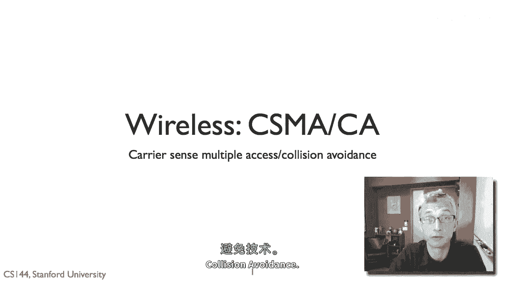
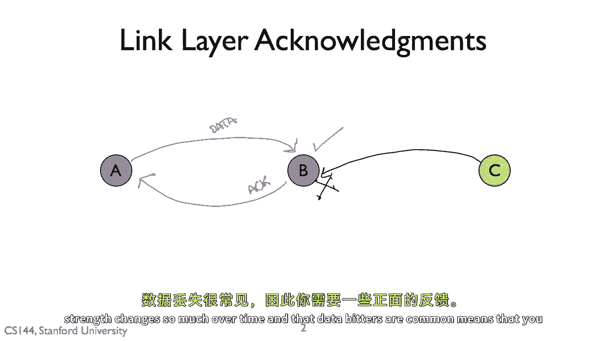
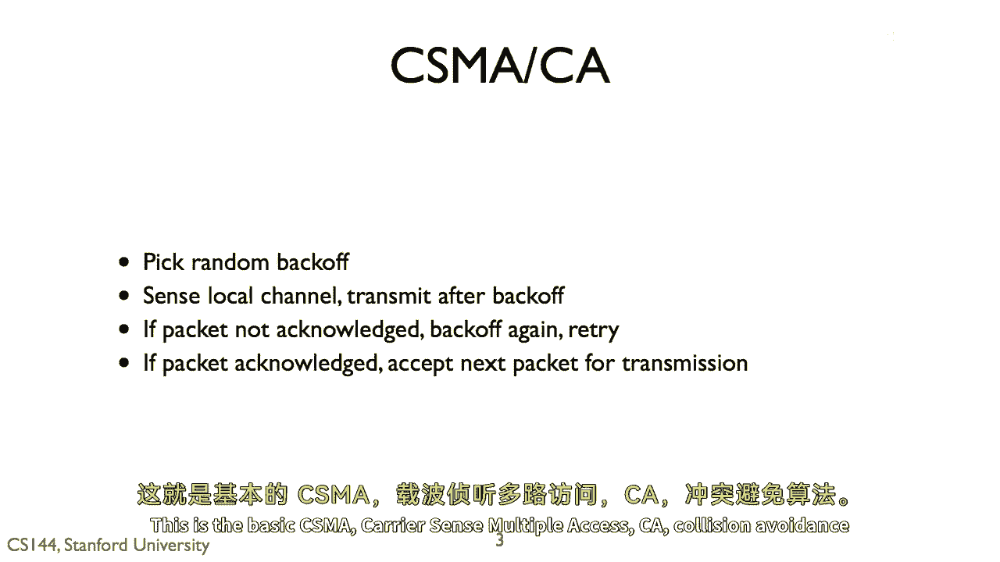
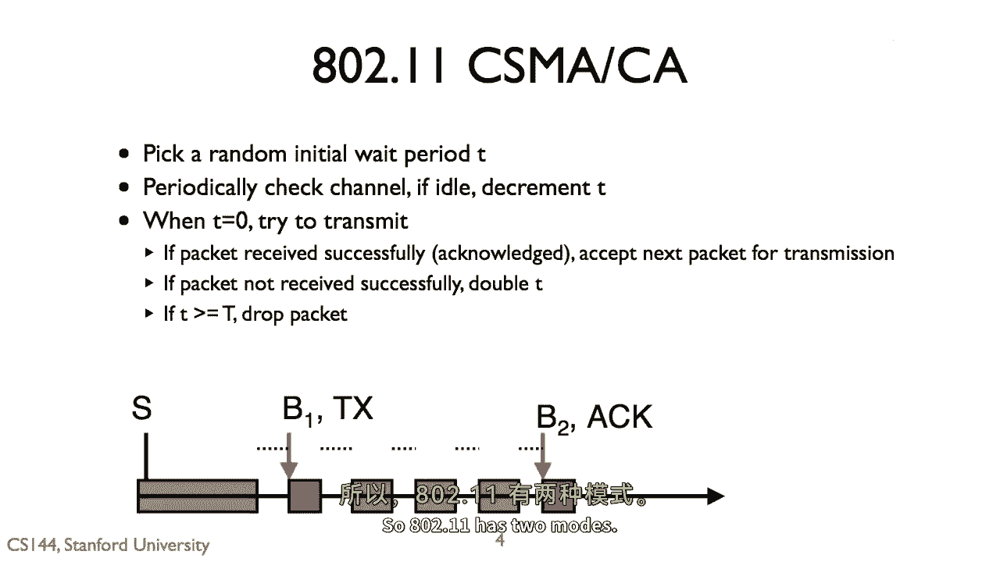
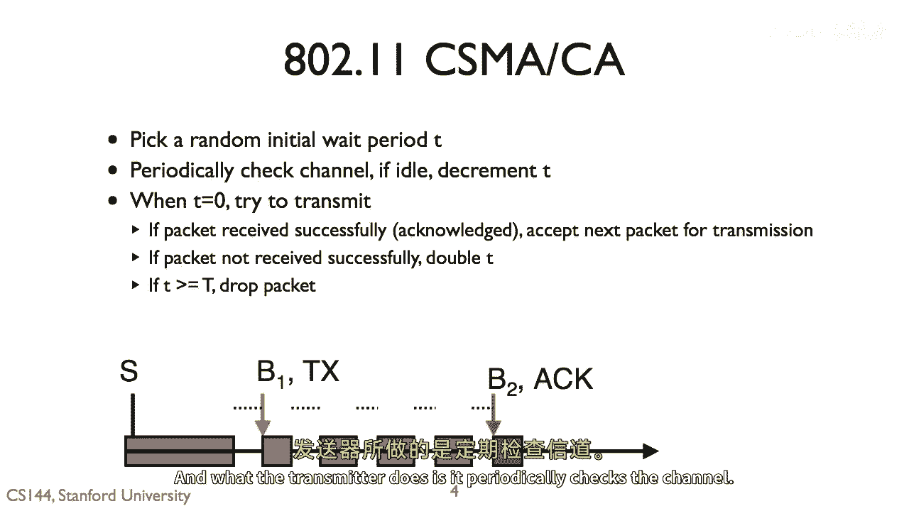
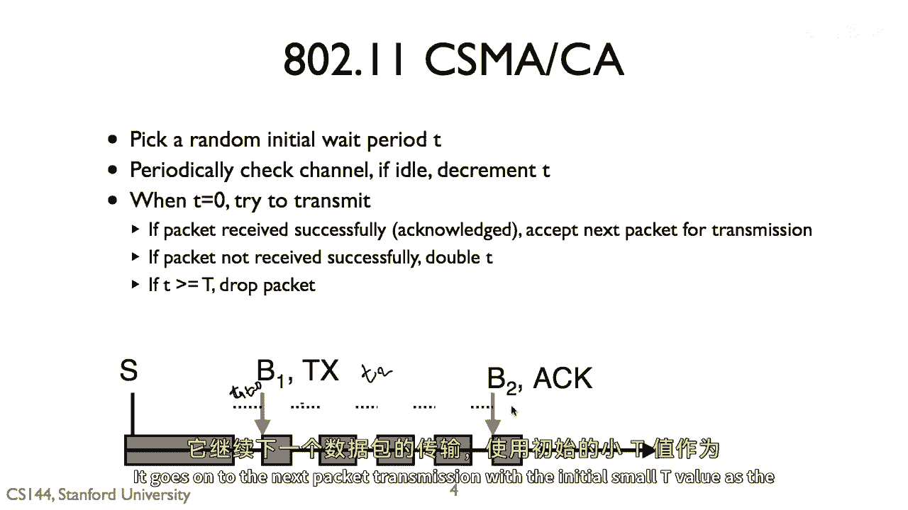
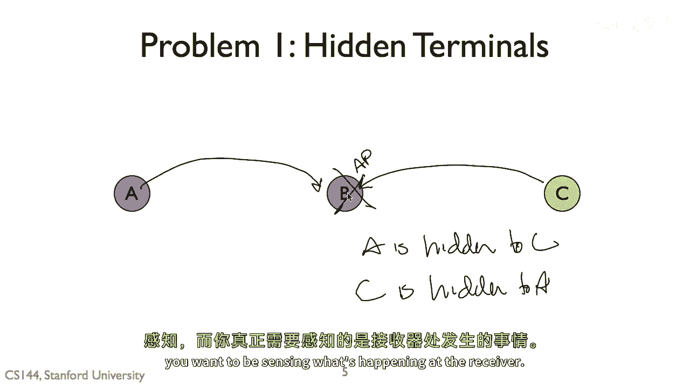
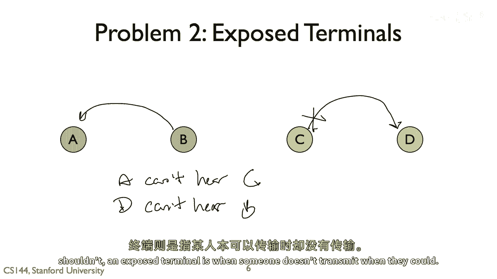
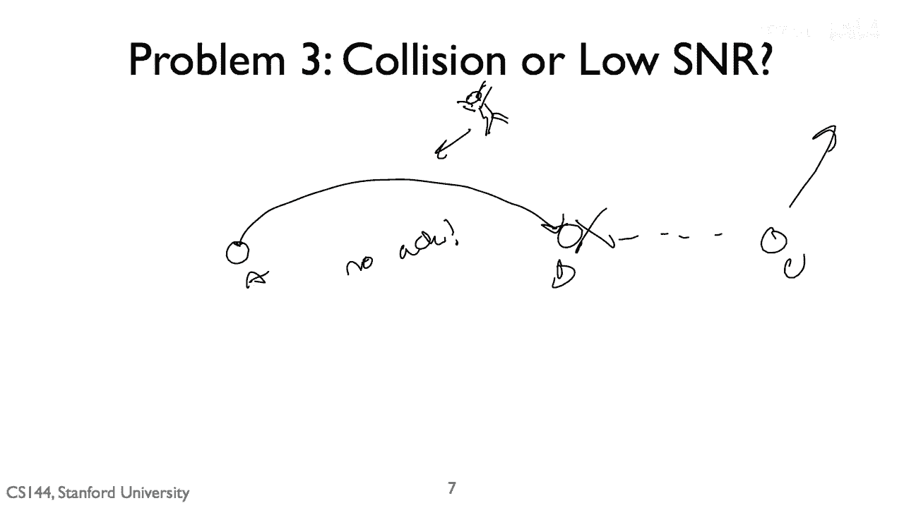

# 计算机网络课程 P103：CSMA/CA 原理详解 📡



在本节课中，我们将要学习无线网络中一种关键的媒体访问控制协议——载波侦听多路访问/碰撞避免。我们将探讨其工作原理、具体实现步骤以及在实际应用中面临的主要挑战。

---

## 概述

CSMA/CA 是一种在无线网络中广泛使用的 MAC 协议。由于无线信号衰减的特性，发送方无法像在有线网络中那样直接检测到数据包在接收端是否发生了碰撞。因此，该协议引入了一套机制，通过接收方的反馈来避免和应对碰撞。

---

## CSMA/CA 的基本原理 🧠



上一节我们介绍了 CSMA/CA 的设计动机，本节中我们来看看它的核心工作流程。

其核心思想是：发送方在传输数据前先侦听信道。如果信道空闲，则等待一段随机时间后发送数据。发送后，发送方会等待接收方返回一个链路层的确认帧。如果收到确认，则认为传输成功；如果没有收到确认，则推断可能发生了碰撞或传输错误，并执行“后退”算法，等待更长时间后重试。



以下是 CSMA/CA 的关键步骤：
1.  **载波侦听**：发送前侦听无线信道是否空闲。
2.  **随机后退**：如果信道空闲，等待一个随机的退避时间。
3.  **数据传输**：退避时间结束后，发送数据帧。
4.  **等待确认**：发送后，等待接收方返回的 ACK 确认帧。
5.  **退避重试**：若未收到 ACK，则执行指数退避算法，增大等待窗口后重试。

---



## 802.11 Wi-Fi 中的实现 🔧

了解了基本原理后，我们具体看看它在 802.11（Wi-Fi）标准中是如何实现的。802.11 有多种模式，其中最常见的是 CSMA/CA 模式。



发送方会选择一个初始的退避时间 `T`。其工作流程可以描述为以下伪代码：

```pseudocode
初始化退避时间 T = 随机小值
循环：
    while 信道繁忙：
        暂停递减 T
    while 信道空闲 且 T > 0：
        T = T - 1
    if T == 0：
        发送数据包
        等待 ACK
        if 收到 ACK：
            传输成功，为下一个包选择新的小T值
        else：
            T = T * 2  # 指数退避
            if T > 最大阈值：
                丢弃当前数据包，处理下一个
```

流程简述如下：
*   发送方持续侦听信道。
*   当信道空闲时，开始递减退避计时器 `T`。
*   当 `T` 减至 0 时，立即发送数据。
*   若成功收到确认（ACK），则重置 `T` 为一个较小的随机值，准备发送下一帧。
*   若未收到 ACK，则将 `T` 值加倍（指数退避），然后重新尝试侦听和发送。如果 `T` 超过某个上限，则丢弃当前帧。

这种指数退避机制有效地减少了在信道繁忙时发生连续碰撞的概率。



---

## CSMA/CA 面临的挑战 ⚠️

尽管 CSMA/CA 非常有效，但在复杂的无线环境中，它仍然面临几个经典问题。

### 1. 隐藏终端问题

隐藏终端是指两个互不可见的节点（A 和 C）同时向一个都能看见的中间节点（B，如接入点）发送数据的情况。

**问题描述**：A 和 C 都在 B 的通信范围内，但彼此不在对方的通信范围内。当 A 向 B 发送数据时，C 侦听本地信道发现是空闲的（因为它听不到 A 的信号），于是 C 也开始向 B 发送数据，导致两个信号在 B 处发生碰撞。而 A 和 C 都无法直接感知到这次碰撞。



### 2. 暴露终端问题

暴露终端是与隐藏终端相反的问题。

**问题描述**：节点 B 向 A 发送数据，同时节点 C 想向 D 发送数据。C 能听到 B 的信号，但 D 听不到 B 的信号（即 B 和 D 互不在通信范围内）。当 C 侦听信道时，会听到 B 正在传输，因此认为信道繁忙而推迟向 D 的发送。但实际上，C 向 D 发送数据并不会干扰 B 到 A 的传输。这就导致了信道利用率下降。

### 3. 碰撞与信号衰减的混淆



在无线网络中，数据包丢失可能由两种原因导致：**碰撞** 或 **信号质量差（低信噪比）**。

**问题描述**：发送方 A 未收到接收方 B 的 ACK。A 无法区分这是因为有另一个节点 C 同时发送造成碰撞，还是因为 A 与 B 之间的信道突然变差导致信号无法正确解码。这两种原因需要不同的应对策略：
*   如果是**碰撞**，应执行**退避**，减少竞争。
*   如果是**信号差**，应**降低传输速率**，使用更稳健的编码。

标准 CSMA/CA 无法区分二者，可能采取错误策略，例如在信号差时不断退避，或在碰撞时错误地降低速率，反而可能加剧问题。

---

## 总结

本节课中我们一起学习了无线网络的核心协议 CSMA/CA。
*   我们首先了解了它通过**载波侦听**、**随机退避**和**链路层确认**来避免碰撞的基本原理。
*   接着，我们剖析了它在 **802.11 Wi-Fi** 中的具体实现，包括其指数退避算法。
*   最后，我们探讨了它在实际部署中面临的三大挑战：**隐藏终端**、**暴露终端**以及**无法区分碰撞与信号衰减**。



理解这些原理和挑战，是深入学习无线网络技术和更高级 MAC 协议（如 RTS/CTS）的重要基础。