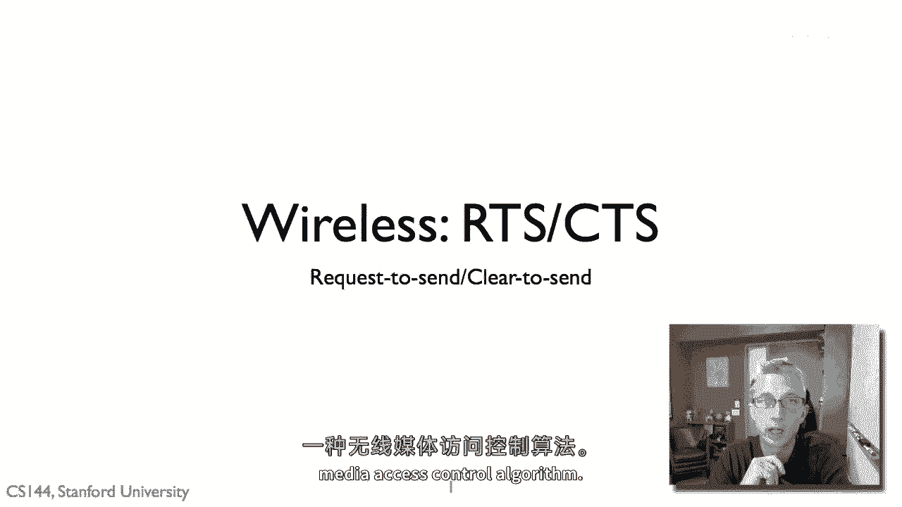
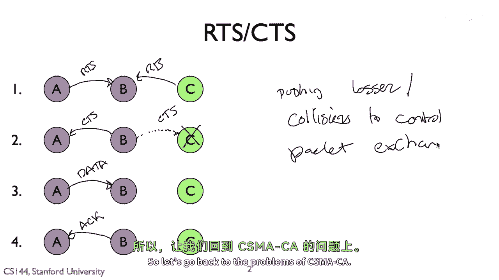
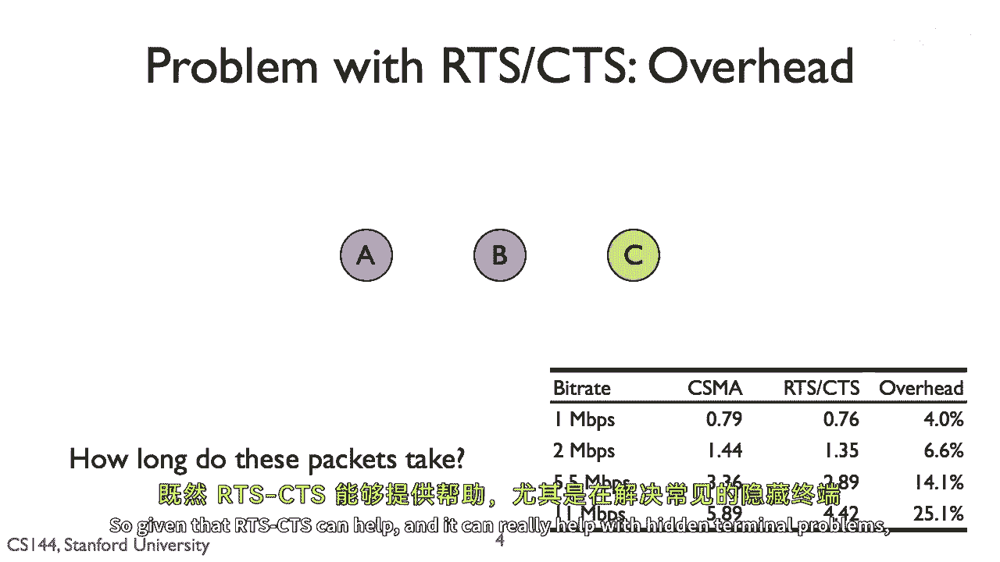
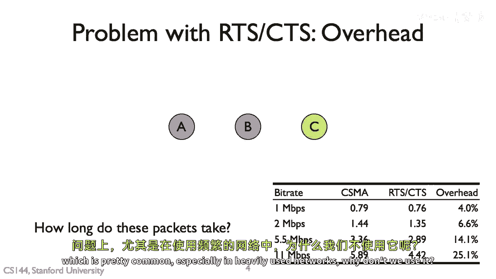
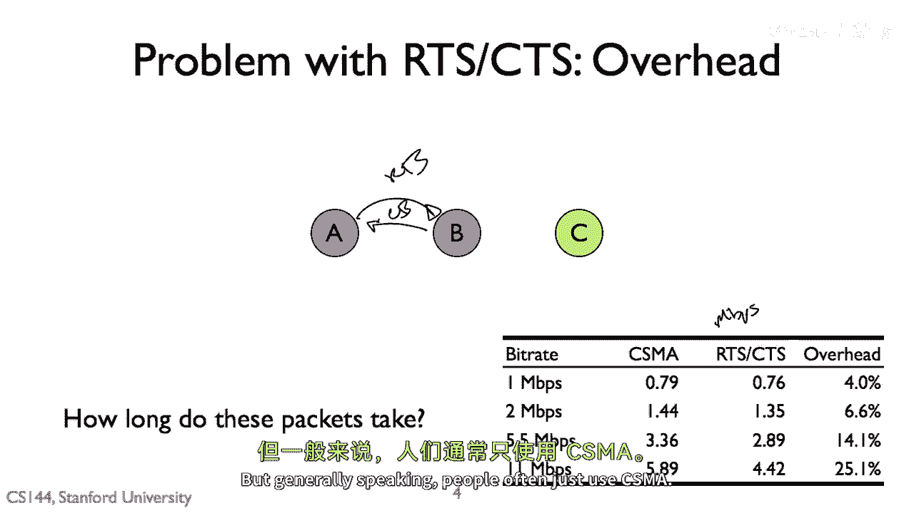

# 📡 课程 P104：无线网络中的 RTS/CTS 机制

在本节课中，我们将要学习无线媒体访问控制中的一种重要机制——请求发送/允许发送（RTS/CTS）。我们将探讨其工作原理、如何解决隐藏终端问题，以及它为何没有被广泛使用的原因。

---

## 🔍 RTS/CTS 机制概述

上一节我们介绍了无线网络中的基本访问控制问题。本节中我们来看看一种旨在解决这些问题的具体机制：RTS/CTS。

RTS/CTS 使用一组短的控制数据包，来确认信道是否安全以传输数据。考虑三个节点 A、B 和 C。A 能听到 B，B 能听到 C，但 A 和 C 无法听到彼此。

在 RTS/CTS 交换中，节点不会立即发送数据包。其过程如下：

以下是 RTS/CTS 交换的基本步骤：
1.  **第一步**：节点 A 发送一个称为“请求发送”（RTS）的短控制包。该消息询问节点 B：“我可以发送一个持续时间为 X 的数据包吗？”
2.  **第二步**：如果节点 B 成功接收到 RTS，并且认为信道空闲（例如，附近没有其他节点在传输），它将以“允许发送”（CTS）包回应。CTS 告知节点 A 可以在此时间段内发送数据。
3.  **第三步**：关键点在于，节点 C 虽然听不到 A 的 RTS，但能听到 B 发出的 CTS。因此，节点 C 知道 B 即将接收数据，从而知道自己应该在该时间段内保持静默，避免传输。
4.  **第四步**：节点 A 在收到 CTS 后发送数据。
5.  **第五步**：节点 B 在成功接收数据后，发送确认（ACK）回传给节点 A。

这就是基本的 RTS/CTS 交换流程：`RTS -> CTS -> DATA -> ACK`。如果节点 A 发送 RTS 后没有收到 CTS，它可以采用标准的退避算法（例如指数退避）稍后重试。

RTS/CTS 的重点在于，它并不能完全消除隐藏终端问题，而是将数据包碰撞的风险转移到了控制包的交换阶段。例如，如果 A 和 C 同时向 B 发送 RTS，则 RTS 包会发生碰撞，但这只会导致控制包重传，而不会造成实际数据包的丢失。

---

## ⚖️ RTS/CTS 对各类问题的效果

上一节我们描述了 RTS/CTS 的工作流程。本节中我们来看看它如何应对 CSMA/CA 中常见的几个问题：隐藏终端、暴露终端以及碰撞或低信噪比（SNR）。

以下是针对每个问题的分析：
*   **隐藏终端问题**：RTS/CTS 无法彻底解决此问题。例如，如果 B 发出的 CTS 包因为其他节点正在传输而未被 C 听到，隐藏终端问题仍可能发生。但 RTS/CTS 通过 CTS 包清空接收方周围的信道，**极大地减少**了隐藏终端问题发生的概率。
*   **暴露终端问题**：RTS/CTS 在实践中对暴露终端问题帮助不大。假设 B 向 A 发送 RTS/CTS 准备传输，而 C 想向 D 传输。C 听不到 B 的 RTS 也听不到 A 的 CTS，理论上它可以向 D 传输。但实际上，C 通常不会传输，因为它之后可能会干扰 A 发回给 B 的 ACK 确认包。
*   **碰撞或低 SNR 问题**：RTS/CTS 通过减少隐藏终端引起的碰撞，间接有助于缓解因碰撞导致的数据丢失。但它不能直接解决信号弱或信噪比低的问题。

综上所述，RTS/CTS 机制**对解决常见的隐藏终端问题非常有帮助**。

---

## 💡 为何 RTS/CTS 未被主流采用？

既然 RTS/CTS 有助于解决隐藏终端问题，尤其是在网络负载较重时，那么我们为什么不始终使用它？为什么当今主流的 Wi-Fi 系统仍主要使用 CSMA/CA？

核心原因在于**开销**。

回忆 RTS/CTS 的数据包交换流程：`RTS -> CTS -> DATA -> ACK`。问题在于这些控制包（RTS 和 CTS）的传输时间。

在 Wi-Fi 中，数据包可以根据信道条件使用很高的速率（如采用密集的调制星座）发送。然而，控制包（RTS、CTS）需要确保所有可能范围内的节点都能听到，因此**必须始终以最低的物理层速率发送**。

考虑一个例子：假设网络支持 1, 2, 5.5 和 11 Mbps 四种速率。数据包可以用高速率发送，但 RTS/CTS 控制包只能用 1 Mbps 的速率发送。

以下是随着数据速率提升，开销变化的影响：
*   在低数据速率（如 1 Mbps）下，数据包本身传输时间就长，短小的控制包带来的额外开销占比相对较小。
*   但在高数据速率（如 11 Mbps）下，数据包传输得非常快，时间很短。而此时，以低速传输的、固定大小的 RTS/CTS 控制包在总传输时间中所占的**比例显著增大**，成为巨大的开销。

研究表明，在 11 Mbps 的网络上，使用 CSMA/CA 可能获得约 5.8 Mbps 的实际吞吐量，而启用 RTS/CTS 后，吞吐量可能下降至 4.4 Mbps，**降低了约四分之一**。如果网络本身空闲，碰撞很少，那么启用 RTS/CTS 只会带来性能损失。

因此，一种折中的方法是：在网络运行良好、丢包率低时，使用基本的 CSMA/CA；当检测到碰撞增多、隐藏终端问题严重时，再动态切换到 RTS/CTS 模式以获得更好的信道仲裁。尽管有相关研究，但出于对开销的考虑，RTS/CTS 并未成为默认的全局设置。

---

## 📝 课程总结

本节课中我们一起学习了无线网络中的 RTS/CTS 机制。我们了解了它通过 `RTS -> CTS -> DATA -> ACK` 的四步握手来预约信道，能有效减少隐藏终端问题。同时，我们也明白了由于其控制包必须低速传输，在高数据速率网络中会引入显著的开销，导致吞吐量下降，这解释了它未被 Wi-Fi 主流默认启用的原因。这种机制体现了网络设计中在**冲突解决**与**传输效率**之间进行的典型权衡。