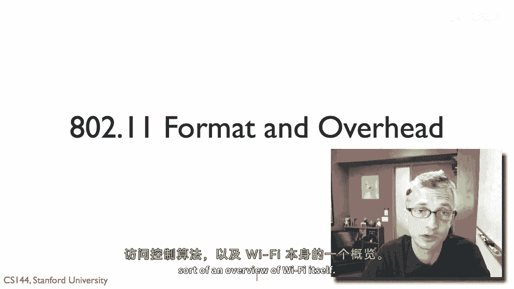
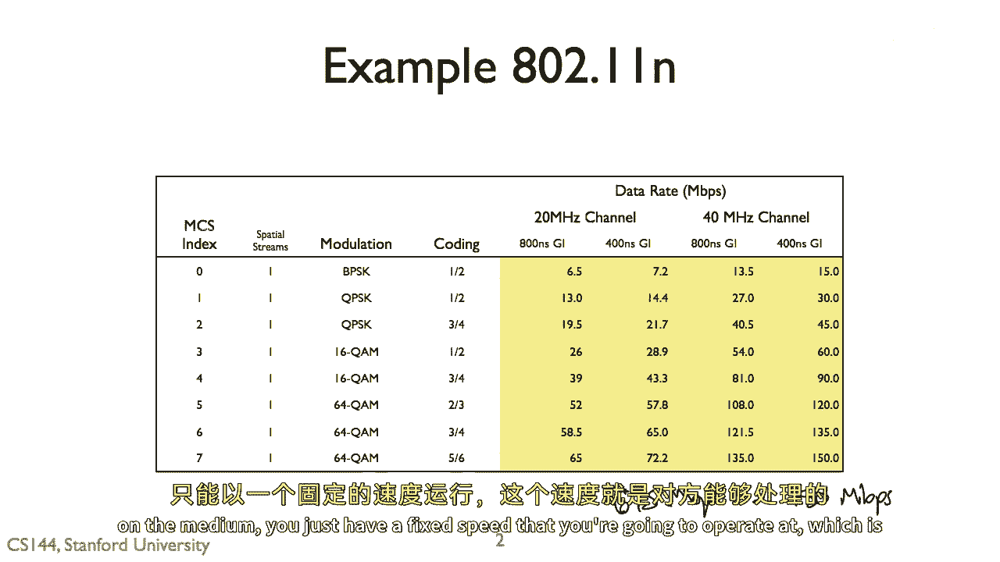
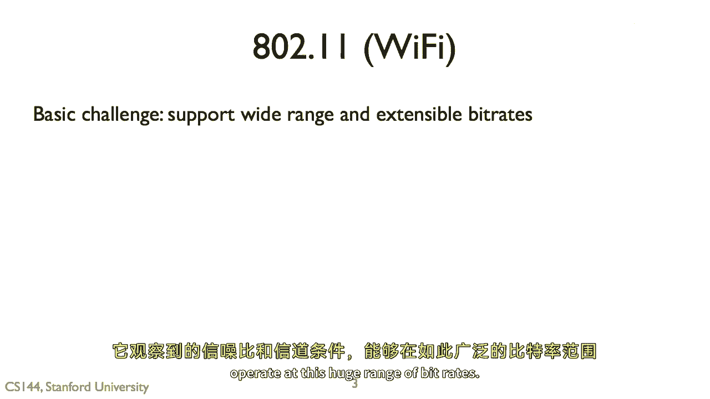
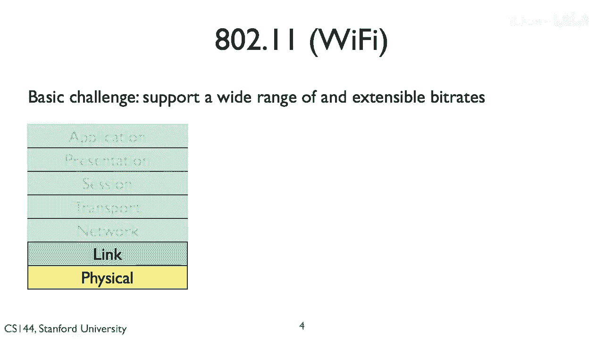
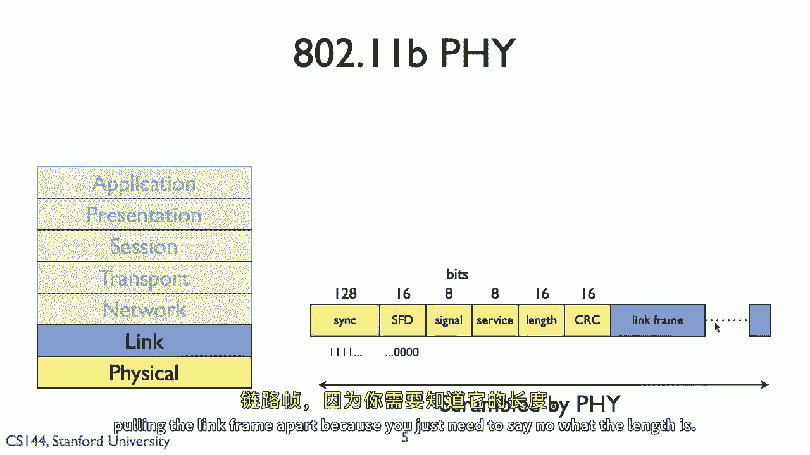
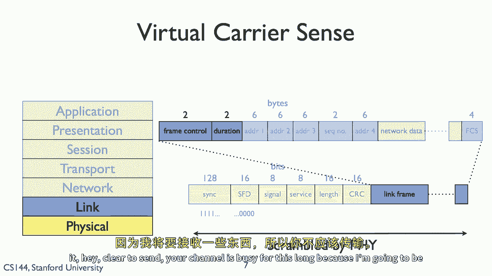
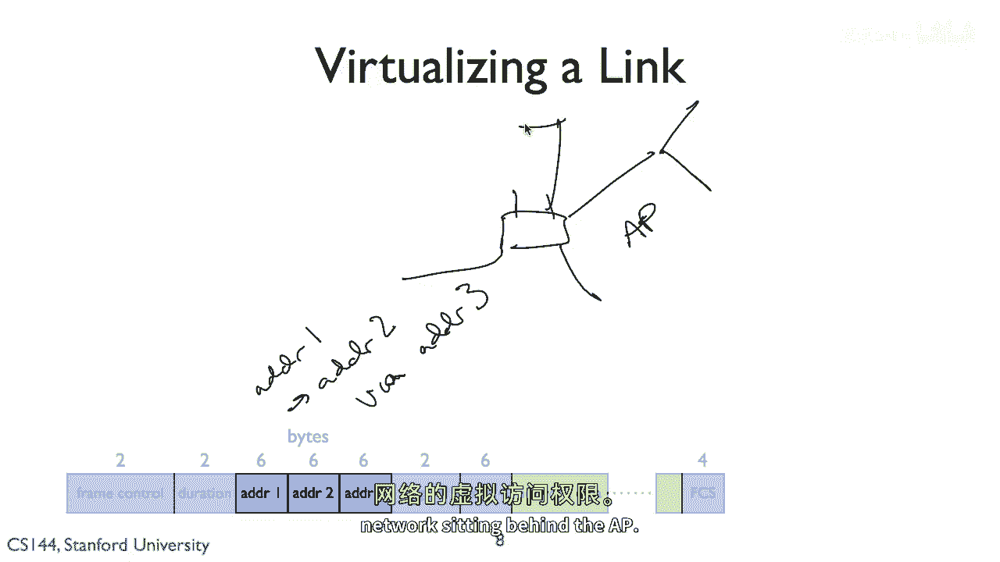
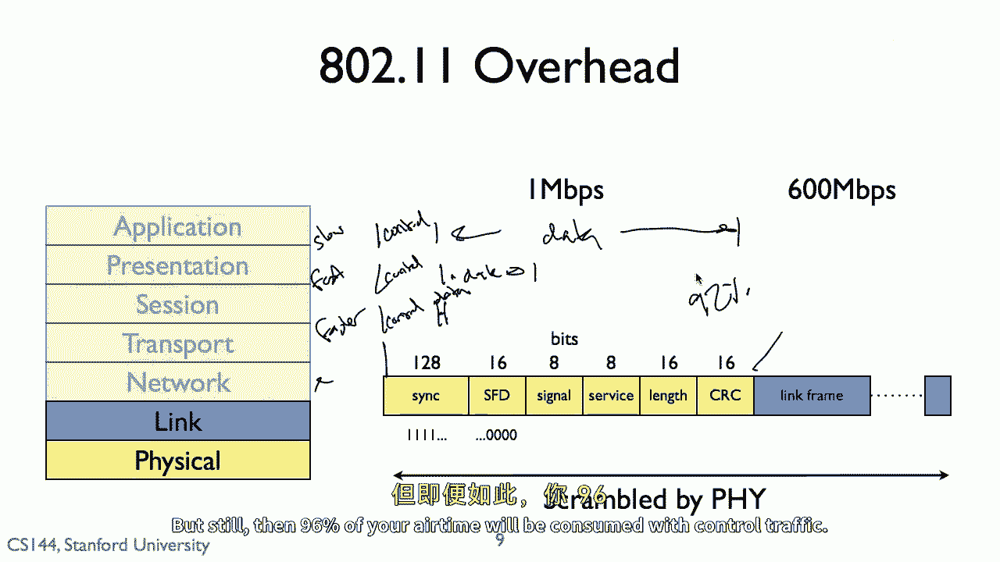
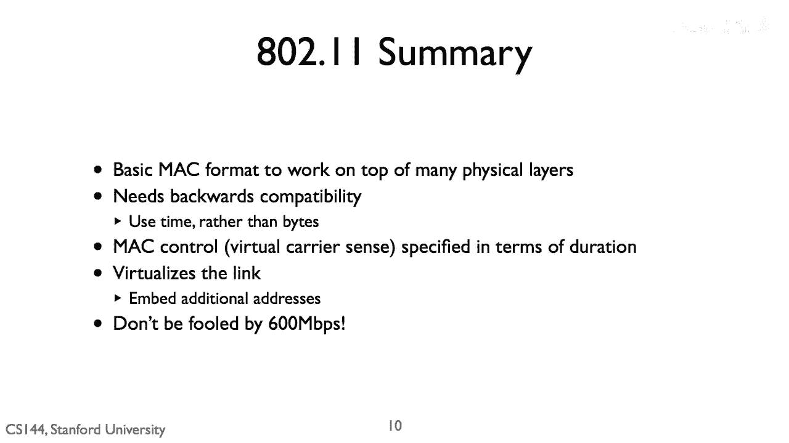

# 课程 P105：Wi-Fi (802.11) 原理详解 🛰️

在本节课中，我们将深入探讨 802.11（即 Wi-Fi）的技术细节。我们将学习其数据包格式、如何使用不同的介质访问控制算法，并对 Wi-Fi 技术有一个全面的概述。

## 自适应速率与调制编码方案 📶

上一节我们介绍了 Wi-Fi 的基本概念，本节中我们来看看 Wi-Fi 如何根据信道条件自适应调整速率。

Wi-Fi 标准（如 802.11n）可以在不同的速度下运行，这取决于所使用的调制和编码方案。**调制编码方案索引** 是数据包中的一个字段，它指明了数据部分是如何被调制和编码的。

802.11 标准使用从**二进制相移键控**到**64正交振幅调制**等多种调制方式，编码率从 **1/2** 到 **5/6** 不等。

这意味着，一个 802.11n 链路的数据速率会根据观测到的**信噪比**进行自适应调整，范围从 **6.5 Mbps** 到 **150 Mbps**，速度差异超过 20 倍。因此，Wi-Fi 能够根据频谱和时间的状况，在一个非常宽的速率范围内进行适配。

与有线系统相比，这是一个关键优势。因为有线介质的信噪比是固定的，所以只能以固定速度运行。而 Wi-Fi 可以根据信道条件动态调整其速率。

## 物理层与链路层帧结构 📡

了解了速率自适应原理后，我们来看看实现这一机制的具体帧结构。这发生在物理层和链路层。

以下是 802.11b 物理层帧的构成：

1.  **同步位**：一系列用于让接收方检测并确认这是 Wi-Fi 信号（而非噪声）的位。
2.  **帧起始分隔符**：一个特定的比特序列，标志着同步阶段的结束。
3.  **物理层头部**：包含信号、服务、长度和 CRC 信息的字段。这部分数据会经过前向纠错编码和交织等技术处理，以抵抗比特错误。接收方必须完整无误地接收此头部，才能开始解析后续数据。

在链路层（MAC 层）帧中，包含以下主要字段：

*   **帧控制字段**：提供关于帧类型和特征的控制信息。
*   **持续时间字段**：指示此数据包或整个数据交换将持续多长时间。这对于虚拟载波侦听至关重要。
*   **地址字段**：最多可包含四个地址，通常包括源地址和目的地址，用于实现诸如跨网络转发等功能。
*   **序列号**：用于数据包排序。
*   **网络层数据**：来自上层协议的数据载荷。
*   **帧校验序列**：一个 **4 字节的 CRC**，用于检错。

## 关键字段：持续时间与虚拟载波侦听 ⏱️

上一节我们列出了链路层帧的各个字段，本节我们重点分析其中两个关键字段：**帧控制字段**和**持续时间字段**。

**持续时间字段** 用于告知所有能侦听到该数据包的节点（包括接收者），此次传输或后续的帧交换（如 RTS/CTS/数据/ACK）将占用信道多长时间。这样，即使其他节点因为速率太快而无法解调数据部分，它们也知道信道将在该时段内繁忙，从而避免冲突。

这里的核心机制是 **虚拟载波侦听**。在 CSMA/CA 算法中，节点通过物理侦听（实际载波侦听）或通过解读数据包中的“持续时间”信息（虚拟载波侦听）来判断信道是否繁忙。例如，一个 CTS 控制包中的持续时间字段，可以告诉周围节点：“信道将在接下来 X 微秒内繁忙，请勿发送”。

## 地址字段与链路虚拟化 🌉

除了控制信道访问，802.11 帧头中的地址字段还支持链路虚拟化功能。

通常情况下，帧中包含源地址和目的地址。但通过使用多个地址字段，可以实现更复杂的功能。例如，一个无线客户端（地址1）可以通过接入点（地址2）向有线网络上的另一台设备（地址3）发送数据。接入点就像一个网桥，利用这些地址信息将数据包从无线域转发到有线域，从而虚拟化了对有线网络的访问。

## 向后兼容性与开销问题 ⚖️

在了解了帧结构的功能后，我们必须面对一个现实问题：**开销**。

由于 RTS/CTS 等控制帧以及物理层头部的存在，会产生显著的开销。在 11 Mbps 的速率下，开销可能高达 25%。这归根于 802.11 的一个基本设计矛盾：它需要支持巨大的速率范围，同时又必须保持**向后兼容性**。

这意味着，无论实际数据传输速率多高（例如 600 Mbps），物理层头部都必须以**所有设备都能理解的最低速率**（例如 1 Mbps）进行发送。因为只有这样，所有监听设备（包括旧设备）才能正确解析持续时间等关键控制信息。

思考这个问题的方式是：当链路速率很慢时（如 1 Mbps），控制头部所占时间比例较小。但当数据速率变得极快时（如 600 Mbps），发送同样比特数的控制头部所需的时间虽然不变，但相对于飞速传输的数据部分，这部分“慢速”发送的控制信息会占据数据包空中时间的绝大部分。

研究表明，在以 600 Mbps 最快速率操作时，控制序列可能占据总传输时间的 **92%**，而仅有 **8%** 的时间用于发送有效数据。因此，即使数据速率翻倍，实际吞吐量的提升也微乎其微，因为绝大部分时间仍被控制开销所占据。这就是 **收益递减** 效应。

## 总结 📝

本节课中，我们一起学习了 Wi-Fi (802.11) 的核心原理。

我们了解到，802.11 使用 **MCS 索引** 支持基于信噪比的自适应速率调整。其帧结构分为物理层头部和链路层帧，其中 **持续时间字段** 实现了 **虚拟载波侦听**，而多个 **地址字段** 支持了链路虚拟化。

然而，为了实现广泛的 **向后兼容性** 和互操作性，必须以最低速率发送控制头部，这导致了在高数据速率下，**控制开销占据绝大部分空中时间**，使得实际观测到的吞吐量远低于标称的物理层速率。这是理解 Wi-Fi 实际性能的关键。