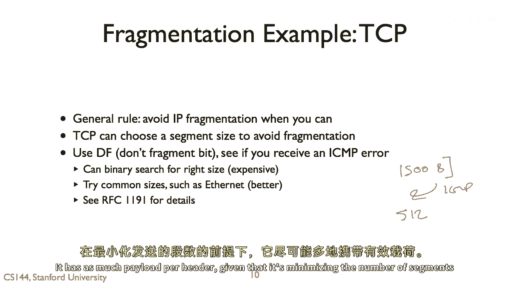

# 计算机网络课程 P106：分片与重组 🧩

在本节课中，我们将要学习网络通信中的一个重要概念：分片与重组。我们将了解为什么需要将大数据块分割成小片段，这个过程发生在网络的哪些层次，以及它是如何具体工作的，特别是在IP协议中。

## 概述

当高层的数据单元大于底层网络能够支持的最大传输单元时，就需要进行分片与重组。分片是将大数据块拆分成更小片段的过程，以便底层网络能够传输。重组则是接收方将这些片段重新组合成原始数据的过程。

## 分片与重组的基本问题

上一节我们概述了分片与重组的概念，本节中我们来看看它要解决的具体问题。

假设有一台名为“myth”的计算机在斯坦福大学，它想从谷歌请求一个网页。谷歌发回的HTTP响应数据包大小为10千字节。这个数据块相当大。问题在于，从谷歌到“myth”的路径上，可能存在某些网络节点无法支持传输10千字节的数据包。

事实上，以太网支持的最大传输单元在许多速率下是1500字节。因此，我需要做的是将这个10千字节的数据包分解成一系列更小的、网络能够支持的片段。

设想一个极端情况：如果我从谷歌下载一个非常大的文件，我不希望发送一个1GB大小的数据包，因为它会长时间占用通信信道。所以，我需要将数据分解成更小的块。

在这个例子中，如果以太网帧的最大尺寸是1.5千字节，我就需要将这个10千字节的数据包分成7个片段。其中前6个片段每个可以是1.5千字节，最后一个片段是1千字节。这就是分片的过程。

这些片段到达“myth”计算机后，它的任务就是进行重组，将这七个片段重新组装成原始的10千字节数据。

## 分片与重组发生的层次

分片与重组可以发生在网络的不同层次。

**传输层**
例如，它可以发生在传输层。TCP协议在将数据流分割成段时就会进行分片，这些段被传输到对端后，再被重组成一个可靠的数据流。这种重组发生在TCP端点之间，是端到端的。一旦TCP段被一个端点生成，它就是不可分割的，会完整地到达另一端。你永远不会看到一个TCP段被拆分成两个独立的段，尽管在它之下的网络层或链路层可能会将其进一步拆分。

**网络层**
这与TCP形成对比。在网络层，分片与重组是在主机到主机的基础上进行的。在IP协议中，一个中间节点可能会接收一个数据包并将其拆分。因此，一个IP数据包在网络中传输时，可能会在某个中间点被分解成多个IP分片，然后由最终的目的主机将这些分片重新组装成原始的IP数据包。这意味着分片可以发生在网络内部。

**链路层**
最后，分片与重组也可以发生在链路层。一个例子是Zigbee或802.15.4链路层，它的帧非常小，大约只有120字节（127字节是最大值，但还未包含帧头）。有时你想在这种链路上发送大的数据包，比如一个1280字节的IPv6数据包。这时，网络层会将这个1280字节的数据包传递给一个叫做“6LoWPAN”（IPv6 over Low-Power Wireless Personal Area Networks）的适配层。6LoWPAN这个链路层技术会将其分片，然后在链路的另一端重新组装成原始数据包。在这种情况下，分片纯粹发生在链路上，网络层是看不到的。

## IP协议中的分片机制

现在，让我们通过一个具体例子来深入理解。IP协议中的分片机制虽然在实际中人们尽量避免使用，但其原理简单，非常适合用来解释分片是如何工作的。

假设我们有一条跨越三跳的路由路径。第一跳和第三跳使用以太网，其最大传输单元为1500字节。但中间一跳使用点对点链路，其最大传输单元为576字节。

这意味着在链路层，帧的有效载荷只能支持576字节或1500字节的数据。

现在，假设左边的主机上的某个应用程序想要发送一个1400字节的有效载荷。

*   在第一跳，这没有问题。我们可以取这个1400字节的有效载荷，加上20字节的IP头部，总共1420字节。这完全可以放入一个以太网帧中。
*   但当数据包到达第二个节点（路由器）时，问题出现了。我们无法将这个1420字节的IP数据包放入一个最大载荷为576字节的PPP帧中。

因此，IP协议会在这里采取行动：它将原始数据包拆分成三个分片。这个节点会接收这个1420字节的IP数据包，意识到它需要通过这个PPP链路转发，于是将其拆分成三个独立的IP数据包（稍后会展示它们是如何形成的），并分别放入三个PPP帧中，每个帧带有更小的有效载荷（例如512字节、512字节和376字节）。

关键点在于：一旦数据包在这个第二个节点被分片，这些分片在后续网络中会保持不变地传输。所以，第三个节点并不会重组它们，它只是将这些IP分片分别放入以太网帧中，然后转发给最终目的地。最终，希望目的地主机能收到所有分片，并将它们重组成原始的1400字节数据。

## IP分片头部字段详解

那么，IP协议是如何实现这一点的呢？如果我们查看IP头部，其中有几个字段专门用于分片与重组。

在分片之前，我们会看到一个标准的IP数据包，其结构如下：
*   **标识符**：设为某个值 `x`。
*   **更多分片位**：设为 `0`（表示这是最后一个或唯一的分片）。
*   **分片偏移**：设为 `0`。
*   这是一个1400字节有效载荷的普通IP数据包。

数据包被分片后，情况发生了变化：
*   **标识符**：在所有三个分片中保持相同的值 `x`。这允许接收方识别哪些分片属于同一个原始数据包。
*   **更多分片位**：对于最后一个分片之外的所有分片，此位被设置为 `1`，表示后面还有更多分片到来。第一个和第二个分片的该位为 `1`，最后一个分片的该位为 `0`。
*   **分片偏移**：告诉接收方这个分片的数据在原始数据包中的起始位置。偏移量以8字节为单位。
    *   第一个分片：有效载荷512字节，偏移为 `0`（覆盖字节 0-511）。
    *   第二个分片：有效载荷512字节，偏移为 `64`（`64 * 8 = 512`，覆盖字节 512-1023）。
    *   第三个分片：有效载荷376字节，偏移为 `128`（`128 * 8 = 1024`，覆盖字节 1024-1399）。

由于偏移字段以8字节块编码，这意味着除了最后一个分片，每个分片的长度必须是8字节的倍数。

源IP地址和标识符字段的组合，使得接收端点能够将这三个分片正确地归类到一起。然后，根据偏移字段，它就能按正确顺序重组出原始的IP数据报。

## 分片的优缺点与避免策略

IP分片非常有用，因为它意味着发送端可以生成IP数据包，而无需担心路径上中间链路的最大传输单元是多少。这对于端点来说是一种很好的方式，尤其是在路径动态变化的情况下，它不需要了解整个路径的属性。

然而，在实际中，系统会尽量避免IP分片。原因在于，你将一个数据包变成了多个数据包，那么其中任何一个分片丢失的概率都会增加。假设网络有1%的丢包率，现在有三个分片，那么整个原始数据包因一个分片丢失而失效的概率就大大增加了。IP协议本身不支持对这些分片的可靠性保证或重传。如果一个分片丢失，通常需要由更高层协议（如TCP）来重传整个原始数据块的所有分片。

因此，通常我们希望避免IP分片。TCP协议有时采用一个有趣的技巧：主动选择一个合适的段大小来避免分片。由于TCP段的大小可以由TCP自己决定，它会尝试生成能够放入IP数据包中，并且在到达目的地的路径上不会触发分片的段。

实现这一点的方法之一是设置IP头部的“不分片”位。例如，TCP连接建立时，可以尝试发送一个标准的1500字节以太网帧大小的数据包，并设置“不分片”位。如果它收到一个ICMP错误消息，提示“需要分片但设置了不分片位，无法转发”，那么TCP就知道路径上存在更小的MTU，于是它会尝试更小的段大小。

有多种方法可以探测路径的MTU：
*   进行二分查找（可能开销较大）。
*   尝试一些常见的大小（如1500字节、576字节等）。
*   遵循相关RFC中的建议。有一种方法是，TCP可以感知连接路径的属性，并据此选择一个最优的段大小。这个大小既要避免分片，又要能最小化头部开销，即在给定头部开销的情况下，最大化每个段的有效载荷，从而减少需要发送的段的总数量。

## 总结

本节课中，我们一起学习了网络中的分片与重组机制。我们了解到，当数据包大小超过链路MTU时，需要将其拆分为更小的分片进行传输，并在目的地重组。这个过程可以发生在链路层、网络层和传输层。我们重点剖析了IP协议的分片过程，包括标识符、偏移量和更多分片位等关键字段的作用。最后，我们探讨了IP分片的优缺点，并介绍了TCP如何通过路径MTU发现来主动避免分片，以提高传输效率和可靠性。理解分片与重组，对于掌握网络数据传输的基本原理至关重要。