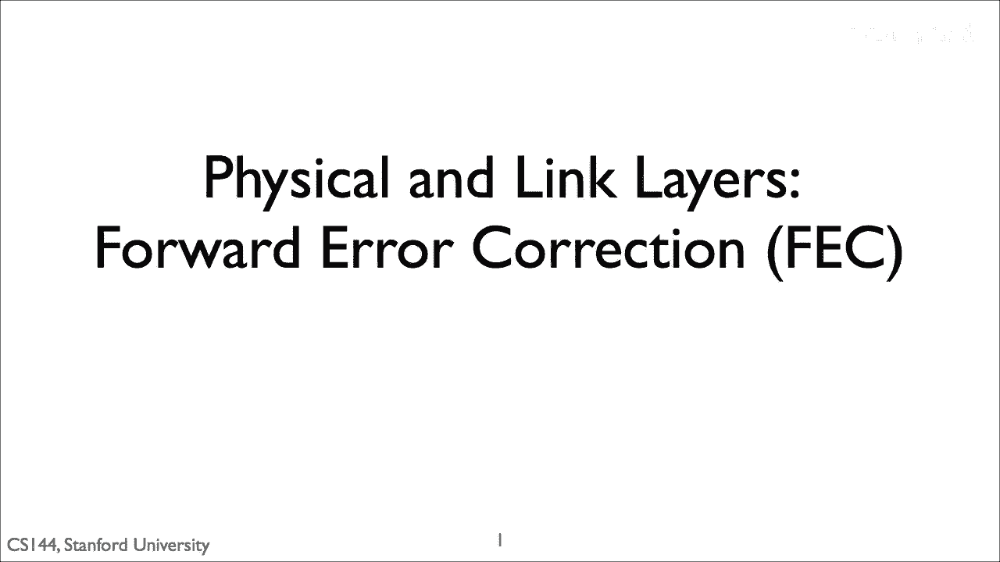
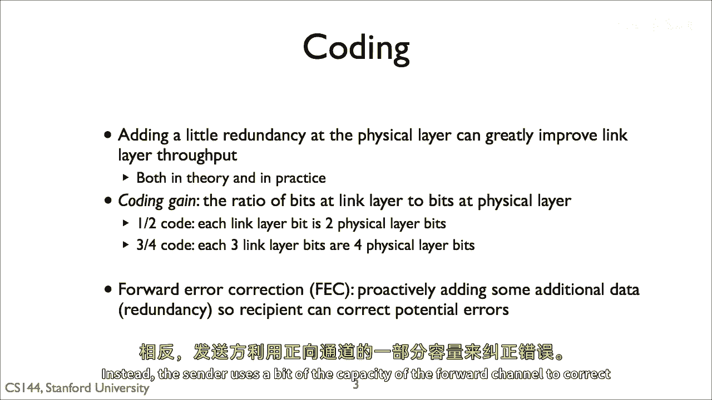
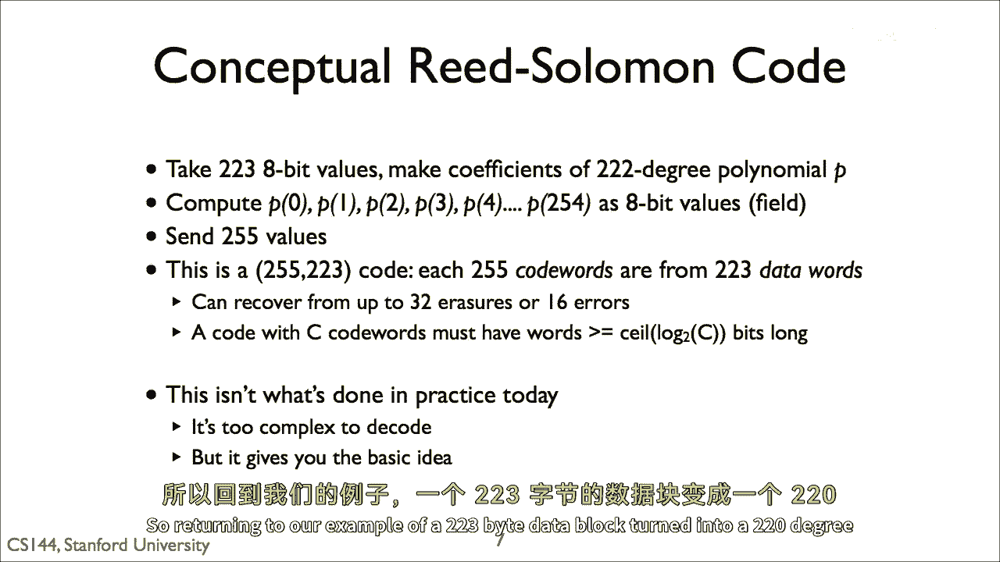
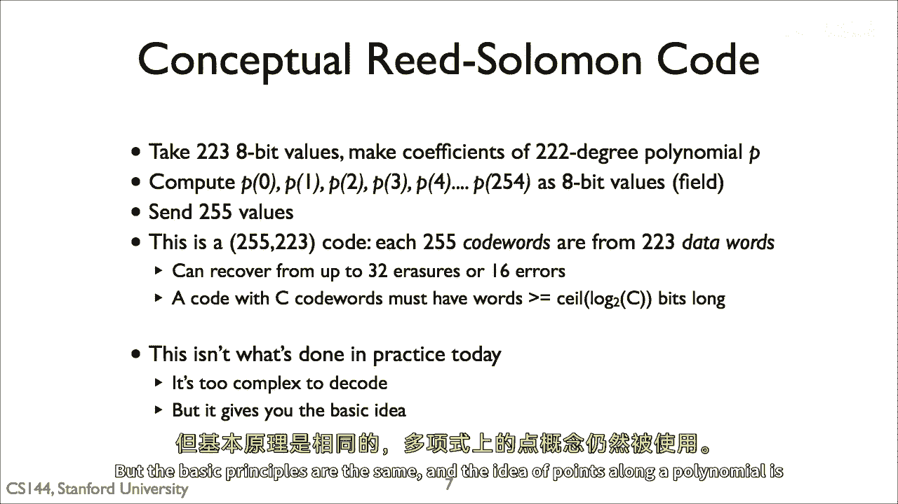
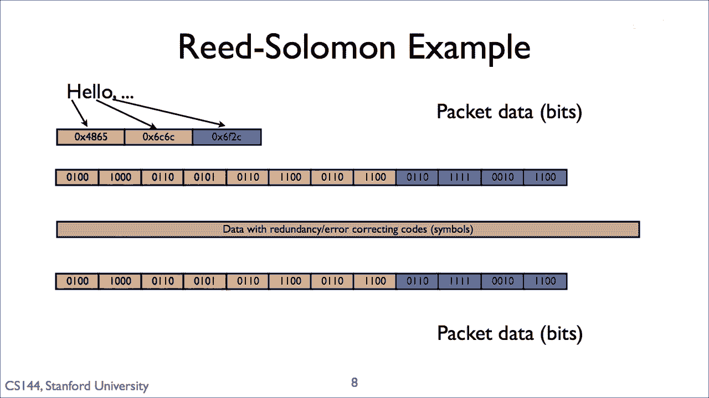
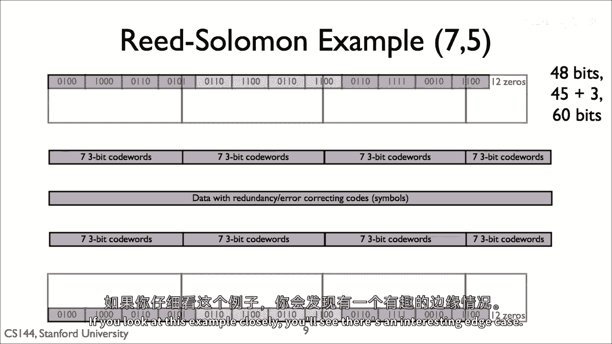
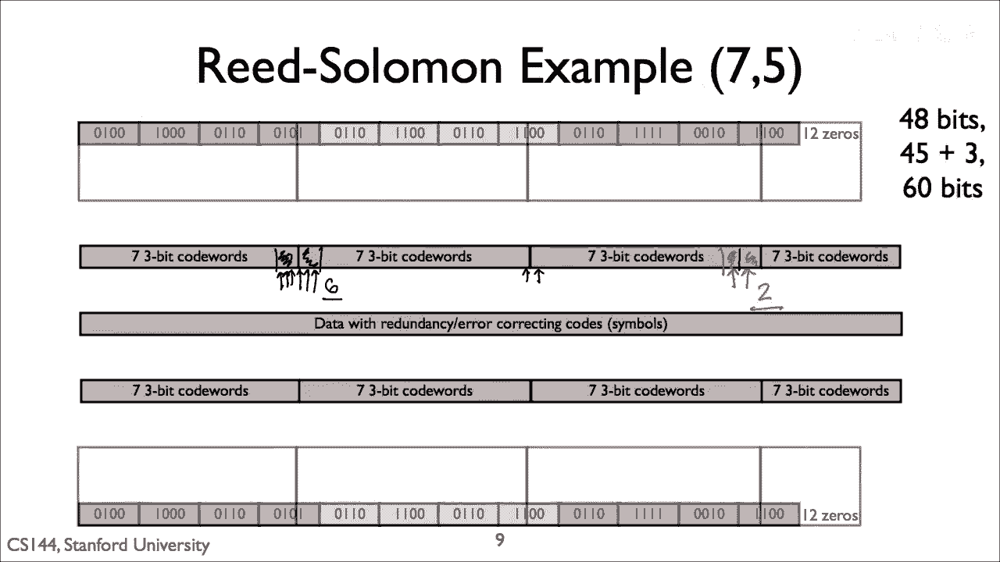
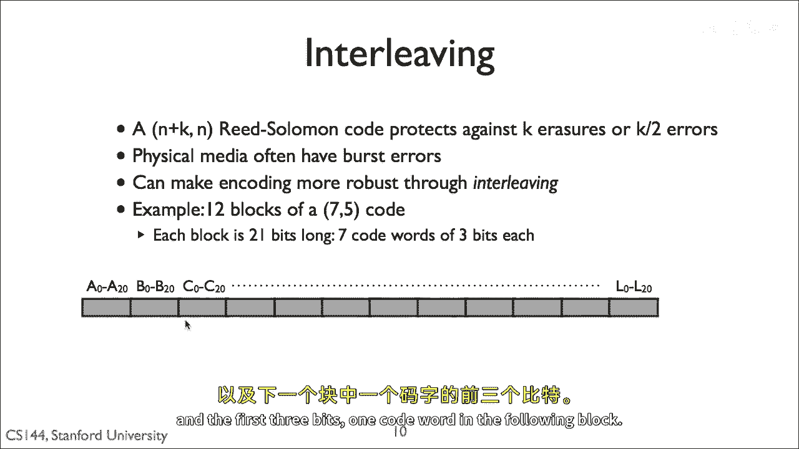

# 📡 课程 P107：前向纠错（FEC）技术详解

在本节课中，我们将学习一种名为**前向纠错**的技术。这项技术允许网络在物理层发生比特错误时，依然能够成功接收数据帧。我们将探讨其基本原理、核心的编码思想，并通过一个具体的编码算法——里德-所罗门码来深入理解。最后，我们还会介绍一种名为**交织**的技术，它能进一步提升系统对长突发错误的抵抗能力。

---

## 🔍 噪声、误码率与信道容量

上一节我们提到了物理层的噪声和干扰会导致比特错误。本节中，我们来看看误码率与信道容量之间的理论关系。

如果对噪声做出一些数学假设（通常是高斯分布），那么信噪比与其比特误码率之间存在精确的关系。对于给定的信噪比，具体的比特误码率取决于所使用的调制方式。例如，在相同信噪比下，相移键控的比特误码率低于幅移键控。

提高信噪比（增强信号或降低噪声）可以降低比特误码率，但一个非常重要的事实是：**比特误码率永远不会降为零**。这是因为噪声遵循高斯分布，超过任何阈值的噪声概率总是非零的。因此，无论信号多强，总会丢失数据包。

从理论上看，如果以原始比特流发送数据包，效率会非常低。当信号强度高到误码率极低时，系统实际上远未达到香农极限。这就好比为了确保对方听清每个字，你必须说得非常慢、非常大声，这浪费了大量的信道容量。

例如，假设我们要传输一个1500字节（12000比特）的数据包，要求丢包率低于万分之一（10⁻⁴）。这意味着所有12000个比特都必须正确，因此需要满足以下条件：

`(1 - 比特误码率)^12000 > 0.9999`

计算可得，所需的比特误码率必须约为10⁻⁸。为了达到这个误码率，系统需要以高功率发射。如果计算在此功率下的理论信道容量（即完美利用信道时可达到的速度），会发现它比我们以极低丢包率发送12000比特数据包时的实际速度高出**5倍**。这意味着，如果仅仅通过提高功率来减少误码，你将浪费掉**80%的信道容量**。

像LTE这样的高度工程化的无线系统，其运行效率非常接近理论最大值。那么，系统是如何做到不浪费那80%容量的呢？答案就是使用**编码**和**前向纠错**技术。

---

## 💡 前向纠错与编码的基本思想

上一节我们看到了单纯提高功率的效率瓶颈。本节中，我们来看看如何通过编码和前向纠错来更高效地利用信道。

编码的基本思想非常简单：与其只发送原始比特并希望它们不被破坏，不如发送数据加上一点冗余。像CRC、MAC和校验和这样的机制只能**检测**错误，而编码则能让我们不仅检测，还能**纠正**错误。

核心思想是：**添加少量冗余就可以纠正少量比特错误**。发送只有少量错误的数据包，可以让你以更高的速率发送数据，而提高的速率足以弥补所增加的冗余开销。

所添加的冗余量由**编码增益**来描述。增益表示为一个分数，显示了链路层发送的比特数与物理层相应比特数之间的比率。

*   **编码增益 = 1/2**：表示系统将数据包长度加倍，即每1比特链路层数据发送1比特冗余数据（总共2比特）。
*   **编码增益 = 3/4**：表示每3比特链路层数据在物理层被发送为4比特。

增益为1意味着你只是在发送原始比特。这种主动添加冗余数据以纠正错误的方法，就叫做**前向纠错**。之所以称为“前向”，是因为发送方不需要接收方的任何反馈（不需要反向信道），而是利用前向信道的一部分容量来纠正错误。

---

## 🧮 里德-所罗门码原理

编码算法有很多种，这是一个有70多年历史的丰富研究领域。接下来，我们将介绍其中一种：**里德-所罗门码**。它有三个突出优点：
1.  非常有效，应用广泛（如CD、DVD、DSL、WiMAX和RAID 6存储系统）。
2.  非常灵活，既用于存储系统，也用于通信系统。
3.  数学原理相对简单，易于解释和理解。

里德-所罗门码对数据块进行操作。例如，取一个223字节的数据块，添加32字节的冗余，将其变成一个255字节的块。

其基本直觉是：将你的数据块分成K个“块”（例如，每个“块”是一个字节）。将这K个值视为一个`K-1`次多项式的系数。例如，一个223字节的块对应一个222次多项式。

**唯一性定理**指出：任何n次多项式都由`n+1`个不同的数据点唯一确定。因此，如果我们有一个222次多项式，那么只要我们拥有该多项式上的223个正确的数据点，并且知道哪些点是正确的，我们就可以恢复出多项式的系数，也就是我们想发送的原始数据。

所以，实际操作中，发送方不是发送原始数据（多项式的系数），而是发送多项式上的一些点，例如 `F(0)`, `F(1)`, `F(2)`...。接收方收到这些数据点后，再从中计算出系数。

这里有一个数学上的复杂性：如果多项式系数很大，数据点的值可能会迅速超过一个“块”能容纳的大小。因此，这些点是在一个**有限域**上计算的。例如，由于每个“块”是一个字节，我们就在0到255的8位域上进行计算，溢出时会自动回绕。

---

## ⚠️ 错误类型与纠错能力

上一节我们假设接收方知道哪些数据点是正确的。但在实际通信中，接收方如何知道呢？里德-所罗门码区分两种错误：

1.  **擦除**：接收方**知道**是错误的那些值（例如，数据块丢失，像RAID中硬盘故障）。
2.  **错误**：接收方**不知道**是错误的那些值（通信系统中更常见的情况，某些块发生了比特错误但未被识别）。

里德-所罗门码能从多少擦除或错误中恢复，取决于冗余量。假设原始块数为`K`，编码后发送`N`个块，即增加了`N-K`个冗余块。

*   对于**擦除**，接收方只需要`K`个正确的块即可恢复。因此，它可以恢复最多 **`N-K`** 个擦除。
*   对于**错误**，接收方可以恢复最多 **`(N-K)/2`** 个错误。

接收方能处理的错误数量只有擦除的一半，因为它还需要找出哪些块是错误的。可以这样理解：接收方需要求解两组未知数——哪些接收块是坏的，以及多项式的系数。如果是擦除，接收方已经知道哪些块是坏的，所以不需要求解那部分未知数；但如果是错误，接收方就需要求解额外的未知数，因此需要更多正确的冗余字节来完成。

回到我们的例子：223字节数据块，编码为255字节（32字节冗余）。如果编码后的块中，有**16个或更少**的块发生比特错误，接收方就能成功解码并恢复原始的223字节数据。这个特定的码被称为`(255, 223)`码。

---

## 📊 编码实例分析

让我们通过一个例子来具体理解。在这个例子中，我们将编码6字节的数据“hello”，使用一个`(7, 5)`码。这意味着5个数据块被转换为7个编码块。

因为每个块有7个码字，所以每个块必须至少有3比特长（`ceil(log₂(7)) = 3`）。因此，对于`(7, 5)`码，我们取5个3比特的数据字，并将它们编码为7个3比特的码字。**15比特变成了21比特**。

输入数据是48比特长（“hello”）。我们需要将其拆分为15比特的块，并发送整数个块。因此，我们必须将数据大小增加到60比特（4个块）。典型的解决方案是用零填充最后一个块。在这个例子中，我们用12个零比特填充最后一个块。

这60个数据比特被编码为4个21比特的码字，总共84比特。发送方发送这84比特，接收方运行里德-所罗门解码器得到60个数据比特，并恢复字符串“hello”。

---

## 💥 突发错误与交织技术

我们通常从“能恢复多长的连续错误突发”这个角度来思考编码方案。对于`(7, 5)`码：
*   **导致解码失败的最短错误突发**是2比特（如果这两个错误恰好落在同一个块内两个相邻的码字中）。
*   **能够恢复的最长错误突发**是6比特（前3比特破坏一个块中的一个码字，后3比特破坏下一个块中的一个码字）。

这些数字很小，部分原因是这个例子使用的码冗余很少且码字很小。想象一下，如果系统使用`(255, 223)`码和8比特码字，它能恢复的最长突发错误可以达到256比特。

有一种技术可以使里德-所罗门码对突发错误更具抵抗力，那就是**交织**。交织的基本思想是：不按线性顺序排列码字，而是将码字分散开，使得一个错误突发会破坏**许多个块中的少量码字**，而不是**少数几个块中的大量码字**。

以下是两种交织方式：
1.  **码字交织**：依次发送每个块的第1个码字，然后是每个块的第2个码字，以此类推。
2.  **比特交织**：依次发送每个块的第1个比特，然后是每个块的第2个比特，以此类推。

关键点在于：对于里德-所罗门码，**一个码字内无论有多少比特出错，整个码字都被视为无效**。因此，面对突发错误时，我们希望：
*   将错误**分散**到尽可能多的块中（这样每个块的错误就很少）。
*   将错误**集中**在单个码字内（因为破坏一个码字的所有比特和只破坏一个比特，后果是一样的）。

码字交织使得一个码字的所有比特相邻，因此一个破坏单比特的错误突发通常会破坏该码字的所有比特。比特交织则将一个码字的比特分散开，因此很容易出现只破坏一个码字中单个比特的情况。因此，码字交织在抵抗导致解码失败的**最短错误突发**方面表现更好（需要更长的突发才能破坏同一个块的两个码字），而两者在抵抗**最长可恢复错误突发**方面的能力是相近的。

---

## 📝 课程总结

在本节课中，我们一起学习了：

1.  **问题的根源**：物理层的噪声导致比特误码率永不为零，单纯提高发射功率会浪费大量信道容量。
2.  **解决方案的核心**：**前向纠错**技术，通过主动添加冗余数据，使接收方能够纠正一定数量的错误，无需重传。
3.  **关键的编码思想**：以**里德-所罗门码**为例，通过将数据视为多项式系数，并发送多项式上的点来实现纠错。其纠错能力取决于冗余量，能纠正最多`(N-K)/2`个未知错误。
4.  **提升鲁棒性的技术**：**交织**，通过重新排列发送顺序，将长突发错误分散到多个数据块中，从而显著提高系统对这类错误的抵抗能力。

通过结合FEC和交织，现代通信系统能够在存在噪声的信道上高效、可靠地传输数据，使其性能接近理论极限。