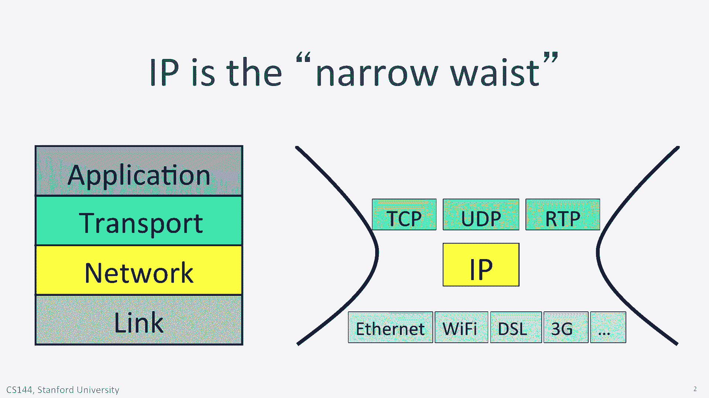
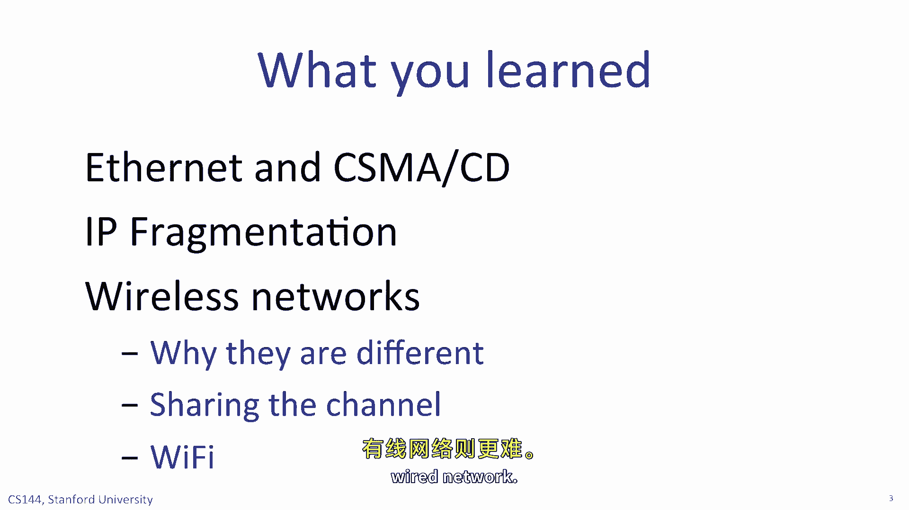

# P108：p107 7-12 Lower Layers (recap) - 加加zero - BV1qotgeXE8D

 By now you've heard it said several times during the quarter that IP is the narrow waste。

 of the internet。 You probably remember this figure from unit one。 If we want to use the。

 internet we have to use the internet protocol IP。 We have no choice。 But we have lots and。

 lots of choices for link layer。 IP runs over many many different link layers such as Ethernet。

 Wi-Fi， DSL， 3G cellular and so on。 On top of the unreliable IP layer we can choose between。

 many different transport layers。 In this unit you learn about different link layers。 You。

 learn about the link layer service model， how Ethernet works including the different speeds。

 it runs at。 You watch several videos about wireless networks， why wireless is different。

 and why we need medium access control protocols to share access to the air。 You learn about。

 channel capacity and how it helps us determine the maximum data rate or capacity of a communication。

 channel and you learn about error connection， correction mechanisms。

 We started by exploring the most commonly used wired work， Ethernet。 If you've ever physically。

 plugged your computer into a network it was almost certainly an ethernet network。 Although。

 many different wired networks were proposed in the 1990s and several were standardized。

 built and sold， Ethernet won the day and has now almost universally used for wired networks。

 This is because it is very simple， cheap and reliable。 In a switch to ethernet network。

 when you have get it ascend you can just go ahead and send it。 The network learns addresses。

 so there are no complicated routing protocols to worry about。 Ethernet runs over the wiring。

 that is installed in almost every office building making it very easy to install。

 Nowadays almost all ethernet networks use， you use ethernet switches allowing many simultaneous。

 communications in the same network and every link is full duplex allowing data to flow in。

 both directions at the same time。 In the next few years we will start to see 40 gigabit。

 per second ethernet， 100 gigabit per second ethernet and beyond。 The ethernet looks certain。

 to remain the dominant wired link layer for years to come。

 All link layers have a maximum packet size they can carry。 For ethernet this is 1500 bytes。

 by default。 Other link layers can carry larger packets such as the FDDI standard of the 1990s。

 they carry packets up to 4500 bytes long。 Some ethernet networks are configured to carry。

 so-called jumbo frames up to 9 kilobytes long。 We call the longest packet a link can carry。

 its MTU or maximum transmission unit。 When a router interconnects two links with different。

 MTUs it might need to fragment IP datagrams going from the link with a larger MTU to the。

 smaller one。 You learned how a router does this using the fragment fields in the IPv4 header。

 to break IP datagrams into new self-contained IP datagrams。

 The network doesn't reassemble the fragments。 The destination host uses information in the。

 IPv4 header to put the data back into the correct order before handling it to TCP or UDP。 Or ICMP。

 IP fragmentation is less common than it used to be for two reasons。 First， most。

 wired networks use ethernet today and so the MTU tends to be 1500 bytes on most links and。

 there is no need to fragment。 Second， hosts often use MTU discovery when creating a TCP。

 connection to identify the shortest MTU along the path。 The sender's don't send packets。

 larger than the MTU， eliminating the need for fragmentation along the way。 When we talked。

 about MSS or maximum segment size of a transport protocol it uses this MTU discovery protocol。

 Wireless networks are very different from wired ones。 In a wired network the links。

 have a constant data rate but in a wireless network the link speed is always changing。

 This for several reasons。 Interference from nearby wireless networks and from other devices。

 operating in the same frequency band such as microwave ovens and cordless phones。 It can。

 also be caused by fades in the channel to the shadowing and multipath。 Wireless networks。

 also suffer from the so-called hidden terminal problem。 This happens when two clients can't。

 communicate directly with each other but both can communicate with an access point。 Because。

 they don't hear each other they don't know how to avoid transmitting at the same time。

 and require extra coordination in the network。 Another way in which wireless networks are。

 different is that the channel naturally broadcasts all communications。 This means senders need。

 to take turns to transmit leading to medium access control protocols such as the CSMA。

 protocol used in Wi-Fi。 A shared broadcast channel also means we need to be more careful。

 about securing our data。 Everyone in the neighborhood can more easily eavesdrop on our conversation。

 than in a wired network。 You also learn some of the underlying principles。

 of communications that dictate how we build physical links。 You learn about biddaras and。

 how they can lead us to incorrectly decode a packet on the wire and you learn about ways。

 to code data to make it easier to detect errors when they happen。 And you learn about how。

 error correcting codes work and when we use them。 Generally speaking we use error correcting。

 codes in environments where bit errors are frequent or where the cost of retransmitting。

 a corrupted packet would be high。 For example in a network with a very large bandwidth delay。

 product。 Finally but perhaps most importantly of all you learn about Shannon capacity。 Claude。

 Shannon created the wonderfully powerful field of information theory and the centerpiece of。

 his work was deducing the maximum error free rate that a channel can communicate at。 Now。

 we're referred to as the Shannon capacity。 The remarkable property of the Shannon capacity。

 is that it gives us a fundamental inescapable limit to the maximum rate information can be。

 carried over a channel regardless of the clever coding schemes we invent。

 All of the communication principles we describe give you a taste of some of the material you。

 will learn in an electrical engineering class on communications theory or information theory。

 If you really enjoyed this material you might consider taking EE classes in the future。

 [BLANK_AUDIO]。

