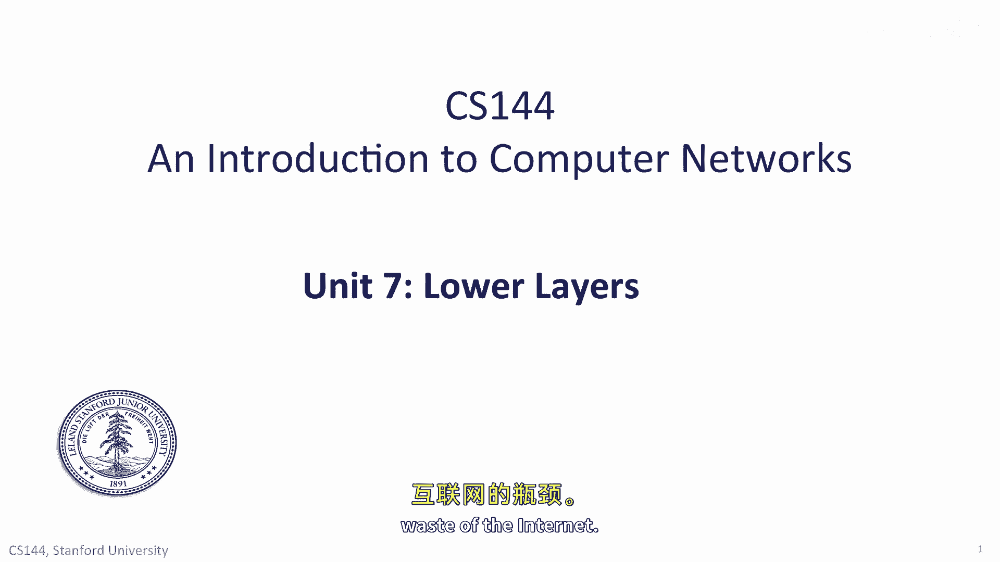
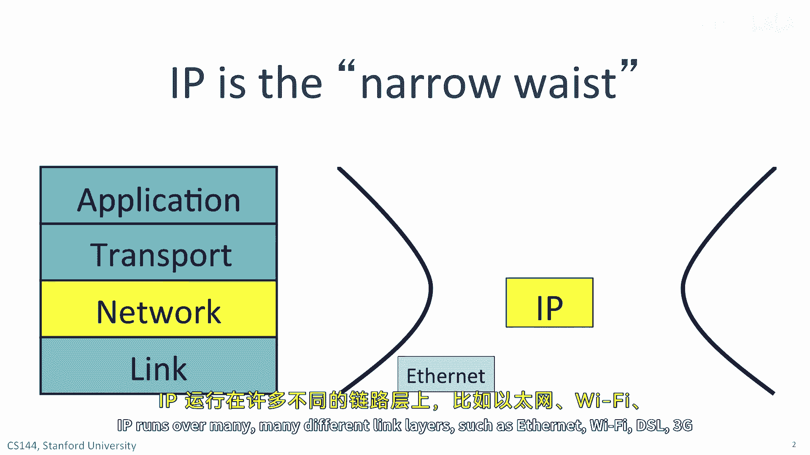
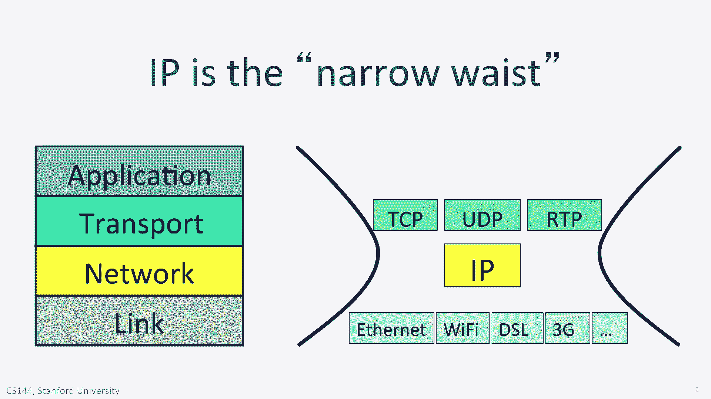
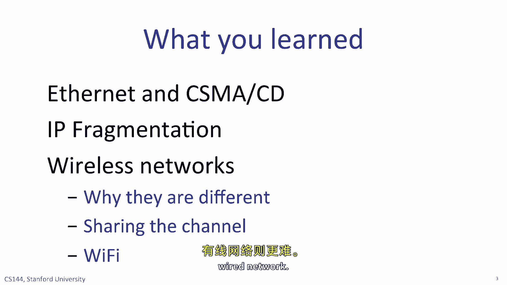
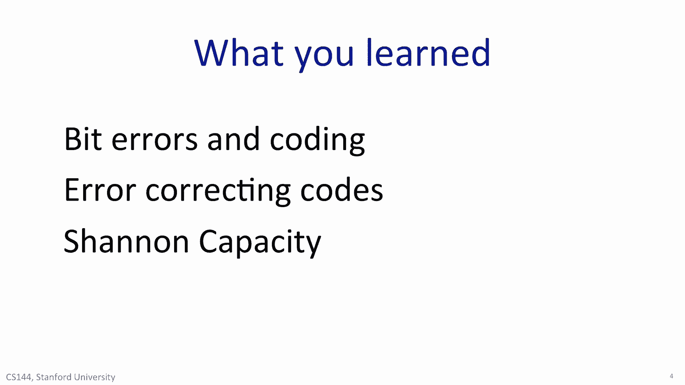

# 计算机网络课程 P108：下层协议回顾 🌐

在本节课中，我们将回顾网络体系结构中的下层协议，特别是链路层。我们将探讨以太网的工作原理、无线网络的特点、信道容量以及错误处理机制。通过本次回顾，你将巩固对网络底层关键概念的理解。

---

## 互联网的“窄腰”：IP协议

到目前为止，本季度课程中已多次提及，IP协议是互联网的“窄腰”。

若想使用互联网，我们必须使用互联网协议（IP），这是唯一选择。然而，在链路层我们却拥有众多选择。IP协议可以运行在许多不同的链路层之上，例如以太网、Wi-Fi、DSL、3G蜂窝网络等。在不可靠的IP层之上，我们可以在多种不同的传输层协议中进行选择。

在本单元中，你学习了不同的链路层。你了解了链路层的服务模型、以太网的工作原理及其不同的运行速率。你观看了几个关于无线网络的视频，理解了无线网络的不同之处，以及为何需要介质访问控制协议来共享空中信道。你还学习了信道容量，它如何帮助我们确定通信信道的最大数据速率或容量，并且学习了错误检测与纠正机制。

---

## 有线网络之王：以太网

我们首先探讨了最常用的有线网络——以太网。如果你曾将电脑物理连接到网络，那几乎肯定是连接到一个以太网。尽管在20世纪90年代提出了许多不同的有线网络标准，其中一些被标准化、制造和销售，但以太网最终胜出，如今几乎普遍用于有线网络。

这是因为以太网非常简单、廉价且可靠。在一个交换式以太网中，当你有数据要发送时，可以直接发送。网络会学习地址，因此无需担心复杂的路由协议。以太网运行在几乎每栋办公楼都已安装的线缆上，这使得安装非常容易。

如今，几乎所有的以太网都使用以太网交换机，允许在同一网络中进行多个同时通信，并且每个链路都是全双工的，允许数据同时双向流动。在未来几年，我们将开始看到每秒40吉比特、100吉比特甚至更高速率的以太网。以太网看起来注定在未来多年内仍将主导有线链路层。

所有链路层都有其能承载的最大数据包大小。对于以太网，默认是**1500字节**。其他链路层可以承载更大的数据包，例如20世纪90年代的FDDI标准，其数据包长度可达4500字节。一些以太网被配置为承载所谓的巨型帧，长度可达9千字节。

我们将链路能承载的最长数据包称为其**MTU**或最大传输单元。当路由器连接两个具有不同MTU的链路时，它可能需要将IP数据报从MTU较大的链路传向MTU较小的链路时进行分片。

你学习了路由器如何使用IPv4首部中的分片字段来实现这一点，将IP数据报分解为新的、自包含的IP数据报。

网络不会重组这些分片。目的主机使用IPv4首部中的信息，在将数据交给TCP、UDP或ICMP之前，将数据按正确顺序重新组合。

IP分片现在不如过去常见，原因有二。首先，今天大多数有线网络都使用以太网，因此大多数链路的MTU往往是1500字节，无需分片。其次，主机在建立TCP连接时经常使用**MTU发现**机制，以确定路径上的最小MTU。发送方不会发送大于该MTU的数据包，从而消除了沿途分片的需要。当我们讨论传输协议的**MSS**或最大段大小时，它使用的就是这种MTU发现协议。

---

## 无线网络的独特挑战

无线网络与有线网络截然不同。在有线网络中，链路具有恒定的数据速率，但在无线网络中，链路速度总是在变化。

这有几个原因：来自附近无线网络和其他在同频段运行的设备（如微波炉和无绳电话）的干扰；也可能是由于信道的衰落，如阴影效应和多径效应。

无线网络还遭受所谓的**隐藏终端问题**。当两个客户端无法直接相互通信，但都能与一个接入点通信时，就会发生这种情况。因为它们听不到对方，所以不知道如何避免同时传输，从而需要在网络中进行额外的协调。

无线网络不同的另一个方面是，信道天然地广播所有通信。这意味着发送方需要轮流传输，这导致了介质访问控制协议的产生，例如Wi-Fi中使用的**CSMA**协议。共享的广播信道也意味着我们需要更加小心地保护数据。与有线网络相比，邻居中的任何人都能更容易地窃听我们的通信。

你还学习了一些支配我们如何构建物理链路的基本通信原理。

你了解了比特错误，以及它们如何导致我们在线上错误地解码数据包；你学习了编码数据的方法，以便在错误发生时更容易检测；你还了解了纠错码的工作原理以及我们何时使用它们。

一般来说，我们在比特错误频繁或重传损坏数据包成本很高的环境中使用纠错码。例如，在一个具有非常大带宽延迟积的网络中。

---

## 通信的理论基石：香农容量

最后，但或许也是最重要的，你学习了**香农容量**。克劳德·香农创立了极其强大的信息论领域，其工作的核心是推导出一个信道能够进行无差错通信的最大速率，现在我们称之为香农容量。

香农容量的显著特性在于，它为我们提供了一个根本性的、无法逃避的限制，即信息在信道上能够承载的最大速率，无论我们发明多么巧妙的编码方案。

我们描述的所有通信原理，让你初步领略了在电气工程课程中关于通信理论或信息论将会学习到的一些内容。如果你真的喜欢这些材料，将来可以考虑选修相关的电气工程课程。

---

在本节课中，我们一起回顾了网络下层协议的核心内容。我们探讨了以太网的统治地位及其简单可靠的设计，分析了无线网络面临的独特挑战如隐藏终端问题和变化的链路质量，并学习了信道容量和错误处理的基本原理。这些知识构成了理解现代计算机网络如何工作的坚实基础。

