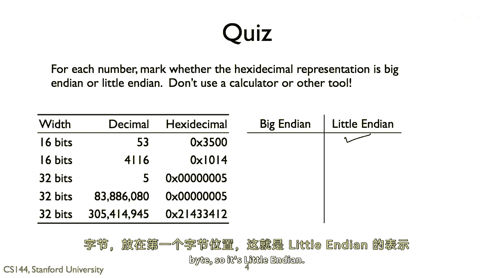
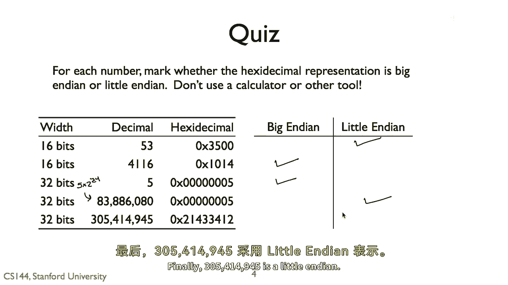
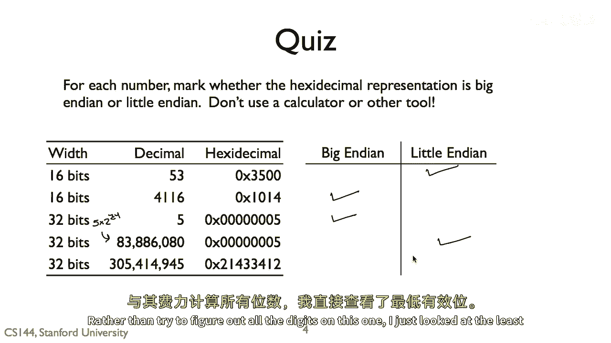
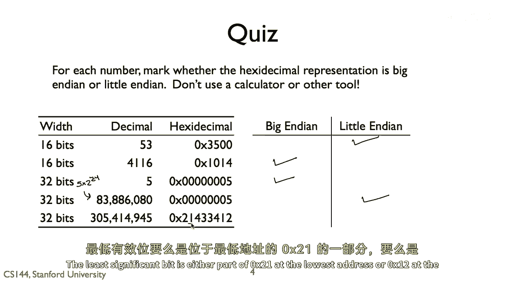
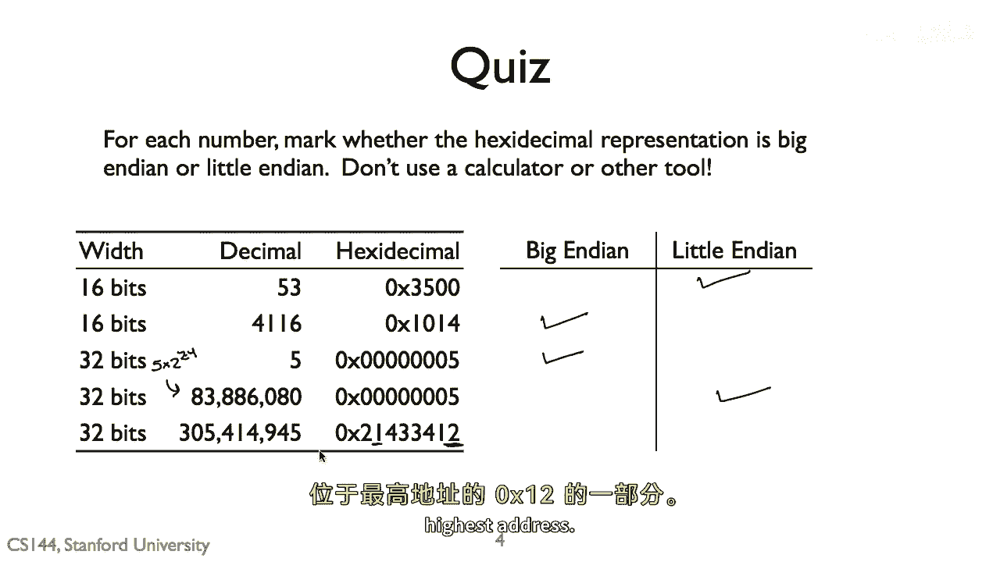
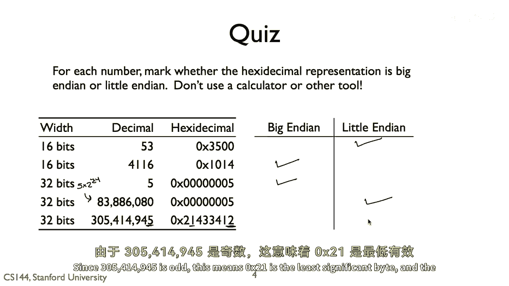

# P11：p10 1-8c byte order - 加加zero - BV1qotgeXE8D

五三在印度数字系统中表示为三十五，五十三等于十六的三倍。

加上五，所以零乘以三五，最低位字节在第一字节中。

所以是小端序，四千一百一十六是大端序。

四千一百一十六等于四千九十六加二十。

所以两个字节是零乘以一零代表四千九十六，和零乘以一四代表二十，以零乘以一零为代表更显著的位字节的字节。

四千九百六十人，所以十六进制是零x01，零一四，这表示最显著的字节。

零x0100首先出现，并且它是大端序。

五是大端序，最不显著的字节是最后一个，地址最高，八十三万八千八百，六十八，这是一点点，这是二的二十四次方乘以五。

所以这意味着零乘以零点五是最重要的字节，最后，三百五十万，四十四万。

九十四万五是一点点的印度人，而不是试图找出所有数字。

这个数字的数字，我只看了最不显著的位，最不显著的位要么是零乘以二一在最低地址的一部分。

或者零乘以一乘以二在最高的地址上。

如果它是零乘以一到一，那么最低位是一的，然后一个数字是奇数，如果它是零乘以一乘以二，那么最低位是零。

因为三百五十万，数字是偶数，四十四万四千。

九十四万五是奇数，这意味着零乘以二乘以一是最低位字节，并且数字被存储在一点小小的印度数字中。

