# 课程 P11：字节序详解 🧠

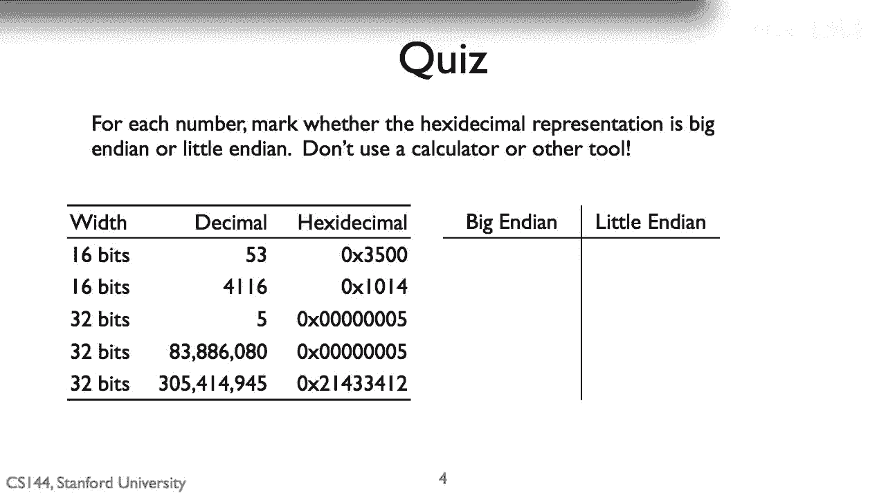

在本节课中，我们将学习计算机系统中一个重要的底层概念——**字节序**。字节序决定了多字节数据在内存中的存储顺序，理解它对于处理网络通信、文件解析和跨平台数据交换至关重要。

---

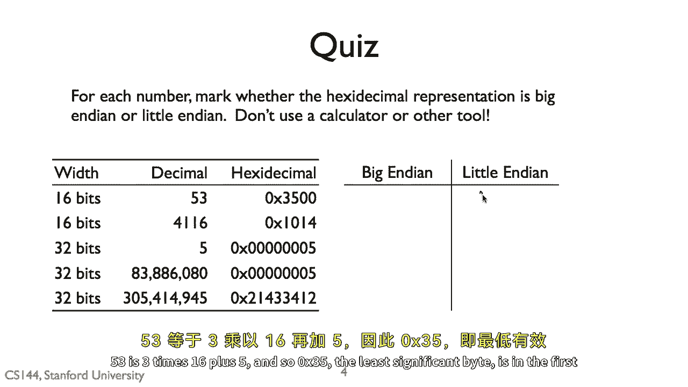

## 概述

字节序主要分为两种：**大端序**和**小端序**。我们将通过具体的数字示例，学习如何判断给定数据的字节序，并理解其背后的原理。

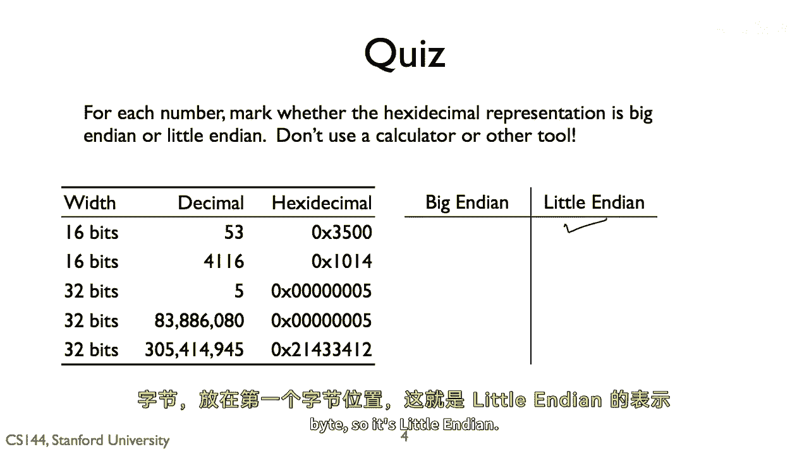

---

## 什么是字节序？

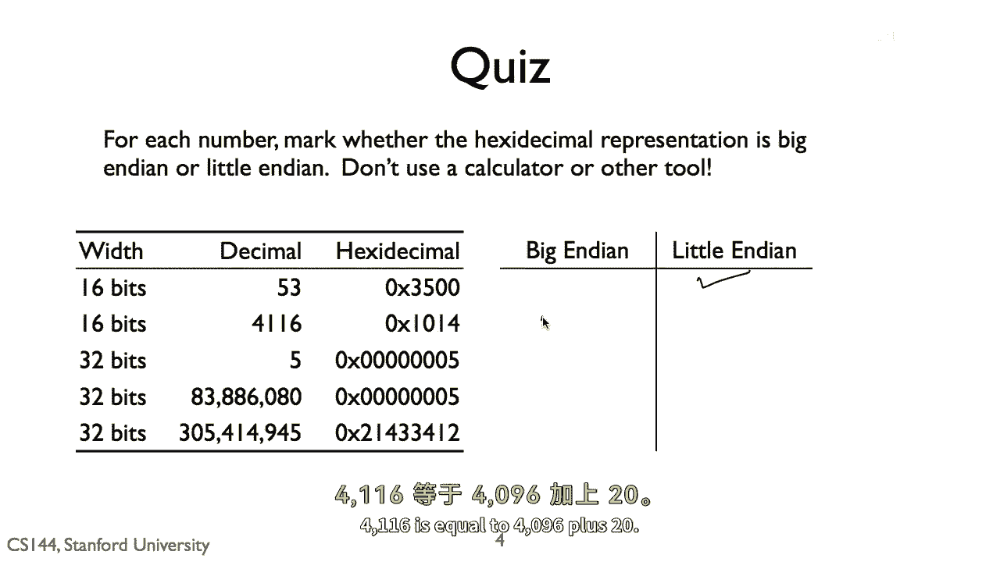

字节序描述了多字节数据（如整数、浮点数）的各个字节在内存中存放的顺序。

*   **大端序**：最高有效字节存储在最低的内存地址。
*   **小端序**：最低有效字节存储在最低的内存地址。

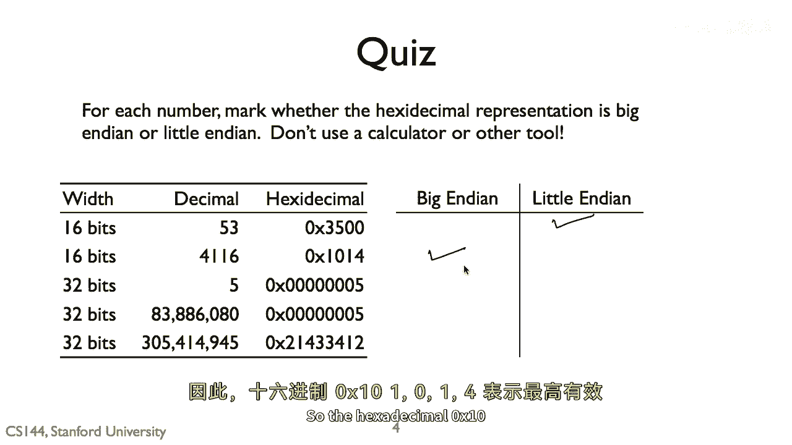

“最高有效字节”可以理解为数字中权重最大的部分，例如在十进制数 `1234` 中，“1”（代表一千）就是最高有效数字。

---

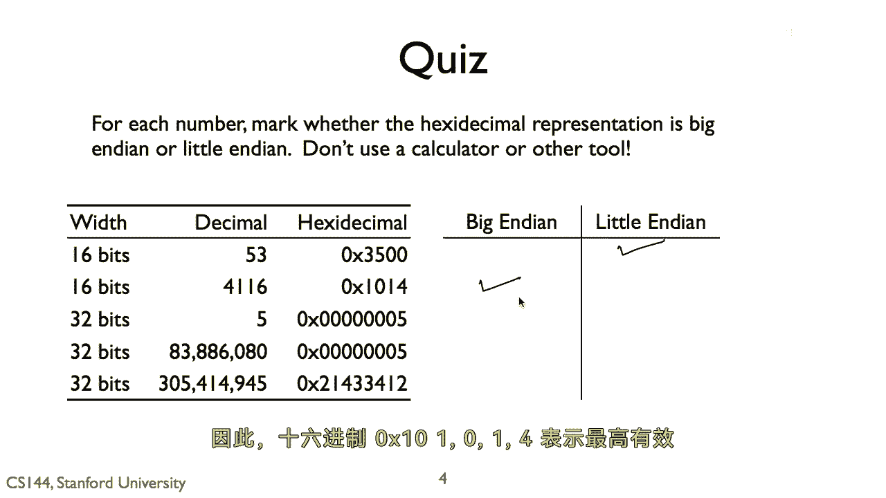

## 示例分析：数字 53

上一节我们介绍了字节序的基本概念，本节中我们通过数字 `53` 的存储来具体分析。

数字 `53` 在十六进制中表示为 `0x35`。假设它被存储在两个连续的字节中。

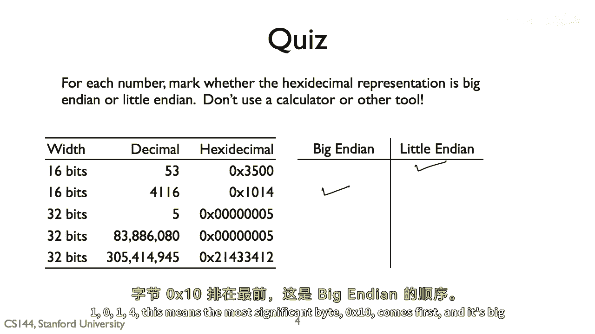

以下是其两种可能的存储方式：

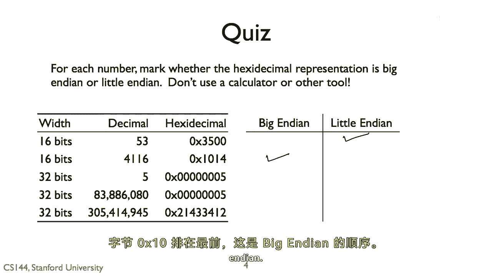

*   **小端序存储**：最低有效字节 `0x35` 存放在第一个（低地址）字节。
    ```
    地址增长方向 →
    +----+----+
    |0x35|0x00|
    +----+----+
    （低地址） （高地址）
    ```
    读取时，从低地址到高地址得到 `0x35 0x00`，解释为数字 `0x0035`，即十进制的 `53`。

*   **大端序存储**：最高有效字节 `0x00` 存放在第一个（低地址）字节。
    ```
    地址增长方向 →
    +----+----+
    |0x00|0x35|
    +----+----+
    （低地址） （高地址）
    ```
    读取时，从低地址到高地址得到 `0x00 0x35`，解释为数字 `0x0035`，同样是十进制的 `53`。

**结论**：对于数字 `53`，其存储序列 `0x35, 0x00` 对应的是**小端序**。

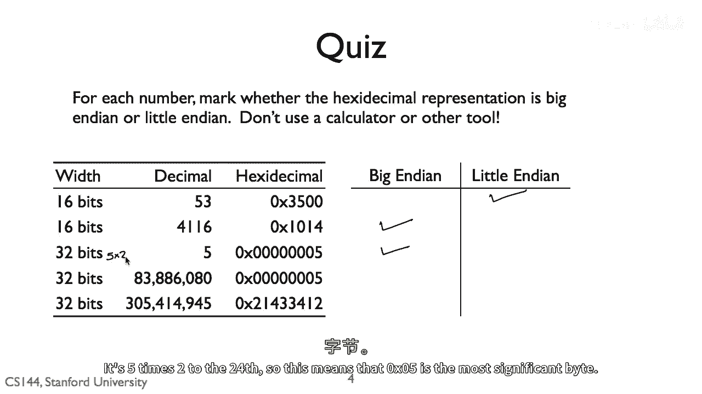

---

## 示例分析：数字 4116

现在，我们来看一个更大的数字 `4116`，进一步巩固判断方法。

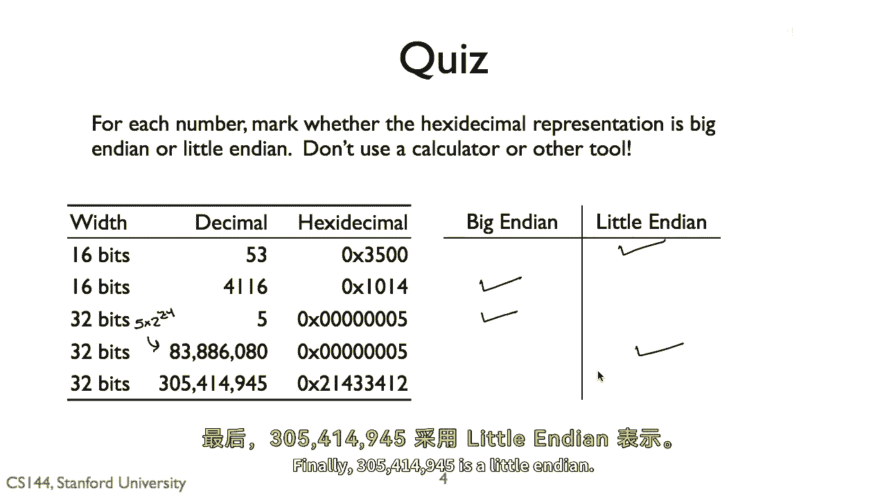

数字 `4116` 等于 `4096 + 20`。在十六进制中：
*   `4096 = 0x1000`
*   `20 = 0x0014`
*   因此 `4116 = 0x1014`

以下是其存储分析：

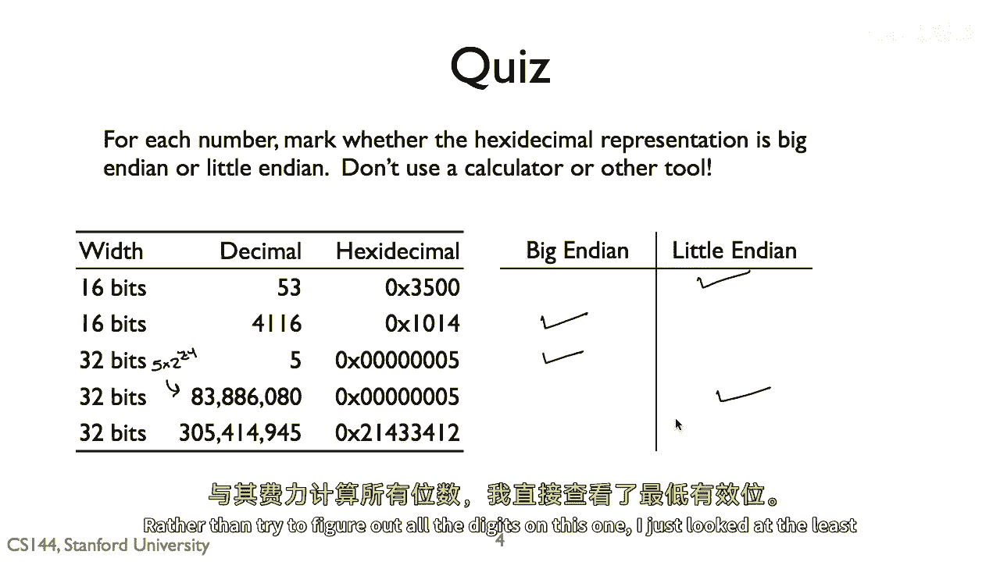

*   如果存储序列是 `0x10, 0x14`，这意味着权重更大的字节 `0x10`（代表 `4096`）存放在更低的地址。这符合**大端序**的定义。
*   如果存储序列是 `0x14, 0x10`，则是**小端序**。

根据给定的上下文，`4116` 的存储被判定为**大端序**，即序列为 `0x10, 0x14`。

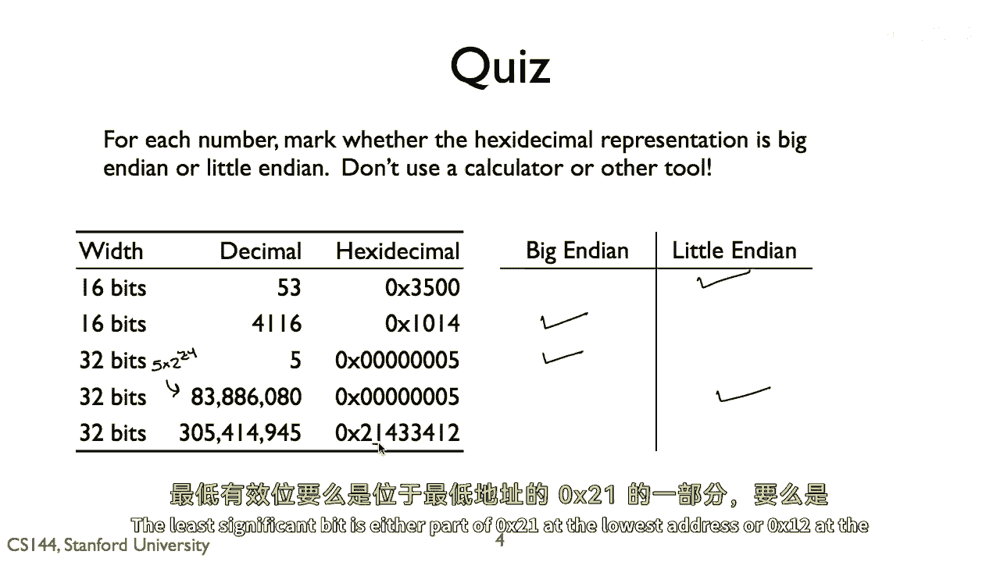

---

## 快速判断技巧：奇偶性

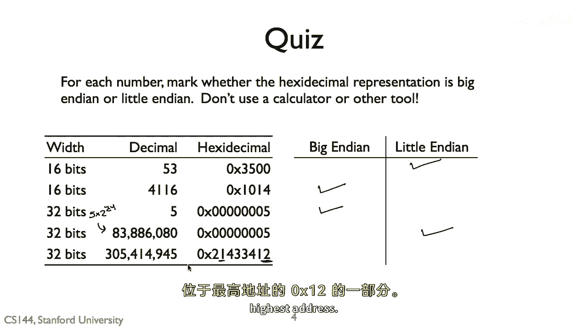

面对更复杂的数字时，我们无需计算完整的十六进制表示。一个快速的判断技巧是利用数字的**奇偶性**。

原理如下：
*   一个数字是奇数还是偶数，仅由它的**最低有效位**（即最后一个字节的最低位）决定。
*   在小端序中，**第一个字节**（最低地址）就是最低有效字节。
*   在大端序中，**最后一个字节**（最高地址）才是最低有效字节。

因此，我们可以通过检查给定字节序列的**第一个字节**来判断：

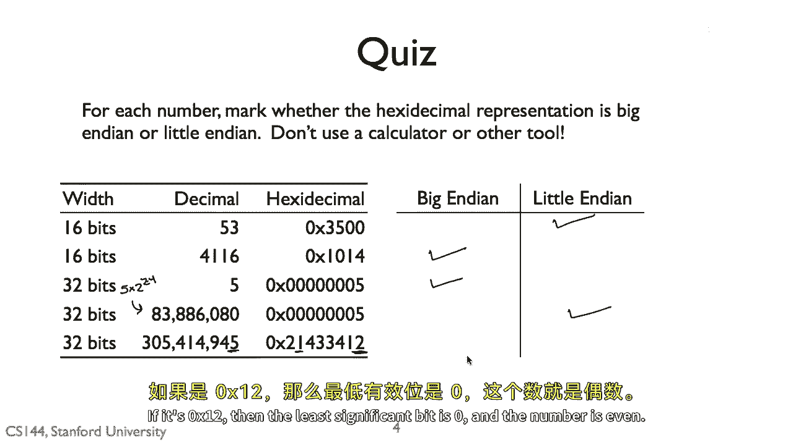

以下是判断步骤：
1.  查看给定字节序列的第一个字节（低地址字节）。
2.  如果这个字节表示的数是**奇数**，那么它很可能就是最低有效字节，存储方式为**小端序**。
3.  如果这个字节表示的数是**偶数**，那么它很可能不是最低有效字节（最低有效字节在别处），存储方式可能为**大端序**。

**应用示例**：
假设一个数字的存储序列以 `0x21` 开头。`0x21` 是十进制 `33`，为奇数。这表明 `0x21` 就是决定奇偶性的最低有效字节，因此存储方式是**小端序**。
反之，如果序列以 `0x10` 开头（十进制 `16`，偶数），则存储方式可能是**大端序**。


---

## 总结

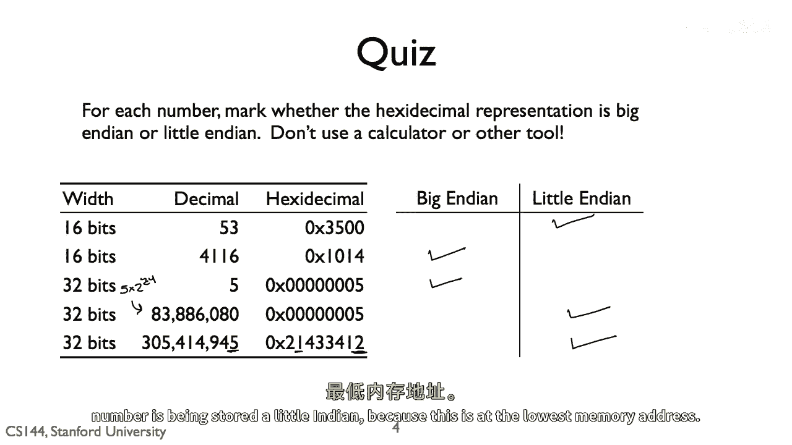

本节课中我们一起学习了字节序的核心知识：
1.  **字节序**分为**大端序**（高位在前）和**小端序**（低位在前）。
2.  可以通过分析具体数字（如 `53`, `4116`）的十六进制存储序列来判断其字节序。
3.  掌握了一个快速判断技巧：观察序列**第一个字节的奇偶性**，奇数常对应小端序，偶数常对应大端序。

理解字节序是掌握计算机数据存储和网络传输的基础，希望本教程能帮助你建立清晰的概念。