# 课程 P110：网络安全入门 🔐

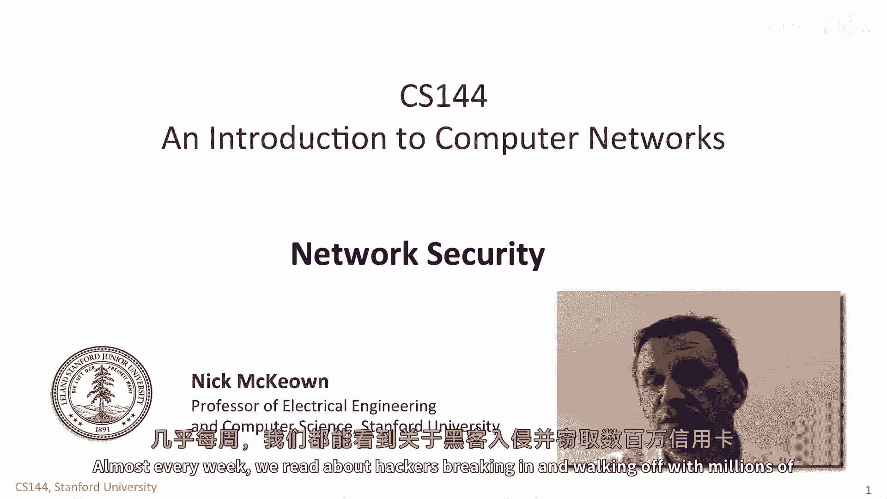

在本节课中，我们将要学习网络安全的基本概念。我们会探讨网络可能遭受攻击的几种方式，并明确一个安全的网络应具备哪些核心特性。

---

当我们在报纸上读到关于计算机网络的新闻时，通常是因为它们遭到了攻击或已被攻破。几乎每周我们都能读到黑客入侵并窃取数百万信用卡号和其他私人数据的报道。这可能是通过钓鱼攻击，或是利用其他漏洞来访问一个本应是私有的网络。

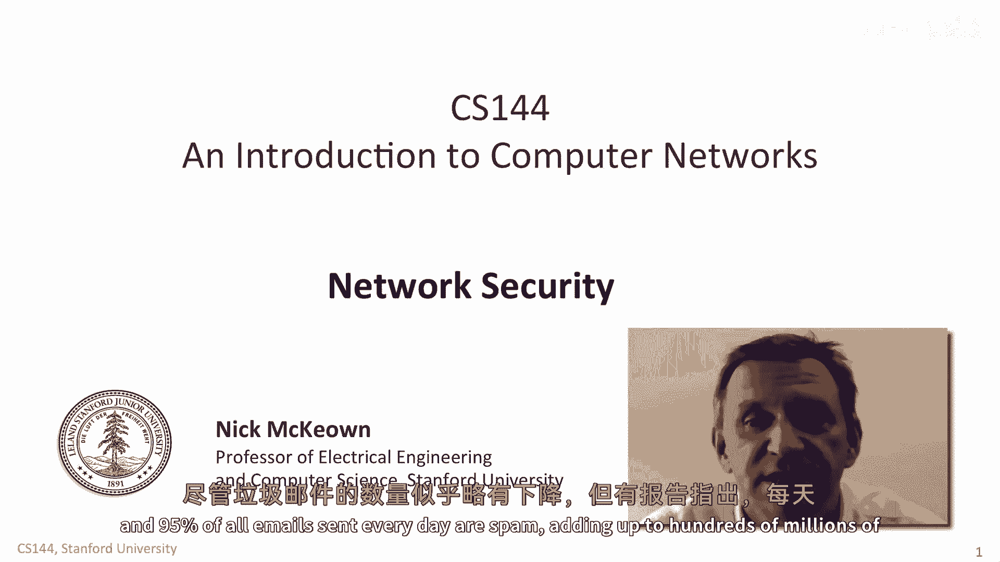

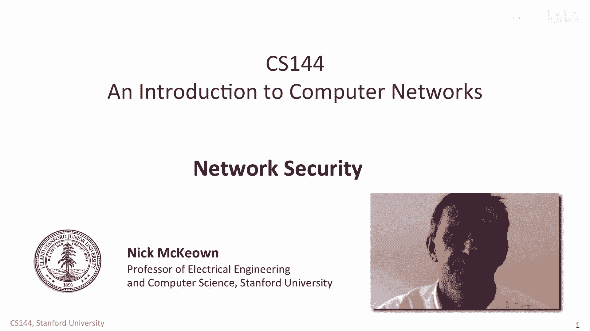

或者，我们可能会读到一种旨在控制计算机、将其变成僵尸网络大军的新型蠕虫病毒，例如21世纪初臭名昭著的“红色代码”和“震荡波”蠕虫。僵尸网络是由主控者控制的一批受感染计算机，通常被用来发送垃圾邮件。虽然垃圾邮件的数量似乎略有下降，但报告表明，每天发送的所有电子邮件中，有75%到95%是垃圾邮件，总计每天达数亿封。

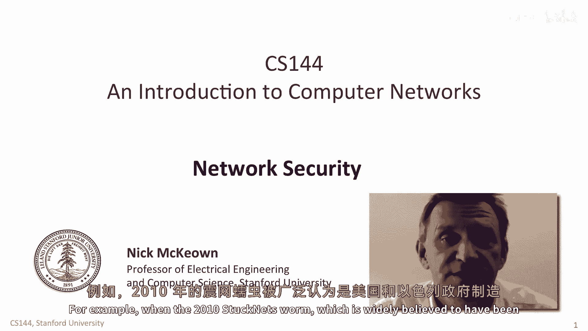

蠕虫病毒也被一国政府用于攻击另一国政府。例如，2010年的“震网”蠕虫被广泛认为是由美国和以色列政府制造的，用于攻击伊朗处理核材料的离心机。

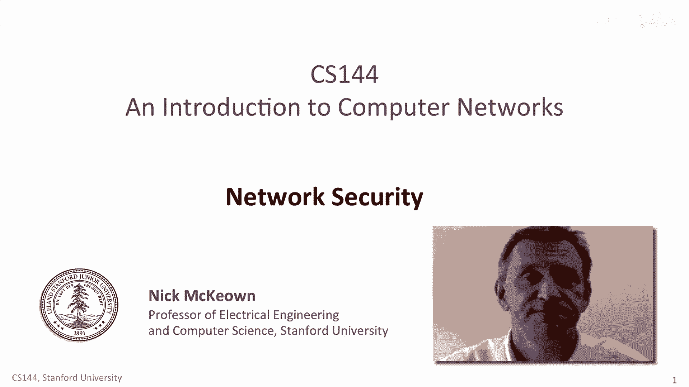

在本视频中，我们将探讨攻击者可能危害网络的几种方式，并解释我们希望网络具备的安全特性。

---

## 通信被危害的几种方式

上一节我们介绍了网络安全问题的普遍性，本节中我们来看看攻击者具体如何危害通信。首先，让我们探索通信可能被危害的不同方式。

第一种也是最简单的方式，是攻击者窃听他人的私人通信。这意味着被动地嗅探和记录网络数据，或者监听元数据，例如记录连接已建立的事实，而不一定记录连接内的数据内容。连接元数据最近因美国国家安全局承认记录通话和连接信息（据称不记录内容）而声名狼藉。

以下是窃听网络的几种方法：

*   **物理层窃听**：攻击者可以被动地搭接电缆或光缆。
*   **无线监听**：如果使用Wi-Fi，攻击者可以监听广播的无线数据包。
*   **路由器复制**：攻击者可以说服路由器复制并转发数据包副本。

在每种情况下，攻击者都可以使用像Wireshark这样的标准工具来解码协议并理解用户数据。

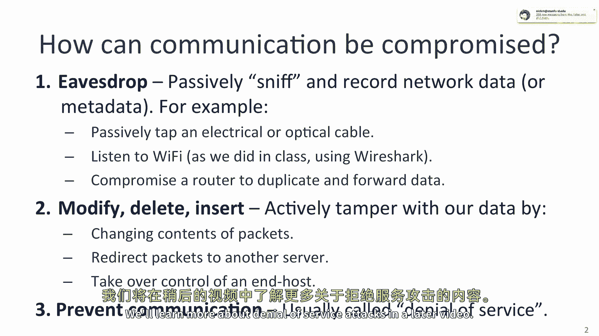

第二种危害类型是攻击者在数据通过网络时修改、删除或插入数据。换句话说，他们主动篡改我们的数据，改变数据包内容，在我们不知情的情况下将数据包重定向到不同的恶意服务器，或者控制我们的终端主机。这可能通过说服我们下载基于钓鱼攻击的恶意软件，或利用我们计算机或通信方式中的漏洞来实现。例如，稍后我们将看到如何在不被任何一端察觉的情况下劫持一个正在进行的TCP连接。

最后，攻击者可能只是想阻止通信双方进行通信。这类攻击通常被称为**拒绝服务攻击**。有时，这些攻击是通过从遍布互联网的不同僵尸网络生成数十亿条消息，来淹没服务器或整个网络来实施的。我们将在后面的视频中了解更多关于拒绝服务攻击的内容。

---

## 窃听攻击实例分析

上一节我们了解了攻击的几种类型，本节我们通过一个具体例子来深入理解窃听攻击。让我们看一个窃听的例子。想象一下，爱丽丝正在从一个电子商务网站进行在线购物。她使用笔记本电脑连接到本地的Wi-Fi接入点，然后通过互联网连接到Amazon.com。她浏览网站并使用普通的HTTP协议进行信用卡购买。

不幸的是，她不知道的是，攻击者正在监听她的操作。攻击者可以通过几种方式进行窃听：

*   **监听无线数据包**：任何拥有笔记本电脑和嗅探工具的人都可以监听空气中的数据包，如果数据未加密，他们就能看到内容。
*   **搭接物理线路**：攻击者可以通过放置被动探测器来拾取电缆泄漏的微小电磁信号，或者直接在电缆下方插入电气连接。
*   **窃听骨干网**：如果攻击者窃听互联网骨干网中的长途链路，他们更可能搭接光纤。这可以通过放置一种叫做光耦合器的设备来实现，该设备将一小部分光信号分流到另一根光纤上，然后进行监听和解码。
*   **劫持网络设备**：没有物理访问权限的攻击者可能会设法颠覆路径上的交换机和路由器，诱使其中一台设备复制数据并将其转发到攻击者的计算机。这可以通过远程颠覆以太网、IP或DNS流量来实现。或者，攻击者可能设法侵入路由器控制台并完全接管路由器。

在我们的例子中，如果攻击者成功窃听了明文的HTTP通信，他或她就可以获取爱丽丝的私人数据，如信用卡号和家庭地址。在后面的视频中，我们将学习HTTPS如何在实际中防止这种情况发生。

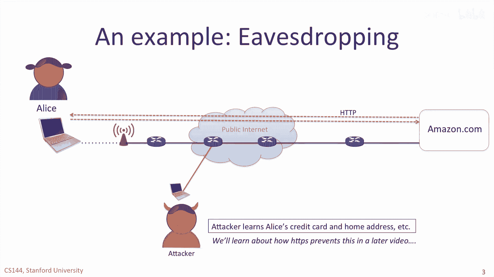

---

## 中间人攻击与流量重定向

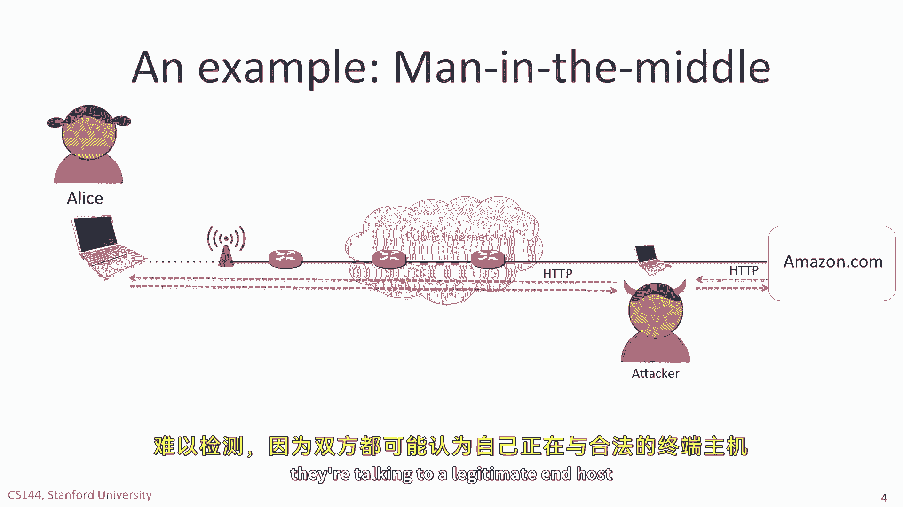

如果攻击者能够将自己插入到爱丽丝和Amazon.com之间的通信中间，那么攻击者就可以在中间终止HTTP连接，对爱丽丝假装是亚马逊，对亚马逊假装是爱丽丝。攻击者可以简单地传递数据并记录而不更改它，或者攻击者可以更改数据，例如修改送货地址，导致购买的商品被送到攻击者那里而不是爱丽丝那里。这些所谓的**中间人攻击**很难被检测到，因为双方都可能认为自己在与合法的终端主机通信。

第三种攻击方式是，在不被爱丽丝察觉的情况下，将流量从服务器重定向出去。如果攻击者能够欺骗路由器，将目的地为Amazon.com的数据包转发给攻击者，那么攻击者就可以响应并假装是亚马逊。或者，攻击者可能欺骗爱丽丝的DNS服务器，当爱丽丝试图查找亚马逊的IP地址时，返回攻击者的IP地址。在每种情况下，爱丽丝都可能被迫浏览攻击者的网站，并被诱使在那里输入她的信用卡信息。

---

## 安全通信的核心特性

显然，爱丽丝不会高兴，她希望自己的通信更加安全。一般来说，当我们说希望互联网上的通信安全时，我们指的是希望具备以下特性：

1.  **保密性**：我们不希望任何人监听我们的通信。为此，我们使用**加密**。我们将在接下来的一个视频中描述其工作原理。
2.  **完整性**：我们不希望我们的消息在传输过程中被篡改。证明消息未被篡改的最常见方法是附加一个**消息认证码**。MAC基于加密技术，并结合对传输消息计算**哈希值**。我们将在后续视频中学习消息认证码。
3.  **认证**：我们通常希望确认与我们通信的另一方的身份。在我们的例子中，爱丽丝希望在输入信用卡详细信息之前，确认她确实在与她信任的亚马逊通信。在后面的视频中，我们将学习**数字签名**和**证书**，它们帮助我们确保我们确实在与我们认为的对象通信。
4.  **可用性**：我们不希望有人一开始就阻止我们进行通信。你可能听说过**拒绝服务攻击**，即攻击者淹没网络或一组服务器，使其无法正常工作。我们很快将研究拒绝服务攻击。

---

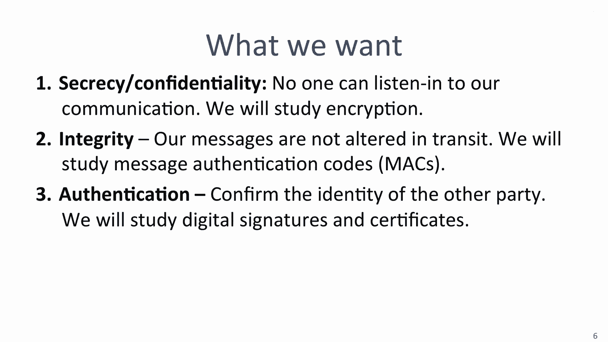

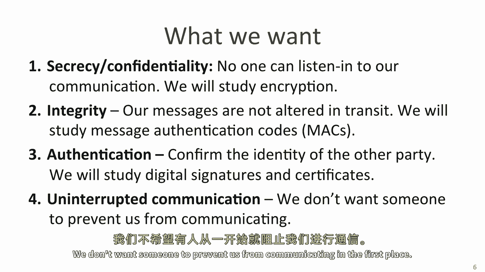

## 总结与预告

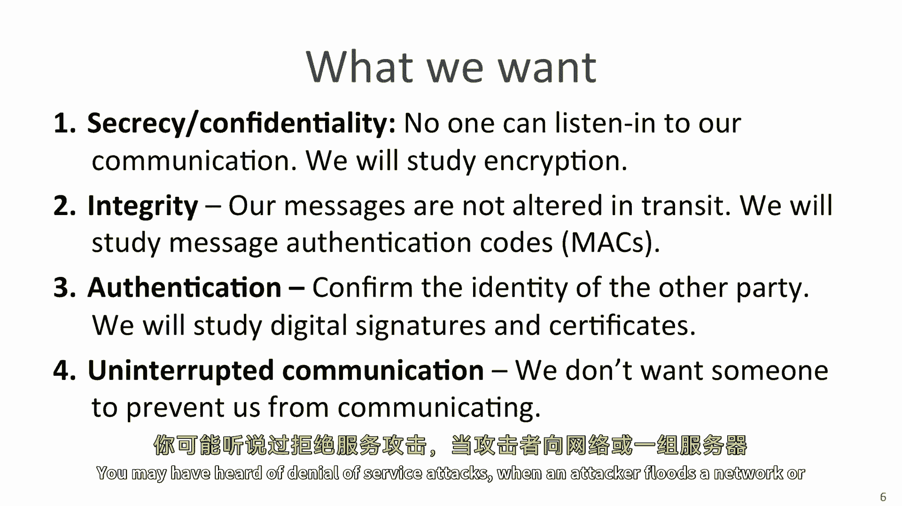

本节课中，我们一起学习了网络安全的基本概念。我们探讨了网络可能遭受的几种主要攻击类型：窃听、数据篡改和拒绝服务攻击。我们还通过爱丽丝在线购物的例子，具体分析了窃听、中间人攻击和流量重定向是如何发生的。最后，我们明确了安全通信应具备的四个核心特性：保密性、完整性、认证和可用性。

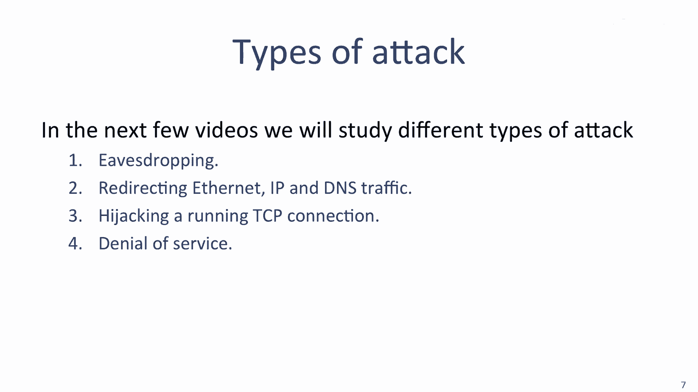

在接下来的几个视频中，我们将深入研究不同类型的攻击。我们将学习窃听、重定向以太网/IP/DNS流量、劫持正在运行的TCP连接以及拒绝服务攻击。