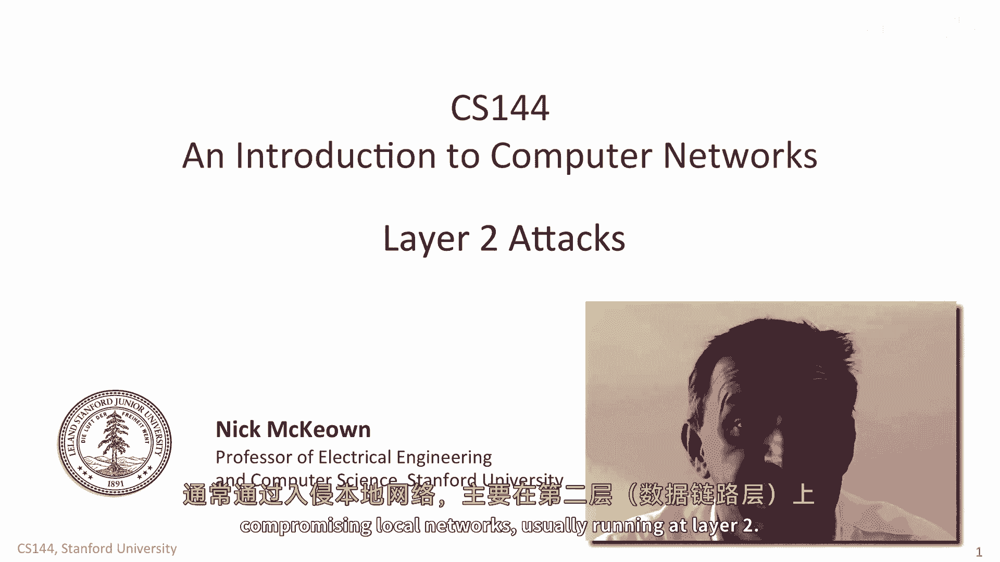
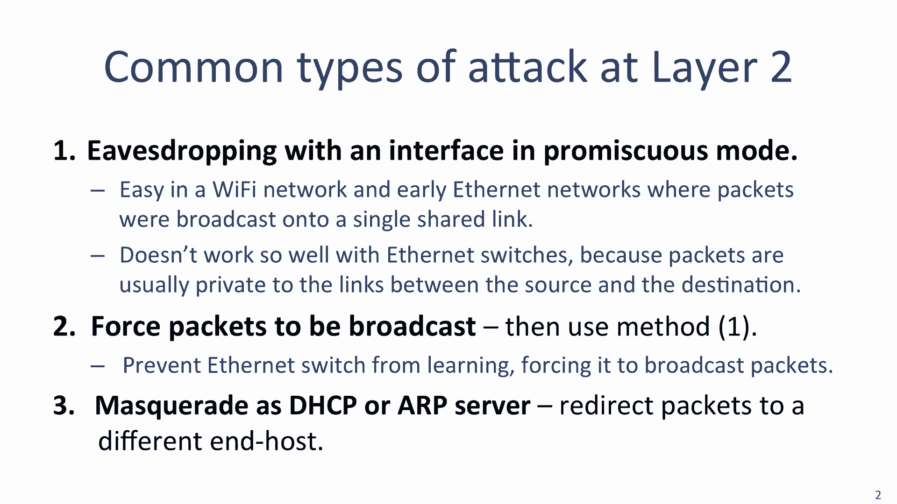
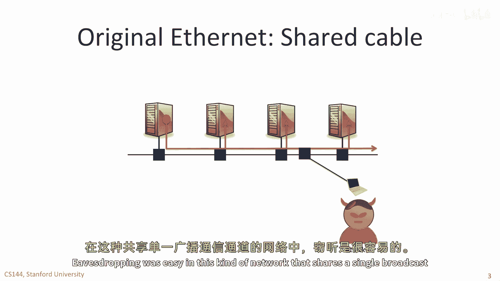
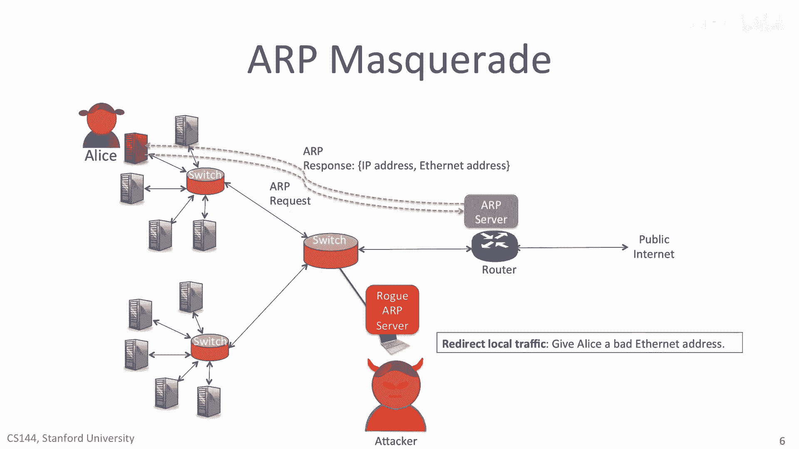

# 课程 P111：二层网络攻击详解 🔓



在本节课中，我们将学习几种通过入侵本地网络（通常运行在第二层）来实施的常见攻击方式。我们将探讨攻击者如何迫使网络广播数据包，以及如何通过伪装成关键网络服务器来劫持流量。

---

## 网络窃听与混杂模式

上一节我们介绍了二层网络攻击的基本概念。本节中，我们来看看攻击者进行网络窃听的一种基础方法。

如果我们将网络接口设置为**混杂模式**，窃听就变得相当容易。在此模式下，网络接口会捕获所有流经的数据包，而不仅仅是那些目标地址是自身以太网地址的数据包。

计算机允许这种操作模式，是为了能够充当以太网交换机。例如，Linux操作系统就内置了以太网交换代码。当Wireshark运行时，它首先会将你的接口置于混杂模式，以便能看到所有数据包。



在Wi-Fi网络和早期的以太网中，数据包被广播到单一的共享链路上，这种窃听方式尤其容易。但在使用以太网交换机的现代网络中，数据包通常只在源和目的地之间的链路上传输，因此这种方法效果不佳。

---

## 通过MAC泛洪攻击强制广播



既然现代交换网络限制了广播，那么攻击者如何实施窃听呢？本节将介绍一种通过攻击交换机转发表来强制网络广播所有数据包的方法。

正如我们在第7单元所见，以太网多年来已经发生了变化。如今的以太网使用交换机，而非单一的共享电缆。使用交换机是因为它允许网络中同时进行多次通信，这对性能是好事，但对攻击者却是坏消息，因为数据包只流经Alice和Bob之间的两条链路，攻击者无法看到。

一种常见的攻击方式是攻击以太网交换机中的转发表。回想一下，以太网交换机通过观察网络中的数据包来学习终端主机的地址。例如，图中Alice和Bob之间的交换机，会在他们发送数据包时学习其以太网地址。

以下是一个交换机学习到一些地址后，其转发表可能的样子：

```
端口1: 地址 AA:BB:CC:DD:EE:01 (Alice)
端口2: 地址 AA:BB:CC:DD:EE:02 (Bob)
```

实际上，这些表比这大得多，通常有数万或数十万个条目，但这里为了简化只展示几个。请记住，如果交换机收到一个以太网目的地址不在其转发表中的数据包，它就会广播该数据包。

那么，攻击者如何说服交换机广播所有数据包呢？它可以通过不断用其他地址填满转发表来实现。以下是攻击者可以采取的步骤：

1.  **发送大量伪造数据包**：攻击者持续高速发送带有新以太网地址的数据包。
2.  **交换机学习并替换**：交换机会学习这些地址，并替换表中已有的条目。通常，替换策略是“最近最少使用”。
3.  **目标条目被驱逐**：如果攻击者发送的速率足够高，表中关于Alice和Bob的条目就会被不断驱逐出去。
4.  **数据包被广播**：一旦Alice和Bob的地址不在表中，发往他们的所有数据包都会被广播，从而被攻击者看到。

这种攻击被称为 **MAC泛洪攻击**。

---

## 伪装服务器攻击：DHCP与ARP

除了泛洪攻击，攻击者还有更“精准”的方法。本节我们将探讨攻击者如何通过伪装成DHCP或ARP服务器来重定向流量。

另一种常见的攻击类型是设置**伪DHCP服务器**。在此攻击中，攻击者试图说服你使用其伪DHCP服务器，而非合法的服务器。

回忆一下，DHCP是网络提供的一项服务，用于在计算机启动或首次接入网络时帮助其进行配置。你的计算机会发送一系列广播发现数据包来寻找DHCP服务器（通常托管在最近的路由器上）。找到后，计算机会发送请求，要求分配本地网络上的IP地址、默认路由器地址以及应使用的DNS服务器地址。

如果伪DHCP服务器能比合法服务器响应更快，它就可以首先响应Alice，并给出它想要的任何配置信息。攻击者可以通过以下几种方式进行破坏：

*   **提供错误的路由器地址**：让Alice将流量发送给攻击者，而非真正的路由器。这使攻击者能在Alice不知情的情况下轻松建立中间人攻击。
*   **提供伪DNS服务器地址**：当Alice未来查询IP地址（例如下次访问Google.com时），伪DNS服务器可以返回另一个服务器的IP地址，从而截获Alice的流量。

最后，攻击者还可以设置**伪ARP服务器**。当Alice向本地主机或通过路由器发送数据包时，她会首先发送ARP请求以查找下一跳的以太网地址。她先发送一个广播ARP请求包，ARP服务器则回复她所寻找的合法以太网地址。

但如果攻击者设置了一个比合法ARP服务器响应更快的伪ARP服务器，攻击者就可以给Alice提供错误信息。如果攻击者回复的是本地网络中一个伪服务器的以太网地址，那么Alice的所有流量都将被发送到这个伪服务器。这是另一种在Alice不知情的情况下，通过将所有流量经由伪服务器转发来建立中间人攻击的简便方法。

---

## 总结 🎯



本节课中，我们一起学习了两种主要的二层网络攻击方式。首先，我们了解了**MAC泛洪攻击**，它通过填满交换机转发表来迫使网络广播数据包，从而实现窃听。其次，我们探讨了**伪装服务器攻击**，包括设置伪DHCP和伪ARP服务器，通过提供错误的网络配置信息，将用户流量重定向到攻击者控制的节点，从而实施中间人攻击。理解这些攻击原理是构建安全网络防御的重要基础。