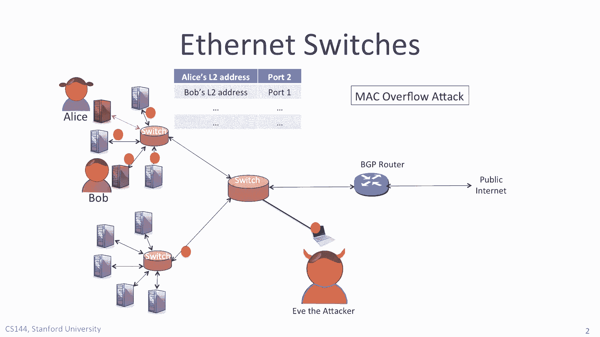
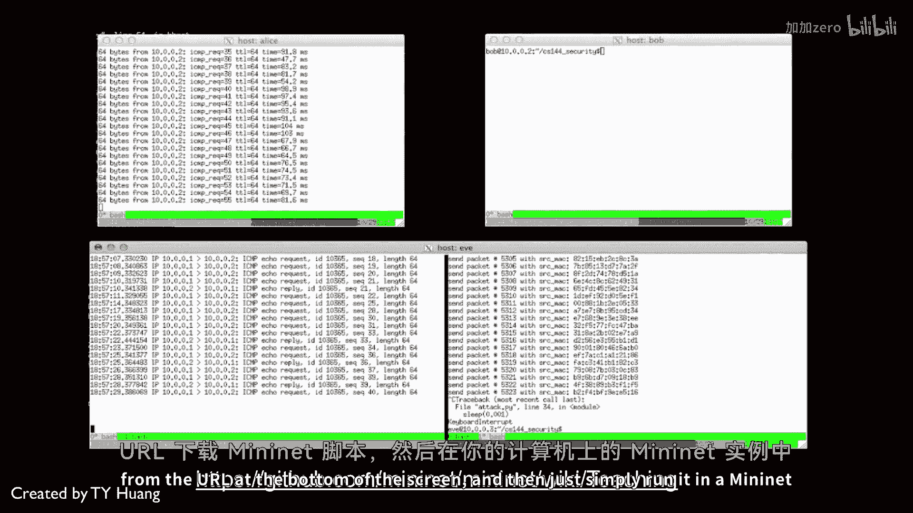

# 课程 P112：MAC 泛洪攻击演示 🚨

在本节课中，我们将学习 MAC 泛洪攻击的原理，并通过一个在 MiniNet 仿真环境中运行的演示，直观地展示攻击者如何通过泛洪交换机转发表来窃听本应隔离的网络流量。

## 攻击原理概述

上一节我们介绍了交换机学习机制的基本原理。本节中我们来看看攻击者如何利用这种机制的局限性。MAC 泛洪攻击的核心是：攻击者向网络发送大量源 MAC 地址随机的以太网帧，迫使交换机的 MAC 地址表（转发表）被填满并溢出。当合法设备的 MAC 地址条目因溢出而被驱逐后，发往该设备的流量将被迫以广播方式发送，从而使攻击者能够窃听到这些流量。

## 演示环境与正常状态验证

首先，我们验证在正常情况下，攻击者无法窃听通信。演示运行在 MiniNet 仿真系统上，这意味着你可以在自己的计算机上安全、轻松地复现此演示。

演示由斯坦福大学的博士生 T-Wifi 创建。屏幕上有三个窗口，分别代表 Alice、Bob 和 Eve（攻击者）。在底部，Alice 正在向 Bob 发送 ping 数据包，而 Eve 在其机器上运行 `tcpdump` 工具，监听来自 Alice IP 地址 `10.0.0.1` 的流量。

正如你所见，`tcpdump` 没有捕获到任何流量，Eve 完全听不到任何信息。这表明交换机的学习机制工作正常，流量没有被广播。

## 攻击过程演示

接下来，Eve 发起攻击。以下是攻击的具体步骤：

1.  **发起泛洪**：Eve 运行攻击脚本，向网络泛洪大量随机生成的源 MAC 地址的以太网帧。
2.  **表项溢出**：交换机持续学习这些新地址，直到其转发表被填满并发生溢出，导致之前学到的 Alice 服务器的 MAC 地址条目被驱逐。
3.  **流量广播与窃听**：此时，Alice 仍在向 Bob 发送 ping 包。由于交换机中已无 Alice 的准确转发表项，这些数据包被广播到所有端口。运行在 Eve 机器上的 `tcpdump` 现在可以看到这些数据包并在屏幕上报告出来。
4.  **持续对抗**：Eve 并非能看到所有数据包，因为交换机偶尔会重新成功学习到 Alice 的地址。但由于 Eve 持续不断的以太网帧泛洪，Alice 的地址条目很快又会被再次驱逐。
5.  **攻击停止**：当 Eve 停止生成新的以太网帧后，交换机将重新学习到 Alice 的以太网地址，并停止广播 Alice 和 Bob 之间的流量。这样，Eve 就无法再窃听到他们的通信。

## 如何自行复现

如果你有兴趣，可以自行复现这个演示。只需从屏幕底部显示的 URL 下载 MiniNet 脚本，然后在你自己计算机的 MiniNet 实例中运行它即可。

## 课程总结

本节课中，我们一起学习了 MAC 泛洪攻击的完整过程。我们了解到，攻击者通过泛洪伪造的 MAC 地址耗尽交换机转发表空间，从而迫使目标流量被广播，达到窃听的目的。这个演示清晰地揭示了依赖自主学习机制的交换网络所面临的安全风险。