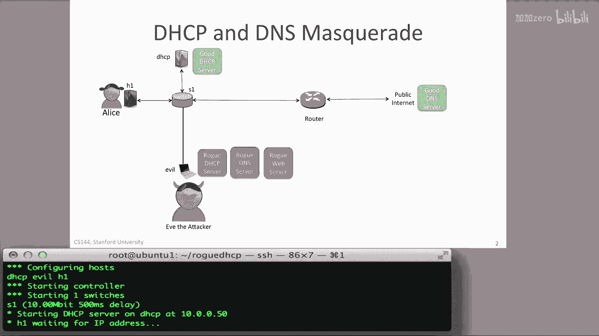
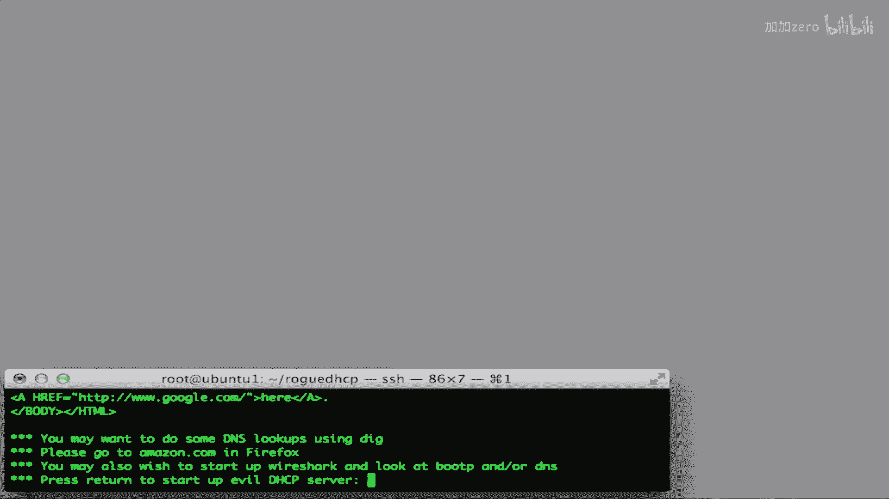
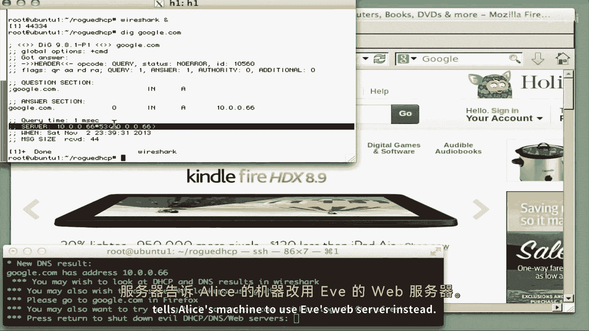

# 课程 P113：DHCP 攻击演示 🧪

在本节课中，我们将学习 DHCP 攻击的基本原理。我们将通过一个演示，了解攻击者如何伪装成合法的 DHCP 服务器，从而错误地配置受害主机的网络设置，并引导其流量至恶意服务器。

---

## 演示环境概述

在演示中，三台主机连接到交换机 S1。主机 H1 是受害者 Alice 的机器，运行着正常的 DHCP 客户端。主机 `DHCP` 运行着正常的 DHCP 服务器，负责为 Alice 的机器配置网络，包括指向互联网上正常 DNS 服务器的信息。主机 `Evil` 由攻击者 Eve 控制，运行着**恶意 DHCP 服务器**、**恶意 DNS 服务器**和**恶意 Web 服务器**。

首先，我们假设 Eve 尚未发起攻击。我们将看到正常的 DHCP 服务器如何正确配置 Alice 的机器，使其能够正常访问互联网。

---

## 正常网络访问流程

上一节我们介绍了演示环境，本节中我们来看看在未受攻击时，Alice 如何正常访问网络。

Alice 使用主机 H1 上的 Firefox 浏览器浏览网页。如下图所示，她可以成功访问斯坦福大学的网站。

她的计算机 H1 运行 DHCP 客户端，以获取 IP 地址、本地路由器地址和 DNS 服务器地址。如果我们使用 `dig` 命令查询另一个域名（如 Amazon.com），可以看到 DNS 服务器（本例中是 Google 运营的公共 DNS 服务器 `8.8.8.8`）正常响应查询，返回 Amazon 的 IP 地址，并且该网站在 Firefox 中能按预期加载。

---

## 攻击者发起攻击

了解了正常流程后，现在让我们看看攻击者 Eve 如何破坏这一流程。

攻击者 Eve 在 `Evil` 主机上启动了三个进程：一个恶意 DHCP 服务器、一个恶意 DNS 服务器和一个 Web 服务器。Eve 的目标是迫使 Alice 的所有 Web 访问都指向 Eve 自己的 Web 服务器。

DHCP 客户端需要定期续订其 IP 地址租约。在演示中我们可以看到，当 H1 发出 DHCP 发现请求时，位于 `10.0.0.50` 的正常 DHCP 服务器会响应一个包含合法 DNS 服务器地址 `8.8.8.8` 的提供报文。然而，Alice 的机器首先收到了来自恶意 DHCP 服务器的提供报文并接受了它。

---

## 攻击后果

现在，Alice 陷入了麻烦。她的机器开始使用 Eve 的恶意 DNS 服务器（地址为 `10.0.0.66`）。当 Alice 的浏览器请求 `Google.com` 的 IP 地址时，恶意 DNS 服务器会告诉 Alice 的机器使用 Eve 的 Web 服务器，于是发生了下图所示的情况。

当她再次访问 `Amazon.com` 时，由于 Firefox 缓存了之前的 DNS 结果，大部分正确的网站内容仍会出现。但一旦 Firefox 执行新的 DNS 查询（我们可以通过按 Shift+刷新 来强制触发），她就会被导向恶意 Web 服务器的 IP 地址。如果她访问一个新网站（如 `Yahoo.com`），同样会最终访问到恶意网站。

以下是攻击者 Eve 可能实施的一些恶意行为：

*   **拒绝服务**： 直接拒绝或阻止 Alice 访问特定网站。
*   **网络钓鱼**： 模仿 Alice 访问的网站（尤其是电子商务网站）的外观，诱骗 Alice 泄露信用卡或其他个人信息。
*   **流量监控**： 充当透明代理，监视和记录 Alice 的所有网络流量。

---

## 恢复与防御启示

当关闭恶意 DHCP 客户端和 DNS 服务器后，Alice 最终会恢复使用正确的本地 DHCP 服务器。她首次重新访问同一网站时，浏览器可能仍缓存了错误的 DNS 记录，并尝试访问恶意 Web 服务器。但最终，Alice 的主机将开始使用正确的 DNS 服务器，她的网络将恢复正常工作。

这个视频展示了，如果你能访问本地网络流量，发起攻击是多么容易。如果你能拦截并抢先响应网络中的 DHCP 流量，你就可以安装自己的 DNS 服务器，进而将流量重定向到你自己的 Web 服务器或任何其他类型的服务器。这在能够访问本地网络的情况下非常容易实现。

---

## 如何自行运行演示

如果你想亲自运行这个演示，可以按照以下步骤操作：

1.  下载演示脚本。脚本的 URL 已显示在屏幕上。
2.  在你自己的 Mini-Net 仿真实例中运行该脚本。

---

## 课程总结

本节课中，我们一起学习了 DHCP 攻击的完整过程。我们看到了攻击者如何利用恶意 DHCP 服务器抢先响应，错误配置受害主机的 DNS 设置，从而将网络流量重定向到恶意服务器。这个演示强调了本地网络安全的重要性，以及 DHCP 服务若缺乏认证机制所面临的潜在风险。