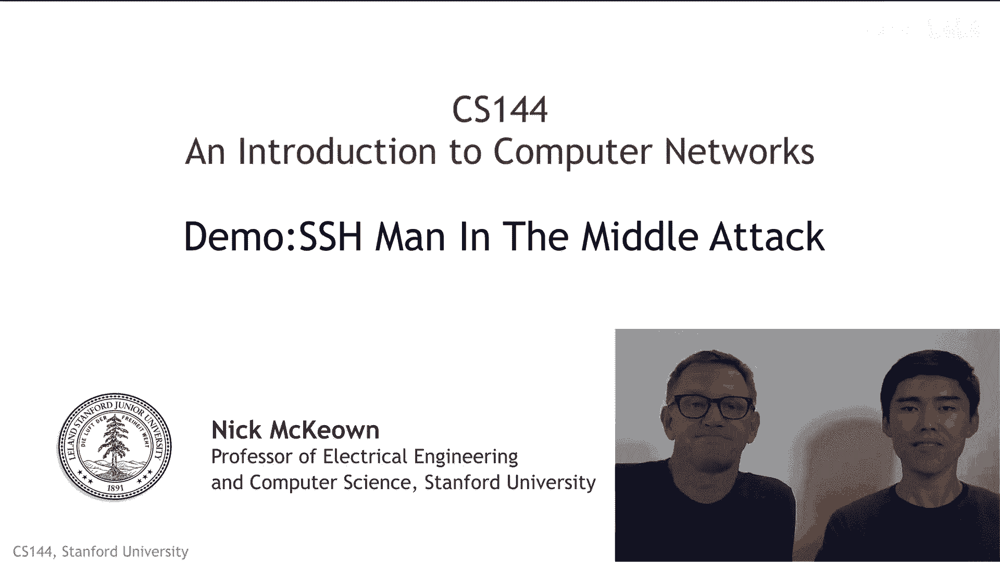
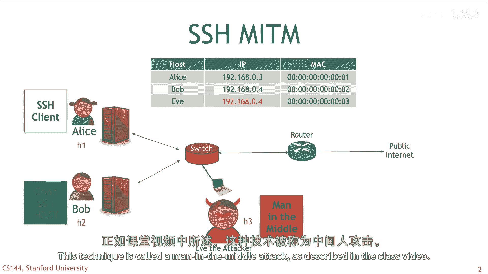
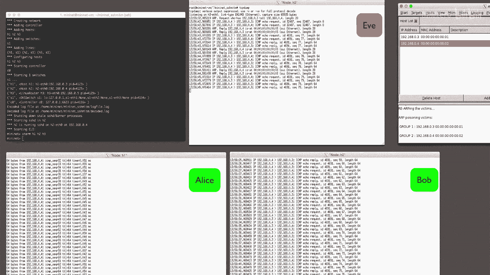
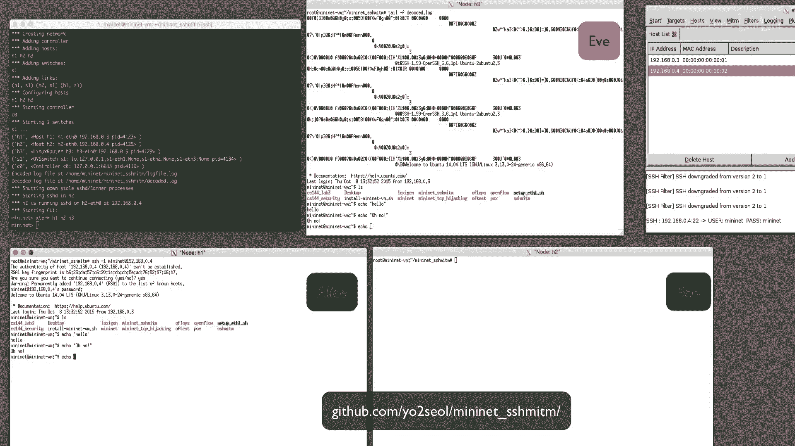

# P114：p113 8-2c Demo SSH Man in the Middle Attack - 加加zero - BV1qotgeXE8D

 In this video， I'm going to show you a demo of SSH man in the middle attack。 Sean。

 who's sitting here with me， created this demo in MiniNet。 In the demo。

 we're going to demonstrate how a malicious attacker can eavesdrop on the traffic between an SSH client and an SSH server。

 And there's going to use a method that we call up spoofing。

 which allows the attacker to become the so-called man in the middle between two communicating parties。

 In the demo， Eve the attacker is going to broadcast falsified art messages over the local area network。

 causing Alice to think that she should use Eve's MAC address to reach Bob。

 Similarly， and at the same time， these falsified art messages cause Bob to think that she should also use Eve's MAC address to reach Alice。

 And so， when Alice requests an SSH connection to Bob。

 the switch will instead route the connection request to Eve instead of Bob。

 Eve is going to make herself the man in the middle， or more precisely the woman in the middle。

 by simply forwarding the packets unchanged to Bob。

 while Eve's dropping and storing SSH data in the middle。

 This technique is called a man in the middle attack， as described in the class video。

 Okay， let's see how this works in more detail。 Just like in the other demos。

 we're going to demonstrate the example on the MiniNet emulation system。

 This means you can easily and safely run it yourself on your own computer。

 I'll tell you shortly how you do that。 Okay， first， let's verify that under normal conditions。

 Eve cannot Eve's drop on Alice。 Alice is sending pings to Bob。

 while Eve is running TCP dump on her machine， trying to listen in on traffic from Alice's IP address。

 Alice's IP address is 192。168。0。3。 As you can see。

 TCP dump running on Eve's machine doesn't capture any traffic at all。

 Eve can't see any of the traffic that is going between Alice and Bob。

 Whereas TCP dump running on Bob's machine correctly sees the packets from Alice。

 as we would expect everything is working as it should。 Next。

 Eve is going to run her attack by sending falsified up data。

 which causes the switch to learn that both Alice and Bob have Eve's Mac address。

 This causes all traffic meant for Alice and Bob to go to Eve instead。

 Ettacap is a nice tool that lets us easily perform this attack。

 It also helps us decrypt SSH data by forcing clients and servers to use SSH version 1。

 which is an older and less secure version of SSH。 Ettacap also saves the decoded SSH data locally for us so we can inspect it。

 So we now turn on our spoofing and start sniffing the network using Ettacap。

 After starting the ARP spoofing， Eve's TCP dump can now successfully see the packets that are sent by Alice to Bob。

 Next， let's create an SSH connection from Alice to Bob。

 We can already see that Ettacap has captured the connection and decoded the username and password that Alice has provided for authentication。

 Also， we can view all the decoded SSH activity between Alice and Bob in a log file on Eve's machine。

 And so we've successfully eavesdrop an SSH connection using a so-called man in the middle attack。

 If you would like， you can reproduce this demo by following the detailed instructions at the following GitHub location。

 [BLANK_AUDIO]。

