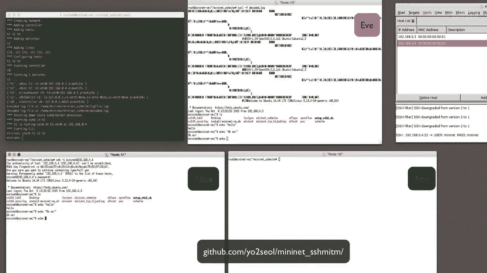

# 课程 P114：SSH 中间人攻击演示 🕵️

在本节课中，我们将学习并演示一次 SSH 中间人攻击。我们将看到攻击者如何通过 ARP 欺骗技术，插入到 SSH 客户端与服务器之间，从而窃听通信内容。

## 攻击原理概述

上一节我们介绍了中间人攻击的基本概念，本节中我们来看看它在 SSH 场景下的具体实现。攻击的核心在于，恶意攻击者通过发送伪造的 ARP 消息，欺骗网络中的其他设备，使其误以为攻击者的 MAC 地址是通信目标的地址。


**核心公式**：`Alice -> (误以为) Eve(MAC) -> Bob` 与 `Bob -> (误以为) Eve(MAC) -> Alice`

这样，当 Alice 尝试连接 Bob 时，网络流量实际上会先经过攻击者 Eve。Eve 可以转发这些数据包以维持连接，同时在其中窃听和解密 SSH 数据。

## 正常网络环境验证

在发起攻击前，我们首先验证在正常网络条件下，攻击者无法窃听 Alice 与 Bob 之间的通信。


以下是验证步骤：
1.  Alice 持续向 Bob 发送 ping 请求。
2.  攻击者 Eve 在其机器上运行 `tcpdump`，试图监听来自 Alice IP 地址（`192.168.0.3`）的流量。
3.  结果显示，Eve 的 `tcpdump` 没有捕获到任何流量。
4.  而在 Bob 的机器上运行 `tcpdump`，则可以正确看到来自 Alice 的数据包。

这证实了在未受干扰的网络中，通信是直接且私密的。

## 实施 ARP 欺骗攻击

接下来，Eve 将发起攻击。她通过发送伪造的 ARP 数据包，欺骗网络交换机，使其误认为 Alice 和 Bob 的 MAC 地址都是 Eve 的 MAC 地址。

我们使用一个名为 `Ettercap` 的工具来执行此攻击。`Ettercap` 不仅能方便地进行 ARP 欺骗，还能通过强制客户端和服务器使用较旧、安全性较低的 **SSH 版本 1** 来帮助解密 SSH 数据，并将解码后的数据保存在本地供我们查看。

启动 ARP 欺骗和网络嗅探的命令类似于：
```bash
ettercap -T -M arp:remote /192.168.0.1// /192.168.0.2//
```

启动 ARP 欺骗后，Eve 的 `tcpdump` 现在可以成功看到 Alice 发送给 Bob 的数据包，证明流量已被重定向。

## 窃听 SSH 连接

现在，让我们从 Alice 向 Bob 发起一个 SSH 连接。

攻击效果立即显现：
1.  `Ettercap` 捕获了该连接。
2.  工具成功解码了 Alice 为身份验证提供的**用户名和密码**。
3.  在 Eve 的机器上，我们可以查看一个日志文件，其中记录了 Alice 与 Bob 之间所有解码后的 SSH 活动记录。


至此，我们成功地使用中间人攻击窃听了一次 SSH 连接。

## 如何复现此演示

如果你有兴趣，可以按照以下 GitHub 仓库中的详细说明，在自己的计算机上复现这个演示。

> 请注意：此演示仅在受控的实验室环境（如 Mininet 仿真系统）中进行，用于教育目的。未经授权对他人网络进行此类攻击是非法的。

## 课程总结



本节课中，我们一起学习了 SSH 中间人攻击的完整过程。我们了解了攻击者如何利用 **ARP 欺骗** 成为通信双方的“中间人”，并使用特定工具（如 `Ettercap`）来拦截和解密 SSH 流量。这个演示清晰地揭示了依赖未加密或弱加密协议，以及在不可信网络中进行通信所面临的风险。