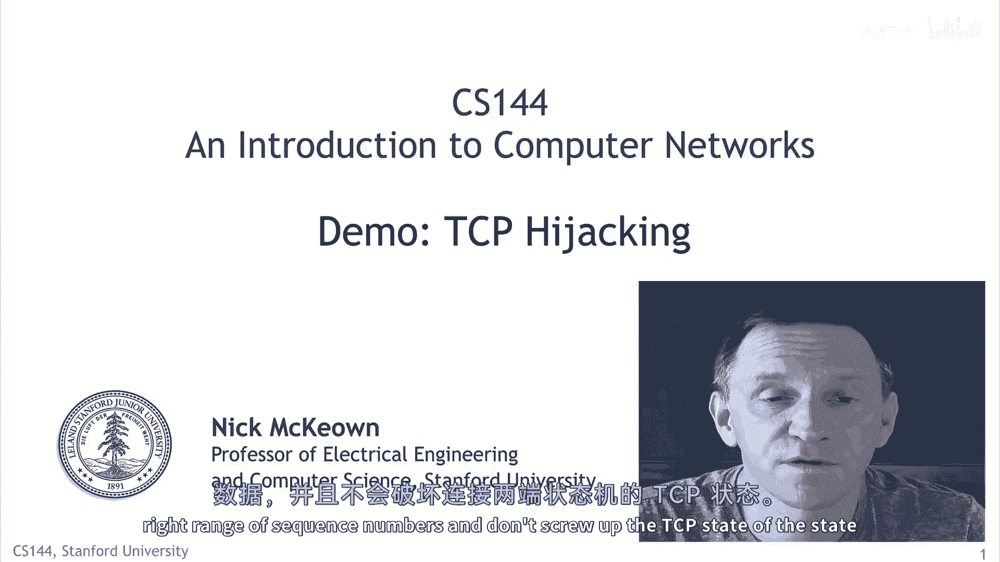
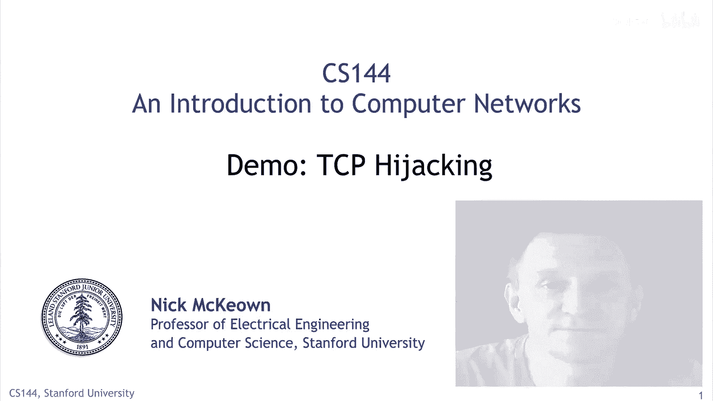
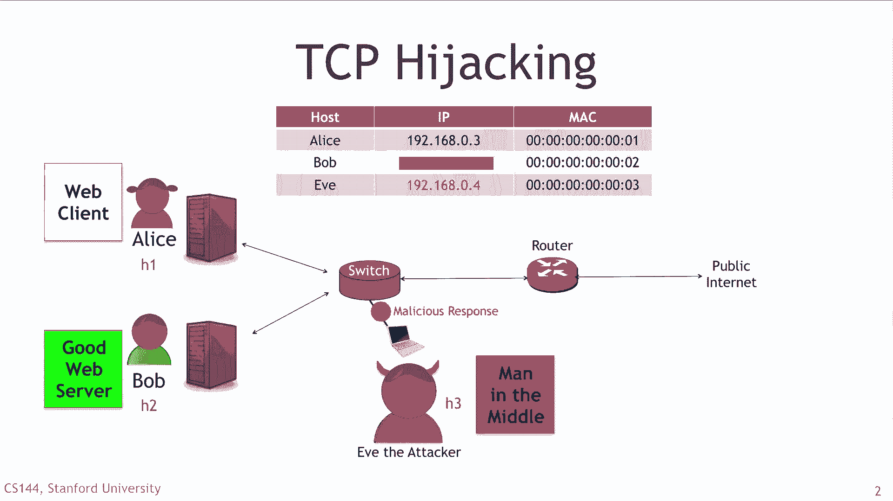
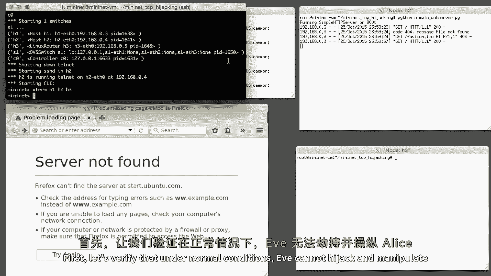
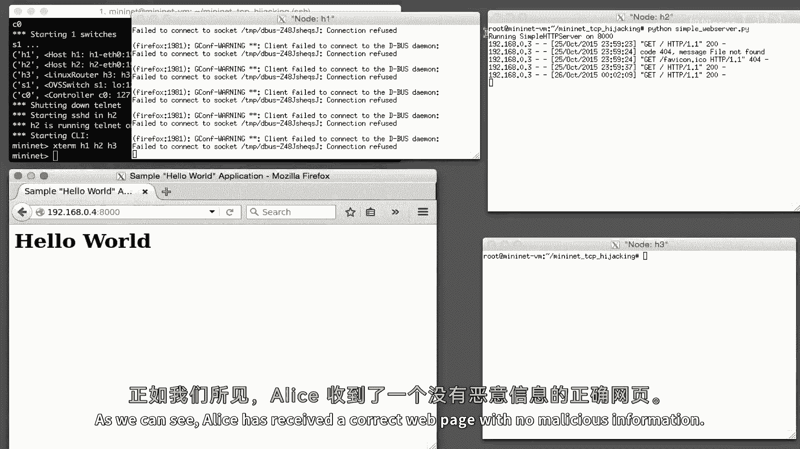
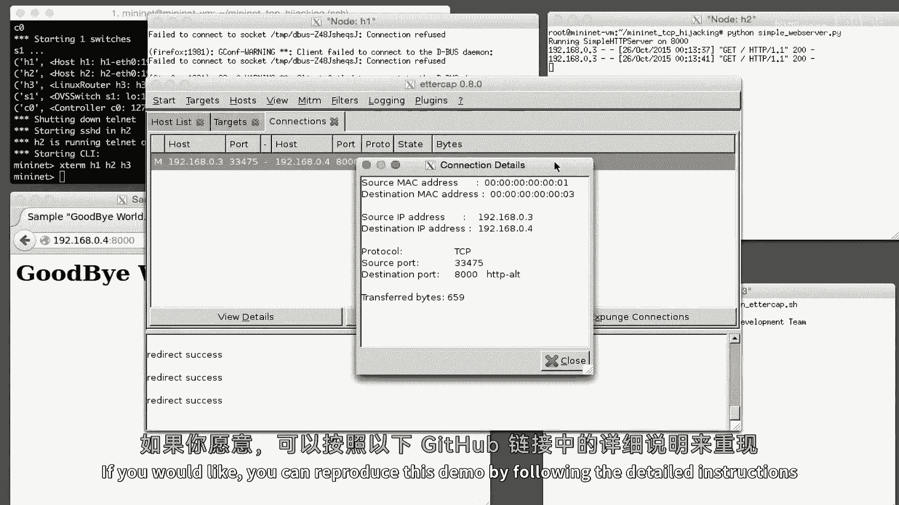

# P115：p114 8-2d TCP Hijack - 加加zero - BV1qotgeXE8D

 By now you've seen several different ways to attack a computer。 Pretty scary stuff。

 We can force the network to broadcast packets or， reroute packets to a malicious server。

 And in this video we're going to see another scary example。 In this case。

 Alison Barber happily communicating over a TCP connection。

 And Evie is going to step in right into the middle of that TCP connection。

 and hijack it after it started。 She's going to manipulate the data inside the connection without either。

 side knowing that she's doing it。 The attack is pretty tricky。

 It's more tricky than the other ones because， Evie has to figure out the current state of the TCP connection between。

 Alison and Bob in order to send data and axe that fall into the right range。

 of sequence numbers and don't screw up the TCP state of the state machines。

 at both ends of the connection。

 Let's see how this works。

 Just as we saw in the SSH man in the middle attack。

 Evie the attacker is going to broadcast falsified art messages over the local。

 area network causing Alice to think that she should use Evie's MAC address to， reach Bob。

 At the same time， the falsified art packets cause Bob to think that he should。

 also use Evie's MAC address to reach Alice。 Therefore。

 all of the TCP traffic between Alice and Bob will actually be， routed through Evie。

 Evie will simply act as a bridge between Alice and Bob passing TCP requests。

 and responses back and forth。 And Evie will look for patterns in the TCP segments waiting for the chance to。

 hijack and manipulate the connection。 Let's take a look in more detail。

 Just like with the other demos， I'm going to demonstrate the example using the。

 MiniNet emulation system。 You can easily and safely run this one yourself on your own computer。

 and in a minute I'll tell you how。 This example was created by Sean Choi shown here。 First。

 let's verify that under normal conditions， Evie cannot hijack and。

 manipulate TCP connections between Alice and Bob。 The type of TCP application we're going to use is HTTP。

 an application， protocol that of course we're all very familiar with by now。

 Alice is requesting a webpage from Bob， and Bob is running a simple HTTP server。

 on his computer and will respond with a static webpage from his local file， system。 As we can see。

 Alice has received a correct webpage with no malicious information。

 Next， Evie runs in an attack in which she sends falsified ARP packets。

 causing both Alice and Bob to think that they should use Evie's MAC address， to reach each other。

 All traffic meant for Alice and Bob now goes to Ev instead。

 Eticap is a nice tool that lets us easily perform this attack。

 Eticap also helps us to hijack TCP connections and manipulate what is sent， to the receiver。

 We now turn on ARP spoofing and start sniffing the network using Eticap。

 Now we'll send another HTTP request from Alice to Bob。

 Detecting some packets as defined in our filter， Evie will capture the packet。

 and manipulate the contents of the webpage。 We can now see the manipulated pay arriving at Alice。

 Also， we can see the connection information between Alice and Bob on Eticap。

 indicating that Evie's dropping is also possible。 We have successfully hijacked the TCP connection。

 If you would like， you can reproduce this demo by following the detailed instructions。

 at the following GitHub location。

