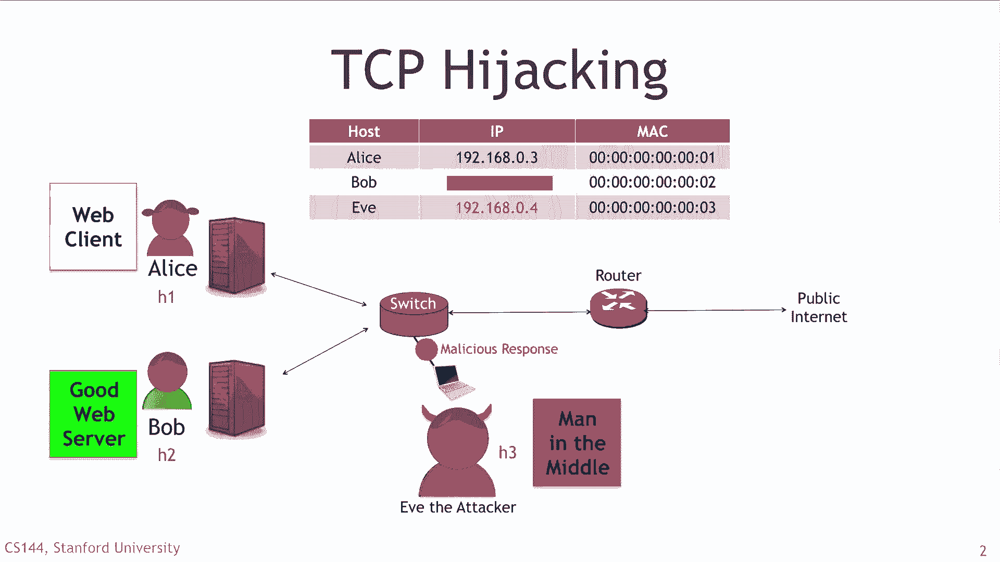
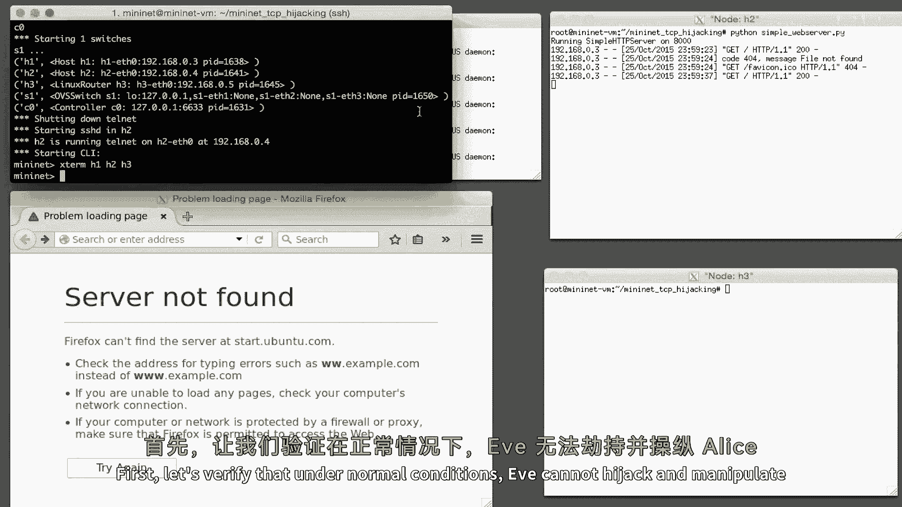

# 课程P115：TCP连接劫持攻击详解 🕵️

在本节课中，我们将学习一种名为TCP连接劫持的网络攻击技术。这种攻击允许攻击者秘密地介入两个通信方之间已建立的TCP连接，并篡改传输的数据，而通信双方对此毫不知情。

## 概述

截至目前，你已经见识了多种攻击计算机的方法。我们可以强制网络广播数据包，或者将数据包重定向到恶意服务器。在本视频中，我们将看到另一个令人不安的例子。在这个场景中，Alice和Bob正在通过TCP连接愉快地通信，而攻击者Eve将介入这个TCP连接的中间，在连接建立后劫持它。她将操纵连接内部的数据，而双方都不会察觉。

这种攻击相当棘手，比之前的攻击更复杂。因为Eve必须弄清楚Alice和Bob之间TCP连接的当前状态，以便发送数据，并且这些数据必须落在正确的序列号范围内，同时不能破坏连接两端状态机的TCP状态。

## 攻击原理

正如我们在SSH中间人攻击中看到的那样，攻击者Eve将在局域网中广播伪造的ARP消息，导致Alice认为她应该使用Eve的MAC地址来联系Bob。同时，伪造的ARP数据包也使Bob认为他也应该使用Eve的MAC地址来联系Alice。

因此，Alice和Bob之间所有的TCP流量实际上都将通过Eve路由。Eve将简单地充当Alice和Bob之间的桥梁，来回传递TCP请求和响应。同时，Eve会寻找TCP数据段中的模式，等待劫持和操纵连接的机会。

让我们更详细地了解一下。

## 演示环境搭建

与其他演示一样，我将使用MiniNet仿真系统来演示这个例子。你可以轻松安全地在自己的计算机上运行此演示，稍后我会告诉你如何操作。这个例子是由Sean Choi创建的。

首先，让我们验证在正常情况下，Eve无法劫持和操纵Alice和Bob之间的TCP连接。

我们将使用的TCP应用类型是HTTP，这是一种我们现在都非常熟悉的应用层协议。Alice正在向Bob请求一个网页，Bob在他的计算机上运行一个简单的HTTP服务器，并将从其本地文件系统响应一个静态网页。

正如我们所见，Alice收到了一个正确的网页，没有任何恶意信息。

## 实施攻击

接下来，Eve发起攻击，她发送伪造的ARP数据包，导致Alice和Bob都认为他们应该使用Eve的MAC地址来联系对方。所有原本发给Alice和Bob的流量现在都流向了Eve。

Ettercap是一个很好的工具，可以让我们轻松执行此攻击。Ettercap还帮助我们劫持TCP连接并操纵发送给接收者的内容。

我们现在开启ARP欺骗，并使用Ettercap开始嗅探网络。然后，我们将从Alice向Bob发送另一个HTTP请求。

根据我们定义的过滤器检测到一些数据包后，Eve将捕获该数据包并操纵网页内容。我们现在可以看到被篡改的有效载荷到达了Alice。

同时，我们可以在Ettercap上看到Alice和Bob之间的连接信息，表明Eve的丢弃操作也是可能的。我们已经成功劫持了TCP连接。

如果你想重现这个演示，可以按照以下GitHub链接中的详细说明进行操作。

## 总结

本节课中，我们一起学习了TCP连接劫持攻击的基本原理和演示过程。我们了解到，攻击者可以通过ARP欺骗成为通信双方的中间人，进而监听、篡改或中断已建立的TCP连接。这种攻击凸显了在不安全的网络环境中，即使使用TCP这样的可靠协议，通信内容也可能被恶意第三方操纵的风险。理解此类攻击有助于我们更好地认识网络安全威胁，并采取相应的防护措施。