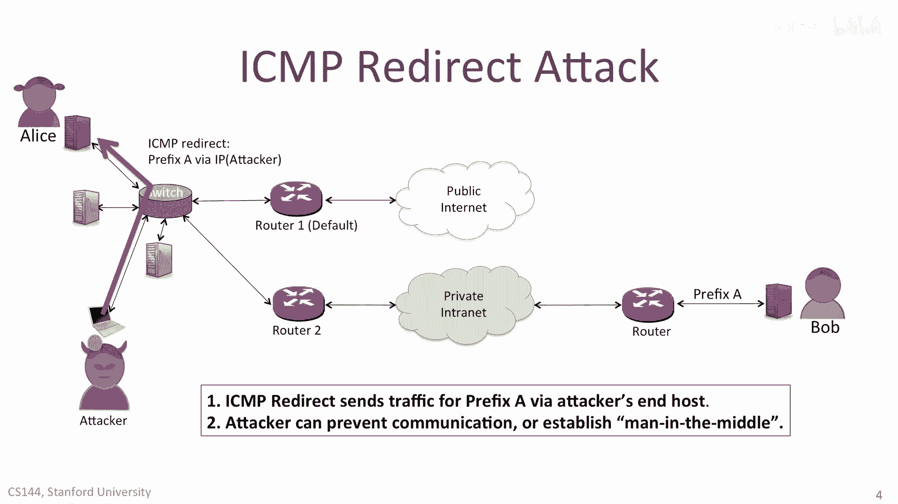
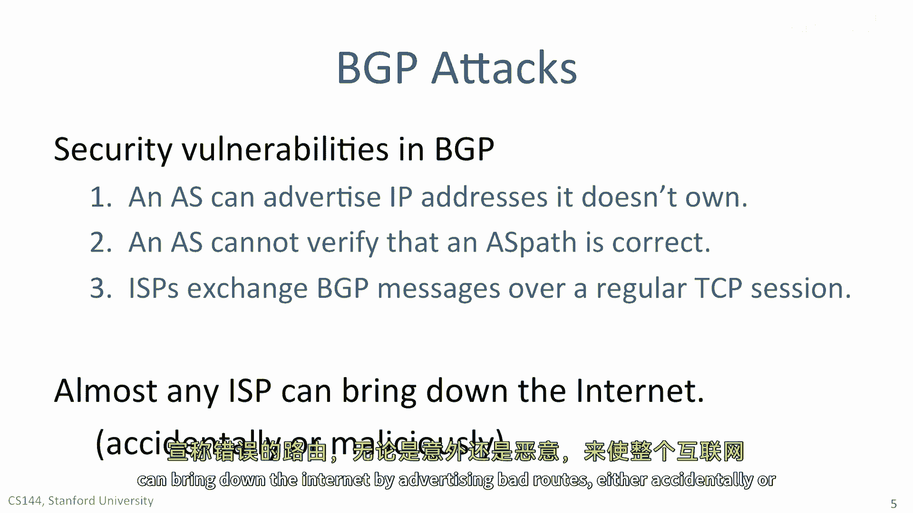
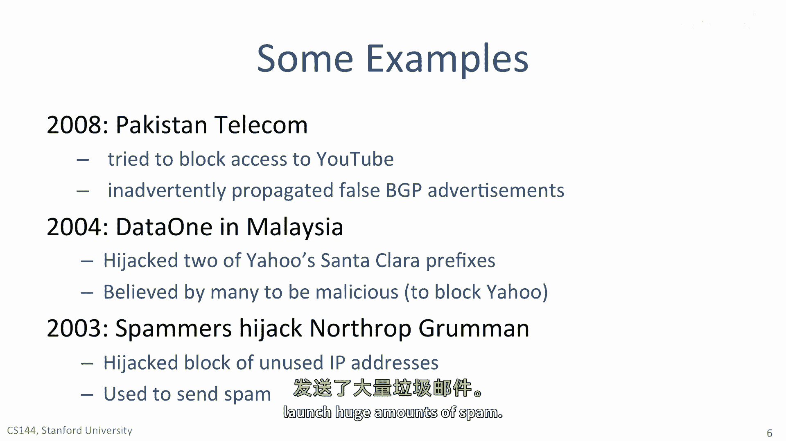
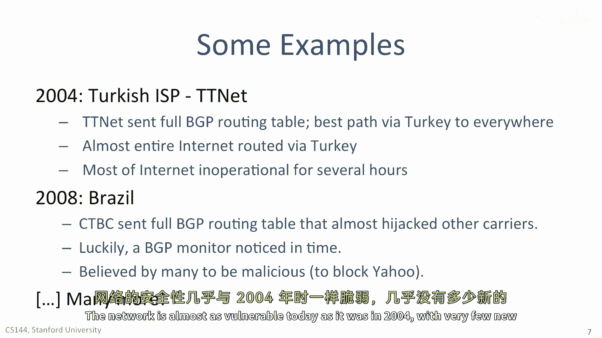

# 课程 P116：第三层网络攻击详解 🔍

在本节课中，我们将学习针对第三层（即IP网络）的几种常见攻击方式。这些攻击虽然原理简单，却能对网络造成严重影响。我们将重点探讨ICMP重定向攻击和BGP劫持攻击，并通过实例了解其运作机制与潜在危害。

## ICMP重定向攻击 🎯

上一节我们概述了第三层攻击，本节中我们来看看第一种具体攻击类型：ICMP重定向攻击。ICMP（互联网控制消息协议）原本用于在网络中传递状态信息，例如通知源主机数据包的TTL（生存时间）已耗尽或目的不可达。然而，攻击者可以恶意利用ICMP的重定向功能。

### 合法ICMP重定向的工作原理

首先，了解合法的ICMP重定向如何工作，有助于理解攻击者的利用方式。

假设Alice连接到其公司网络，该网络通过路由器1接入公共互联网。Alice想给同公司的同事Bob发送数据包。Alice的计算机默认将路由器1配置为默认网关。因此，发往不同子网的数据包会先发送给路由器1。

但实际上，发往Bob的数据包应该通过路由器2路由。当数据包到达路由器1时，路由器1发现该数据包需要从接收它的同一接口发回。这提示路由器1，Alice将数据包发送给了错误的路由器。

于是，路由器1执行两个操作：
1.  将数据包转发给正确的下一跳，即路由器2。
2.  向Alice的计算机发送一个**ICMP重定向消息**，告知她未来发送给Bob的数据包应直接通过路由器2发送。

Alice的计算机收到此消息后，会在其本地路由表中添加一条新的路由条目。下次Alice再向Bob发送数据包时，她的计算机会直接将其发送给路由器2。

### 攻击者如何利用ICMP重定向

攻击者可以伪造并发送ICMP重定向消息。例如，攻击者可以向Alice发送一条ICMP重定向消息，声称前往特定IP前缀（比如Bob所在的网络）的最佳路径是通过攻击者自己的计算机。

结果，当Alice尝试与Bob通信时，她的数据包会被错误地发送给攻击者。攻击者可以选择：
*   **丢弃数据包**：导致Alice无法与Bob通信（拒绝服务攻击）。
*   **查看并转发数据包**：在Alice和Bob之间充当中间人，窃听或篡改通信内容（中间人攻击）。

## BGP劫持攻击 🌐

接下来，我们探讨另一种更复杂、影响范围更广的攻击：BGP（边界网关协议）劫持攻击。BGP是互联网核心的路由协议，负责在不同自治系统（AS）之间交换路由信息。

### BGP的安全漏洞

BGP攻击利用了该协议的一个或多个安全漏洞：

1.  **地址所有权验证缺失**：一个AS可以宣告它并不拥有的IP地址前缀。这意味着它可以宣告属于其他AS的IP地址，从而引发路由混乱。
2.  **AS路径验证缺失**：接收方AS无法验证宣告的AS路径是否真实有效。BGP路由器无法知道所宣告的AS序列是否真的能到达正确的目的地。
3.  **会话安全依赖**：ISP之间通过普通的TCP会话交换BGP消息。如果攻击者能够接管这个TCP会话，或在未被察觉的情况下向会话中注入数据包，就可以宣告错误的AS路径，从而劫持部分地址空间。

令人惊讶的是，即使在今天，几乎任何ISP（无论是意外还是恶意）通过宣告错误路由，都可能使互联网部分瘫痪。

### 著名的BGP攻击案例

以下是历史上一些因BGP问题导致重大网络故障的著名案例：

*   **2008年巴基斯坦电信YouTube事件**：巴基斯坦电信试图在境内屏蔽YouTube，但其错误配置导致虚假的BGP路由宣告泄露到全球互联网，致使YouTube在全球范围内瘫痪数小时。
*   **2004年马来西亚Data One攻击雅虎**：马来西亚的ISP Data One被认为发动了恶意攻击，成功劫持了雅虎位于圣克拉拉的两个IP前缀，导致雅虎数据中心无法运作。
*   **2003年垃圾邮件发送者劫持IP地址**：垃圾邮件发送者故意劫持了美国政府承包商Northrop Grumman的一块IP地址空间，并利用这些地址发送大量垃圾邮件。
*   **2004年土耳其Titinat事件**：土耳其ISP Titinat向全球宣告了完整的BGP路由表，声称土耳其是通往互联网所有地方的最佳路径，导致全球互联网流量试图经由土耳其路由，造成数小时的网络混乱。
*   **2008年巴西CTVC未遂事件**：巴西的CTVC几乎发送了会劫持几乎所有运营商IP地址块的完整BGP路由表，幸运的是，一个BGP监控系统及时发现了问题。

### BGP劫持攻击原理

让我们通过一个场景具体了解BGP劫持是如何发生的：

假设Alice位于AS1，她想与位于遥远AS3中的Bob（IP前缀为A）通信。正常情况下，Alice的邻居AS2会正确宣告，前往AS3中Bob的最佳路径是通过AS2。

现在，攻击者控制了恶意自治系统`ASEvil`。一旦攻击者掌控了`ASEvil`与AS2之间的BGP会话，他就可以宣告虚假的AS路径。例如，他可以宣告一条路径，声称16位的前缀`171.64.0.0/16`（假设这是Bob所在网络的更大范围）可以通过`ASEvil`到达。

AS1无法验证这条信息的真伪，因此可能开始将原本发往Bob的流量路由到`ASEvil`。攻击者可以选择丢弃所有数据包（黑洞攻击），也可以建立中间人攻击，在Alice和Bob不知情的情况下窃听或篡改通信。

为了不引起过多怀疑，攻击者不必劫持整个`/16`前缀。他可以注入一个更具体的`/24`前缀（例如`171.64.74.0/24`），这样只会将属于该更小子网的部分流量引流到攻击者的AS。

本节课中我们一起学习了两种主要的第三层网络攻击。**ICMP重定向攻击**利用了网络设备间信任的ICMP协议消息，将受害者流量导向攻击者。**BGP劫持攻击**则利用了互联网核心路由协议BGP在验证和信任模型上的根本性漏洞，允许攻击者宣告虚假路由，从而劫持或干扰大规模的网络流量。这些攻击揭示了网络协议在设计时对可扩展性和效率的追求，有时会以牺牲安全性为代价。