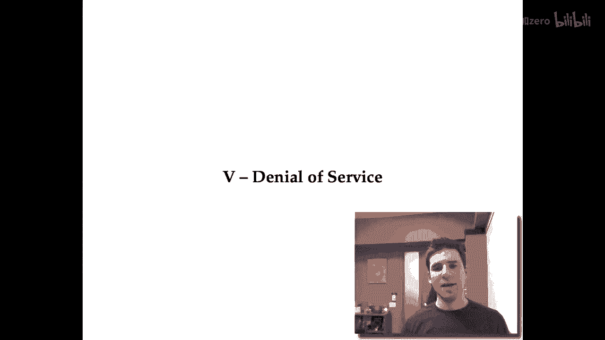
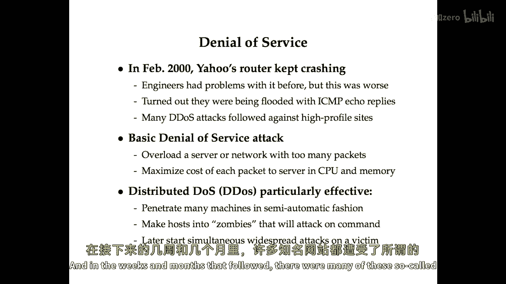
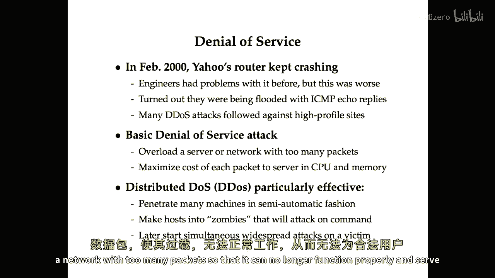
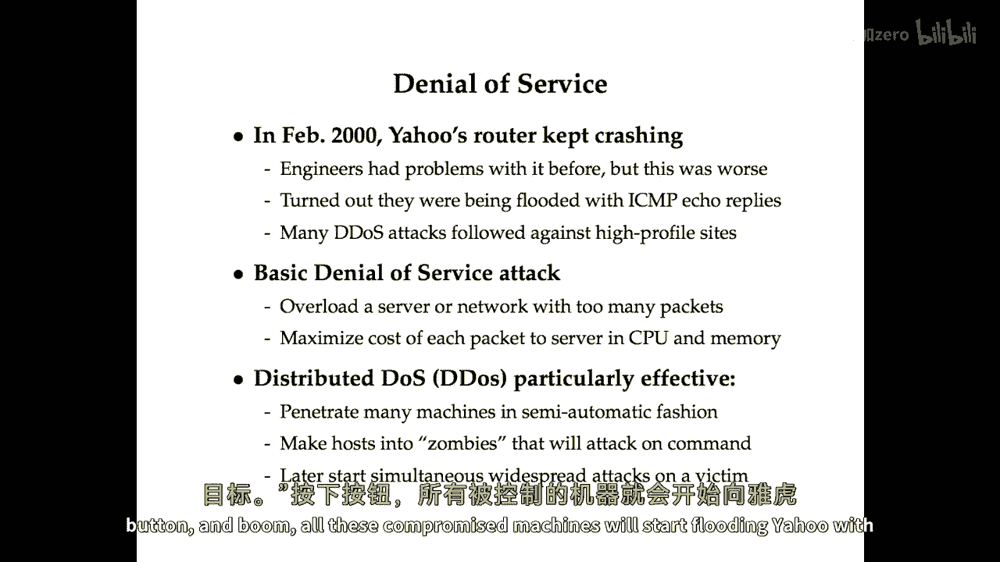
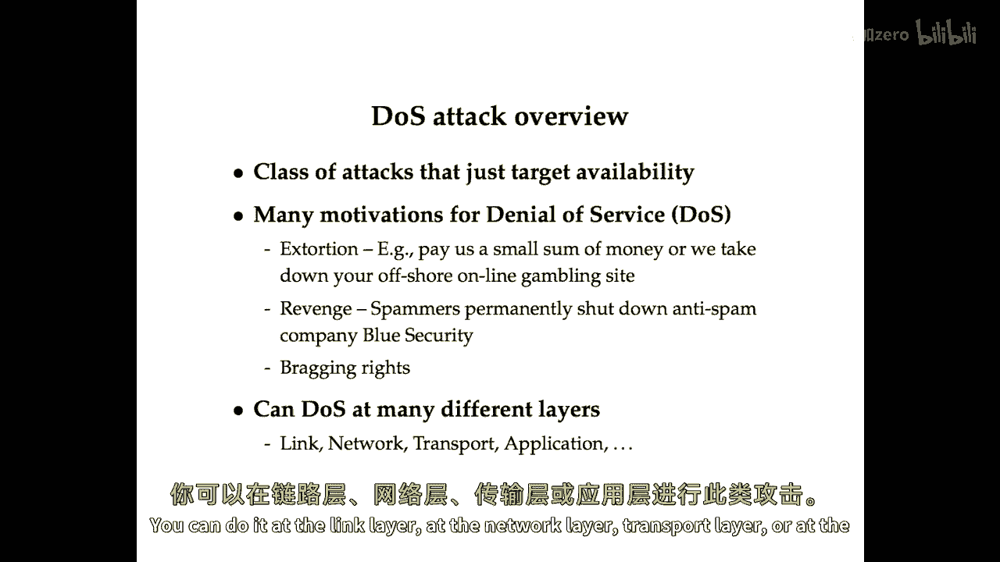
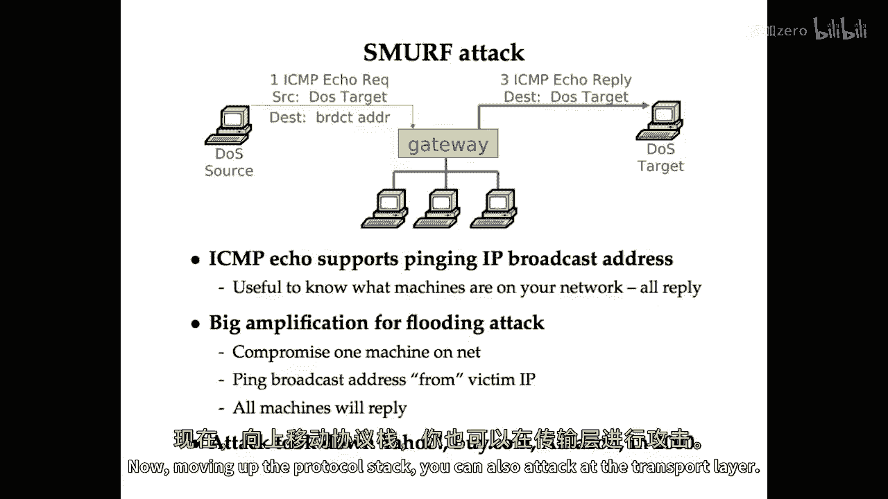
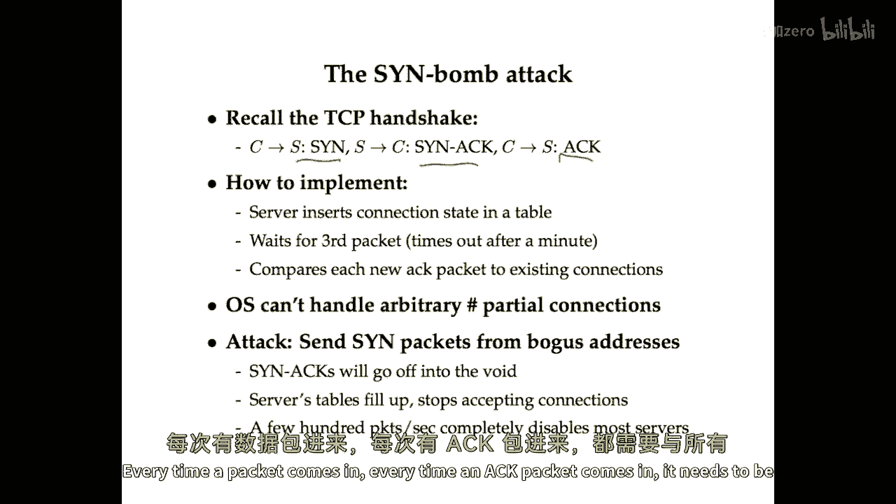
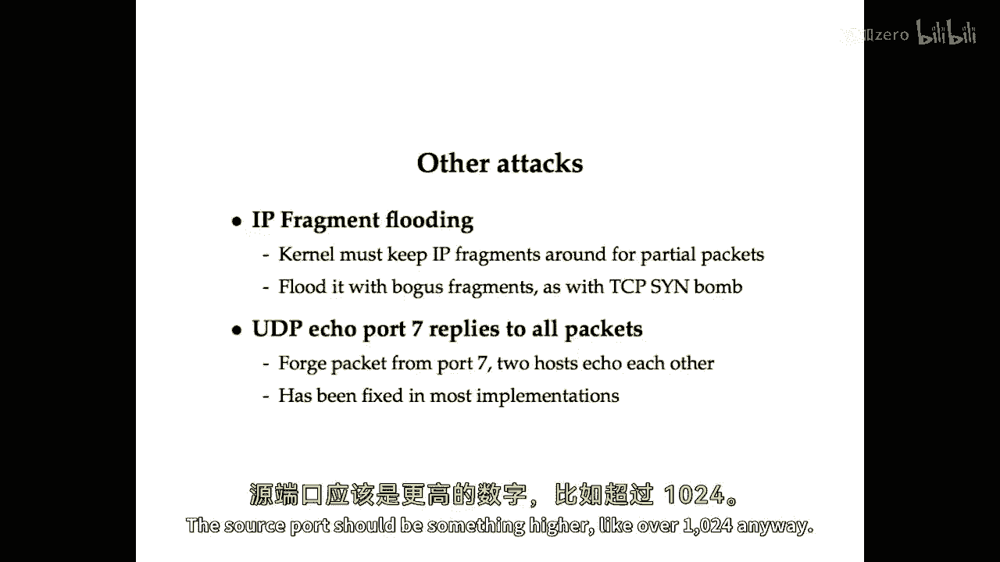

# 网络安全课程 P117：拒绝服务攻击 (DoS/DDoS) 🛡️


在本节课中，我们将学习拒绝服务攻击。这是攻击系列视频的最后一节，我们将探讨攻击者如何通过耗尽目标资源，使其无法为合法用户提供服务。



## 概述：什么是拒绝服务攻击？



拒绝服务攻击旨在阻止某项服务正常可用。最简单的攻击方式是向服务器或网络发送过量数据包，使其无法正常运行并服务合法客户端。

攻击者希望最大化每个数据包对服务器造成的资源消耗，包括网络带宽、CPU和内存。分布式拒绝服务攻击之所以有效，是因为攻击流量来自四面八方，难以通过过滤单一来源来阻止。

---



## DDoS攻击的动机与实施

上一节我们介绍了DoS的基本概念，本节中我们来看看攻击者实施DDoS攻击的动机和常见方式。

攻击者通常通过恶意软件以半自动方式渗透大量机器，将其变为“僵尸主机”。随后，攻击者可以命令这些僵尸主机同时向特定目标（如Yahoo.com）发送海量数据包。

以下是攻击者发动DDoS攻击的几个主要原因：



*   **敲诈勒索**：攻击者可能威胁某些公司（如离岸赌博网站），要求支付赎金，否则将攻击使其网站瘫痪。
*   **报复**：例如，垃圾邮件发送者曾对一家名为Blue Security的反垃圾邮件公司发动DDoS攻击，导致其永久关闭。
*   **炫耀**：有些人发动攻击只是为了炫耀技术能力。


---

## 各网络层次的拒绝服务攻击

拒绝服务攻击可以发生在网络协议栈的不同层次。从物理层到应用层，都存在相应的攻击手法。


### 物理层与链路层攻击


在物理层，攻击者可以通过干扰无线信号使网络瘫痪。例如，使用廉价的无线电话或自制简单电路即可实现。

在链路层，可以利用协议特性进行攻击。例如，在802.11无线网络中，存在一种称为网络分配矢量（NAV）的机制，用于指示网络何时空闲。攻击者可以反复使用该机制，长时间“预定”网络，从而有效阻止其他设备传输数据。


### 网络层攻击


网络层的一个经典攻击是洪水Ping攻击。攻击者可以向目标发送大量ICMP回显请求数据包。

```bash
ping -f victim.com
```


此命令会以最快速度向`victim.com`发送ICMP请求，试图使其过载。

攻击者更希望实现“攻击放大”，即用较小的攻击成本，消耗目标服务器更多的资源。DNS放大攻击就是此类攻击的典型。

**DNS放大攻击原理**：
攻击者向互联网上大量开放的DNS解析器发送伪造的DNS查询请求，并将请求的源IP地址伪造成受害者的IP地址。这些查询请求通常很小（例如60字节），但请求的DNS记录（如EDNS记录）可能触发巨大的响应（例如3000字节）。这样，攻击者就实现了带宽的放大。



```
攻击流量放大倍数 ≈ 响应大小 / 请求大小
```


由于响应数据包是从DNS服务器直接发送给受害者，攻击者的真实身份被隐藏，使得防御和追踪变得困难。



另一种著名的网络层攻击是**Smurf攻击**。它利用了ICMP协议支持向IP广播地址发送Ping请求的特性。攻击者向一个拥有众多主机的网络广播地址发送伪造的Ping请求（源IP设为受害者地址），该网络内的所有主机都会向受害者回复ICMP响应，从而实现攻击放大。

### 传输层攻击

传输层最著名的攻击是**SYN洪水攻击**。它利用了TCP协议的三次握手过程。


1.  客户端向服务器发送SYN包。
2.  服务器回复SYN-ACK包，并为这个“半开连接”分配资源（存入哈希表）。
3.  服务器等待客户端回复最终的ACK包以完成握手。


攻击者持续向目标服务器发送大量SYN包，并且使用伪造的源IP地址。服务器会为每个SYN包分配资源并回复SYN-ACK，但由于源地址是伪造的，永远不会收到ACK回复。服务器的连接表很快被这些“半开连接”占满，导致无法接受新的合法连接。

在2000年代初期，仅需每秒几百个SYN包就足以使大多数服务器瘫痪。

一个真实案例是**MS Blaster蠕虫**，它向`windowsupdate.com`的80端口发送SYN洪水攻击，每秒约50个数据包。这导致受感染的客户端无法连接到Windows更新服务器来获取补丁。微软最终不得不更改更新服务器的域名，并借助高带宽的内容分发网络（Akamai）来缓解攻击。

其他传输层攻击还包括：
*   **IP分片洪水攻击**：发送大量IP分片数据包，但从不发送完整数据包的其他部分，迫使服务器为等待重组而消耗资源。
*   **UDP回声攻击**：利用UDP端口7上的回声服务。如果两台主机都开启了此服务，攻击者可以伪造从一台主机端口7发往另一台主机端口7的数据包，引发两者之间无限循环的流量往返，直到有数据包被丢弃。合理的防御是，回声服务应忽略源端口也是7的数据包。


### 应用层攻击

应用层攻击的特点是，客户端的一个简单操作，可能消耗服务器不成比例的巨大资源。

*   **DNS over TCP攻击**：DNS协议支持TCP。在TCP模式下，客户端先发送一个16位的长度字段，指示后续请求的大小。某些DNS服务器实现会阻塞式地读取指定长度的数据。如果攻击者发送一个很大的长度值，但随后不发送或只发送很少的数据，就会导致DNS服务器挂起等待，消耗其资源。
*   **SSL/TLS攻击**：建立SSL/TLS连接时，服务器需要进行成本较高的非对称解密运算。攻击者通过发送大量伪造的连接请求，可以消耗服务器大量的CPU资源，而攻击者自身的开销则小得多。



---

## 总结

本节课我们一起学习了拒绝服务攻击。我们了解到，DoS/DDoS攻击的核心目标是破坏服务的可用性。攻击可以发生在网络协议栈的各个层次，从物理干扰到利用协议特性（如TCP三次握手、DNS查询、ICMP广播），再到针对特定应用（如DNS、SSL）的漏洞。


攻击者常利用“放大”效应，以较小的自身代价对目标造成巨大冲击，并通过分布式僵尸网络和IP地址伪造来隐藏自身，增加防御难度。理解这些攻击原理，是构建有效防御措施的第一步。