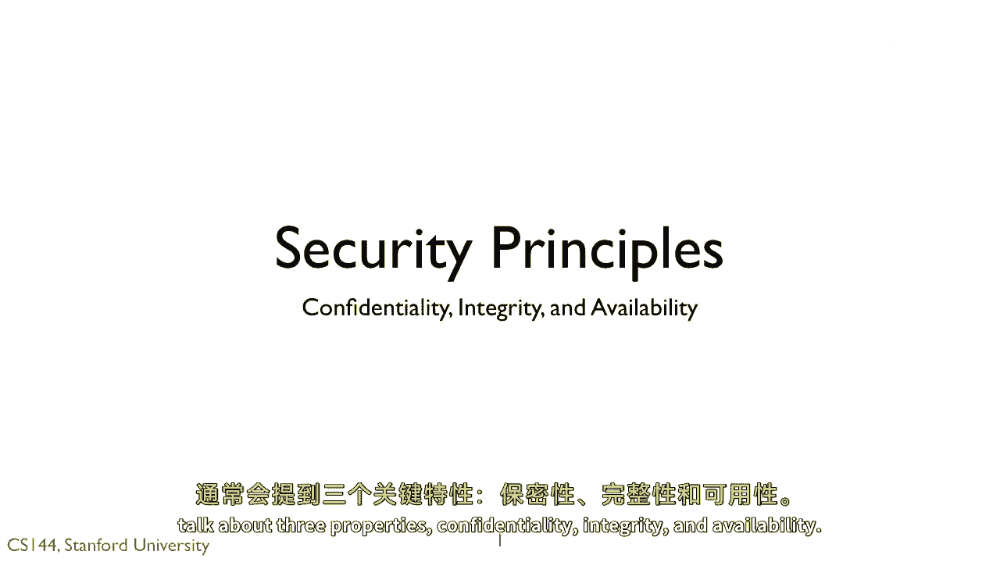
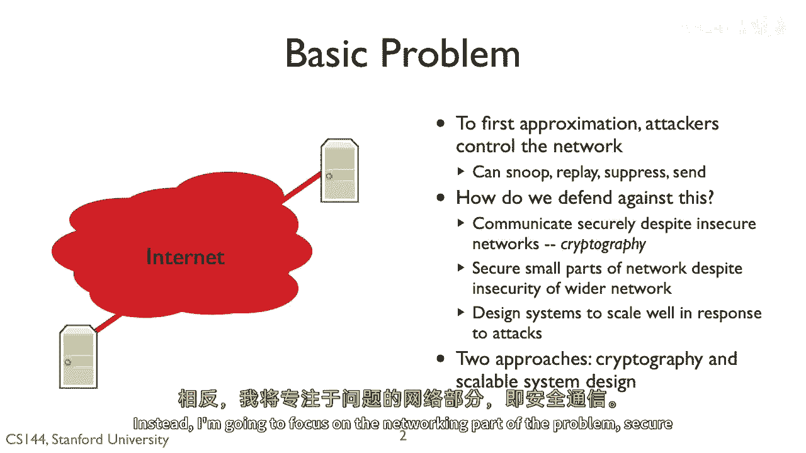
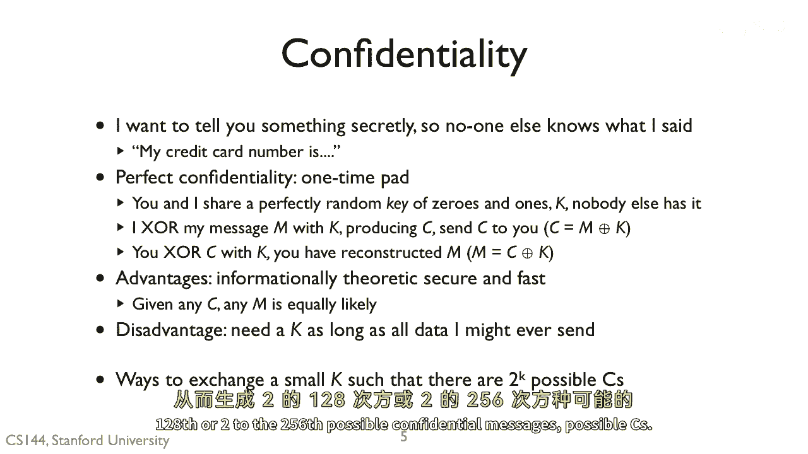
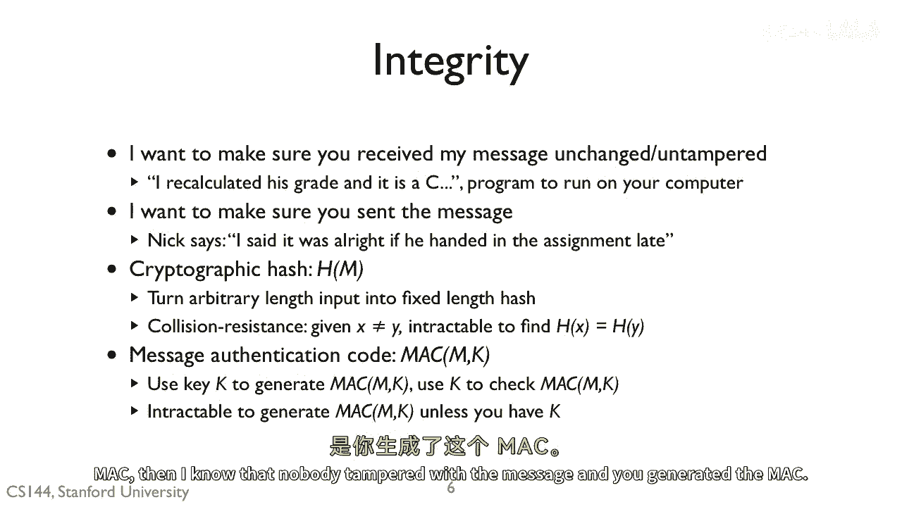
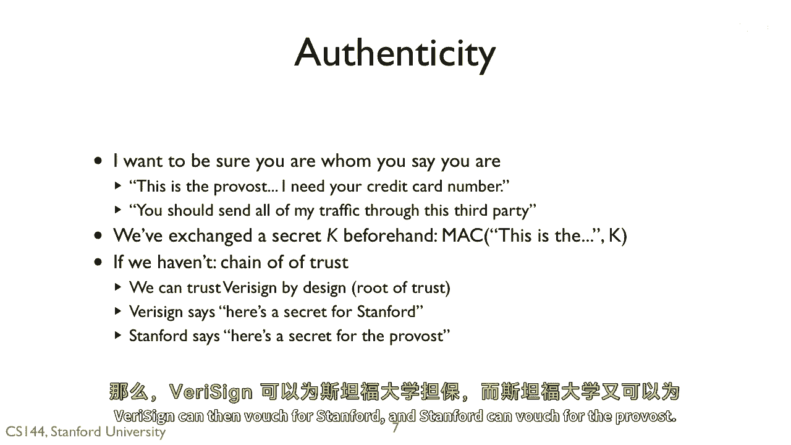
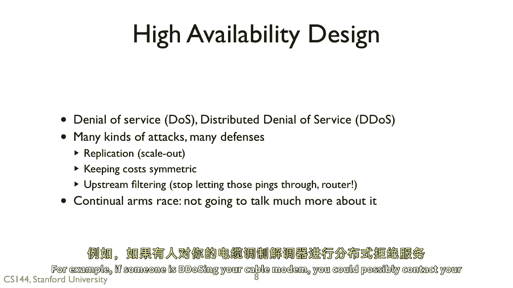

# P118：p117 8-5 Security Principles - 加加zero - BV1qotgeXE8D

 [MUSIC]， So it's a dangerous world out there。 I want to keep our computer system secure。

 but exactly what does this mean？ Every system in protocol is different。

 but when talking about security， we generally talk about three properties， confidentiality。

 integrity， and availability。

 [MUSIC]， We'll call our threat model based on all the attacks we've covered。

 An adversary can snoop on all of your traffic， suppress any of your packets， replay packets。

 and even generate new packets that seem to come from your host and or application。

 To defend against this， we're going to use two approaches。 The first， cryptography。

 is where to communicate securely end to end， despite the fact that the network in between is insecure。

 Cryptography literally means the study of codes。 It's a set of mathematical tools focused on the idea of secrets and。

 the computational difficulty of understanding data without the secret。

 Using cryptography as a building block， it turns out that we can actually build end to end。

 secure communication， despite the fact that the adversary might control and， own the entire network。

 By secure， I mean the adversary can't re-write our messages， generate new messages， or。

 snoop our messages。 The second approach is to prevent an adversary from blocking your messages。

 Even if two hosts can communicate securely， an adversary could prevent them from communicating at all。

 The general approach for this is the design systems to be scalable。 Take， for example， DNS。

 The fact that there are so many root servers， some of which are highly replicated。

 means that it's very hard to launch a denial of service attack against it。

 I'm not going to talk much about scalable system design。

 It's a complex topic worthy of a whole course in and of itself。 Instead。

 I'm going to focus on the networking part of the problem， secure communication。

 Cryptography is a set of mathematical principles and ideas for securing communication。

 The most important thing to know about cryptography is that it can be very subtle and。

 details oriented。 If there's a single flaw in your system， then it's not secure。

 So just taking cryptography and applying it without care is unlikely to make your system secure。

 Instead of inventing your own whole new security system， it's much， much safer to use existing。

 tested， well understood ones。 It's often the case that ideas from security are misused or misunderstood。

 such as people thinking a message authentication code， a security primitive。

 has the same air detection properties as CRC。 Cryptography can give us three valuable things。

 The first is confidentiality。 This is the ability to communicate with another party privately such that no one else can read it。

 Cryptography provides confidentiality through something called encryption。 The second is integrity。

 This is the ability to know if our messages have been tampered with。

 There are many ways to provide integrity depending on the exact needs and。

 the type of cryptography used。 There are three basic mechanisms which future Verdeos will cover in depth。

 And their cryptographic hashes， cryptographic signatures， and， message authentication codes are max。

 Finally， there is authenticity。 This is the ability for the party to prove they are who they say they are。

 The three basic mechanisms for authenticity which future videos will cover in depth。

 are certificates， message authentication codes， and cryptographic signatures。 Again。

 I really can't stress it enough。 Cryptography can make your system secure。

 but if and only if you use it carefully and， correctly， it's very， very easy to make a mistake。

 Don't trust systems that seem to have tax security on later and。

 don't think making a system secure is easy。

 So the first property is confidentiality。 The idea is the two-party should be able to exchange information secretly。

 so no one else can understand what they're sending even if they can read the messages。

 This is really useful if you want to send your credit card number。

 A crypto system that has perfect confidentiality is something called a one-time pad。

 The idea is that you and I can share a perfectly random key of zeros and ones。

 No one else has this key， this one-time pad。 To send you a message。

 I just exhore the message M with a key K producing， a confidential message C。

 I then send C to you to reconstruct M， you just exhore C with K。

 A one-time pad is an example of perfectly secure confidentiality。

 If the one-time pad is perfectly random， then given any C， any M is equally likely。

 It's also very fast， all you have to do is exhore。 But a one-time pad isn't very practical。

 K has to be at least as long as M。 If I want to exchange 100 megabytes with you。

 I need a 100 megabyte K。 So in practice， crypto systems that provide confidentiality。

 try to provide algorithms in which we can exchange a much smaller K， say 128 bits or 256 bits。

 such that 2 to the 128th or 2 to the 256th possible。

 confidential messages possible cease。 The second property is integrity。

 Integrity is the ability to exchange messages and， be sure they were not tampered with or changed。

 For example， when I download software， I want to know it's the real version and。

 not a hacked version that installs malware in my machine。

 Some forms of integrity also allow you to know that the other party sent the message。

 If the two of you share a secret key， then there are forms of integrity which。

 only someone with the secret key can perform correctly。

 Two very common forms of integrity are cryptographic hashes and message authentication codes。

 Verteographic hashes are functions that turn arbitrary length data into a fixed。

 length hash just like a normal hash function。 But cryptographic hashes have the additional property of their collision resistant。

 If I have a message X with a hash H of X， then it's intractable for。

 someone to find a message Y different from X， which has the same hash。 This means for example。

 if I know a cryptographic hash of a program I want to， download。

 then it's intractable for someone to hack the software in a way that， has the same hash。

 Message authentication codes， Macs， are like cryptographic hashes except they use。

 a key K to both generate and check the Mac。 Anyone can generate a cryptographic hash。

 but only someone with K can compute the correct Mac。 With a Mac。

 it's intractable to generate the correct Mac of a message unless you， have the key K。

 So if we've exchanged key， the key K beforehand and， are receiving message with a correct Mac。

 then I know that no day tamper with the message， and you generated the Mac。

 There's authenticity。 This is the ability to verify someone is who they say they are。 For example。

 you receive a message supposedly from the Provost and， want to be sure the Provost actually sent it。

 If you and the Provost have exchanged a secret beforehand， then you can do this。

 with message authentication codes。 If you receive a message that has a correct Mac。

 computed with the secret you've， shared with the Provost， you know that the Provost sent it。

 If you don't have a secret， then you can use a chain of trust。 If you trust one party。

 then that party can vouch for someone else。 This second party can then vouch for a third party and so on。

 So， for example， suppose we have some information that lets us check in Veracine's authenticity。

 Veracine can then vouch for Stanford and Stanford can vouch for the Provost。

 Finally， there's how you design computer systems for high availability。

 They're resistant to denial of service and distributed denial of service attacks。

 There are tons of kinds of attacks out there， replication attacks， resource use attacks。

 ping attacks， botnets attacks， etc。 Generally speaking。

 you can either scale out your system so it distributes the load and。

 can handle it or at some point you can filter the traffic upstream。 For example。

 if someone is de-dossing your cable modem， you could possibly contact your。

 ISP to filter out traffic coming at it。