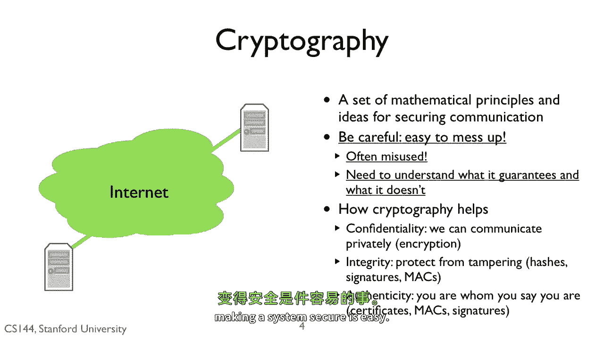

# 课程 P118：网络安全基础原理 🔐

在本节课中，我们将要学习网络安全的核心原则。我们将探讨如何在一个充满威胁的网络环境中，保护计算机系统的通信安全。课程将围绕三个核心安全属性展开，并介绍实现这些属性的基本密码学方法。

---

## 威胁模型与防御方法

上一节我们介绍了网络世界充满危险。本节中我们来看看如何定义威胁并构建防御。

一个威胁模型基于我们已了解的所有攻击方式。攻击者可以监听你的所有流量、丢弃你的任何数据包、重放数据包，甚至生成看似来自你的主机或应用程序的新数据包。

为了防御这些攻击，我们将采用两种主要方法。

第一种方法是**密码学**。它使得通信双方能够进行端到端的安全通信，尽管中间的网络是不安全的。密码学字面意思是“对密码的研究”，它是一套基于“秘密”概念以及“在没有秘密的情况下理解数据的计算难度”的数学工具。

以密码学为基础，事实证明，即使攻击者可能控制并拥有整个网络，我们也能构建端到端的安全通信。这里的“安全”意味着攻击者无法重写我们的消息、生成新消息或窥探我们的消息。

第二种方法是防止攻击者阻塞你的消息。即使两台主机可以安全通信，攻击者也可能完全阻止它们通信。解决此问题的通用方法是设计可扩展的系统。以DNS为例，其拥有众多根服务器，其中一些被高度复制，这意味着很难对其发起拒绝服务攻击。

可扩展系统设计本身是一个复杂的话题，值得开设一门完整的课程。因此，本课程将聚焦于问题的网络部分：**安全通信**。

---

## 密码学：安全通信的基石

上一节我们提到了密码学是防御的核心。本节中我们来深入了解密码学的基本概念。

密码学是一套用于保护通信安全的数学原理和思想。关于密码学最重要的一点是，它非常微妙且注重细节。如果你的系统中存在一个缺陷，那么它就是不安全的。因此，不加思索地应用密码学不太可能使你的系统安全。

与其发明全新的安全系统，使用经过测试、被充分理解的现有系统要安全得多。安全概念经常被误用或误解，例如有人认为消息认证码这种安全原语具有与CRC相同的错误检测属性。

密码学可以为我们提供三样宝贵的东西。

以下是密码学提供的三个核心价值：

1.  **保密性**：这是与另一方私下通信的能力，确保其他任何人都无法读取。密码学通过**加密**来提供保密性。
2.  **完整性**：这是判断我们的消息是否被篡改的能力。根据具体需求和使用的密码学类型，有多种提供完整性的方法。未来的视频将深入介绍三种基本机制：**密码学哈希**、**密码学签名**和**消息认证码**。
3.  **真实性**：这是一方证明其身份的能力。未来的视频将深入介绍真实性的三种基本机制：**证书**、**消息认证码**和**密码学签名**。

再次强调，密码学可以使你的系统安全，但前提是你必须谨慎且正确地使用它。犯错误非常容易。不要信任那些看起来事后才添加安全措施的系统，也不要认为构建一个安全的系统是容易的。

---

## 核心安全属性详解

上一节我们概述了密码学的三大价值。本节中我们将逐一详细探讨这些核心安全属性。

### 保密性

第一个属性是保密性。其理念是通信双方应能秘密交换信息，即使他人能读到消息，也无法理解其内容。这在发送信用卡号等场景中非常有用。

一个具有完美保密性的密码系统称为**一次性密码本**。其思想是，你和我共享一个完全随机的0和1密钥K，没有其他人拥有这个一次性密码本。为了向你发送消息M，我只需将消息M与密钥K进行异或运算，生成密文C：`C = M XOR K`。然后我将C发送给你。为了重建M，你只需将C与K再次进行异或运算：`M = C XOR K`。

一次性密码本是完美安全保密性的一个例子。如果一次性密码本是完全随机的，那么给定任何C，任何M出现的可能性都相等。它也非常快，你只需要做异或运算。但一次性密码本并不实用，因为K必须至少与M一样长。如果我想与你交换100兆字节，我需要一个100兆字节的K。

因此，在实践中，提供保密性的密码系统试图提供算法，使我们能够交换一个小得多的K（例如128位或256位），使得可能的密文数量达到2^128或2^256，从而确保安全。

### 完整性

第二个属性是完整性。完整性是交换消息并确信它们未被篡改或更改的能力。例如，当我下载软件时，我想知道它是真正的版本，而不是一个在我的机器上安装恶意软件的破解版本。

某些形式的完整性还允许你知道是对方发送了消息。如果双方共享一个秘密密钥，那么存在一些完整性形式，只有拥有秘密密钥的人才能正确执行。

两种非常常见的完整性形式是**密码学哈希**和**消息认证码**。

密码学哈希是将任意长度的数据转换为固定长度哈希值的函数，就像普通的哈希函数一样。但密码学哈希具有额外的**抗碰撞**属性。如果我有一个消息X及其哈希值H(X)，那么对于他人来说，找到一个与X不同但具有相同哈希值的消息Y是计算上不可行的。这意味着，例如，如果我知道我想要下载的程序的密码学哈希值，那么他人以某种方式篡改软件并使其具有相同哈希值是计算上不可行的。

消息认证码类似于密码学哈希，不同之处在于它们使用一个密钥K来生成和验证MAC。任何人都可以生成密码学哈希，但只有拥有K的人才能计算出正确的MAC。对于MAC，除非你拥有密钥K，否则生成消息的正确MAC是计算上不可行的。因此，如果我们事先交换了密钥K，并且收到了带有正确MAC的消息，那么我就知道没有人篡改过消息，并且是你生成了这个MAC。

### 真实性

第三个属性是真实性。这是验证某人是否是其声称身份的能力。例如，你收到一条据称来自教务长的消息，并希望确认教务长确实发送了它。

如果你和教务长事先交换了一个秘密，那么你可以使用消息认证码来实现这一点。如果你收到一条带有正确MAC的消息，并且该MAC是用你与教务长共享的秘密计算的，那么你就知道是教务长发送了它。

如果你没有共享秘密，那么你可以使用信任链。如果你信任一方，那么该方可以为另一方担保。这第二方又可以担保第三方，依此类推。例如，假设我们有一些信息可以验证Veracine的真实性。Veracine可以为斯坦福大学担保，而斯坦福大学可以为教务长担保。

---

## 高可用性系统设计

上一节我们讨论了如何确保通信内容的保密、完整与真实。本节中我们来看看如何确保通信服务本身可用。

最后，是如何设计具有高可用性的计算机系统，使其能够抵抗拒绝服务和分布式拒绝服务攻击。攻击种类繁多，包括复制攻击、资源耗尽攻击、ping攻击、僵尸网络攻击等。

一般来说，你可以通过两种方式应对：扩展你的系统，使其能够分布负载并处理攻击；或者在某个上游节点过滤流量。例如，如果有人对你的电缆调制解调器发起DDoS攻击，你可以联系你的互联网服务提供商，请求过滤掉指向它的攻击流量。

---

本节课中我们一起学习了网络安全的基础原理。我们首先定义了威胁模型，并介绍了两种核心防御方法：密码学和可扩展系统设计。接着，我们深入探讨了密码学如何提供保密性、完整性和真实性这三大安全属性，并解释了每种属性的基本实现机制，如加密、哈希和消息认证码。最后，我们简要提及了通过可扩展设计和流量过滤来保障系统可用性的思路。理解这些基本原则是构建和评估安全网络系统的第一步。