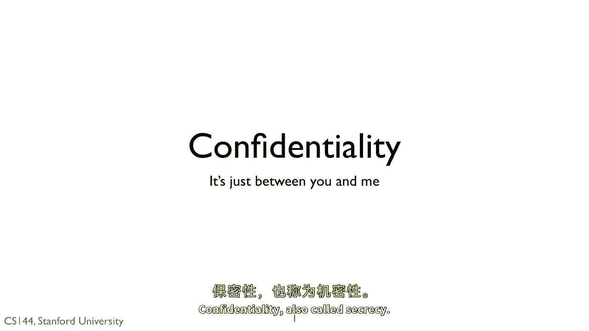
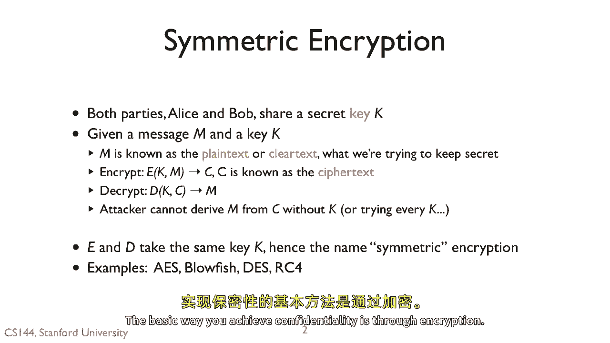
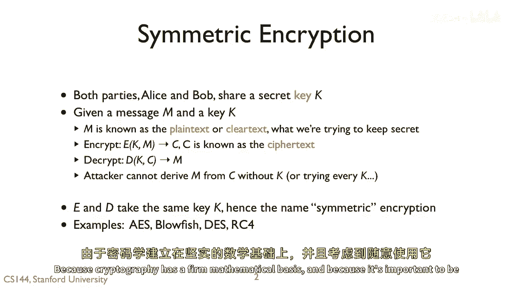
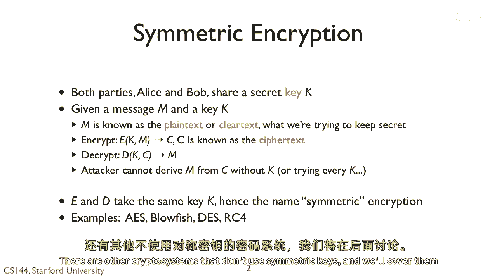
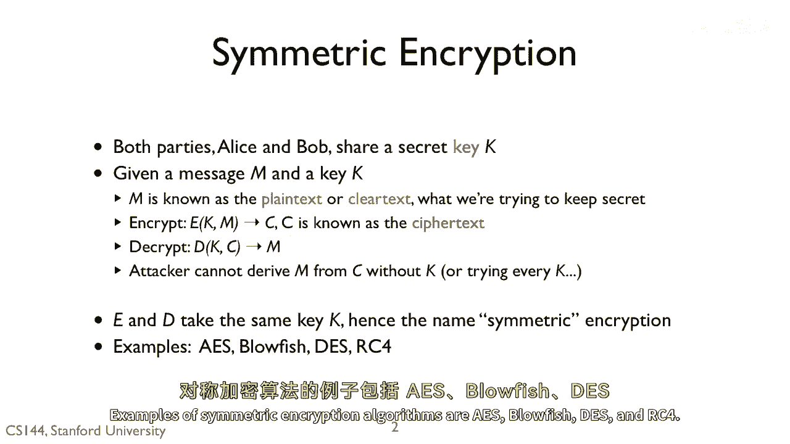
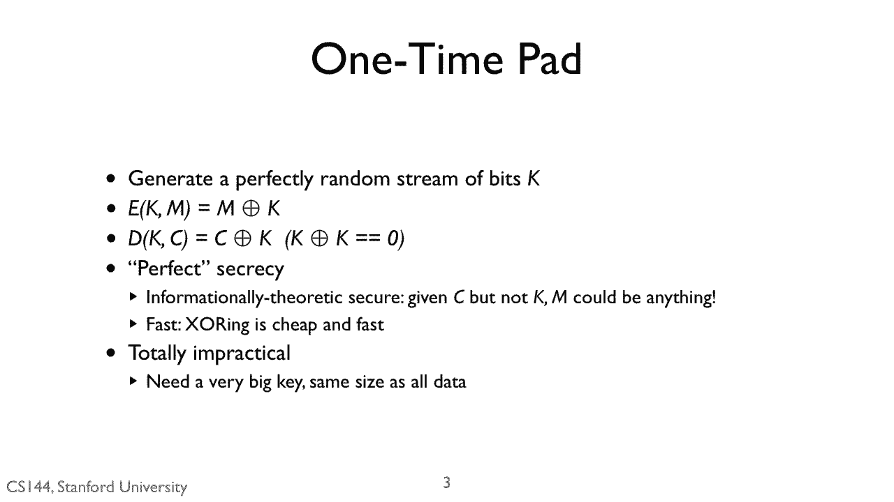
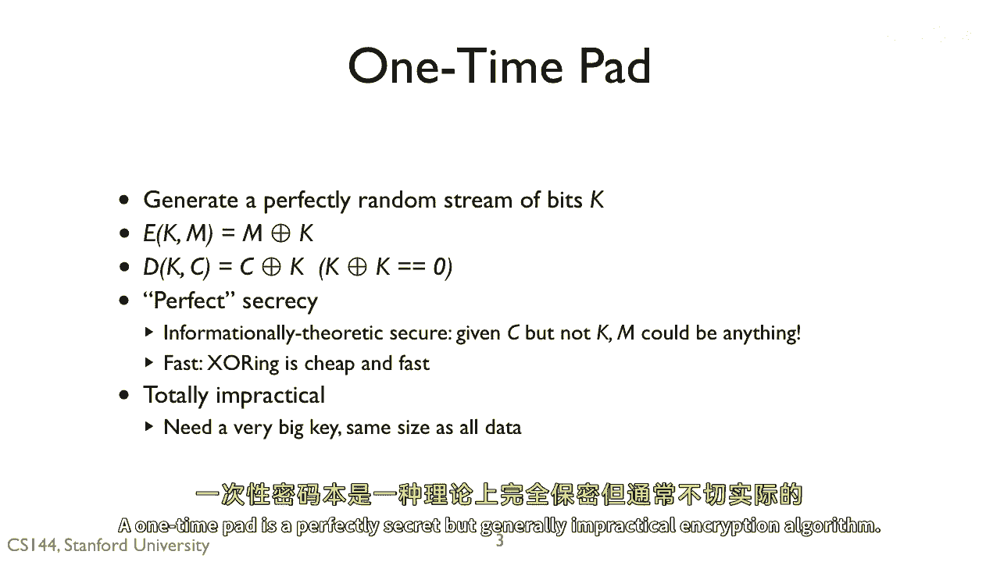
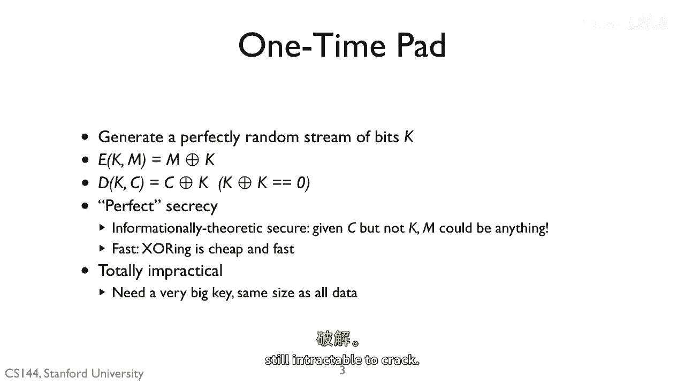

# 课程 P119：密码学三要素之一 —— 保密性 🔒

在本节课中，我们将要学习密码学能够提供的三个核心属性中的第一个：**保密性**，它也被称为**机密性**。

保密性的基本实现方式是通过**加密**。由于密码学建立在坚实的数学基础之上，并且精确地使用它至关重要，我们将引入一些关键术语来避免因随意使用而带来的风险。

## 对称加密的基本概念

上一节我们介绍了保密性的目标，本节中我们来看看实现它的基础方法：对称加密。

在对称加密中，通信双方共享一个秘密密钥 **K**。假设我们有一个需要保密传输的消息 **M** 和密钥 **K**。
*   **M** 被称为**明文**或**纯文本**，即我们希望保密的内容。
*   为了加密，我们调用一个加密函数 **e**，传入明文 **M** 和密钥 **K**。这会生成一个**密文 C**。
*   如果我们的加密算法是安全的，那么对于没有密钥的人来说，从密文 **C** 推导出明文 **M** 在计算上是不可行的。
*   因此，我们可以通过网络传输密文 **C**。攻击者可以看到它，但无法读取原始消息 **M**。
*   为了解密密文，我们调用解密函数 **D**，同样传入密钥 **K**。这将返回原始的明文 **M**。

整个过程的目标是：只有拥有正确密钥 **K** 的人才能解密消息或了解其任何信息。当然，攻击者可以尝试每一个可能的 **K**，因此我们需要选择一个足够大的密钥空间，使得穷举搜索变得不可行。例如，使用 128 位或 256 位的密钥。

因为加密函数 **E** 和解密函数 **D** 使用相同的密钥 **K**，所以我们称之为**对称加密**或**共享密钥加密**。还有其他不使用对称密钥的密码系统，我们将在后续课程中介绍。

以下是常见的对称加密算法示例：
*   AES
*   Blowfish
*   DES
*   RC4

## 一次性密码本：完美但受限

了解了通用的对称加密后，我们来看一个理论上完美但实践中受限的特殊算法：一次性密码本。

一次性密码本是一种具有完美保密性但通常不实用的加密算法。其工作原理如下：
1.  我们生成一个完全随机的比特流作为密钥 **K**。发送方和接收方需要事先通过某种安全方式交换这个密钥（例如，通过握手和U盘传递）。
2.  为了加密，我们将明文 **M** 与密钥 **K** 进行**异或**运算。
    *   加密公式：`C = M ⊕ K`
3.  为了解密，我们将密文 **C** 与相同的密钥 **K** 再次进行**异或**运算。
    *   解密公式：`M = C ⊕ K`

这个算法是完美安全的，因为如果我们只有密文而没有密钥，那么**任何可能的明文 M 都同样可能是正确的**。此外，这个算法非常快，因为它只需要进行异或操作。

因此，如果你是一个需要发送短消息的超级秘密间谍，一次性密码本非常棒。但在一般实践中并非如此。一次性密码本的主要问题是：你的密钥 **K** 必须和消息 **M** 一样长。要发送 1GB 的数据，就需要一个 1GB 长的密钥，这显然不实用。

我们更希望使用小的密钥来加密大量的数据，同时仍然保证密码难以被破解。

---

本节课中我们一起学习了密码学的第一个核心属性——保密性。我们介绍了通过**对称加密**实现保密性的基本模型，明确了**明文**、**密文**和**密钥**的概念。我们还探讨了理论上完美的**一次性密码本**算法及其在实践中的局限性，即密钥长度必须等于消息长度。在实际应用中，我们追求的是用短密钥安全地加密长数据。