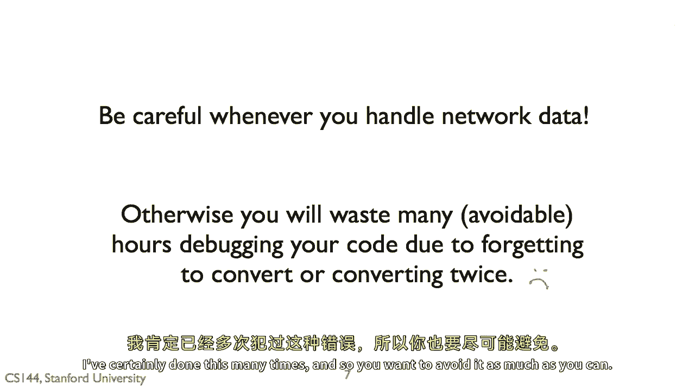

# P12：p11 1-8d byte order - 加加zero - BV1qotgeXE8D

那么，为什么这很重要，如果两台电脑要通信，它们需要同意是否使用大端或小端格式来表示数字，这由于事实是，不同的处理器使用不同的字节顺序，例如，英特尔和AMD的x86处理器是小端格式，最低位字节首先。

ARM处理器和大端格式如iPhone中使用的设备相反，在那里，最重要的字节首先，我们不想让两台电脑关心或知道另一方是大端还是little endian，并且一个小型的印度人，因此。

协议规范体通常选择一个并坚持使用它们对于互联网，这意味着大nen，所有互联网规范使用的协议都使用大端格式，这里是一个例子。

仅仅是一段C代码，它将告诉你你的计算机是大端格式还是小端格式，它接受一个十六字节的值，并将其转换为一个指针，这允许代码单独查看字节，如果索引为零的字节是零x四零，这意味着最显著的字节首先出现。

并且计算机是大端序的，如果字节索引一为0x4000，那么它就是小端序的等待。

这创造了一个复杂性，你需要互联网包以大端序格式存在。

但如果你的处理器是小端序的，让我们说，例如，你想要将TCP段的端口号设置为80，HTTP端口，一种简单的方法是。

这可能是通过创建一个c结构，该结构有一个在正确偏移量的字段port，但如果您使用值八十来与port字段进行比较，那么八十将被存储，小端模式以零x五零为首个字节，大端模式需要零x五零存储在第二个字节。

所以尽管段中的port字段是八十，并且您的值是八十，这个测试将无法使此更容易，看网络库。

提供将主机和网络顺序之间转换的实用函数，函数h two s，例如，接受一个十六位或十六位主机值作为参数，并返回网络顺序的值，还有将网络短转换为主机短的函数，和将长值转换为三个二位值的函数，所以。

检查包端口是否为八十的正确方法是，读取包结构的端口字段，并调用n到hs将其从网络顺序转换为主机顺序，然后您可以将其与八十进行比较并获取正确的结果，在小印度架构的情况下。

end to hs和h ten s反转，两字节的顺序。

在大印度式架构的情况下，它们只是返回值不变，这些函数，为您提供机制，以便您可以编写与处理器架构无关的网络代码，但是请注意，我真的不能强调这一点足够，每当您处理网络数据时都要小心，如果您不严格和原则性地。

在主机和网络顺序之间转换时，您会给自己带来巨大的头痛，因为您可能忘记转换，或者无意中转换了两次，突然，您的协议行为不正确，触发了，各种奇怪的错误，我确实这样做过很多次，因此，您尽可能避免这种情况。

现在我们知道互联网规范如何布局，网络中的多字节值或大端序，我们可以看看互联网规范如何描述他们的包格式，出于历史原因，互联网规范是用纯ASCII文本编写的，左侧的块文本直接来自请求对公共的请求。

Rfc七九十一，它指定互联网协议版本四，或i，P，V，四，顶部显示从零到三的位，数据包被写成四字节宽，因为i，P，V，四有五行要求的字段，这意味着一个i，P，V，四头部至少是二十字节长，Nick。

我经常使用更简单的视觉格式，当我们显示像右侧的包时，使用此，例如，一个i，P，V，四包的总长度字段是两字节或十六位长，您可以在右上角看到，这意味着一个i，P，V，四包不能超过六十，五千，五百三十五字节。

那个字段在包中以大端格式存储，十四百字节的包长度被存储为十六进制零x578。

所以，那个长度的ip包的第三个字节是十六进制零x05，让我们在wire shark中看看。

我只是要启动wireshark并监听包，这个第一个包是为叫做tls或传输层安全的东西，它是网页浏览器用于安全连接的。

https tls隐藏了包的数据对我们，但我们仍然可以使用wireshark看到其头部，我们可以看到，tls负载位于tcp段的端口4内部，四三，标准tls端口，这个tcp段在内部ip中，V。

详细查看头部的pv，头部看起来像四，我们可以看到包总长度字段是一千二百三十，十二三十的十六进制是零x零for ce ten，二十四或四乘以二百五十六，加上一百六或零xce在底部。

wire shark显示我们包的实际字节，这就是零，在大端或网络顺序下是四个字节，你已经看到了处理器如何以不同的方式布局数字，但由于网络粒子需要达成一致，协议规范决定如何在其包中布局数字。

这可能与你的处理器不同，以帮助你处理这个问题，C网络库提供帮助函数，可以将主机和网络顺序之间的数据进行转换，但请谨慎使用，随意使用他们可能会很容易导致您在调试中失去许多小时，这可以通过谨慎来防止。

