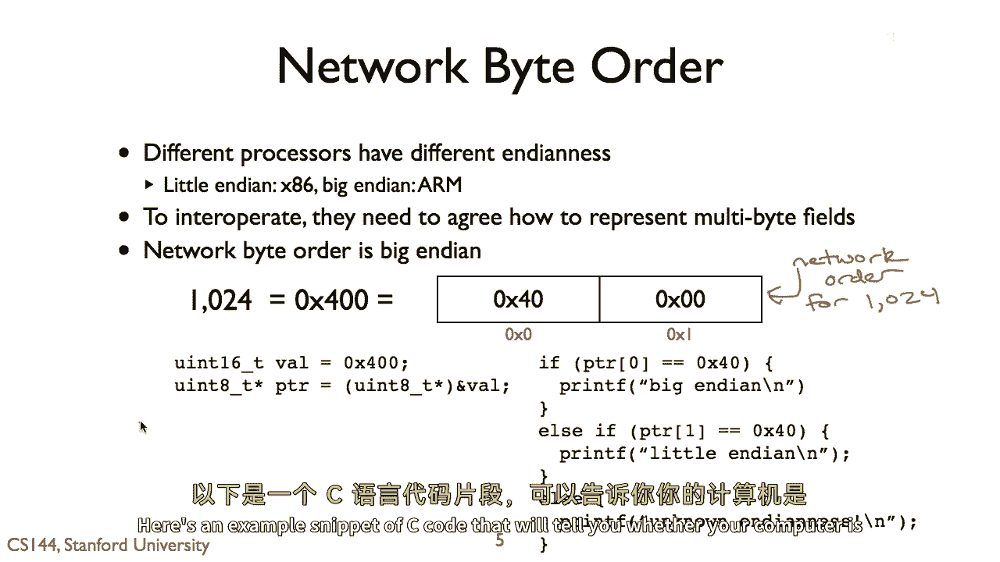
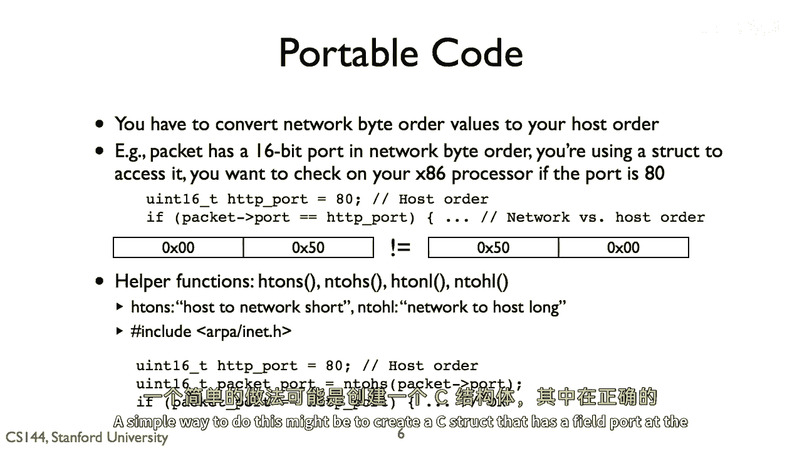
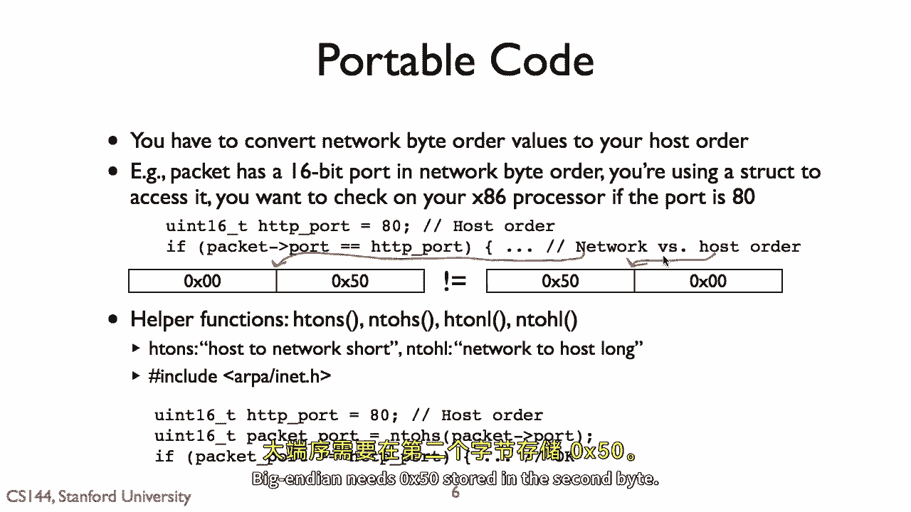
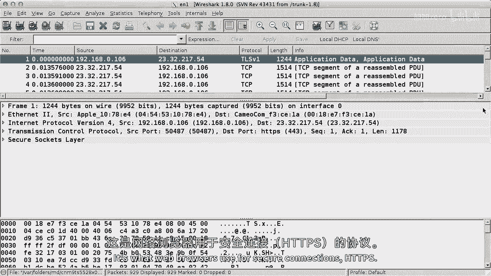

# 课程 P12：字节序与网络数据 🧩

在本节课中，我们将学习计算机如何存储多字节数据（字节序），以及为什么在网络通信中统一字节序至关重要。我们还将了解如何编写与处理器架构无关的网络代码。

---

## 为什么字节序重要？🤔



上一节我们介绍了字节序的基本概念。本节中我们来看看为什么它在网络通信中如此关键。

如果两台计算机需要通信，它们必须就使用大端序还是小端序来表示数字达成一致。这是因为不同的处理器使用不同的字节顺序。例如，英特尔和AMD的x86处理器使用小端序，最低有效字节在前。相反，ARM处理器和iPhone等设备使用大端序，最高有效字节在前。

我们不希望两台计算机去关心或了解对方使用的是大端序还是小端序。因此，协议规范通常选择一种字节序并始终坚持。对于互联网，这意味着**大端序**。所有互联网协议规范都使用大端格式。


---


## 如何检测字节序？🔍



以下是检测你的计算机是大端序还是小端序的一段C代码示例。

```c
#include <stdio.h>

int main() {
    int num = 1;
    // 将整数指针转换为字符指针，以便逐个字节查看
    char *byte = (char *)#
    if (*byte == 1) {
        printf("小端序\n");
    } else {
        printf("大端序\n");
    }
    return 0;
}
```



这段代码接受一个整数值，并将其转换为字符指针，从而允许代码单独查看其字节。如果索引为0的字节是1，这意味着最低有效字节在前，计算机是小端序。如果索引为0的字节是0，则计算机是大端序。


---

## 网络通信中的字节序转换 🔄

这带来了一个复杂性：互联网数据包需要以大端序格式存在。但如果你的处理器是小端序的，就会产生问题。

例如，假设你想将TCP段的端口号设置为80（HTTP端口）。一种简单的方法是创建一个C结构体，其中包含一个在正确偏移量的`port`字段。但如果你将值80赋给`port`字段，在小端序机器上，80会被存储为`0x50`作为第一个字节。而大端序要求`0x50`存储在第二个字节。


所以，尽管数据包中的`port`字段值是80，你的值也是80，但直接比较可能失败。

为了使这更容易，网络库提供了在主机字节序和网络字节序之间转换的实用函数。

以下是核心转换函数：
*   `htons()`：将16位（短整型）主机字节序值转换为网络字节序。
*   `ntohs()`：将16位网络字节序值转换为主机字节序。
*   对于32位（长整型）值，也有对应的`htonl()`和`ntohl()`函数。


因此，检查数据包端口是否为80的正确方法是：读取数据包结构中的端口字段，调用`ntohs()`将其从网络字节序转换为主机字节序，然后将其与80进行比较以获得正确结果。

在小端序架构上，`htons`和`ntohs`会反转两个字节的顺序。在大端序架构上，它们只是原样返回值。这些函数为你提供了编写与处理器架构无关的网络代码的机制。

**但是请注意**：每当处理网络数据时都要格外小心。如果你在主机和网络字节序之间转换时不够严格和规范，会给自己带来巨大的麻烦。你可能忘记转换，或者无意中转换了两次。突然之间，你的协议行为就会不正确，触发各种奇怪的错误。这种情况确实经常发生。

因此，你应该尽可能避免这种情况，并谨慎使用这些转换函数。

---

## 互联网协议格式 📄


现在我们知道互联网规范如何布局网络中的多字节值（即大端序），我们可以看看互联网规范如何描述它们的数据包格式。

出于历史原因，互联网规范是用纯ASCII文本编写的。左侧的块文本直接来自RFC 791，它指定了互联网协议版本四（IPv4）。顶部显示从0到31的位。数据包被写成四字节宽，因为IPv4有五行必需的字段，这意味着一个IPv4头部至少是20字节长。


我们经常使用更简单的视觉格式来显示像右侧这样的数据包。例如，一个IPv4数据包的“总长度”字段是两字节（16位）长，这意味着一个IPv4数据包不能超过65,535字节。该字段在数据包中以大端格式存储。一个1400字节的数据包长度将被存储为十六进制`0x0578`。



所以，那个长度的IP数据包的第三个字节是十六进制`0x05`。

让我们在Wireshark中看看。启动Wireshark并监听数据包。第一个数据包是用于TLS（传输层安全）的，它是网页浏览器用于安全连接的。HTTPS TLS向我们隐藏了数据包的数据，但我们仍然可以使用Wireshark看到其头部。我们可以看到，TLS负载位于TCP段的端口443（标准TLS端口）内部。这个TCP段又在IPv4内部。

详细查看IPv4头部，我们可以看到数据包总长度字段是1230。1230的十六进制是`0x04CE`（4 * 256 + 206）。在底部，Wireshark向我们显示数据包的实际字节，这就是`04` `CE`，以大端（网络）顺序存储。

---

## 总结 📝

本节课中我们一起学习了：
1.  **字节序的重要性**：不同的处理器使用不同的字节序（大端序或小端序），网络通信需要统一标准（互联网使用大端序）。
2.  **检测方法**：可以通过C代码检测当前系统的字节序。
3.  **网络编程实践**：使用`htons()`、`ntohs()`等函数在主机字节序和网络字节序之间进行转换，以编写架构无关的代码。**必须谨慎使用，避免错误转换**。
4.  **协议格式**：互联网协议（如IPv4）规范使用大端序定义多字节字段，我们可以使用工具（如Wireshark）查看和分析网络数据包的实际字节布局。

你已经看到了处理器如何以不同的方式布局数字，但由于网络数据包需要达成一致，协议规范决定了如何在其数据包中布局数字。这可能与你的处理器不同。为了帮助你处理这个问题，C网络库提供了辅助函数来在主机和网络字节序之间转换数据，但请谨慎使用。随意使用它们很容易导致你在调试中浪费许多时间，这可以通过谨慎来防止。