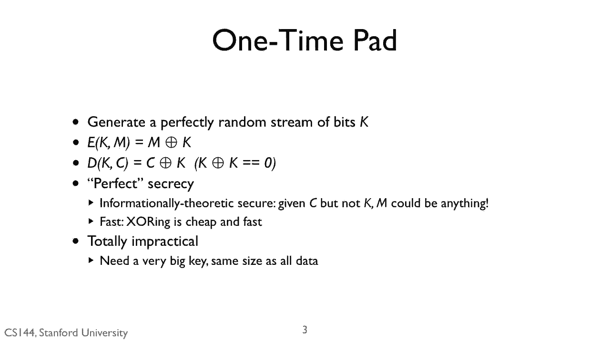
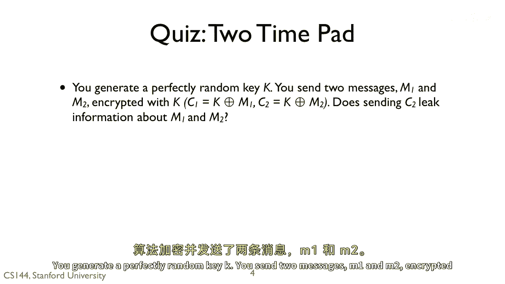

# 课程P120：一次性密码本密钥复用风险 🔑

在本节课中，我们将要学习一次性密码本加密算法中一个关键的安全概念：密钥复用。我们将通过一个具体的例子，分析当同一个密钥被用来加密多条消息时，会泄露哪些信息。

上一节我们介绍了理想的一次性密码本加密。本节中我们来看看，如果违背了“一次性”的使用原则，会发生什么。

## 场景设定



假设你生成了一个完全随机的密钥 **K**。你用这个密钥，通过一次性密码本算法加密了两条消息 **M1** 和 **M2**。


加密过程遵循以下公式：
```
C1 = K XOR M1
C2 = K XOR M2
```
其中，**C1** 和 **C2** 分别是消息 **M1** 和 **M2** 对应的密文。

## 密钥复用导致的信息泄露

现在，关键问题来了：攻击者同时获得了密文 **C1** 和 **C2**，这会泄露关于原始消息 **M1** 和 **M2** 的信息吗？

答案是肯定的。尽管密钥 **K** 本身是完美随机的，但重复使用它，会将两条消息联系起来。



我们可以通过数学推导来理解这一点。根据加密公式，我们可以进行如下操作：
```
C1 XOR C2 = (K XOR M1) XOR (K XOR M2)
```
由于异或运算满足结合律和交换律，且同一个值异或两次等于零（`K XOR K = 0`），上式可以简化为：
```
C1 XOR C2 = M1 XOR M2
```


这个结果 **M1 XOR M2** 就是泄露的信息。攻击者虽然不能直接得到 **M1** 或 **M2**，但获得了它们异或后的结果。

以下是这个结果可能带来的风险：
*   **结构暴露**：如果其中一条消息（例如 **M1**）的部分内容被猜测或已知（比如标准的文件头、问候语），攻击者可以立即计算出另一条消息（**M2**）的对应部分。
*   **模式分析**：两条消息之间的关系被暴露。例如，如果两条消息在相同位置有相同的单词或字符，那么异或结果在该位置就会是0，这可能会暴露消息的语言特征或格式。
*   **完全破解**：在极端情况下，如果其中一条消息被完全破解，那么另一条消息也会随之被完全解密。

## 核心要点总结


本节课中我们一起学习了密钥复用在一次性密码本中的危害。


*   **一次性密码本的核心安全前提是密钥绝对只使用一次。**
*   当同一个密钥 **K** 用于加密多条消息时，即使密钥本身随机，密文的组合（如 `C1 XOR C2`）也会直接泄露原始消息之间的关系（即 `M1 XOR M2`）。
*   这种泄露为攻击者提供了破解的突破口，彻底破坏了一次性密码本理论上具备的完美保密性。

因此，确保每个密钥只使用一次，是使用一次性密码本时不可妥协的原则。