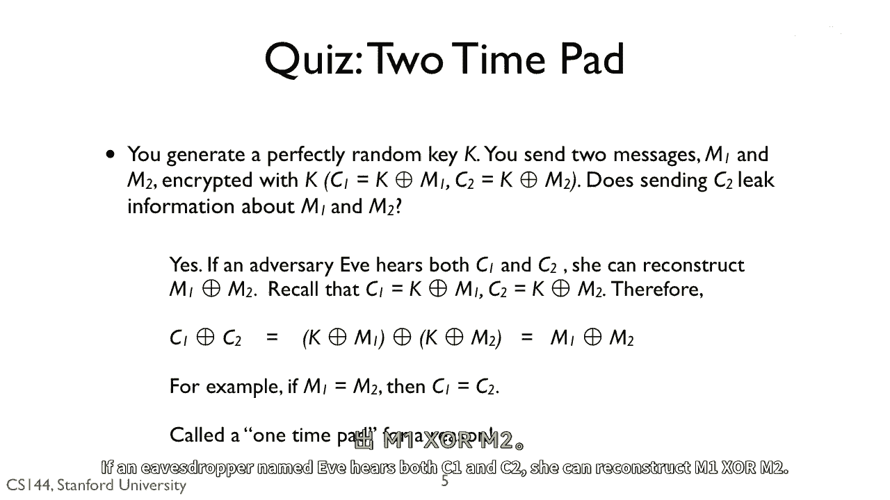
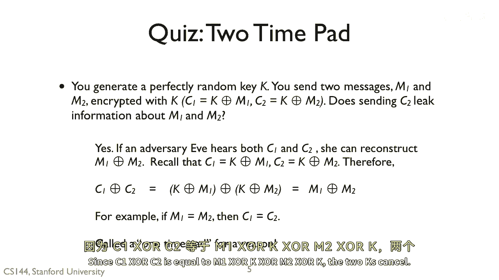
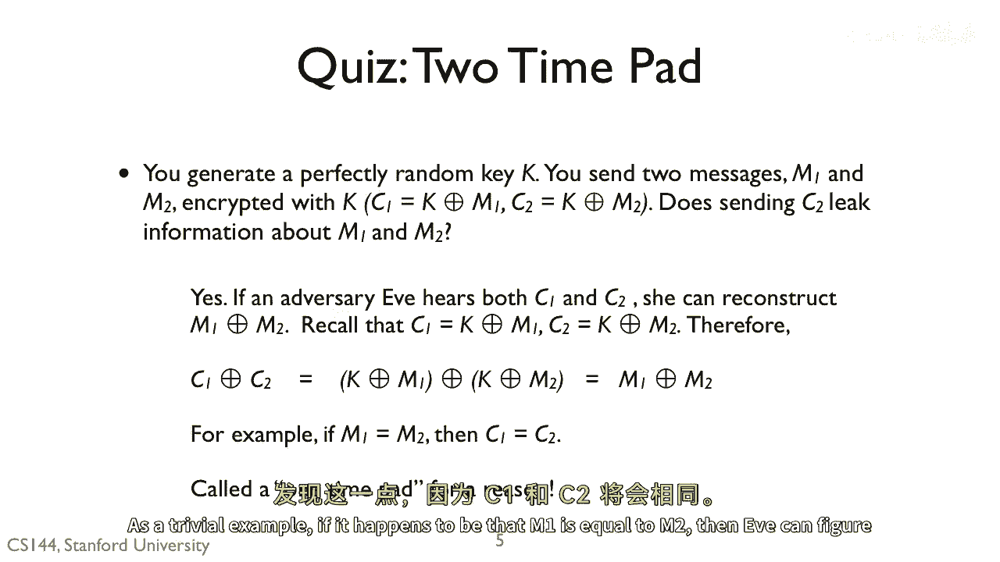

# 课程 P121：一次性密码本的安全性 🛡️

在本节课中，我们将探讨一次性密码本加密方案的安全性。我们将分析，如果同一个密钥被重复使用来加密不同的消息，会带来怎样的安全风险。

---


## 概述


一次性密码本是一种理论上绝对安全的加密方法，但其安全性依赖于一个关键前提：密钥必须**只使用一次**。本节课程将通过一个具体的例子，展示当同一个密钥被重复使用时，窃听者如何利用两次密文来获取原始消息的信息。

上一节我们介绍了理想加密的概念，本节中我们来看看如果违背了“一次性”原则会发生什么。

---



## 密钥重用导致的信息泄露

答案是肯定的，存在安全风险。如果一个名为 Eve 的窃听者同时截获了两次使用相同密钥 `K` 加密的密文 `C1` 和 `C2`，她可以尝试进行重构。


以下是窃听者 Eve 的推理和计算过程：

1.  **获取两次密文**：
    *   第一条消息 `M1` 的密文：`C1 = M1 XOR K`
    *   第二条消息 `M2` 的密文：`C2 = M2 XOR K`

2.  **对两个密文进行异或操作**：
    *   Eve 计算 `C1 XOR C2`。
    *   根据公式推导：
        ```
        C1 XOR C2 = (M1 XOR K) XOR (M2 XOR K)
        ```
        由于异或运算满足结合律和交换律，且 `K XOR K = 0`，上式可以简化为：
        ```
        C1 XOR C2 = M1 XOR M2
        ```
    *   这意味着，**两次密文的异或结果，等于两次原始明文的异或结果**。密钥 `K` 在计算中被抵消了。



3.  **分析结果**：
    *   虽然 Eve 没有得到 `M1` 或 `M2` 本身，但她得到了 `M1 XOR M2`。
    *   如果 `M1` 和 `M2` 都是 ASCII 文本消息，那么 `M1 XOR M2` 的结果会泄露大量关于原始消息的信息。通过分析字符频率、空格位置等模式，攻击者有可能推断出部分或全部明文内容。

---

## 一个简单的例子


让我们通过一个极端但清晰的例子来理解这种风险。


假设巧合的是，两条原始消息完全相同，即 `M1` 等于 `M2`。

那么根据上面的公式，`C1 XOR C2` 的结果将是 `M1 XOR M1`，这等于全零。更直接的是，Eve 会发现 `C1` 和 `C2` 是完全相同的。

这样一来，Eve 立刻就能推断出“两条原始消息一模一样”这一重要信息。这完全违背了加密的保密性原则。

---



## 核心总结

本节课中我们一起学习了一次性密码本加密的核心安全准则。


其名称“一次性”密码本就包含了最重要的使用规范：**一个密钥只能使用一次**。本节课的推导证明，如果同一个密钥被用来加密多条消息，即使该密钥本身是随机的且长度与消息相等，攻击者也能通过对比密文获得关于明文的宝贵信息，从而导致整个加密体系失效。

因此，确保密钥的绝对一次性使用，是维护该加密方案理论安全性的唯一途径。