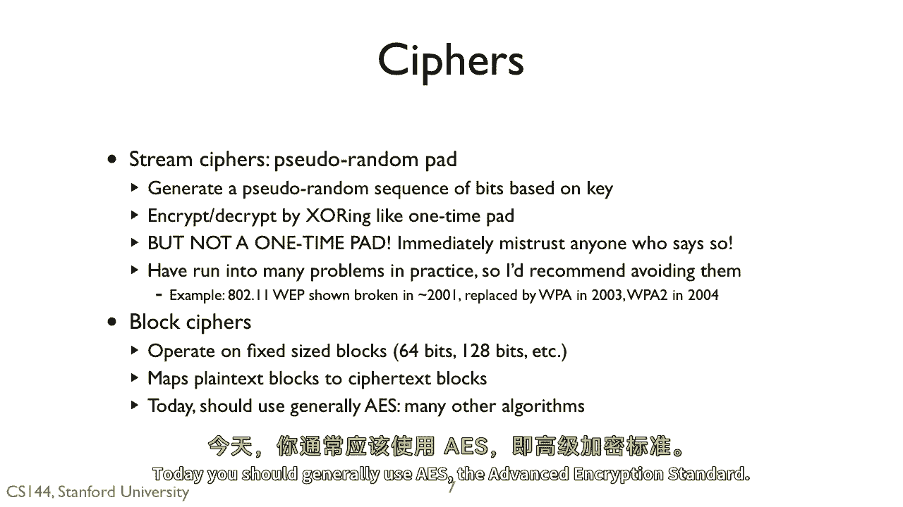
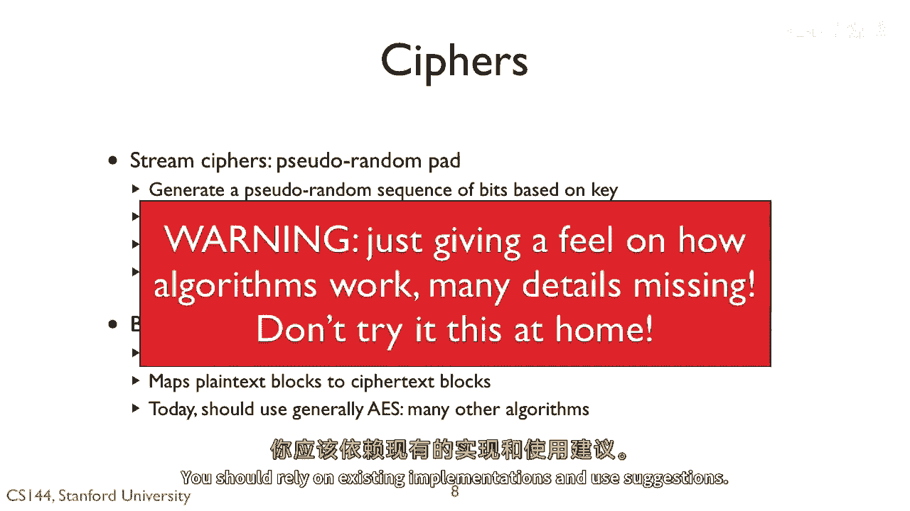

# 课程 P122：对称加密基础 🔐

在本节课中，我们将学习对称加密的基本概念，了解一次性密码本在实际应用中的局限性，并探索两种主流的对称加密类型：流密码和分组密码。我们还将以Blowfish算法为例，简要了解分组密码的工作原理。

---

一次性密码本通常不切实际。因此，我们需要一种密码系统，能够分发一个较小的密钥，例如128或256位。

我们通过某种方式预先共享这个密钥，例如通过电话沟通，或者在握手时写下并交换。然后，我们使用这个密钥 `k` 来加密一个更长的消息 `M`。

我们调用加密函数 `E`，传入明文消息 `M` 和密钥 `k`，生成密文 `C`。

现在，与一次性密码本不同，可能只有一个可能的 `M` 能产生这个密文 `C`。但我们相信，通过计算找到这个 `M` 是可行的。你可以尝试所有可能的密钥，但要解密 `2^256` 个密钥中的一个，将需要极其漫长的时间。

假设解密一条消息只需要一条指令。再假设你的处理器核心是4GHz，并且你的处理器有40亿个核心。我们仍然需要40亿台这样的计算机，花费31年，才能解密这样一条消息。

---

上一节我们讨论了对称加密的必要性，本节中我们来看看对称密码的两种主要类型：流密码和分组密码。

对称密码主要有两种类型：流密码和分组密码。

流密码基于密钥生成一个伪随机密码流，即一个伪随机的比特序列。然后，我们通过与这个流进行异或（XOR）操作来加密或解密，类似于一次性密码本。但它并非真正的一次性密码本。如果有人声称它是，请立即对其表示怀疑，因为他们并不了解自己在谈论什么。

一般来说，流密码在实践中遇到了许多问题。流密码的问题通常源于重复使用。例如，如果我们重用相同的伪随机比特序列（即在不同消息中重用相同的密钥），那么攻击者就可以发起类似于“两次密码本”的攻击。

例如，最初的Wi-Fi加密协议WEP就使用了流密码。大约在2001年Wi-Fi开始普及时，它被证明存在漏洞，并在2003至2004年间被WPA取代。现在的WPA2使用了一种称为分组密码的技术。

分组密码对固定大小的数据块进行操作，例如64位或128位。分组密码将明文块映射为密文块。存在许多种分组密码。如今，通常应该使用AES（高级加密标准）。

---

了解了分组密码的概念后，接下来我们通过一个具体例子来感受其工作原理。我将简要介绍一种分组密码Blowfish的基本原理，但请注意：我并非完整解释整个算法，只是试图让你感受一下分组密码的外观和工作方式。我省略了许多细节，如果不注意这些细节，密码可能就不安全。你应该依赖现有的实现和使用建议。

以下是Blowfish分组密码的基础知识。它使用了一种称为Feistel网络的结构。

Feistel网络或Feistel密码是一种加密和解密使用相同计算结构的密码。具体来说，解密Blowfish看起来就像是加密的逆过程，只是函数 `F` 有所不同。因此，要解密，如果你从底部的密文 `C` 开始，反转所有箭头，明文 `M` 就会从顶部输出。

使用Blowfish时，你获取原始密钥并推导出函数 `F` 和18个子密钥 `P1` 到 `P18`。你取64位的明文块，并将其分成两部分：左半部分 `L0` 和右半部分 `R0`。`L0` 和 `R0` 都是32位长。

然后，你通过左侧所示的结构对 `L0` 和 `R0` 进行16轮迭代处理。你将左半部分与一个子密钥 `P` 进行异或。然后将这个值传递给函数 `F`，并将其结果与右半部分的值进行异或。右半部分的值变成新的左半部分，反之亦然。

在最后一步，你将左半部分的值与 `P18` 异或，右半部分的值与 `P17` 异或。这产生两个32位的值，将它们连接起来就形成了密文 `C`。

---

在本节课中，我们一起学习了对称加密的核心思想。我们了解到一次性密码本虽然理论完美但实践困难，因此需要能使用短密钥加密长消息的密码系统。我们介绍了对称密码的两种主要类型：易因密钥重用而出问题的流密码，以及更现代、更安全的分组密码（如AES）。最后，我们以Blowfish算法为例，初步了解了分组密码通过Feistel网络进行多轮迭代加密的基本过程。记住，实际应用中应使用经过严格验证的现有算法和实现。