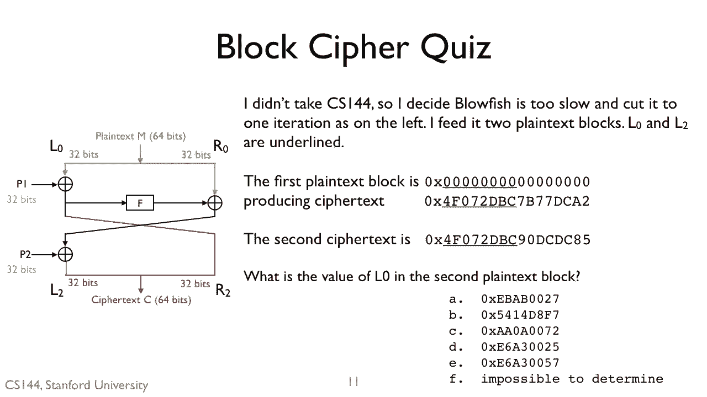
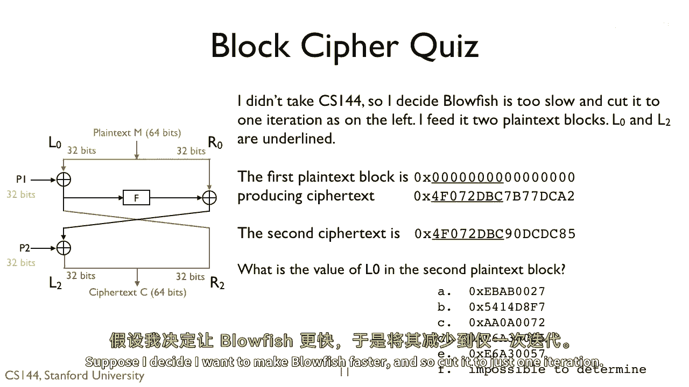
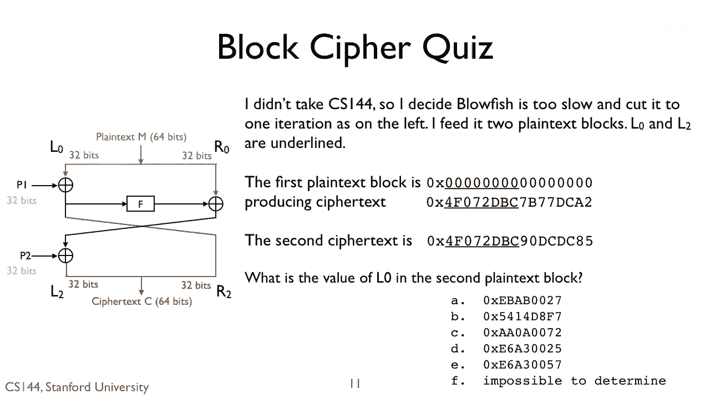
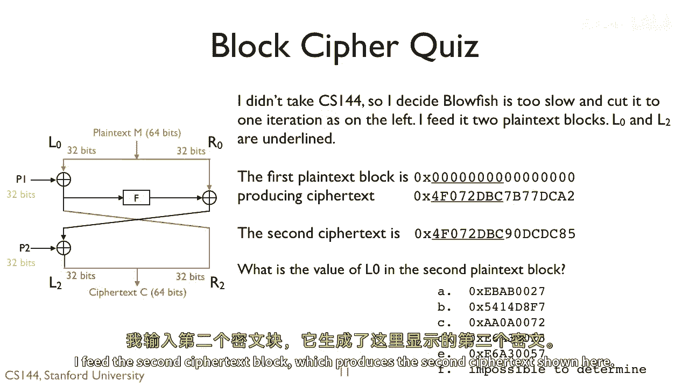
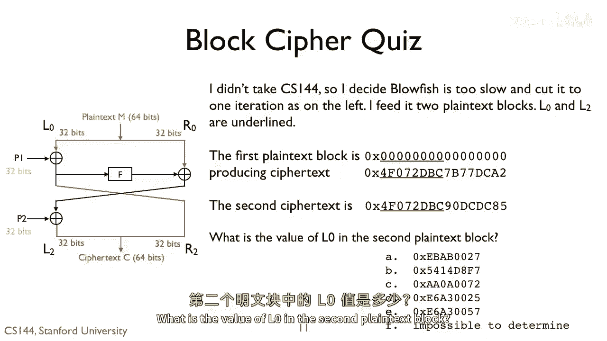

# P123：p122 8-6e Confidentiality - 加加zero - BV1qotgeXE8D

 So here's a second quiz。

 Suppose I decide I want to make blowfish faster and subcut it to just one iteration。

 I feed it two plain text blocks。 The first plain text block is all zeros。

 which somehow my adversary knows。 It produces the first ciphertext shown here。

 I feed the second ciphertext block， which produces the second ciphertext shown here。

 What is the value of L0 in the second plain text block？

