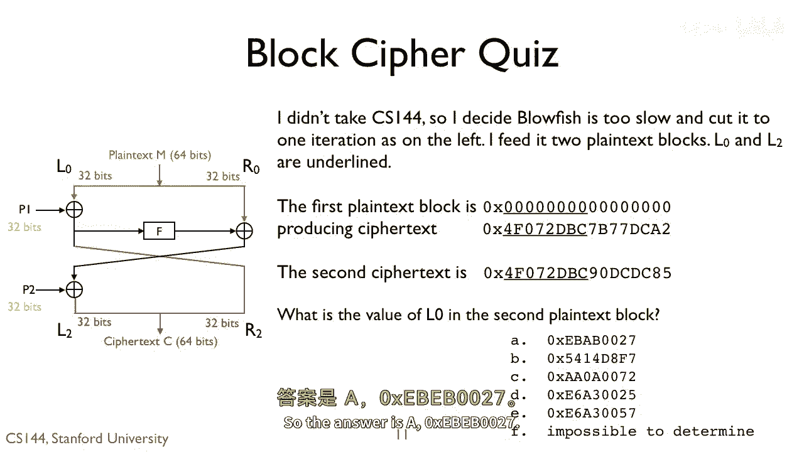
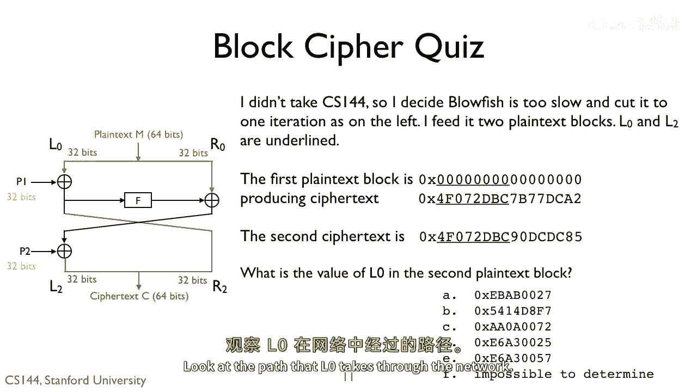
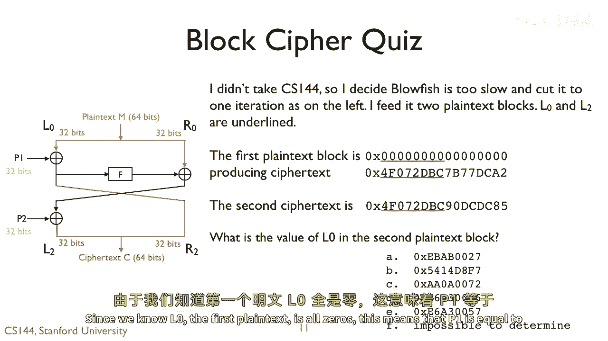
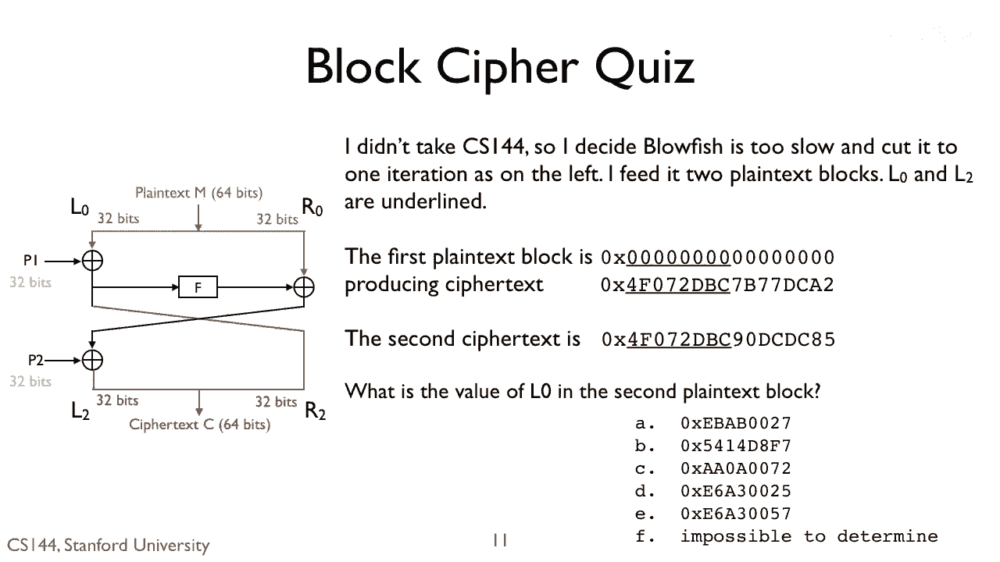
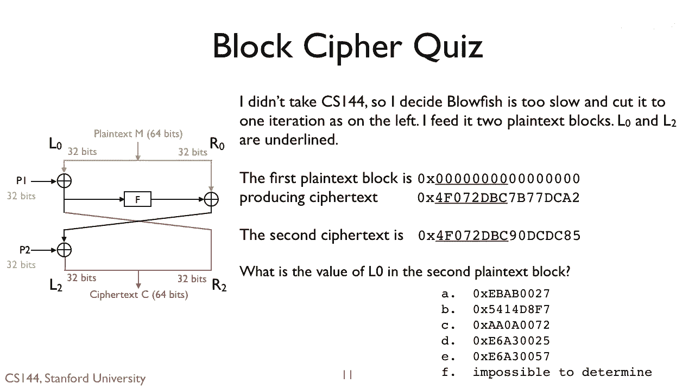
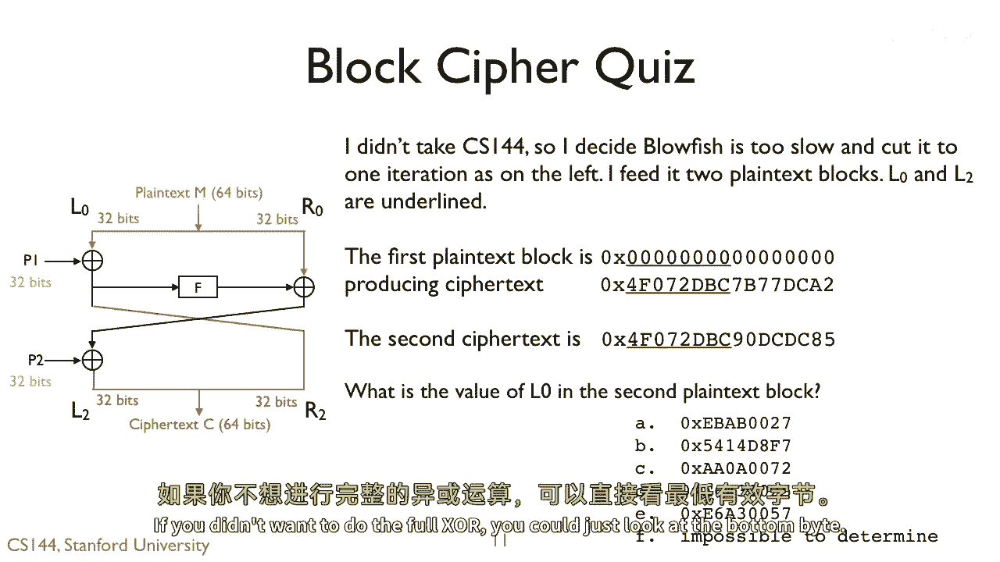
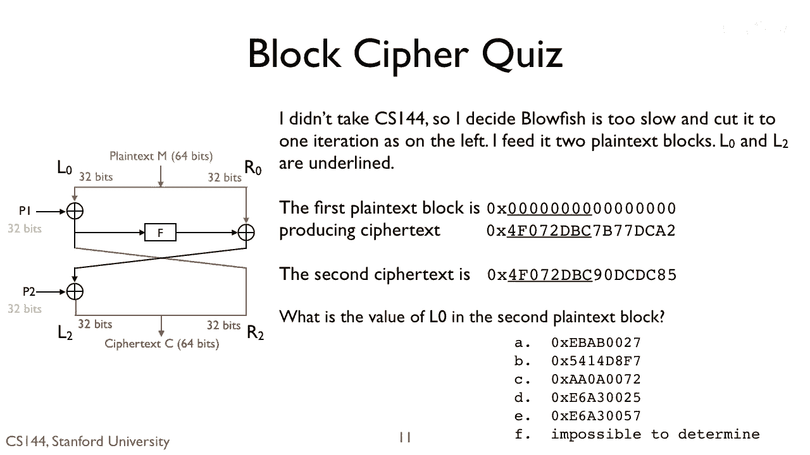

# P124：p123 8-6f Confidentiality - 加加zero - BV1qotgeXE8D

 So the answer is A， 0x EBEB0027。

 Look at the path that L0 takes through the network。

 R2 is equal to L0 XORD with P1。

 Since we know L0， the first plaintext is all zeros。

 This means that P1 is equal to R2， or 0x7B77 DCA2。 Since we know P1。

 we can then compute L0 of the second plaintext by XORing。

 It's R2 with the second with the key。

 If you XOR 0x7B77 DCA2 with 0x0 DC/DC85， you obtain 0x EBEA0027。

 If you didn't want to do the full XORD， you could just look at the bottom byte。

 A2 XORD with 85 is 27。 R2 XORD because 2 XORD with 5 is 7 and A XORD with 8 is 2。

 [audience members talking to each other]。