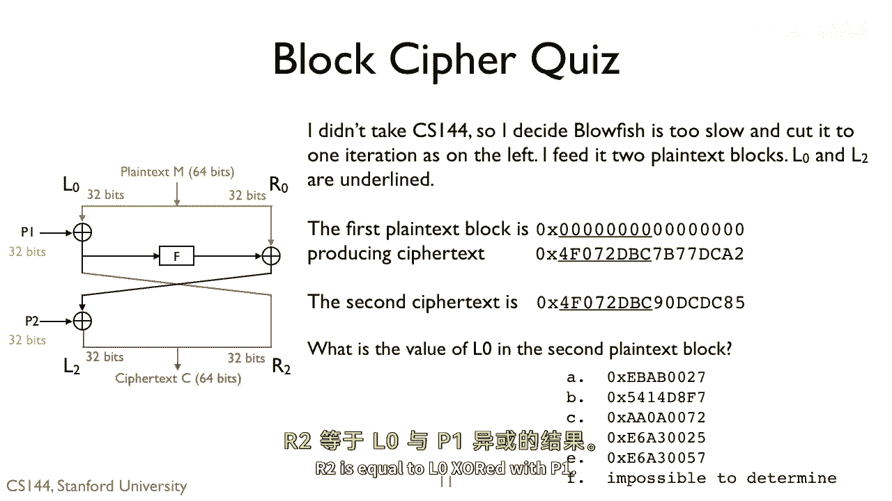

# 课程 P124：Feistel 网络解密实战 🧩

在本节课中，我们将学习如何分析一个简化的 Feistel 网络加密过程，并通过已知的明文和密文片段，推导出未知的明文数据。我们将重点关注异或（XOR）运算在解密过程中的核心应用。

---

上一节我们介绍了 Feistel 网络的基本结构，本节中我们来看看一个具体的解密计算实例。

观察 L0 在网络中的传递路径。已知第一个明文的 L0 部分是全零。

根据 Feistel 网络的规则，R2 的值由 L0 与第一轮的轮函数输出 P1 进行异或运算得到。其关系可以表示为：

**公式：R2 = L0 ⊕ P1**

由于我们知道第一个明文的 L0 为 0，这意味着 P1 的值就等于 R2 的值。从图中可知，R2 的值为 `0x7B77DCA2`。

因此，我们得到：
**P1 = 0x7B77DCA2**

---

既然我们已经知道了 P1 的值，接下来可以计算第二个明文的 L0 部分。

第二个明文的 R2 值（即密文的一部分）为 `0x0DCD85`。在 Feistel 网络中，第二轮的 L0 由第一轮的 R2 与 P1 异或得出。以下是计算过程：

**公式：L0_second = R2_second ⊕ P1**

将数值代入公式：
`0x7B77DCA2 ⊕ 0x0DCD85 = 0xEBEA0027`

因此，第二个明文的 L0 部分是 `0xEBEA0027`。

---

为了验证或进行快速计算，我们可以只关注字节的异或运算，而不必进行完整的 32 位计算。以下是快速校验的方法：

观察最低字节的运算：
*   `A2 ⊕ 85` 的结果是 `27`（因为 `A(1010) ⊕ 8(1000) = 2(0010)`， `2(0010) ⊕ 5(0101) = 7(0111)`）。

这个快速计算的结果与完整计算得到的 `0xEBEA0027` 的最低字节 `27` 相符，验证了我们的推导。

---

本节课中我们一起学习了如何利用 Feistel 网络的对称性和异或运算的可逆性进行解密。我们通过已知的第一个明文（L0=0）推导出了中间值 P1，进而成功地计算出了第二个未知明文的 L0 部分，最终答案为 **A， 0xEBEA0027**。

核心在于掌握 **R2 = L0 ⊕ P1** 这一关系，并通过异或运算逆向求解所需值。