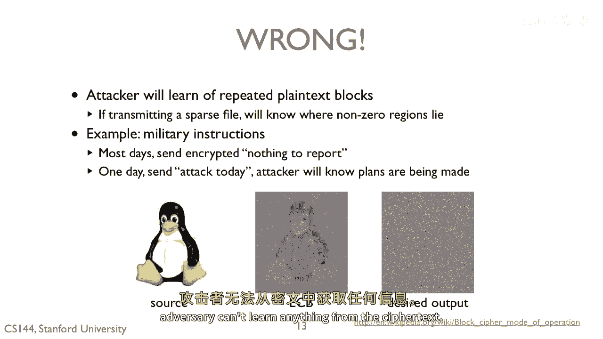
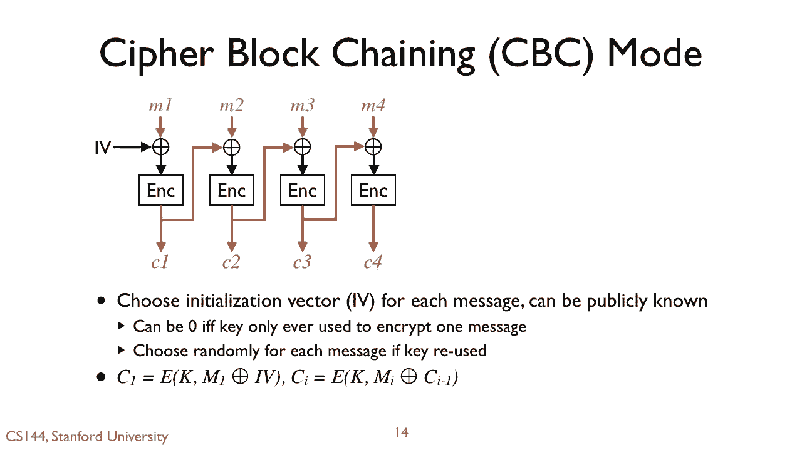

# P125：p124 8-6g Confidentiality - 加加zero - BV1qotgeXE8D

 So let's suppose we have a good block cipher。 How do we use it？

 Messages are typically longer than 164 or 128-bit block。

 One straight forward approach is something called ECB， or electronic codebook mode。 This is simple。

 We take our message AM and break it into blocks， M1 and M2 and M3 and M4。

 We encrypt each one individually， so M1 becomes C1， M2 becomes C2， etc。 This is fast。

 because we can do them all in parallel， something great on modern multicore processors。

 Assuming that our encryption algorithm is secure， then an adversary can't decrypt any block and so our message is secure。

 Furthermore， we can reuse our keys since every blocking cryptid with a cipher will be secure。

 We'll be secure。 Simple， fast and secure。

 Nope， it's not secure at all。 Using electronic codebook mode。

 an attacker will learn of repeated plaintext blocks。 Since encryption is deterministic。

 then if M1 equals M2， C1 will equal C2。 For example， if we're transmitting a sparse file。

 this is really bad。 An adversary can see where the non-zero regions of the file are。

 Here's a visual example of the problem using an image of Tux。

 The center image shows the result of encrypting the image on the left with ECP。

 Identical regions of the image， such as the whitespace， show up identically。

 and you can see a general outline of Tux。 The image on the right is more like what we want。

 where there's no pattern and an adversary can't learn anything from the ciphertext。

 One way to achieve this desired degree of confidentiality is cipher block chaining or CBC mode。

 In CBC mode， you choose an initialization vector IV， the same size of the block。

 You XOR M1 with this initialization vector， and encrypt the result of that to produce C1。

 You then take C1 and XOR it with M2 before encrypting it to produce C2。

 If you want to use a key to encrypt only one message， then IV can be zero。

 The basic tanger is that you don't want to reuse an initialization vector。 Suppose you do。

 So you set IV to be zero for one message， then reuse an IV of zero for a second message。

 If the plaintexts are identical， then the ciphertext will be identical。

 and you've leaked information to the adversary。

 If we use CBC mode on the tux image， on the tux image。

 and we end up computing the ciphertext on the right， so problem solved。 But again。

 for this to work across multiple messages and remain secure。

 you need to be careful about how you pick and use initialization vectors。

 Electronic codebook mode cipher block chaining mode are just two ways to use block ciphers。

 There are many more with different properties， strengths， and weaknesses。 cipher feedback mode。

 for example， XOR is the message with an encryption of the prior ciphertext。

 This is useful if the message isn't a multiple of the block size and you don't want to pad it with zeros。

 In ECB and CBC mode， you pass the message block to encrypt， so you can't trim the ciphertext。

 Or there's output feedback mode， where you repeatedly encrypt the initialization vector and use it like a stream cipher。

 Or counter mode， where you encrypt incrementing values with a key in XOR and with message blocks。

 This is easily easily parallelizable， but it means that you can only use a key for one message unless you do something smart with the value I。

 So let's do one final quiz。 Suppose we have a shared secret key。

 which only you and the other party know。 You encrypt your messages with a good cipher using CBC mode and transmit those messages over a network。

 Are these messages secure？

