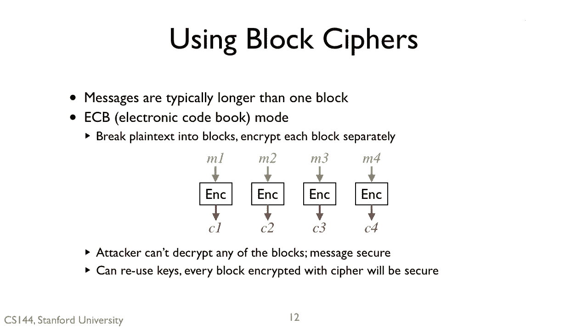
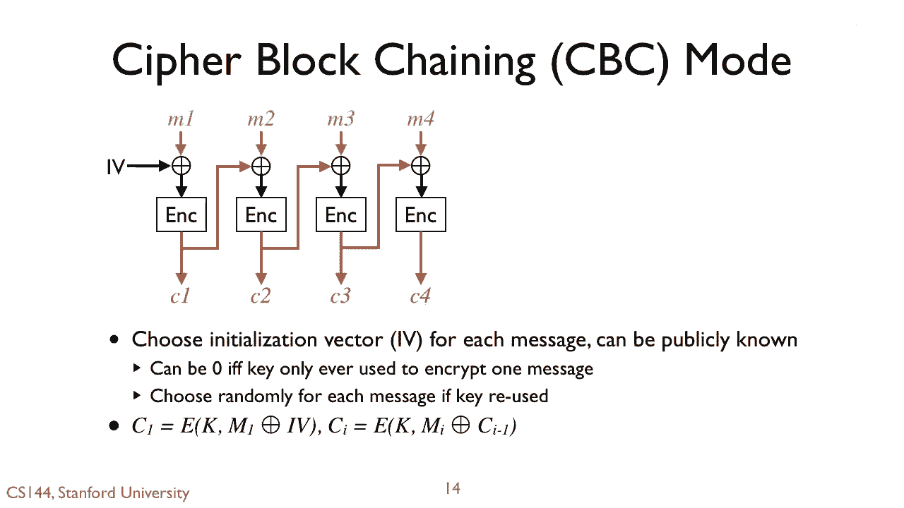
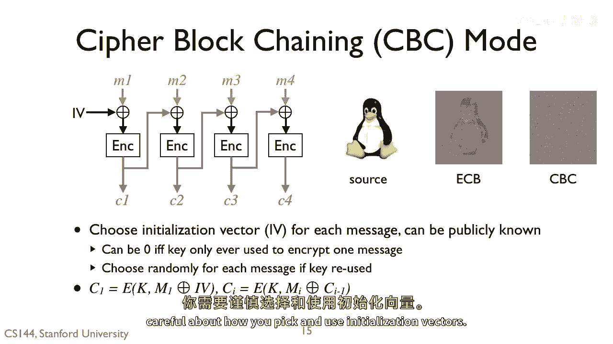
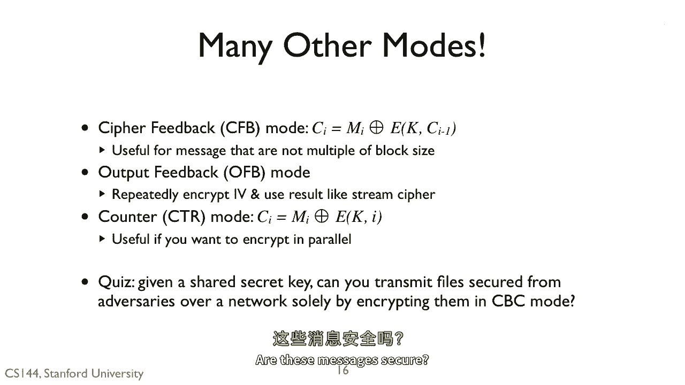

# 课程 P125：分组密码工作模式 🔐

在本节课中，我们将要学习如何将安全的分组密码（如AES）应用于实际中长度不固定的消息。我们将探讨几种不同的工作模式，分析它们如何运作以及为何某些模式比其他模式更安全。

---

## 从简单开始：电子密码本模式

上一节我们介绍了安全的分组密码。本节中我们来看看如何用它加密长消息。一个最直接的方法是**电子密码本模式**。

其工作原理非常简单：
1.  将消息 `M` 分割成多个固定长度的块，例如 `M1`, `M2`, `M3`, `M4`。
2.  使用相同的密钥 `K`，独立加密每个明文块。
    *   加密过程可以表示为：`C_i = Encrypt(K, M_i)`
3.  所有密文块 `C1`, `C2`, `C3`, `C4` 组合起来就是完整的密文。

这种模式速度快，因为所有块的加密可以并行进行，非常适合现代多核处理器。如果加密算法本身是安全的，那么攻击者无法解密任何单个块。

然而，ECB模式存在一个严重的安全缺陷。由于加密是确定性的，相同的明文块总会产生相同的密文块。

以下是ECB模式的问题：
*   如果 `M1` 等于 `M2`，那么 `C1` 也将等于 `C2`。
*   例如，在传输稀疏文件时，攻击者可以通过观察重复的密文块，识别出文件中非零数据区域的位置。
*   视觉上，用ECB加密一张图片（如左图的企鹅Tux），其中相同的区域（如白色背景）会产生相同的密文，导致加密后的图片（中图）仍然能看出原始图像的轮廓，这泄露了信息。我们期望的是像右图那样，密文中看不出任何模式。

因此，ECB模式不能为实际数据提供足够的保密性。

---

## 提升安全性：密码块链接模式

为了解决ECB模式暴露模式的问题，我们需要一种方法将每个明文块的加密与之前的结果联系起来。这就是**密码块链接模式**。

在CBC模式中，我们引入一个**初始化向量**（IV），它是一个与分组长度相同的随机数。

以下是CBC模式的加密步骤：
1.  将第一个明文块 `M1` 与 IV 进行异或操作。
2.  加密异或后的结果，得到第一个密文块 `C1`。
    *   公式表示为：`C1 = Encrypt(K, M1 XOR IV)`
3.  对于后续的每个明文块 `M_i`，先将其与前一个密文块 `C_{i-1}` 进行异或，然后再加密。
    *   公式表示为：`C_i = Encrypt(K, M_i XOR C_{i-1})`

IV的使用至关重要。如果只用一个密钥加密一条消息，IV可以设为零。但基本准则是：**不要重复使用同一个IV**。

以下是关于IV的注意事项：
*   假设你对两条不同的消息重复使用了相同的IV（例如都是0）。
*   如果这两条消息的明文开头部分相同，那么它们产生的密文开头部分也会相同。
*   这就向攻击者泄露了“这两条消息开头可能相同”的信息。

当我们将CBC模式应用于之前的企鹅图片时，得到的密文图像（右图）完全掩盖了原始模式，问题得以解决。

---

## 其他工作模式简介

ECB和CBC只是使用分组密码的两种方式。还有许多其他模式，各有不同的特性、优点和缺点。

以下是另外几种常见的工作模式：
*   **密码反馈模式**：将消息与前一个密文块的加密结果进行异或。这在消息长度不是分组大小的整数倍，且不想填充零时很有用。
*   **输出反馈模式**：反复加密IV，将其用作类似流密码的密钥流。
*   **计数器模式**：使用密钥加密一个递增的计数器值，然后将输出与明文块进行异或。这种模式非常易于并行化，但通常需要确保每个消息使用的计数器值不重复。

---

## 最终测验与总结

现在让我们做一个最后的测验。假设你和通信方共享一个秘密密钥，并使用一个安全的密码算法以CBC模式加密消息，然后通过网络传输这些消息。

**这些消息是安全的吗？**

答案并非绝对“是”。虽然CBC模式本身能很好地隐藏明文模式，但消息的保密性还取决于其他因素，例如：IV是否唯一且不可预测、密钥是否保持机密、以及通信信道是否还面临其他攻击（如篡改）。

在本节课中，我们一起学习了：
1.  **ECB模式**：简单、并行化好，但因相同的明文产生相同的密文而**不安全**，会泄露数据模式。
2.  **CBC模式**：通过将每个块与前一个密文块链接，有效隐藏了模式。安全使用它的关键是使用**唯一且不可预测的初始化向量**。
3.  还有其他如CFB、OFB、CTR等工作模式，适用于不同的场景。

选择正确的工作模式并正确使用其参数（如IV），对于构建安全的加密系统至关重要。