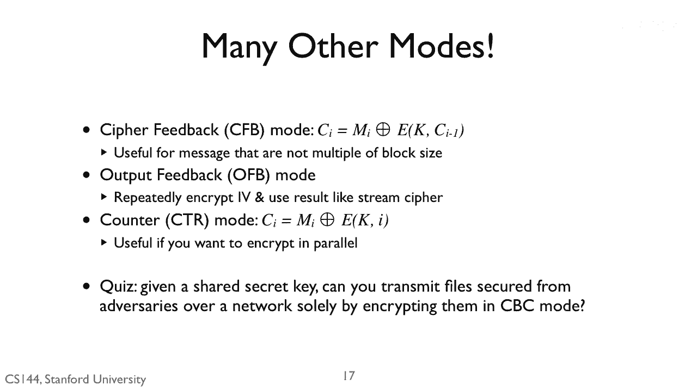
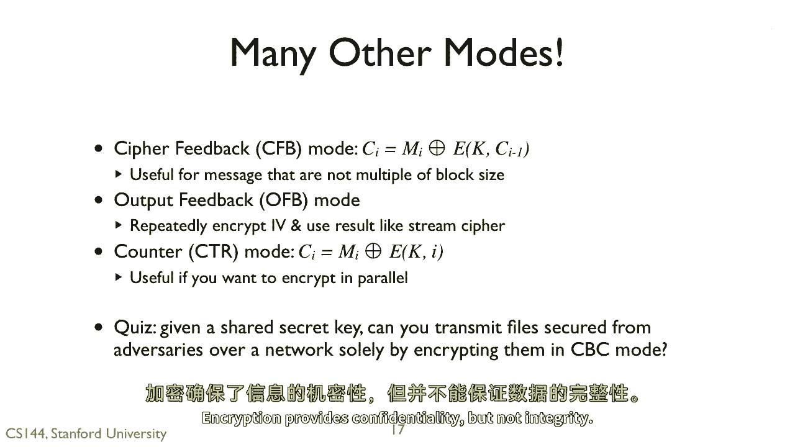
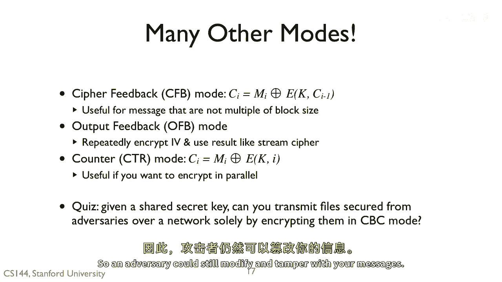

# P126：p125 8-6h Confidentiality - 加加zero - BV1qotgeXE8D

 The answer is no。

 Encryption provides confidentiality， but not integrity。

 So an adversary could still modify and tamper with your messages。

