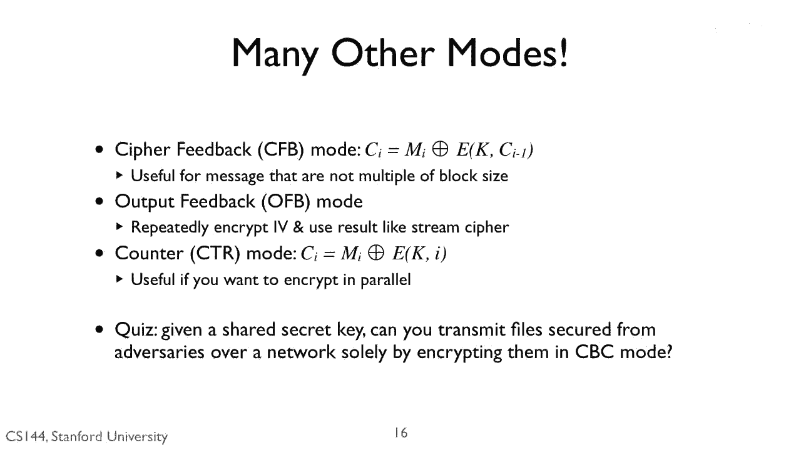
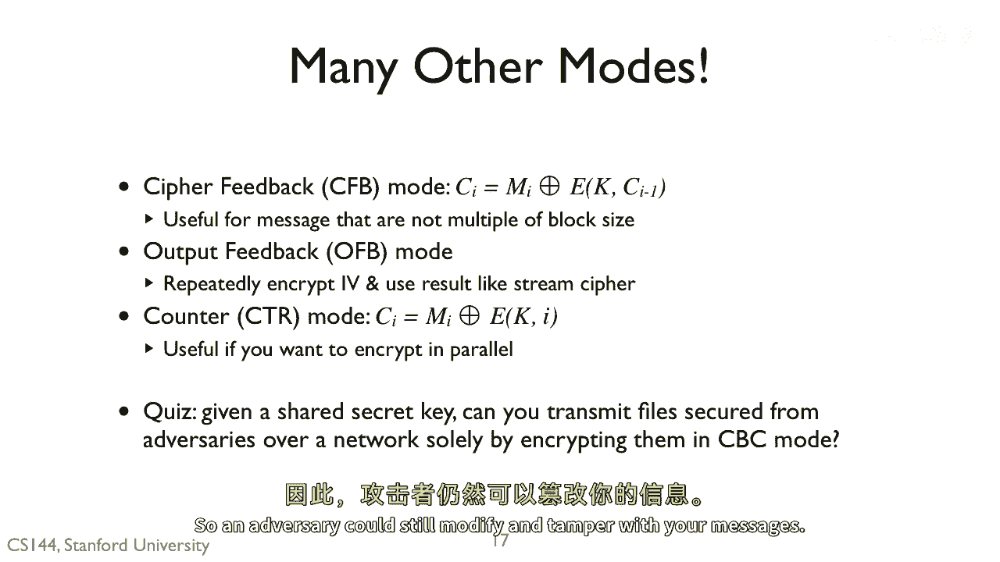

# 课程 P126：加密与完整性 🔐

在本节课中，我们将要学习加密与数据完整性之间的关键区别。我们将探讨为什么仅使用加密技术不足以保护信息不被篡改，并理解保密性与完整性的不同作用。

---

上一节我们介绍了加密的基本概念，本节中我们来看看加密的具体作用。

加密技术能够提供**保密性**。这意味着只有拥有正确密钥的授权方才能读取被加密的信息。其核心过程可以用以下公式描述：

**密文 = 加密(明文, 密钥)**

然而，加密本身并不能保证信息的**完整性**。

---

理解了加密的局限性后，我们来看看这意味着什么。

即使信息被加密，攻击者仍然可能对其进行修改或破坏。加密过程并不验证信息在传输或存储后是否与原始状态一致。

以下是可能发生的情况：

*   攻击者可以截获加密的密文。
*   攻击者可以修改密文中的部分数据。
*   接收方解密后，可能会得到一份被篡改过的、无意义的或有害的明文信息，而无法察觉信息已被更改。

---

所以，答案是“不能”。加密提供保密性，但不提供完整性。因此，攻击者仍然可以修改和篡改你的信息。

---

本节课中我们一起学习了加密与完整性的核心区别。我们明确了加密技术能确保信息的私密性，但无法防止信息被篡改。要构建一个安全的信息系统，通常需要结合使用加密（提供保密性）和消息认证码或数字签名等技术（提供完整性）。