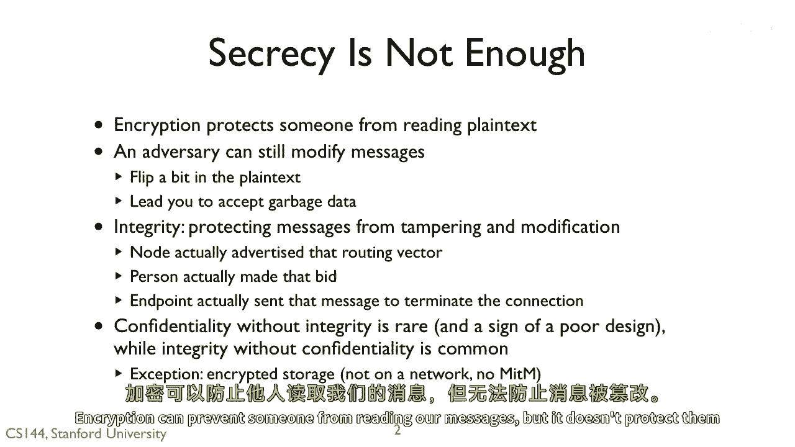
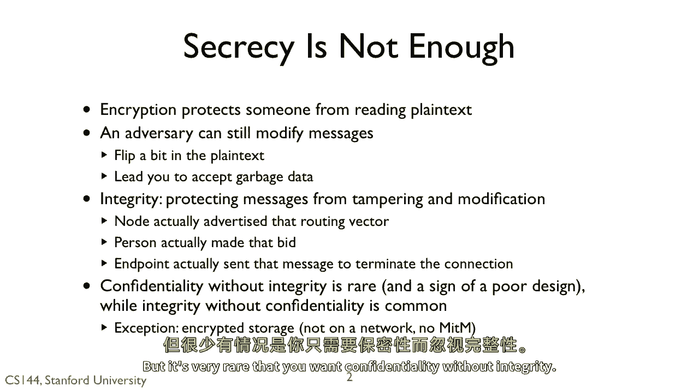
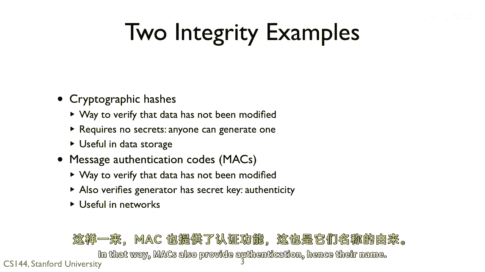
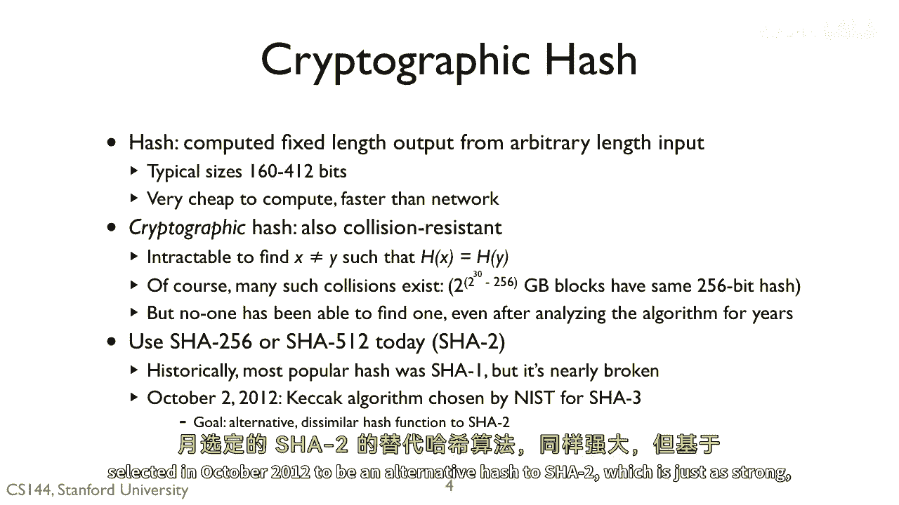
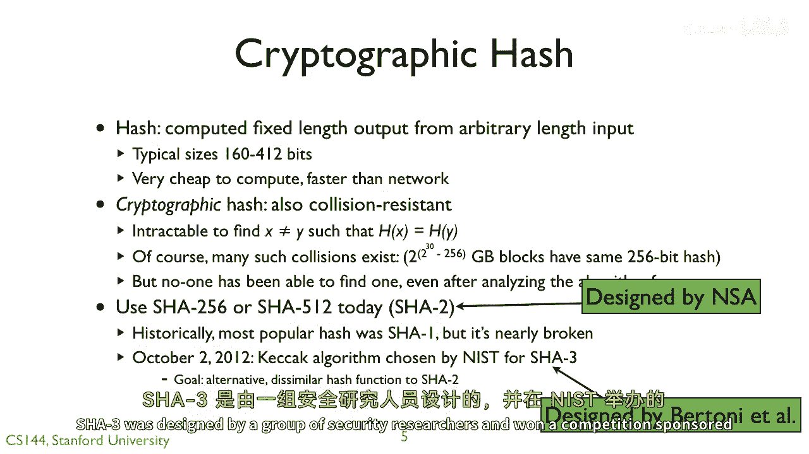
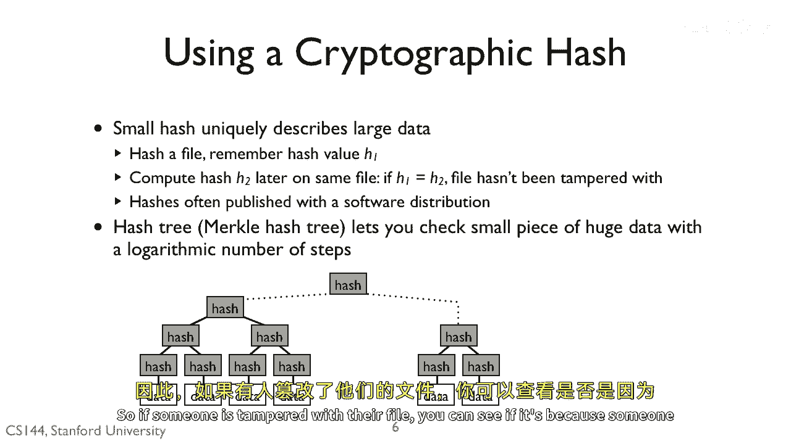
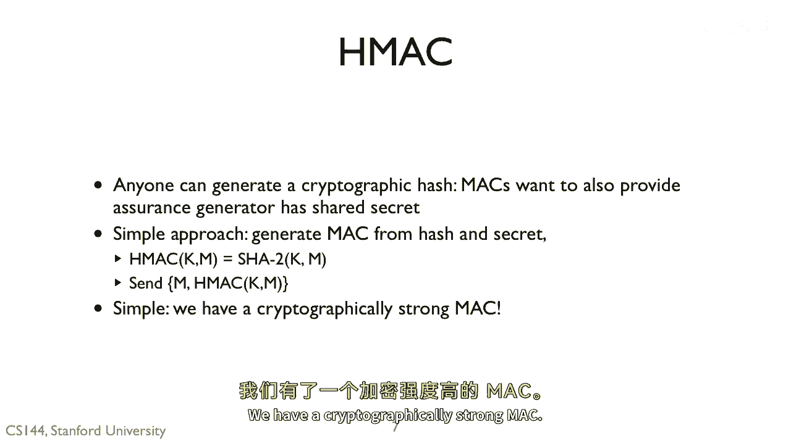
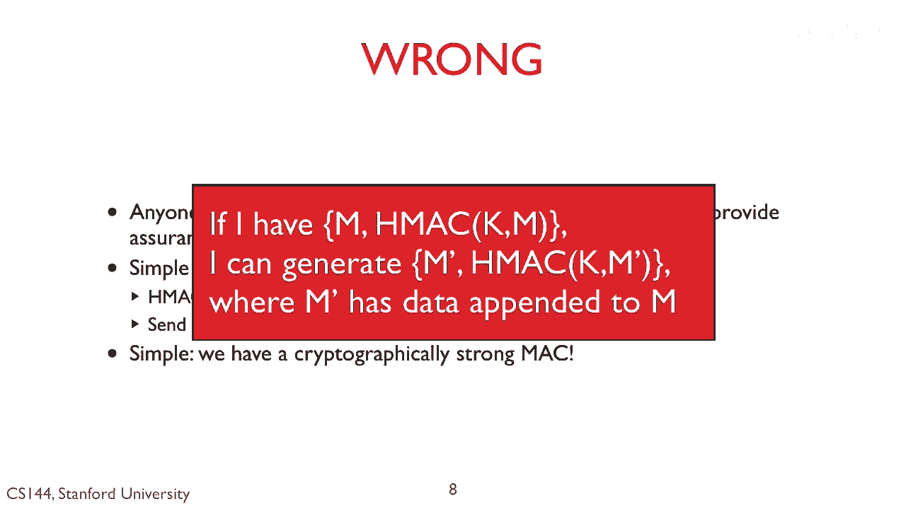
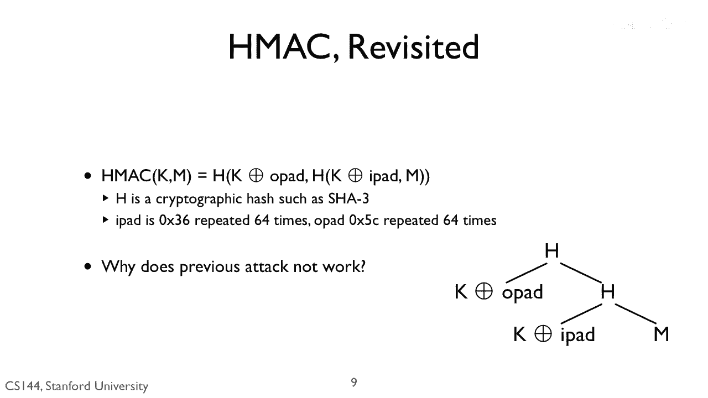
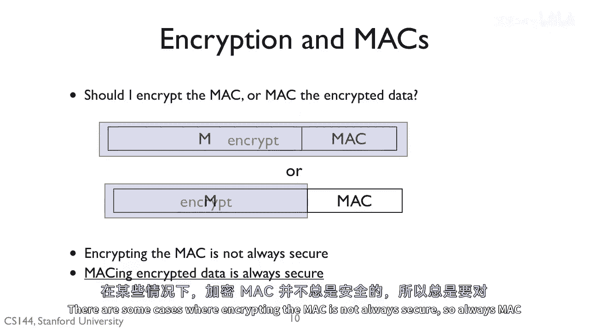

# 课程 P127：完整性 🔐

在本节课中，我们将要学习计算机安全中的“完整性”概念。我们将探讨为什么仅有加密提供的保密性是不够的，并介绍两种确保数据完整性的核心密码学原语：密码学哈希函数和消息认证码。

---

## 概述

加密提供了保密性，但我们也需要完整性。对于一个安全的系统，我们需要知道一条消息确实是由特定方生成的，并且没有被任何人篡改。

例如，假设我们想要一个安全的文件系统协议。如果没有完整性，攻击者可能会向写入命令附加垃圾数据，甚至可能创建包含垃圾数据的新写入命令。

核心要点是：仅有保密性是不够的。加密可以防止他人读取我们的消息，但它不能保护消息免受篡改。除了保密性之外，安全系统的第二个属性就是完整性。

---

## 完整性的重要性 🛡️

上一节我们概述了完整性的必要性，本节中我们来看看它的具体应用场景。

完整性算法让你确信一条消息是由拥有密钥的人生成的。因此，假设密钥是保密的，你就可以确信消息来自特定的程序、主机等。这非常有用。

以下是完整性的一些关键应用场景：

*   **网络路由**：你可以知道一个路由向量确实来自声称发送它的节点，而不是攻击者试图诱骗你将流量路由到他们那里。
*   **在线拍卖**：你可以知道在拍卖中出价的人确实发出了那个出价。
*   **安全通信**：如果你收到一条终止连接的消息或一条可能导致你终止连接的坏消息，你可以知道该消息确实来自另一端，而不是有人试图关闭你的连接。

一般来说，在安全领域，完整性通常排在首位。有很多情况你需要完整性，但保密性不那么重要。然而，你很少需要保密性而不需要完整性。

---

## 两大完整性原语

上一节我们了解了完整性的应用，本节中我们来认识实现完整性的两大核心工具。

密码学哈希函数和消息认证码是两种主要的完整性原语。

*   **密码学哈希函数**：让你安全地确定数据未被修改。任何人都可以生成密码学哈希，它不需要密钥。它是一个具有特殊属性的哈希函数。
*   **消息认证码**：是验证数据未被修改的第二种方式。它们具有密码学哈希函数的所有完整性属性，但还有一个额外属性：它们确保生成MAC的人拥有密钥。只有拥有相同密钥的其他人才能检查MAC是否正确。

密码学哈希函数对于存储数据很有用。你可以确信没有人篡改过数据，并且由于不需要密钥，任何人都可以检查数据是否被篡改。

消息认证码在网络中很有用。如果你发送一条附加了MAC的消息，接收方如果拥有对应的密钥，就可以检查他们收到的消息是否是你发送的、未经篡改的消息，并且由于你必须拥有密钥才能生成MAC，这也提供了身份认证，因此得名“消息认证码”。

---

## 密码学哈希函数详解 🔍

现在，让我们首先深入了解密码学哈希函数。密码学哈希函数是一种具有特殊属性的哈希函数。

像普通哈希函数一样，密码学哈希函数从任意长度的输入产生固定长度的输出。例如，我可以从1GB的数据计算出一个256位的哈希值。它们的计算速度通常非常快，比网络传输还快。

密码学哈希函数，像普通哈希函数一样，通常通过对数据执行单次扫描，并基于每个字节或字执行一些数学运算来工作。这样，你就不必一次性将整个数据保存在内存中，可以流式处理。

密码学哈希函数提供了一个特性：**抗碰撞性**。

这意味着，如果我有一段数据 **X** 和它的哈希值 **H(X)**，那么要生成另一条消息 **Y**，使得 **H(Y) = H(X)**，在计算上是不可行的。

当然，这样的碰撞是存在的。假设我有一个256位的密码学哈希，它有 **2^256** 个不同的可能取值。假设我正在哈希1GB的数据，那么有 **2^(2^30)** 个不同的数据块，但只有 **2^256** 个不同的哈希值。虽然碰撞存在，但找到它们非常困难，以至于人们花费数年时间尝试也找不到。你不能仅仅尝试 **2^100** 或 **2^120** 个不同的数据块。

这是一个非常深刻的概念。请确保你理解它：**给定一个哈希值 H，要生成一段具有该哈希值的数据在计算上是不可行的**。这看似简单，但功能强大。

**核心公式/概念**：
*   **抗碰撞性**：给定 **H(X)**，找到 **Y ≠ X** 使得 **H(Y) = H(X)** 是计算上不可行的。

---

### 如何选择哈希函数

如果你需要使用哈希函数，那么请使用 **SHA-256** 或 **SHA-512**。这些是SHA-2安全哈希算法，分别提供256位或512位哈希值。

SHA-1在今天几乎已被攻破。还有 **SHA-3**，它由美国国家标准与技术研究所在2012年10月选定，作为SHA-2的替代哈希算法，强度相同但基于不同的数学原理。这样，如果SHA-2出现问题，我们可以回退到SHA-3。

SHA-2由美国国家安全局设计并于2001年发布。考虑到最近关于NSA试图构建后门的新闻报道，你可能会认为SHA-2有后门。实际上很可能没有。它已经存在了十多年，并经过了公开审查。任何密码学和安全性领域的人士都研究过它，它看起来是安全的。破解SHA-2的难度堪比在物理学中发展出爱因斯坦的相对论。

SHA-3是由一组安全研究人员设计的，并在NIST赞助的新SHA-3竞赛中获胜。

---

### 哈希函数的应用：数据完整性校验

密码学哈希函数有一个很好的特性：一个小的哈希值可以唯一地描述一大段数据。

基本方法如下：
1.  获取你的文件并计算其哈希值，存储为 **H1**。
2.  稍后，再次计算该文件的哈希值，称这个哈希值为 **H2**。
3.  如果新值与旧值不匹配，则文件中的某些内容已更改。
4.  如果两者相等，那么你知道文件没有被篡改，因为没有人能生成一个具有相同哈希值的新文件或修改现有文件。

因此，你有时在下载软件时会看到发布者同时公布软件的哈希值。然后，你可以检查下载的内容是否是他们生产的，以确保在软件发布后没有人向分发包中插入恶意软件。

---

### 进阶应用：默克尔哈希树

哈希函数本身只能告诉你数据是否被修改。如果我有一个巨大的文件，我可以知道它被修改了，但不知道是哪里被修改。

如果你构建一个“默克尔哈希树”，你就可以知道文件的哪部分被修改了。
1.  你对文件的小块进行哈希。
2.  然后像这里展示的那样，创建一个哈希树。
3.  如果顶部的哈希值不同，那么你就知道两个文件不同。
4.  然后，你可以在对数级步数内遍历树，找出文件的哪部分不同。

这样，如果有人篡改了文件，你可以判断是因为意外截断，还是因为插入了恶意代码。

**核心概念**：**默克尔树** 通过对数据块分层哈希，实现对大数据集的高效、局部完整性验证。

---

## 消息认证码详解 🔑

上一节我们介绍了无需密钥的完整性校验，本节中我们来看看如何结合密钥，实现同时保证完整性和认证的消息认证码。

密码学哈希函数非常有用，它们能告诉你数据是否被修改，但它们不需要秘密。任何人都可以生成和检查密码学哈希。而消息认证码则希望同时提供真实性。你想确保生成MAC的程序拥有一个秘密。

一旦我们有了密码学哈希函数，构建消息认证码就很容易了。我们需要做的就是将秘密与哈希结合起来。

我们可以定义一个消息认证码算法 **HMAC**，它接收一个密钥 **K** 和一条消息 **M**。它所做的就是将密钥前置到消息前，并对该数据计算哈希。然后，你可以只发送消息和MAC。为了检查消息认证码，接收方将密钥前置并计算MAC。他们知道只有拥有密钥的人才能产生这个MAC。

听起来很简单。我们有了一个密码学上强大的MAC。

**错误**。

回想一下，哈希函数是通过迭代处理数据来工作的。对于大多数哈希函数，这意味着你将新数据合并到现有的哈希值中。换句话说，哈希值是计算的中间状态。

这意味着，如果我看到一条具有特定MAC的消息 **M**，我可以向 **M** 追加一些数据，形成 **M‘**，并计算出 **M’** 的MAC。因此，正如安全领域常见的那样，简单的方法行不通，并且存在漏洞。我们需要更聪明的方法。

幸运的是，这个更聪明的方法并不复杂得多。

---

### 正确的MAC计算方法

以下是计算消息认证码的正确方法：
1.  取你的密钥 **K**，与一个内填充（例如，重复64次的 `0x36`）进行异或操作，得到内密钥 **K\_i**。
2.  计算 **K\_i** 前置到消息 **M** 后的哈希值，得到内哈希 **H\_i**。
3.  然后，通过将 **K** 与一个不同的外填充（例如，重复64次的 `0x5C`）进行异或操作，计算外密钥 **K\_o**。
4.  计算 **K\_o** 前置到内哈希 **H\_i** 后的哈希值，结果即为最终的MAC。

**为什么之前的攻击无效？**
假设攻击者向 **M** 附加了一些信息。他们不知道 **K**。然而，MAC是由 **M** 的哈希值构成的，而不是 **M** 本身。因此，向 **M** 追加数据将导致完全不同的哈希值。之前方法中泄露的计算中间状态，通过这个内哈希被隐藏了起来。

**核心公式/代码描述**：
`HMAC(K, M) = H( (K ⊕ opad) || H( (K ⊕ ipad) || M ) )`
其中 `H` 是哈希函数（如SHA-256），`||` 表示连接，`opad` 和 `ipad` 是固定的填充常量。

这就是当今通常计算MAC的方式：对密钥和消息的一种变换进行密码学哈希，再对该哈希值和密钥的另一种变换进行密码学哈希。

---

## 结合保密性与完整性

最后一个问题。假设你同时需要保密性和完整性。你应该加密MAC，还是对加密后的数据计算MAC？

答案是后者：**对加密后的数据计算MAC**。

在某些情况下，加密MAC并不总是安全的。因此，始终对加密后的数据计算MAC。

---

## 总结

在本节课中，我们一起学习了：
1.  **完整性的定义与重要性**：确保数据来自可信来源且未被篡改，是安全系统的基础属性，通常比保密性更优先。
2.  **两大核心原语**：
    *   **密码学哈希函数**（如SHA-256）：提供抗碰撞性，用于验证数据完整性，无需密钥。
    *   **消息认证码**（如HMAC）：在哈希函数基础上结合密钥，同时提供完整性校验和身份认证。
3.  **关键应用**：包括软件分发验证（哈希校验）、安全通信（MAC）、数据结构完整性（默克尔树）等。
4.  **重要实践**：当同时使用加密和完整性保护时，应采用“先加密，后MAC”的模式。

记住，一个健壮的安全方案往往需要同时考虑保密性、完整性和可用性。完整性是连接信任与数据的桥梁。