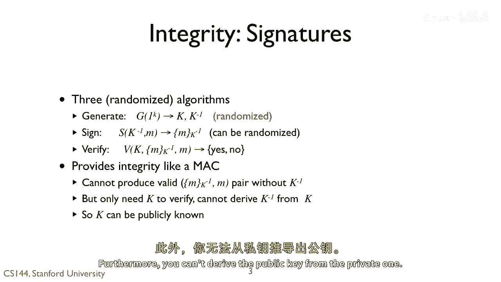
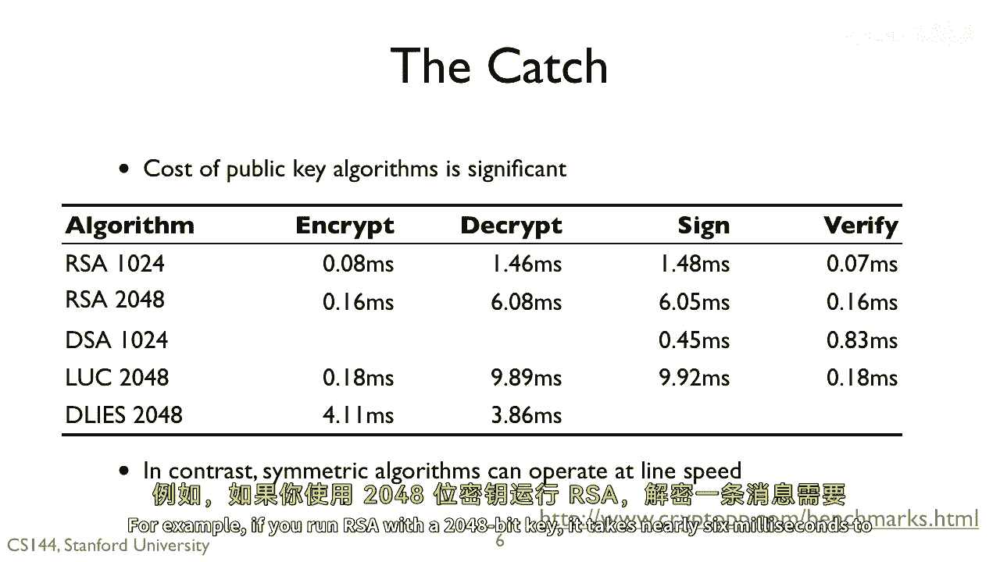
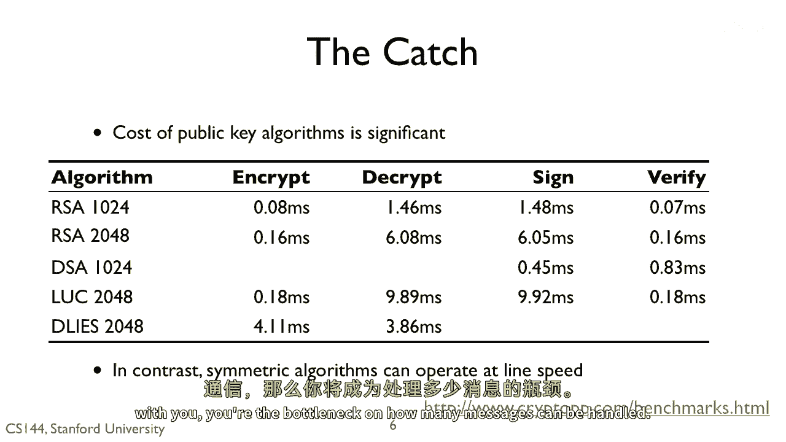
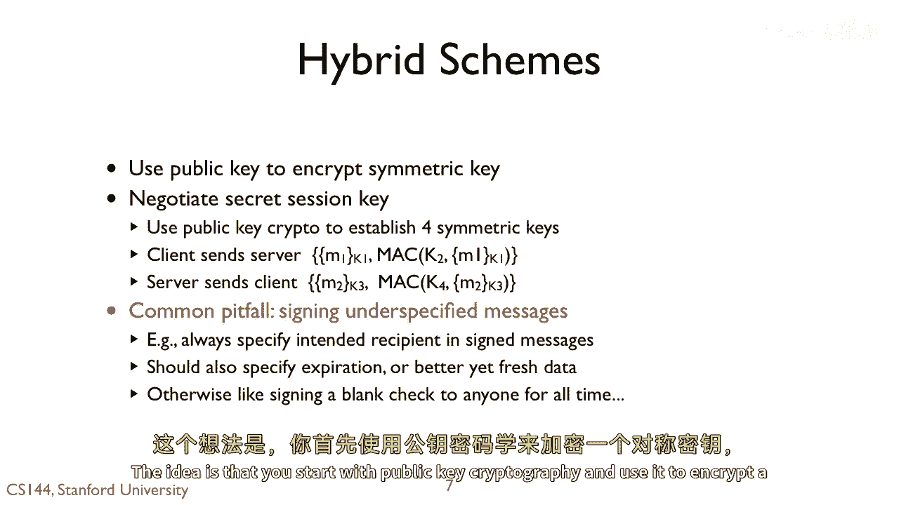

# P128：p127 8-8 Public Key Cryptography - 加加zero - BV1qotgeXE8D

 Public key cryptography is a critical part of most secure systems today。

 It's different than symmetric cryptography， and that there's what's called a public key。

 a key that doesn't have to be secret。 You can distribute this public key freely and still communicate securely。

 So how does that work？ Like symmetric cryptography， public key ciphers have three algorithms。

 One to generate keys， one to decrypt， and one to encrypt。

 They differ from symmetric cryptography in two ways。 First。

 the generated algorithm generates two keys， a public key k， and a private key k inverse。 To encrypt。

 you pass the public key in a plaintext to obtain a ciphertext。 To decrypt。

 you pass the private key and the ciphertext to obtain the plaintext。 Therefore。

 if you generate the keys， you can give out the public key freely， hence its name。

 and know that only someone with a private key can decrypt something sent with the public key。

 Because the public key is reused many times， though。

 this means the encryption process has to include randomization。 Otherwise。

 two parts that send the same message will produce the same ciphertext。

 If you're dealing with small messages， an adversary could just exhaustively try all the messages。

 So， for example， you can prepend some random data to generate the ciphertext。

 So this is kind of magic。 You can generate two keys， one public， one private。

 People with a public key can send data only someone with a private key can decrypt。

 If each side had the other's public key， then we wouldn't need symmetric cryptography at all。

 So it turns out that's not quite the case， and I'll explain why in a little bit。

 Public cryptography is much， much more computationally expensive than symmetric cryptography。

 so we can't just use it all the time。

 You can use public key cryptography for integrity as well， using something called a signature。

 Again， you have three functions。 Generate， which generates a pair of keys。 Sign。

 which takes the private key。 And verify， which takes the public key。

 A signature provides integrity like a Mac。 You can't produce a valid signature for a message M without the private key。

 but anyone can verify it with the public key。 Furthermore。

 you can't derive the public key from the private one。

 So there are a lot of public key algorithms out there。 For encryption， we have RSA， Raven。

 and Elgomile。 For signatures， we have RSA， Raven， Elgomile， and DSA。

 But public key algorithms work differently than symmetric ones。 The basic idea behind RSA。

 for example， is really simple。 Modular exponentiation of large integers。 However。

 simple transformations of a message to a number are non-acetrally secure。

 So you have to be careful in how you use them。 I gave one example of that earlier of how you have to add randomness。

 So generally speaking， it's good to use existing， tested implementations of these algorithms。

 rather than try to re-implement them yourself。 Or you can re-implement them。

 but then don't use your implementation in a secure system。 For many of these algorithms。

 we can use the same key for encryption and for signing。 While they use the same key though。

 they use very different algorithms。 You can't， for example。

 sign a document by encrypting it with the private key。

 So I'm not going to go into all of the details， but I just want to give you a sense of how one very famous of these algorithms。

 RSA， works。 RSA is named for its co-creators， Rivec Chimer and Ailman。 They won a Turing Award。

 the highest word in computing for it。 I'm presenting RSA because， conceptually， it's very simple。

 To generate RSA keys， you choose two distinct， very large， prime numbers， P and Q。 From P and Q。

 you compute their product N。 You then use P and Q to derive K and K in first。

 the public and private keys。 You advertise N and K as the public key。 To encrypt a message。

 you consider the message M as a large number and raise it to the K power and take it modulo N。

 You send that ciphertext number。 The decrypt。 You consider the ciphertext message M as a large number。

 The ciphertext message C as a large number and raises it to the K inverse power that take it modulo N。

 It turns out that if you do this， you will recover the original plaintext message。

 So you drive K and K inverse from P and Q。 If an adversary learns P and Q。

 then they can generate the private key and break the system。 You can't derive P and Q from K。

 It turns out you also can't derive P and Q from N。 N is the product of two primes。

 Factoring N into P and Q turns out to be computationally hard。

 If someone figured out how to do it quickly， then all of RSA crashes down。 As you can imagine。

 a lot of people put a huge amount of effort to understand exactly how hard it is to factor a product with two prime numbers。

 For those of you who know a bit about computational complexity。

 we know that the problem is in the computational class NP。 It's suspected to be outside class P。

 but it's suspected to not be NP complete。 So that means our best guess is that you can't do it in polynomial time。

 but it's not as hard as the hardest problems in NP， like traveling salesman。 So public。

 your cryptography seems pretty amazing。 You can generate two keys， distribute one publicly。

 then have confidentiality， integrity， and authenticity。

 So why do we use symmetric cryptography at all？ There is， of course， a catch。

 Public key cryptography is much， much slower than symmetric ciphers。

 We can do symmetric crypto-aligned rate。 Public says key systems， though。

 have execution times in milliseconds。 For example， if you run RSA with a 2048-bit key。

 it takes nearly six milliseconds to decrypt a message。

 And remember， the party who has the private key does the decrypting。

 So if you distribute your public key widely so lots of other parties can communicate with you。

 you're the bottleneck on how many messages can be handled。

 So this is why hybrid schemes are very popular today。

 The idea is that you start with public key cryptography and use it to encrypt a symmetric key。

 Or you use it to exchange some information， a secret session key that you use to generate symmetric keys。

 You bootstrap the secure session with public key cryptography to exchange a secret。

 Then use that secret for much more efficient symmetric cryptography。

 If you want to see a detailed example of this， I'll cover it in the TLS video。 Now。

 one big pitfall people weren't into with public key cryptography is signing an underspecified message。

 For example， if I sign a message， I should specify who in the message is for and give it a lifetime。

 Otherwise， someone can simply replay the message。 Since my public key isn't changed very often。

 a signed message is valid as long as people are using my public key。 By valid。

 I mean you'll properly pass the verify function。 So you want to limit its use at the application level。

 Otherwise， a signed message saying you can access this file could be taken by an adversary and used。

 Instead， you should say something like "Nick can access this file until noon on Halloween。"。

