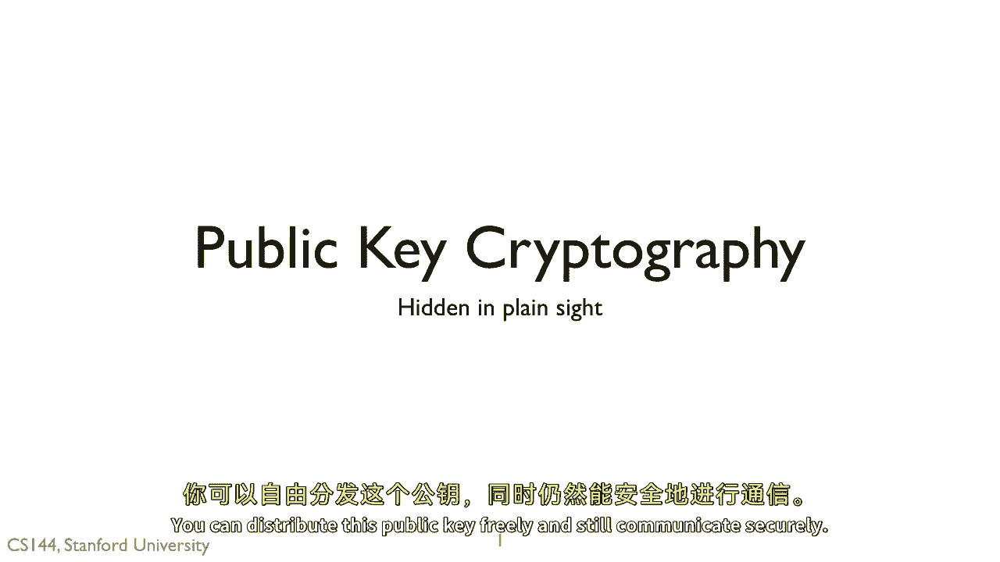
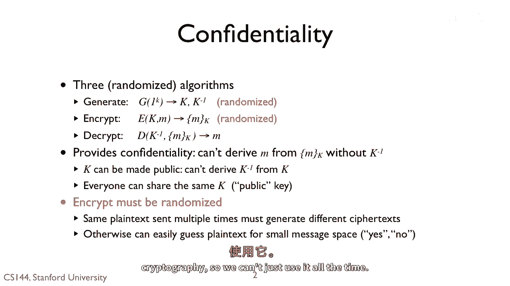
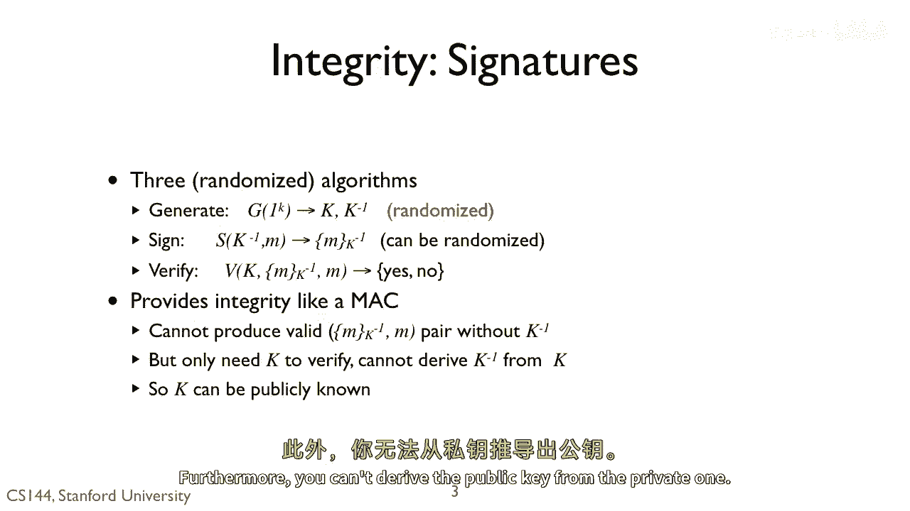
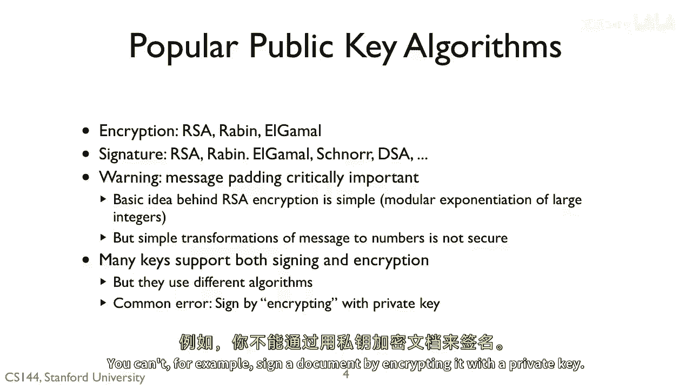
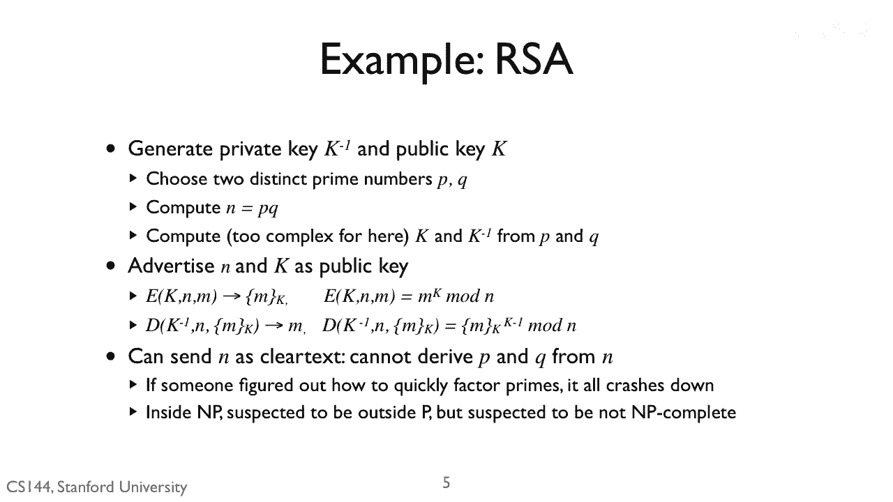
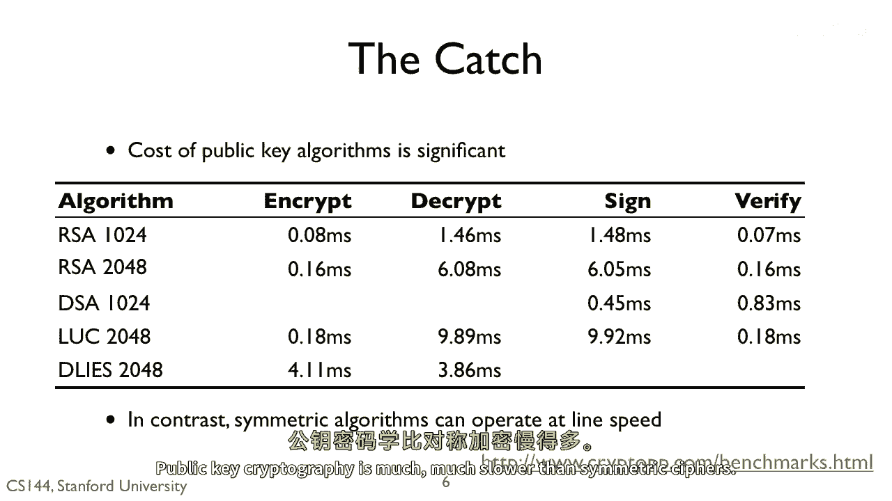
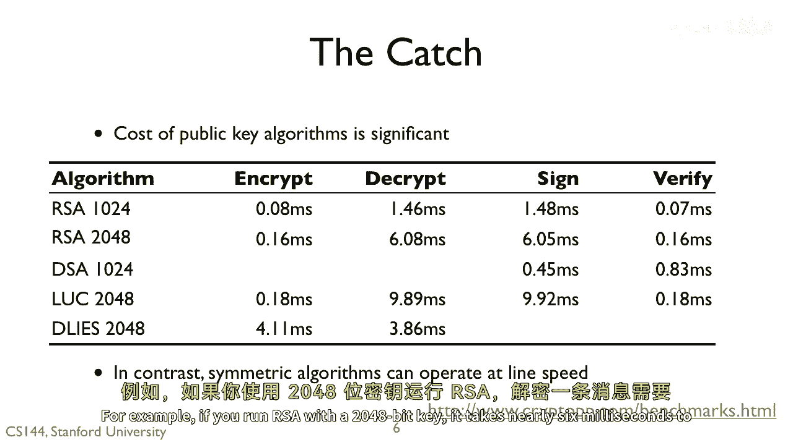
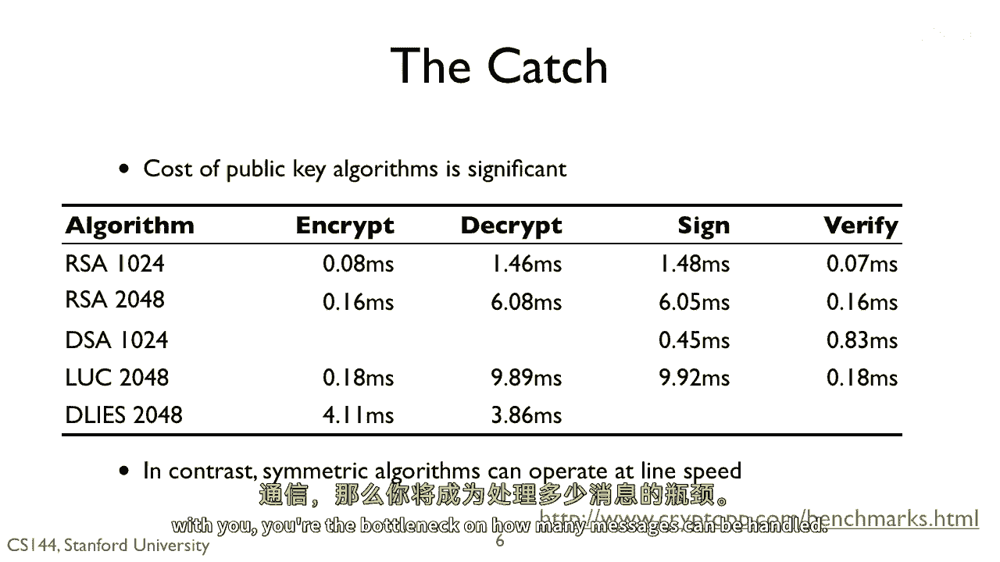
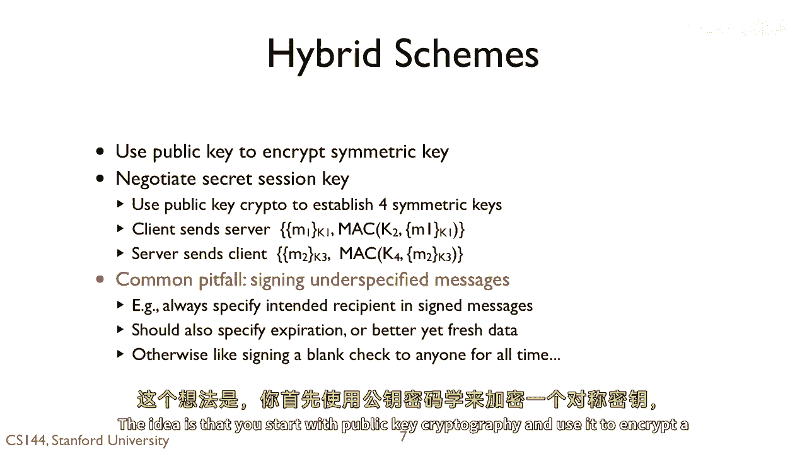
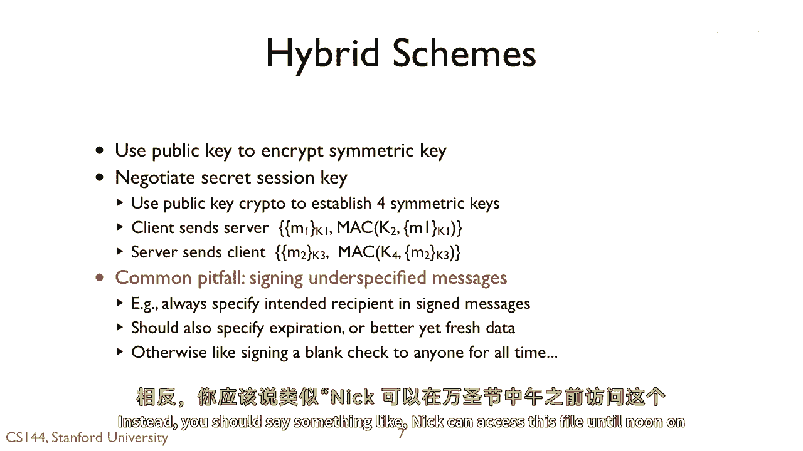

# 课程 P128：公钥密码学 🔐

在本节课中，我们将要学习公钥密码学的基本原理。公钥密码学是现代大多数安全系统的核心组成部分。我们将了解它与对称密码学的区别、其工作原理、主要算法以及实际应用中的优缺点。

---

## 概述

公钥密码学与对称密码学不同，它使用一对密钥：一个可以公开的公钥和一个必须保密的私钥。公钥可以自由分发，而私钥则由所有者秘密保存。这种机制使得无需预先共享密钥即可实现安全通信和数据完整性验证。

---

## 公钥密码学如何工作？🔑

与对称密码学类似，公钥密码系统也包含三个核心算法：**密钥生成**、**加密**和**解密**。

两者的主要区别在于两点。首先，密钥生成算法会生成两个密钥：一个公钥 **K** 和一个私钥 **K⁻¹**。加密时，使用公钥和明文来生成密文。解密时，则使用私钥和密文来恢复明文。

因此，如果你生成了密钥对，就可以自由分发公钥（这也是它名称的由来），并且确信只有拥有对应私钥的人才能解密用该公钥加密的信息。

然而，由于公钥会被重复使用多次，这意味着加密过程必须引入随机化。否则，发送相同明文的两方会产生相同的密文。如果处理的是短消息，攻击者就可能通过穷举所有可能的消息来破解。

例如，可以在加密前添加一些随机数据来生成密文。

这听起来很神奇：你可以生成两个密钥，一个公开，一个私有。拥有公钥的人可以发送数据，而只有拥有私钥的人才能解密。如果通信双方都拥有对方的公钥，那么我们似乎就不再需要对称密码学了。但实际情况并非完全如此，稍后我会解释原因。

---

## 公钥密码学与完整性：数字签名 ✍️

公钥密码学同样可以用于确保数据完整性，这通过一种称为**数字签名**的机制实现。

同样，它包含三个函数：**生成**（生成密钥对）、**签名**（使用私钥）和**验证**（使用公钥）。

签名像 MAC（消息认证码）一样提供完整性保证。没有私钥就无法为消息 **M** 生成有效的签名，但任何人都可以使用公钥来验证签名。此外，无法从私钥推导出公钥。

---

## 主要公钥算法 📊

目前存在多种公钥算法。用于加密的算法有 **RSA**、**Rabin** 和 **ElGamal**。用于签名的算法有 **RSA**、**Rabin**、**ElGamal** 和 **DSA**。

但公钥算法的工作原理与对称算法截然不同。以 RSA 为例，其基本思想非常简单：对大整数进行模幂运算。然而，将消息简单地转换为数字并进行变换并不一定是安全的，因此在使用时必须非常小心。我之前举过一个必须添加随机性的例子。

一般来说，最好使用经过测试的现有算法实现，而不是尝试自己重新实现。或者，你可以重新实现，但不要将其用于安全系统。对于许多此类算法，我们可以使用同一个密钥对进行加密和签名。尽管它们使用相同的密钥，但使用的算法却大不相同。例如，你不能通过用私钥加密文档来对其进行签名。

---

## RSA 算法浅析 🧮

我不会深入所有细节，但我想让你了解一下其中一种非常著名的算法——**RSA**——是如何工作的。RSA 以其共同创造者 Rivest、Shamir 和 Adleman 的名字命名，他们为此获得了计算机领域的最高奖项——图灵奖。我介绍 RSA 是因为它在概念上非常简单。

以下是 RSA 密钥生成和加解密的核心步骤：

1.  **密钥生成**：选择两个不同的、非常大的质数 **P** 和 **Q**。计算它们的乘积 **N = P * Q**。然后利用 **P** 和 **Q** 推导出公钥 **K** 和私钥 **K⁻¹**。将 **N** 和 **K** 作为公钥公布。
2.  **加密**：将消息 **M** 视为一个大数，计算 **C ≡ M^K (mod N)**，得到的 **C** 即为密文。
3.  **解密**：将密文 **C** 视为一个大数，计算 **M ≡ C^{K⁻¹} (mod N)**，即可恢复出原始明文 **M**。

私钥 **K⁻¹** 是从 **P** 和 **Q** 推导出来的。如果攻击者知道了 **P** 和 **Q**，他们就能生成私钥并破解系统。而从 **K** 无法推导出 **P** 和 **Q**。

同样，从 **N** 也无法推导出 **P** 和 **Q**。**N** 是两个质数的乘积，将 **N** 分解为 **P** 和 **Q** 在计算上是困难的。如果有人找到了快速分解的方法，那么整个 RSA 体系就会崩溃。可以想象，许多人投入了大量精力来研究分解两个质数乘积的确切难度。

对于那些了解计算复杂性的人来说，我们知道这个问题属于 **NP** 计算类。它被怀疑不属于 **P** 类，但也被怀疑不是 **NP 完全**问题。这意味着我们最好的猜测是，你无法在多项式时间内解决它，但它也不像旅行商问题那样是 NP 中最难的问题。

---

## 公钥密码学的瓶颈与混合方案 ⚡

公钥密码学看起来非常神奇。你可以生成两个密钥，公开分发其中一个，然后实现机密性、完整性和真实性。那么我们为什么还要使用对称密码学呢？这其中当然有一个“陷阱”。

公钥密码学的计算速度比对称密码慢得多。

对称密码可以达到千兆比特每秒的速率。而公钥系统的执行时间则在毫秒级别。例如，使用 2048 位密钥运行 RSA 解密一条消息需要近 6 毫秒。

请记住，拥有私钥的一方负责解密。因此，如果你将公钥广泛分发，让许多其他方都能与你通信，那么你自身就会成为处理消息数量的瓶颈。

这就是为什么**混合方案**在今天非常流行。

其核心思想是：首先使用公钥密码学来加密一个对称密钥。

或者，用它来交换一些信息（一个秘密的会话密钥），然后用这个会话密钥来生成对称密钥。你使用公钥密码学来引导安全会话并交换一个秘密，然后利用这个秘密进行效率高得多的对称密码学操作。如果你想看一个详细的例子，我将在关于 TLS 的视频中介绍。

---

## 使用公钥密码学的注意事项 ⚠️

人们在使用公钥密码学时容易陷入的一个大陷阱是：对未充分指定的消息进行签名。

例如，如果我签署一条消息，我应该在消息中指定接收者是谁并给出有效期。否则，有人就可以简单地重放这条消息。由于我的公钥不会经常更改，只要人们还在使用我的公钥，签名消息就“有效”。这里的“有效”指的是它能通过验证函数。

因此，你需要在应用层面限制其使用。否则，一条写着“可以访问此文件”的签名消息可能会被攻击者获取并利用。相反，你应该签署类似“Nick 可以在万圣节中午之前访问此文件”这样的消息。

---

## 总结

本节课中，我们一起学习了公钥密码学的基础知识。我们了解了公钥和私钥的概念、它与对称密码学的区别，以及如何用于加密和数字签名。我们简要探讨了 RSA 算法的工作原理，并认识到公钥密码学虽然功能强大，但计算开销较大，因此在实际中常与对称密码学结合形成混合加密方案。最后，我们指出了在使用数字签名时需要注意消息规范，以防止重放攻击。