# P129：p128 8-9 Certificates - 加加zero - BV1qotgeXE8D

 There's one last security primitive that's very common today。

 Use it every time you establish an SSH or HTTP session。 There's certificates。

 Public key cryptography lets us verify that someone with。

 a private key associated with a public key signed a document。

 But how do we know what the right public key is？ How do we know that www。ebay。com has a public key？

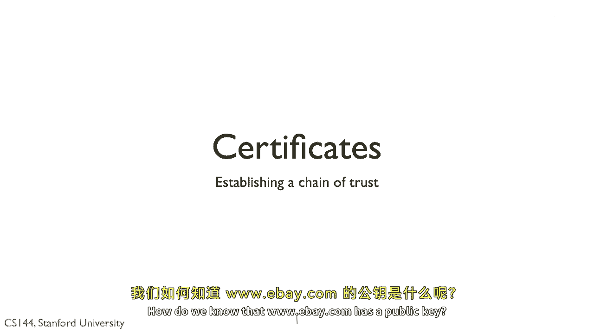

 The answer is certificates。 So let's say we want to securely communicate with a server such， as www。

amazon。com。 Now using public key cryptography， if I know www。amazon。com's， public key。

 then I can communicate securely with that server。 I can verify that www。amazon。

com has a private key associated， with a public key I'm using。

 We can then use public key encryption to exchange symmetric， keys all as well。

 But there's a missing step here。 How do I get the server's public key？ Do I find it on a web page？

 If I just found it somewhere random or insecure， then how。

 can I be sure it's really that server's public key and not。

 an adversary pretending to be that server？

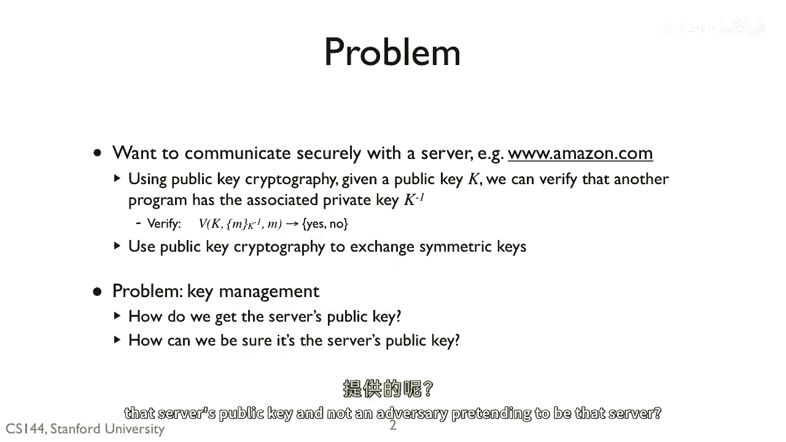

 For example， imagine this very simple attack。 I want to communicate with a server。

 so I ask it for its， public key。 It gives me the key。

 Then I can verify that it has the associated private key。

 This is completely open to a man in the middle attack。

 An attacker could pretend to be the server and give me its， own public key。

 I have no way of telling whose key is right。 The attacker looks just like the server。

 except that it has a， different key。 The attacker then can open up a connection to the server and。

 pretend to be you。 It sees everything you send since you're communicating with it。

 And it forced along to that server。 It could rewrite or suppress anything you send， or even。

 in certain new traffic。 You'll be like passwords， all kinds of stuff。

 So what you need is some way to be able to receive the public， key for www。amazon。com。

 And be reasonably sure it's actually www。amazon。com。 In the best case。

 I'd have someone I trust tell me what， www。amazon。com's key is。

 That's exactly what a certificate does。

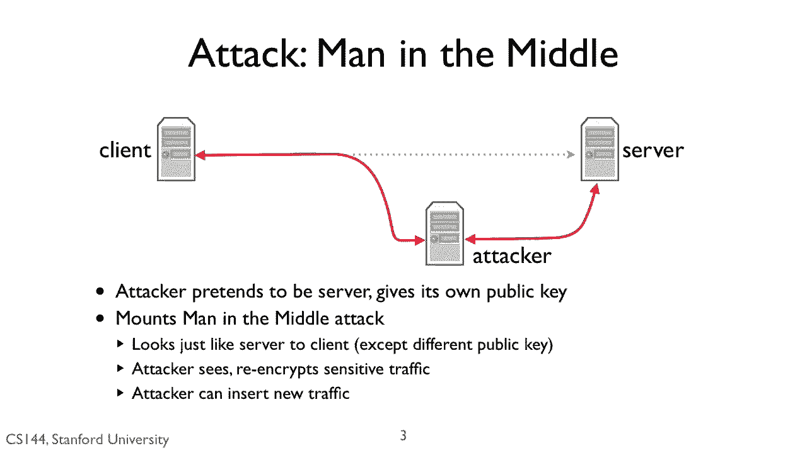

 Abstractly， a certificate is a digital document just to chuck， a byte that binds a name to a value。

 This document is signed by the private key， by a private key， K inverse， K1 inverse。

 If I already have the public key， K1， then I can verify this， was signed with the right public。

 private key。 If I trust the party who has K1 inverse， then I can trust， their claim， the name。

 for example， a host name， has the， public key， K2。 I can use K2 when communicating with N。

 In this way， I， establish a chain of trust。 If I start with the public key at one party that I trust。

 then this party can give me public keys for other parties。

 Those parties could give me further public keys。

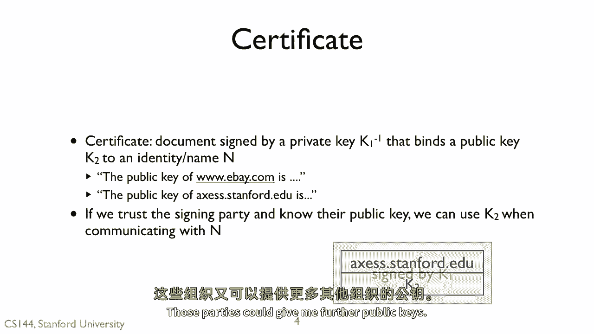

 If you browse the web a lot， you've probably seen an error。

 message like this one come up many times。 This one is for Firefox。

 It tells you that you can't trust that the site is secure。 Why？ Generally。

 you see this error because there's a mistake， in certificates。 For example， the host at Stanford。

 my research group， runs， sing。stanford。edu。 It has a few other names， such as tinywes。stanford。edu。

 Stanford provided me with a certificate that says that。

 these names are associated with the server's public key。 But rather than name to Stanford--。

 but if I added a name to Stanford's DNS， such as bad， saying that's Stanford。edu。

 then this certificate wouldn't， have that name。 If you tried to connect to bad saying that's。

 Stanford。edu over HTTPS， you'd receive an error like this one。

 because the certificate Stanford gave me， doesn't cover that name。

 So you often run into this error when， someone has aliases for a host or is issue。

 certificate for an old name and has an update of it。

 But it could be an adversary running a different server， and trying to convince you it's trustable。

 Generally speaking， seeing this error， means someone has misconfigured their system for security。

 When I ever see-- see， whenever I see an error like this， I never say， OK。

 even if it's just a little mistake， given how subtle and hard security is。

 now obvious this mistake is， I don't trust。 I don't want to trust this server。

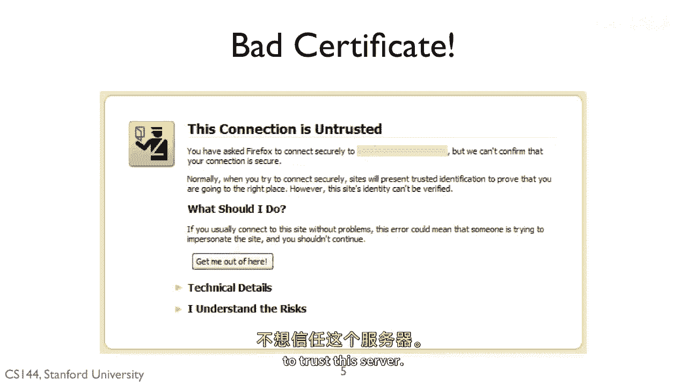

 And so this is how things work today。 Everyone trusts a few signing authorities。

 and knows their public keys。 These keys are hard baked into your browser or operating， system。

 Good reason to check your program's for integrity。 Here。

 let's take a look at the keys installed on my Mac。

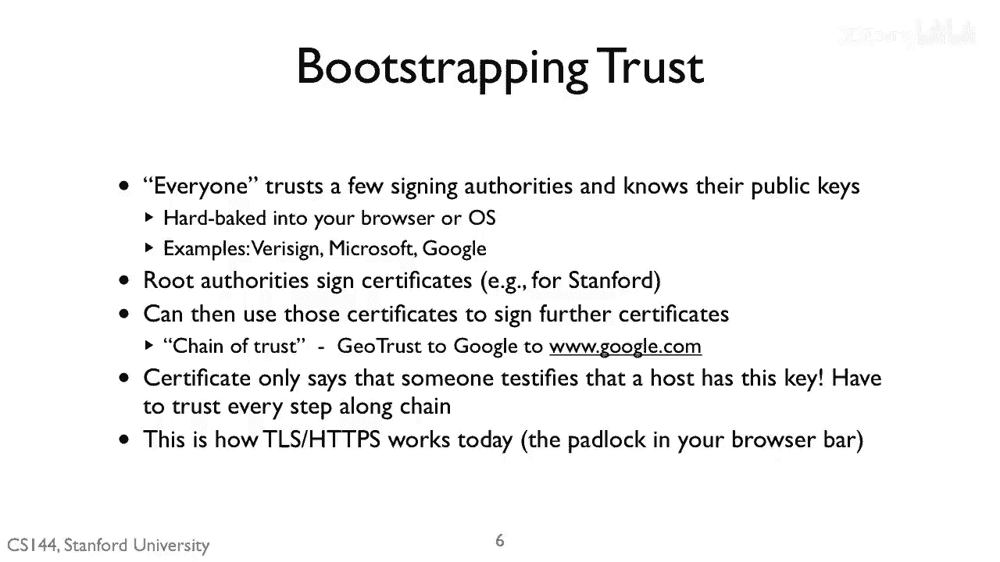

 I open up applications， utilities， keychain access。 And you can see all these different keys that。

 are pre-installed on my back-and-tush。 These are root keys which they have already been installed。

 And so these are public keys that I can trust。 There they are。

 The public key is hard-baking to the operating system。 You can see Veracine down here and up here。

 you can see Apple。 These root authorities can then sign keys for other parties。 For example。

 let's go to Google。 I'm accessing Google over HTTPS。

 I've also installed a plugin for Firefox called CypherFox， that lets me look at certificate details。

 I can click on the lock and now see the certificate。 You can see that www。google。

com is signed by the Google。

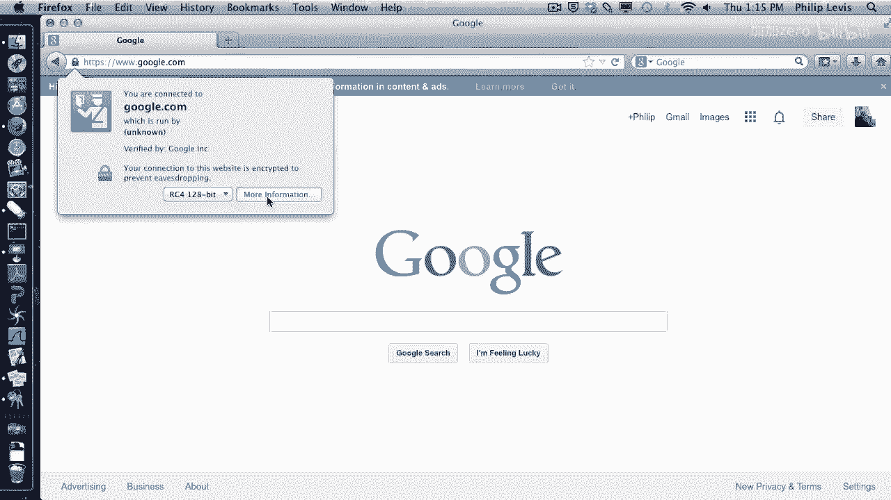

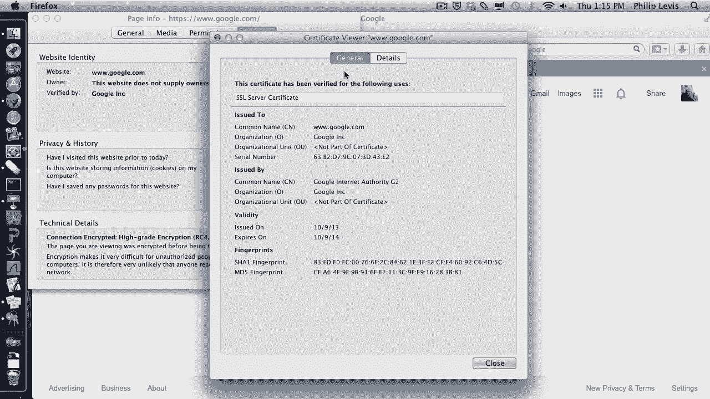

 Internet Authority， which is in turn signed by the Geotrust。

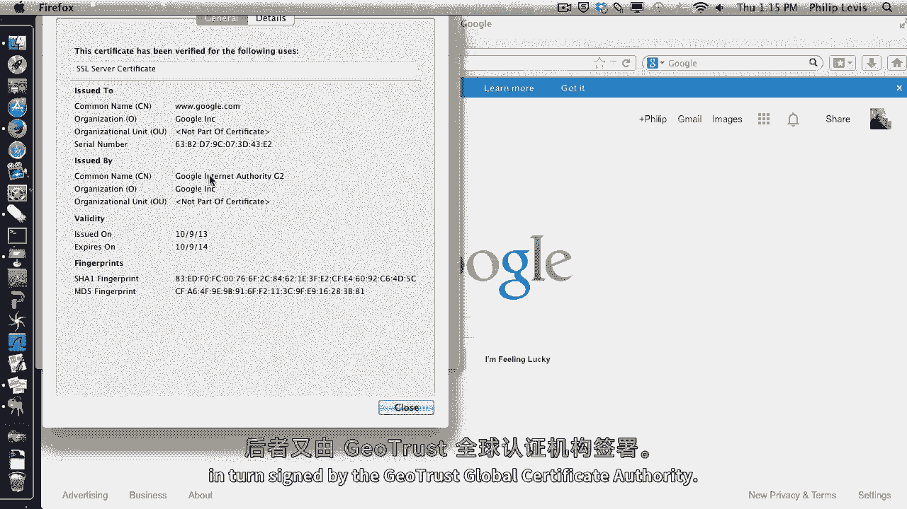

 Global Certificate Authority。 So here's the certificate hierarchy。

 Signing authorities are often called CA's for certificate， authorities。

 But realize that all a certificate says。

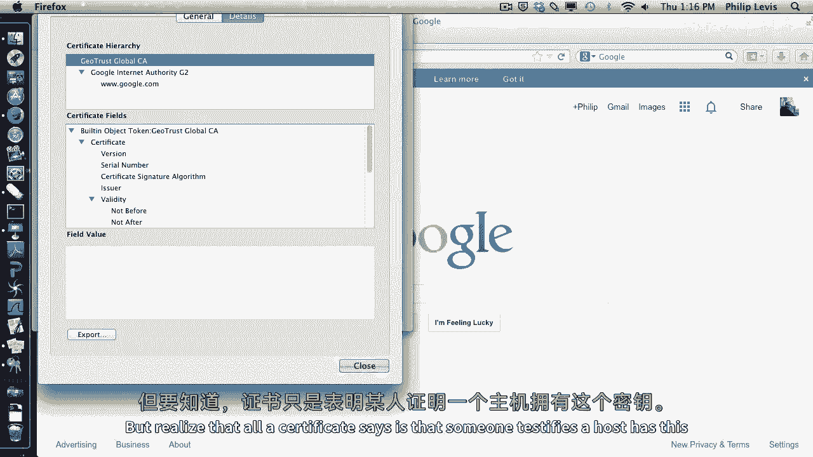

 is that someone testifies a host has this key。 If there's an adversary along the certificate chain。

 then you could be fooled。 It turns out there are actually many different kinds of。

 certificates for this reason。 Some， such as the one I have on the same。stanford。edu。

 doesn't require much more than filling out a web form。

 Others require paper validation and possibly meeting， someone in person。 So this is how TLS。

 ACPS work today when you see the padlock， on your browser bar。

 You connect to a server and it provides a certificate， with its public key。

 It says if the certificate chain ends in a root certificate， authority that you trust。

 that is already have the public， key for a suit and verify its signature， then you trust the。

 key in the certificate and encrypt date with the server。

 I'll explain the details of this in the TLS video。

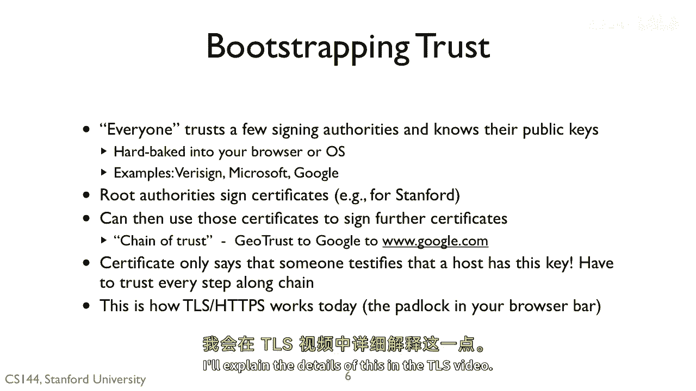

 [ Pause ]。