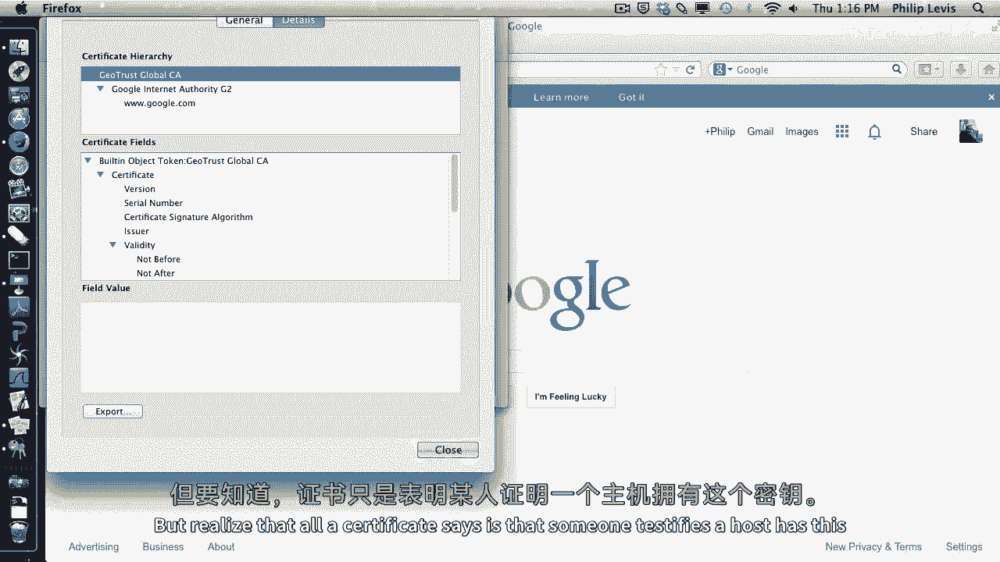
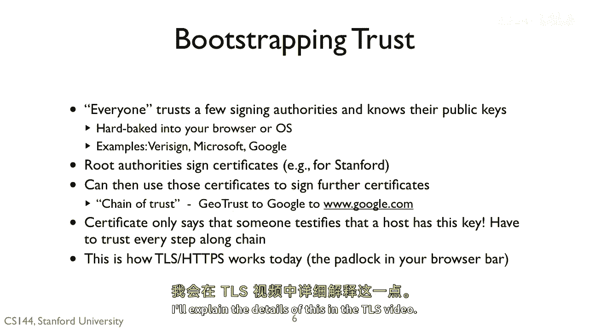

# 课程 P129：证书 🔐

在本节课中，我们将要学习一个当今非常普遍且至关重要的安全原语——证书。每当你建立 SSH 或 HTTPS 会话时，都会用到它。我们将了解证书如何解决公钥分发中的信任问题，以及它们如何构成现代网络安全通信的基础。

## 公钥分发的挑战 🔑

上一节我们介绍了公钥密码学，它允许我们验证持有与公钥关联的私钥的人签署了某个文档。

但这里存在一个关键问题：我们如何知道正确的公钥是什么？我们如何知道 `www.ebay.com` 拥有哪个公钥？

答案是使用证书。假设我们想与一个服务器（例如 `www.amazon.com`）进行安全通信。如果我知道 `www.amazon.com` 的公钥，那么我就可以使用公钥密码学与该服务器安全通信，并验证它确实拥有与我所用公钥关联的私钥。我们还可以使用公钥加密来交换对称密钥。

然而，这里缺少了一个步骤：我如何获取服务器的公钥？是从网页上找到的吗？如果我从不安全或随机的来源获取它，我如何确定这真的是该服务器的公钥，而不是一个冒充该服务器的攻击者的公钥？

## 中间人攻击的威胁 🕵️

上一节我们提到了信任问题，本节中我们来看看一个具体的威胁场景。

例如，想象一个非常简单的攻击。我想与一个服务器通信，所以我向它请求其公钥。它给了我一个密钥，然后我可以验证它是否拥有关联的私钥。但这完全对中间人攻击开放。

攻击者可以冒充服务器，并给我它自己的公钥。我无法分辨哪个密钥是正确的。攻击者看起来就像服务器，只是它拥有一个不同的密钥。然后，攻击者可以打开一个到真实服务器的连接，并冒充你。由于你正在与攻击者通信，它能看到你发送的一切，并将其转发给真实服务器。它可以重写、拦截你发送的任何信息，甚至注入新的流量，例如密码等敏感数据。

因此，你需要一种方式，能够接收 `www.amazon.com` 的公钥，并有理由确信它确实是 `www.amazon.com` 的。在理想情况下，最好有一个我信任的人告诉我 `www.amazon.com` 的密钥是什么。这正是证书的作用。

## 证书：建立信任链 📜

上一节我们看到了中间人攻击的风险，本节中我们来了解证书如何解决这个问题。

抽象地说，证书是一个数字文档（本质上是一串字节），它将一个名称绑定到一个值（通常是公钥）。这个文档由一个私钥（记作 `K1_inverse`）签名。

如果我已拥有对应的公钥 `K1`，那么我就可以验证这个文档确实是由正确的私钥签名的。如果我信任持有 `K1_inverse` 私钥的一方，那么我就可以信任他们的声明：某个名称（例如主机名）拥有公钥 `K2`。这样，在与该名称通信时，我就可以使用 `K2`。

通过这种方式，我建立了一条信任链。如果我从一个我信任的方的公钥开始，那么这个方可以给我其他方的公钥，而这些方又可以给我更多方的公钥。

## 证书错误与配置问题 ⚠️

如果你经常浏览网页，可能多次看到过类似这样的错误信息（以 Firefox 为例）。它告诉你无法信任该站点的安全性。

通常，你看到这个错误是因为证书存在问题。例如，我在斯坦福的研究小组运行着 `sing.stanford.edu` 服务器，它还有其他几个别名，如 `tinywes.stanford.edu`。斯坦福为我提供了一个证书，声明这些名称与服务器的公钥关联。但如果我向斯坦福的 DNS 添加了一个新名称（例如 `bad.stanford.edu`），那么这个证书就不会包含该名称。如果你尝试通过 HTTPS 连接到 `bad.stanford.edu`，就会收到这样的错误，因为斯坦福给我的证书没有覆盖那个名称。

因此，你经常会在以下情况遇到此错误：
*   主机有别名，但证书未包含。
*   证书是为旧名称颁发的，而名称已更新。

当然，这也可能是一个攻击者在运行不同的服务器，并试图让你相信它是可信的。一般来说，看到这个错误意味着有人在安全配置上出现了失误。鉴于安全的微妙性和复杂性，即使这可能只是一个小错误，看到此类错误时也应保持警惕，不要轻易信任该服务器。

## 根证书与信任锚 🏛️

上一节我们讨论了证书错误，本节中我们来看看信任体系是如何实际运作的。

当今的运作方式是，每个人都信任少数几个签名机构（证书颁发机构，CA），并知道它们的公钥。这些公钥被硬编码到你的浏览器或操作系统中。这也是检查程序完整性的一个重要原因。

以下是我 Mac 上安装的密钥示例（通过“应用程序”->“实用工具”->“钥匙串访问”查看）。你可以看到许多预先安装的不同密钥。这些都是根密钥，它们的公钥已被硬编码到操作系统中，因此是我可以信任的。例如，这里有 VeriSign 和 Apple 等根机构。

这些根机构可以为其他方签署密钥。例如，当我通过 HTTPS 访问 Google 时，可以看到 `www.google.com` 的证书是由“Google Internet Authority”签署的，而后者又由“Geotrust Global Certificate Authority”签署。这就是证书的层级结构。

签名机构通常被称为 CA。但需要认识到，证书所声明的全部内容就是：某人证明某个主机拥有这个密钥。如果证书链中的任何一方是攻击者，那么你可能会被欺骗。

## 证书的类型与总结 📝

由于上述信任链的风险，实际上存在许多不同类型的证书。有些证书（例如我用于 `sing.stanford.edu` 的证书）只需要填写一个网页表格即可获得。而其他证书则需要纸质文件验证，甚至可能需要当面会晤。

这就是当今 TLS/SSL（当你看到浏览器地址栏上的锁形图标时）的工作原理：
1.  你连接到一个服务器。
2.  服务器提供一个包含其公钥的证书。
3.  如果该证书链终结于一个你信任的根证书颁发机构（即你已经拥有其公钥并能验证其签名），那么你就信任证书中的密钥，并可以开始与服务器进行加密通信。

关于 TLS 的具体细节，我们将在后续视频中详细解释。

---

**本节课中我们一起学习了：**
*   **证书** 的核心作用：将一个名称（如域名）绑定到一个公钥，并由可信方签名，从而解决公钥分发中的信任问题。
*   面临的**挑战**：中间人攻击如何利用公钥分发的不确定性。
*   **信任链** 的建立：从硬编码在系统中的根证书（CA 公钥）开始，逐级验证和信任。
*   常见的**证书错误** 及其含义，提醒我们注意安全配置。
*   现代网络（HTTPS）中证书的**实际应用** 流程。

证书是构建安全网络通信（如 HTTPS、SSH）的基石，它通过数字签名和预先建立的信任关系，确保我们是在与正确的对方进行通信。