# P13：p12 1-9a  IPv4 addresses - 加加zero - BV1qotgeXE8D

"互联网协议允许两台计算机在一个构建起来的网络上交换消息"，"出自许多不同的链路层"，它通过地址来实现，"一个IP数据包有一个源地址和一个目的地址"，路雪，"决定转发哪个链接"。

"基于宠物包裹目的地地址的包"，"让我们详细看看IP版本四地址的格式"。

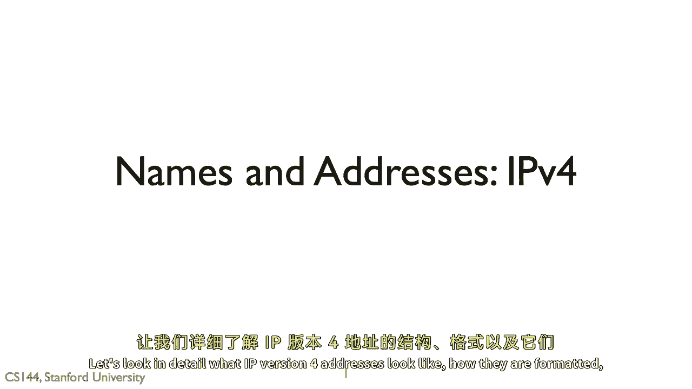

"它们如何格式化和如何分配"，"互联网协议的原始目标是将许多不同的网络连接在一起"。

这需要工作，协议需要一个方式，以便引用不在其网络上的计算机，并且是唯一的，所以，一个在ibm网络上的计算机，和一个通过串行线连接到路由器的计算机可以相互交谈，今天需要一种方式，以便相互地址，我，P，V。

四个地址稍微复杂一些，它们并不是完全独特的，只适用于一些特殊的情况使用，但是，让我们现在就假设它们是独特的。

一个互联网协议版本四地址是三个，两比特长，这三个两比特经常被写成四个八位，那就是四个，以a b c d的形式表示的八位值，这里有三个例子，一，七十一，六十四，六十四，六十四，一，二，八，三十，七十，六。

八十，两，和十二。

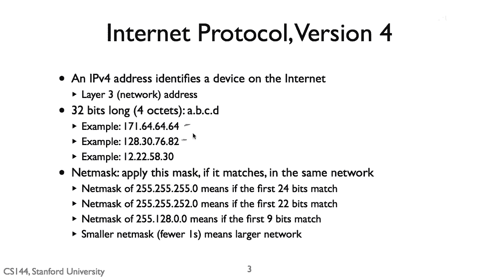

二十二，五十八三十，通过ip连接的所有设备。

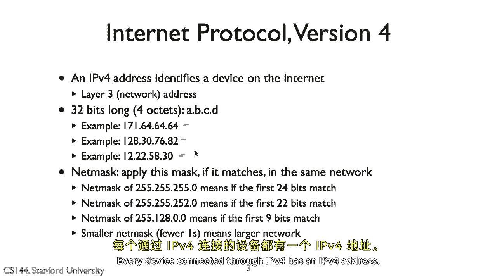

V四有一个i，P，V，四个地址，ip层将目的地地址为这个地址的包交付给那个设备。

除了地址之外，一个设备通常还有有一个被称为网掩码的东西，网掩码告诉你哪些ip地址在本地链路上是本地的。

在同一个网络中，并且哪些需要通过ip路由器，例如，想象一下，一台笔记本电脑在一个无线网络中。

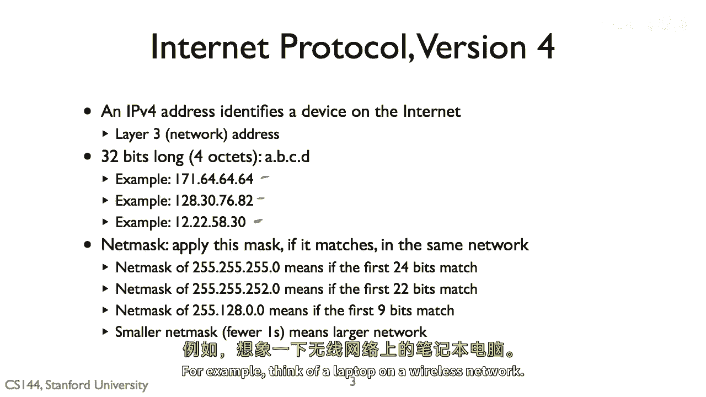

为了将数据包发送到无线网络中的其他设备，你不需要经过ip路由器。

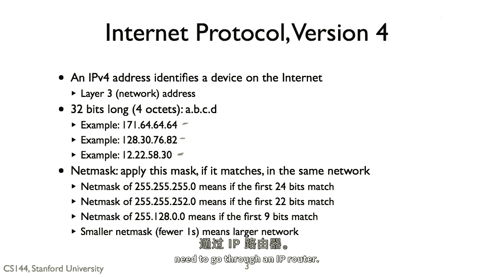

你可以，理论上只需要直接将包直接发送到其他设备，因为它在同一个无线网络中，子网掩码被写成一连串的一连串的1。

从最显著的位开始，一个二五子网掩码，五，二，五，五，二，五，五十零，例如，意味着前三个八位都是一一到第八的二进制数，减一等于二百五十五。

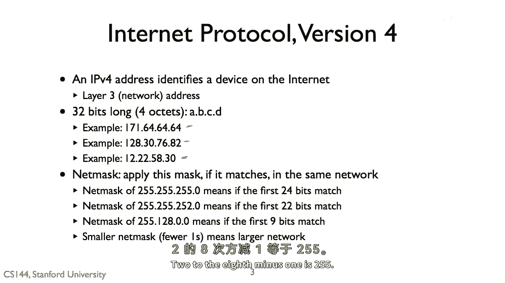

并且最后一个八位是零，这意味着一个IP地址，它的前三个八位。

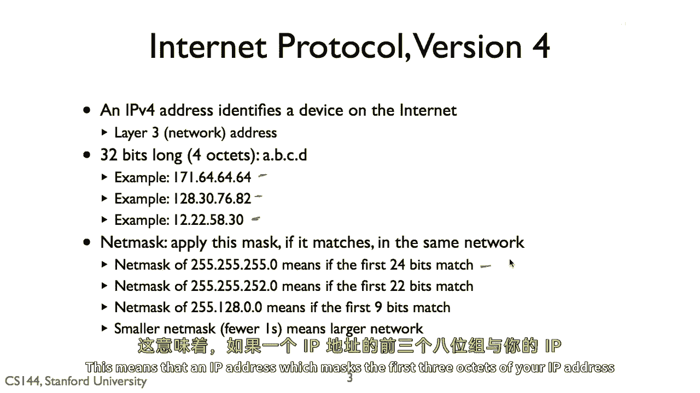

你IP地址的二十四位是在同一个网络中。

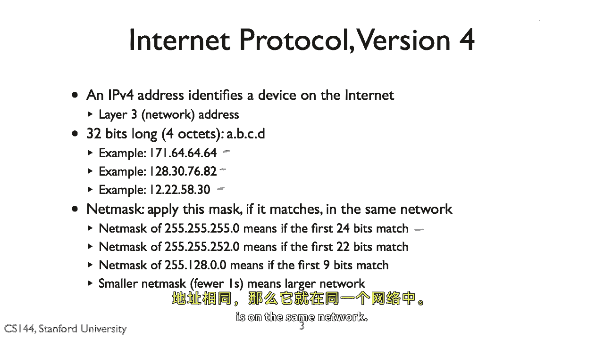

一个网掩码为二五五二五五二五五二五二零，意味着网掩码是二二位长。

当两个五五幺二八零时，零是一个九位网络质量，你可以通过取二进制位，和他们的地址与网络掩码来确定两台电脑是否在同一网络。

如果得到的地址相等，它们处于同一网络，让我们看看我的电脑上它是什么样子的。

我打开终端并使用i f config程序，我的电脑通过wi fi连接到互联网。

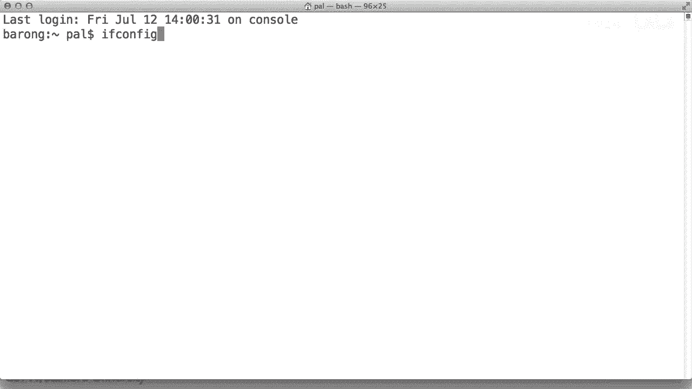

这正好是名为ian one的链接，如果我们查看关于某个的信息。

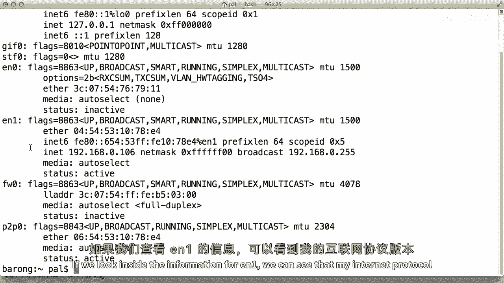

我们可以看到我为艺术地址分配的互联网协议版本是一九二一六八。

零一零六，我的网掩码是零 x f f f f f f 零 零。

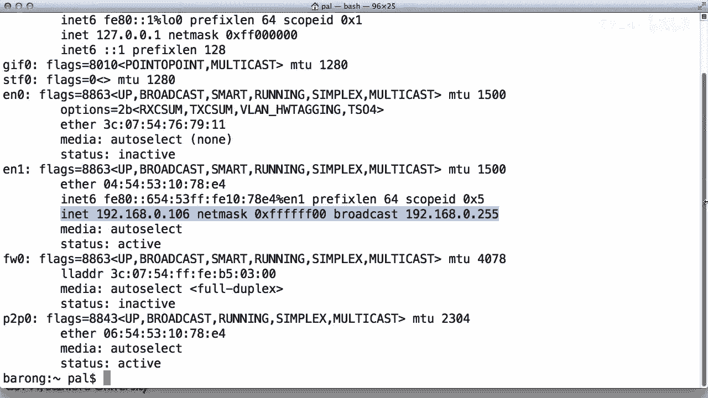

这是用十六进制表示的二，二，五，五，二，五，五，二，五，五到零。

这意思是如果我向以一九开头的地址发送IP包，二，一，六，八零。

我应该直接发送，但如果它不以一九开头，二，一，六，八零。

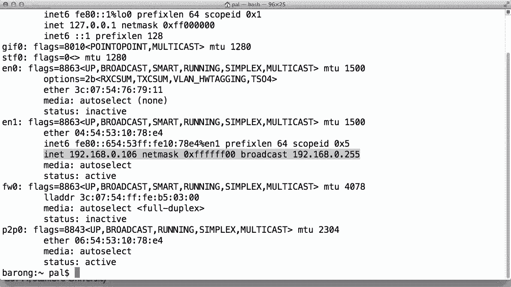