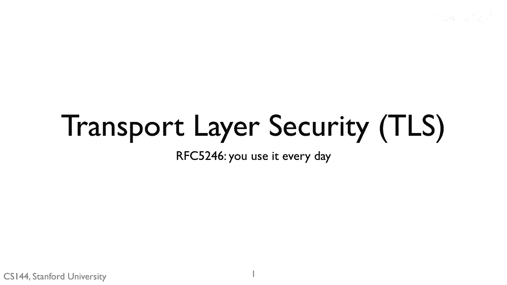
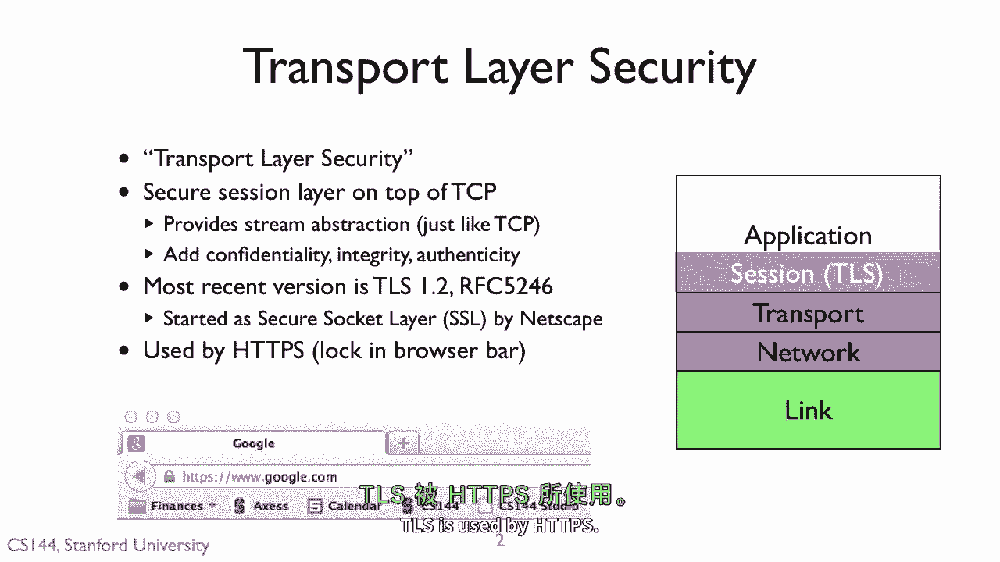
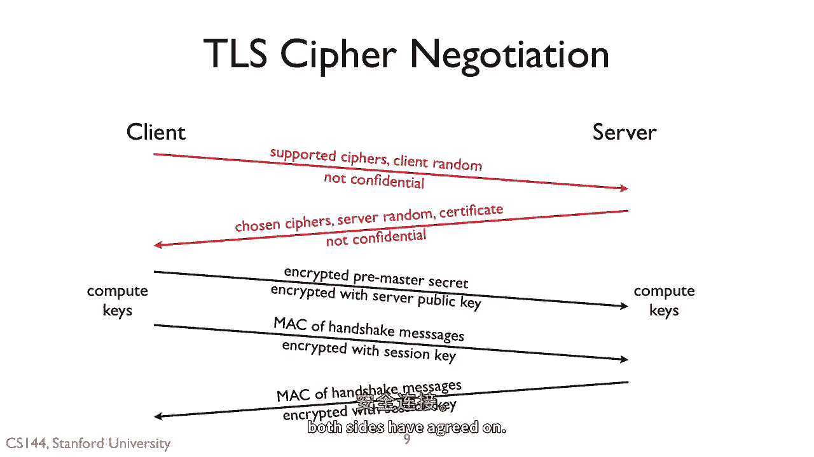
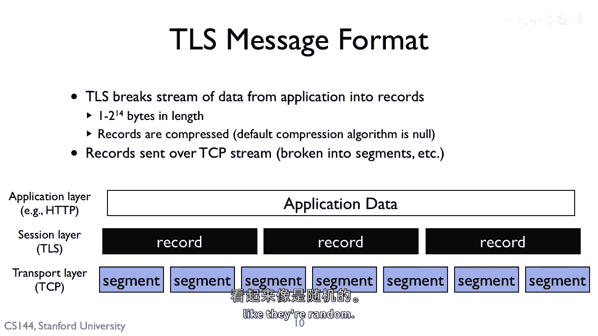
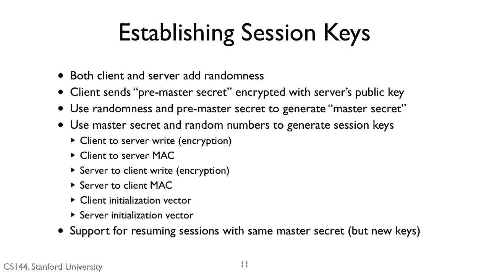
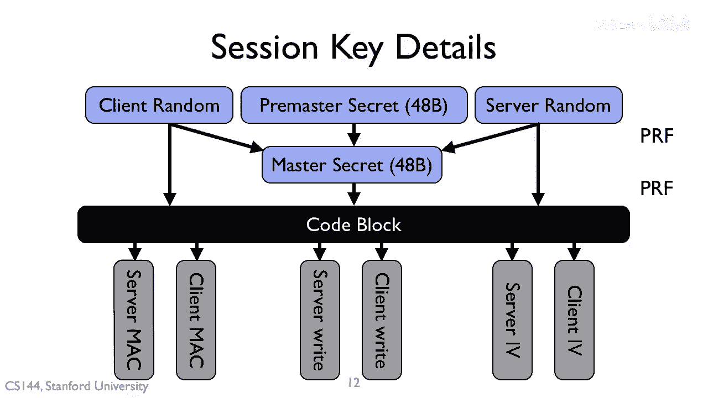

# 课程 P130：传输层安全 (TLS) 详解 🛡️



在本节课中，我们将要学习传输层安全 (TLS) 的核心概念和工作原理。TLS 是 HTTPS 协议的基础，为网络通信提供机密性、完整性和真实性保障。

## TLS 概述

传输层安全正如其名，它在传输层为应用程序之间的通信提供安全保障。TLS 是位于 TCP 之上的会话层协议。



它提供了类似 TCP 的流抽象。因此，对于大多数应用程序而言，TLS 看起来就像一个双向的、可靠的字节流。但 TLS 为这个流增加了**机密性**、**完整性**和**真实性**。

正确使用 TLS 可以保护通信免受窃听、篡改和欺骗攻击。TLS 的最新版本是 1.2 版，由 RFC 5246 定义。TLS 最初由网景公司开发，名为安全套接字层 (SSL)。其版本演进顺序为：SSL 2.0、SSL 3.0、TLS 1.0、TLS 1.1，以及现在的 TLS 1.2。HTTPS 协议正是基于 TLS。

## TLS 使用的密码套件与密钥

TLS 支持多种可用的密码套件。在建立 TLS 会话的过程中，客户端和服务器需要协商四种独立的密码套件。

以下是协商的四种密码套件：
1.  用于**服务器认证**的密码套件（也可选用于客户端认证）。
2.  用于**交换对称密钥**的密码套件。
3.  用于**对称机密性**的密码套件。
4.  用于**对称完整性**的密码套件。

这些套件通过一个五步的会话启动协议进行协商。这一切都发生在 TCP 连接建立之后，因此这些消息是通过 TCP 发送的。

## TLS 会话建立过程

上一节我们介绍了 TLS 使用的密码套件，本节中我们来看看它们是如何通过握手协议协商并建立安全连接的。

以下是 TLS 会话建立的五个步骤：
1.  **客户端问候**：客户端发送其支持的密码套件列表和一个它生成的随机数。此步骤以明文发送。
2.  **服务器问候**：服务器响应选定的密码套件、它自己的随机数以及包含其公钥的证书。此步骤也以明文发送。
3.  **预主密钥交换**：客户端将所谓的“预主密钥”用服务器的公钥加密后发送给服务器。客户端和服务器使用这个预主密钥以及之前明文交换的两个随机数，计算出会话所需的密钥。
4.  **客户端完成**：客户端发送一个“完成”消息，该消息使用从服务器随机数、客户端随机数和预主密钥生成的对称密钥进行加密和认证。此消息包含握手消息的消息认证码 (MAC)，以确保双方看到的消息一致。
5.  **服务器完成**：服务器发送一个“完成”消息，其安全保护方式与客户端的完成消息类似，同样包含握手消息的 MAC。

对握手消息进行 MAC 计算，使得 TLS 能够抵御试图迫使双方选择不同密码套件的攻击者。由于前两个步骤未受保护，既无机密性也无完整性，攻击者可能进行中间人攻击以尝试更改提议和选定的密码套件。对握手消息进行 MAC 计算可以让双方检测到此类攻击。至此，双方已建立一个使用协商好的对称密码套件保护的安全连接。

## TLS 记录协议

在建立了安全连接之后，TLS 需要处理应用层数据。为了提供完整性，TLS 需要将应用数据分割成可以附加消息认证码的数据块。



TLS 将应用数据流分割成**记录**。记录中包含数据长度和 MAC。这些记录使用选定的密码套件和密钥进行加密，然后通过 TCP 发送。在 TCP 层，这些数据表现为数据流，TCP 再将其分割成段。

记录可能远大于 TCP 段，因此单个记录可能被分割成多个段，记录边界和段边界可能不对齐。

TLS 的特性之一包括压缩。例如，如果配置 TLS 仅提供完整性而不提供机密性，那么发送的就是明文。这些文本通常可压缩性很高，压缩比可达近 10:1。因此可以配置 TLS 对数据进行压缩。请注意，如果启用了机密性，压缩仍然有益，因为加密后的比特流应呈现随机性。

## 会话密钥的生成

现在，让我们深入了解 TLS 如何建立其会话密钥。请记住，服务器和客户端都提供了随机数。这样，即使其中一方的随机数生成器不够好，最终结果仍然具有随机性。

客户端还发送了一个用服务器公钥加密的预主密钥。客户端和服务器结合这三部分信息，生成一个**主密钥**，然后从主密钥派生出会话密钥。



一旦计算出主密钥，客户端和服务器就会丢弃预主密钥。它们生成六个密钥，其长度由所使用的密码套件决定。

以下是生成的六种密钥：
*   用于加密**客户端到服务器**数据的密钥。
*   用于对**客户端到服务器**数据进行 MAC 计算的密钥。
*   用于加密**服务器到客户端**数据的密钥。
*   用于对**服务器到客户端**数据进行 MAC 计算的密钥。
*   客户端初始化向量（适用于需要它的密码）。
*   服务器初始化向量（适用于需要它的密码）。

拥有这个主密钥后，客户端和服务器可以通过选择新的随机数来重新生成新密钥。这意味着可以使用相同的主密钥恢复会话，但使用新的密钥。

## 密钥生成过程详解

上一节我们列出了生成的密钥类型，本节我们具体看看它们是如何从随机数中计算出来的。

整个过程如下图所示。客户端和服务器将客户端随机数、服务器随机数和预主密钥作为输入，传递给一个称为**伪随机函数** 的组件，该函数生成看似随机的比特流。这产生了 48 字节的随机比特，即主密钥。



TLS 将主密钥和两个随机值作为伪随机函数的输入，生成所有密钥所需的比特数。例如，如果 MAC 密钥是两个 512 位，加密密钥是两个 56 位，初始化向量是两个 128 位，那么就需要调用伪随机函数生成足够多的次数，以产生总计 1792 位的密钥材料。

密钥生成的核心公式可以概括为：
```
主密钥 = PRF(预主密钥, “主密钥”, 客户端随机数 + 服务器随机数)[0..47]
密钥块 = PRF(主密钥, “密钥扩展”, 服务器随机数 + 客户端随机数)
```
然后从`密钥块`中按顺序提取出所需长度的客户端 MAC 密钥、服务器 MAC 密钥、客户端加密密钥、服务器加密密钥等。

## 总结



本节课中我们一起学习了传输层安全 (TLS) 协议。我们了解了 TLS 如何通过在 TCP 之上建立安全会话，为应用数据流提供机密性、完整性和真实性。我们详细探讨了 TLS 握手协议，包括密码套件协商、基于随机数和预主密钥的密钥交换过程，以及用于验证握手完整性的 MAC 机制。此外，我们还学习了 TLS 记录协议如何封装数据，以及会话密钥是如何从主密钥派生出来的。掌握这些原理，是理解现代网络安全通信（如 HTTPS）的基础。