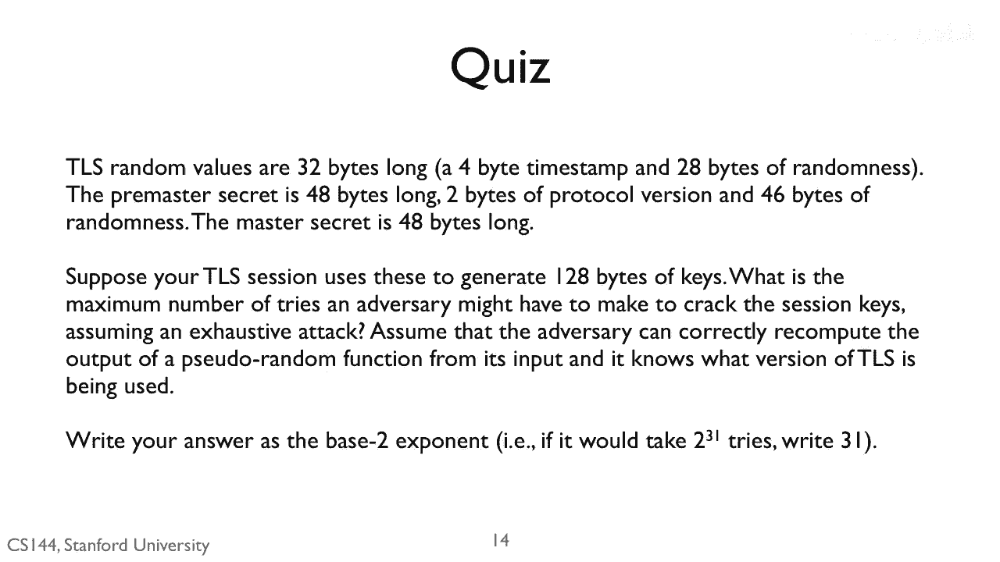
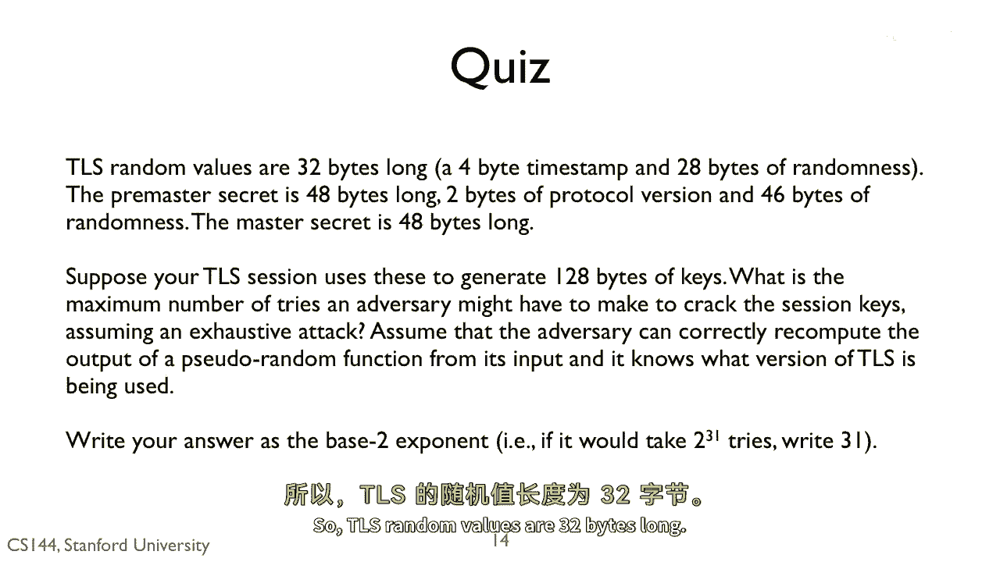
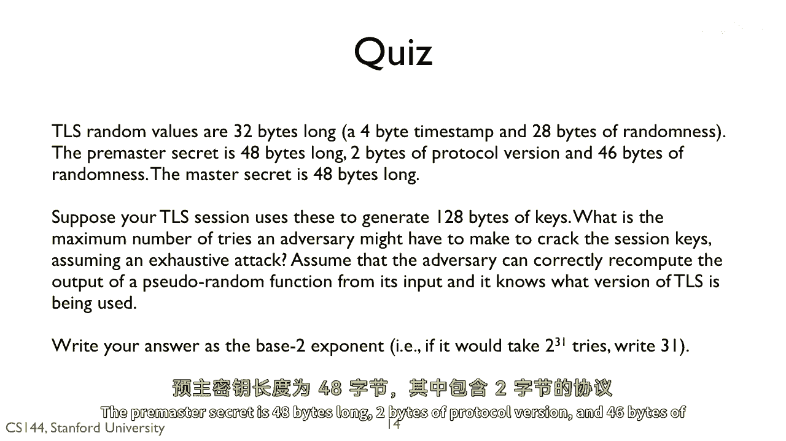
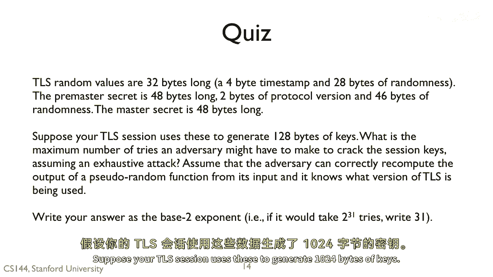
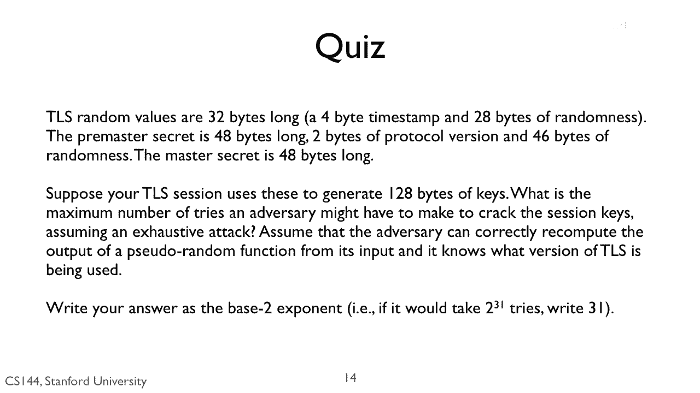
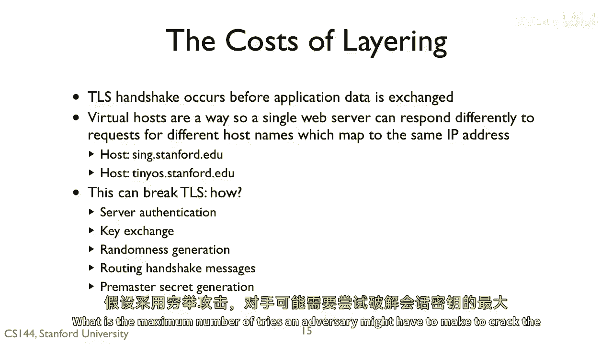
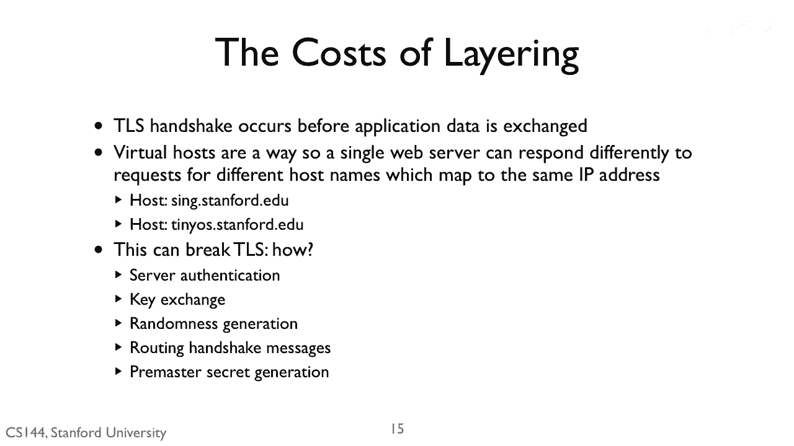

# P131：p130 8-10b TLS - 加加zero - BV1qotgeXE8D

 So TLS random values are 32 bytes long。

 There's a 4-byte timestamp and 28 bytes of randomness。 The pre-master secret is 48 bytes long。

 2 bytes of protocol version and 46 bytes of randomness。

 Suppose your TLS session uses these to generate 1，024 bytes of keys。

 What is the maximum number of tries an adversary might have to make。

 to crack the session keys is soon an exhaustive attack。

 Assume the adversary can correctly compute the output of a pseudo-random function from its input。

 So they can see the random function。 They can see the random values。

 They don't see the pre-master secret and they can compute the pseudo-random functions。

 Write your answers to the base two exponent。 For example， if it would take 2 to 31 tries。

 then write 31。

