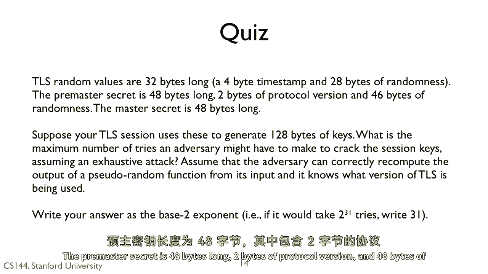
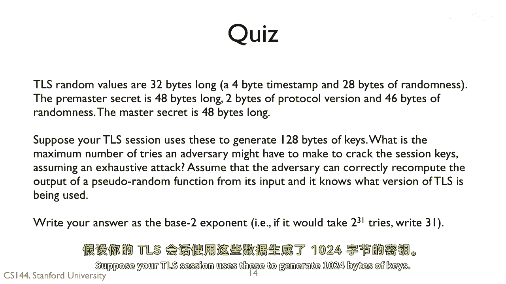
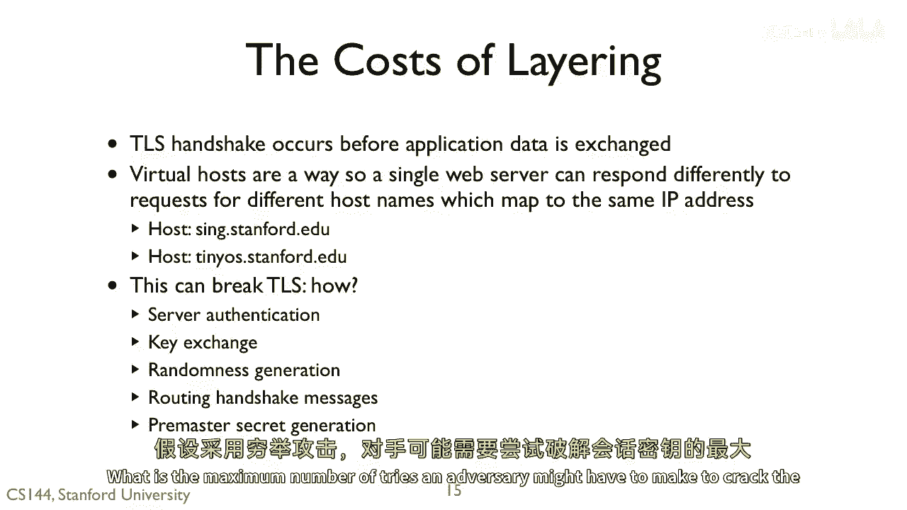
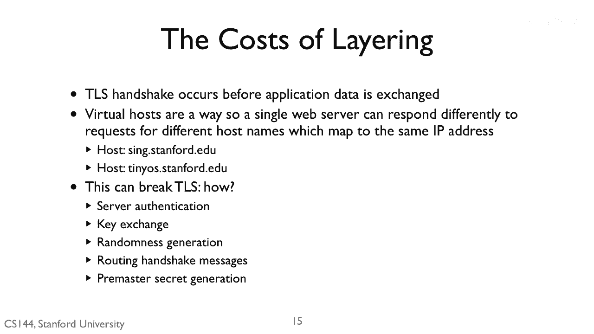

# 课程 P131：TLS 随机值与密钥生成 🔐

在本节课中，我们将学习 TLS 协议中随机值的构成，以及攻击者需要尝试多少次才能破解会话密钥。我们将分析客户端随机数、服务器随机数和预主密钥的字节长度，并计算在最坏情况下攻击者所需的尝试次数。

---

## TLS 随机值的构成

上一节我们介绍了 TLS 握手的基本流程，本节中我们来看看 TLS 协议中使用的几个关键随机值。

TLS 随机值的长度为 32 字节。

以下是其具体结构：
*   前 4 字节是一个时间戳。
*   后 28 字节是随机数。

预主密钥的长度为 48 字节。

以下是其具体结构：
*   前 2 字节是协议版本号。
*   后 46 字节是随机数。

---

## 密钥的生成与攻击场景

假设你的 TLS 会话使用上述随机值来生成 1024 字节的密钥。

那么，攻击者为了破解这些会话密钥，在最坏情况下（即穷举攻击）可能需要尝试的最大次数是多少？

我们假设攻击者能够根据输入正确计算出伪随机函数的输出。这意味着：
*   攻击者可以看到客户端和服务器随机值。
*   攻击者看不到预主密钥。
*   攻击者可以计算伪随机函数。

请以 2 的指数形式写出你的答案。例如，如果需要尝试 2^31 次，则写 31。

---

## 计算攻击尝试次数

根据以上信息，攻击者不知道的是预主密钥中那 46 字节的随机部分。因此，攻击者需要穷举所有可能的预主密钥。

预主密钥的随机部分长度为 46 字节。每字节有 256 种可能（2^8），因此总共有：
`(2^8)^46 = 2^(8*46) = 2^368` 种可能性。

所以，攻击者最多需要尝试 **2^368** 次。答案应写为 **368**。

---

## 总结

本节课中我们一起学习了 TLS 协议中随机值的结构，包括 32 字节的客户端/服务器随机数和 48 字节的预主密钥。我们分析了在最坏情况下，攻击者要破解由这些随机数生成的会话密钥，需要尝试的最大次数为 **2^368** 次，这体现了 TLS 协议通过足够长的随机数来保证密钥安全性的设计思想。