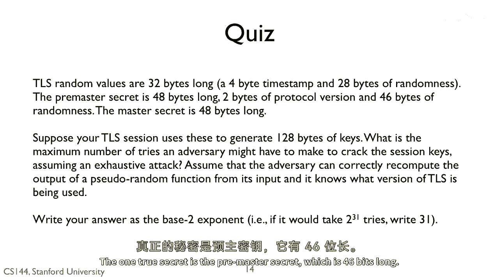

# P132：p131 8-10c TLS - 加加zero - BV1qotgeXE8D

 It will take it most to two to the 368 attempts。

 The two random values are known by an adversary because they're sent in clear text。

 The one true secret is the pre-master secret， which is 46 bits long。

 If the adversary can guess this value， then it can recompute the master secret using the。

 pseudorandom function。

 With the master secret， it can recompute the keys。 2 to 368 is enormous。

 [BLANK_AUDIO]。