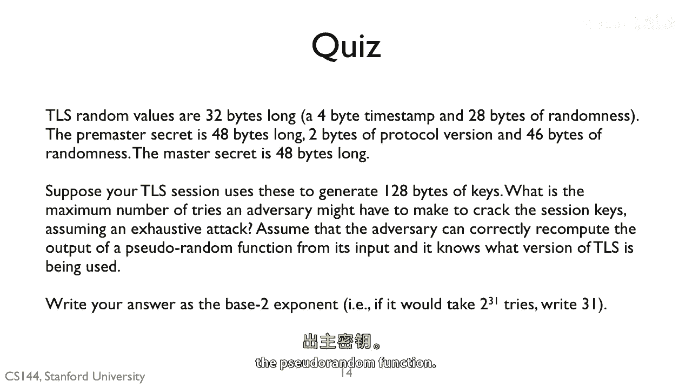

# 课程 P132：TLS 握手协议中的密钥交换与安全性 🔐

在本节课中，我们将学习 TLS 握手协议中密钥交换的核心机制，特别是预主密钥的作用及其安全性。我们将了解攻击者可能面临的挑战，以及为什么一个看似简单的秘密值能提供强大的安全保障。

---

上一节我们介绍了 TLS 握手的基本流程，本节中我们来看看握手过程中交换的随机值与最终密钥生成的关系。

握手过程中交换的两个随机值（客户端随机数和服务器随机数）对攻击者是已知的，因为它们以明文形式发送。

---

真正的秘密是预主密钥，其长度为 46 字节（即 368 比特）。

如果攻击者能够猜中这个值，那么它就可以利用伪随机函数，结合已知的两个随机值，重新计算出主密钥。

伪随机函数（PRF）的公式可以表示为：
`master_secret = PRF(pre_master_secret, "master secret", ClientHello.random + ServerHello.random)`

---

获得主密钥后，攻击者就能进一步计算出用于加密和完整性验证的会话密钥。

然而，猜中一个 368 比特长的预主密钥需要尝试的次数是 2 的 368 次方，这是一个极其巨大的数字。

---

以下是关于此安全机制的关键点总结：
*   **已知信息**：客户端与服务器的随机数在握手时明文传输，对攻击者可见。
*   **核心秘密**：预主密钥是真正的秘密，长度为 46 字节（368 比特）。
*   **密钥派生**：主密钥由预主密钥、两个随机数通过伪随机函数（PRF）计算得出。
*   **安全性基础**：攻击者若想破解，必须暴力猜测预主密钥。2^368 次尝试在计算上是不可行的，这构成了 TLS 协议安全性的基石。

---

本节课中我们一起学习了 TLS 握手协议中密钥交换的核心。我们明确了攻击者已知的信息（两个随机数）与真正的秘密（预主密钥）之间的区别，并理解了通过伪随机函数派生最终密钥的过程。最关键的是，我们认识到由于预主密钥的熵足够大（368 比特），对其进行暴力破解在计算上是不可行的，这正是 TLS 能够保护我们通信安全的关键所在。