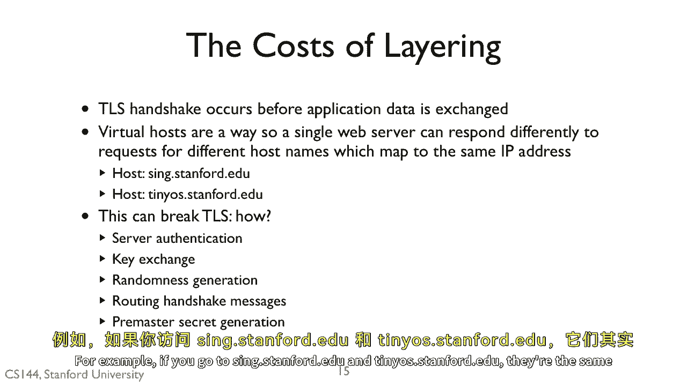

# 课程 P133：分层架构与TLS的挑战 🔐

在本节课中，我们将探讨计算机网络中的分层设计原则，并分析这种设计如何与TLS（传输层安全）协议产生交互，特别是在虚拟主机场景下所面临的挑战。

---

## 分层架构概述 📊

现在，让我们稍微转换一下思路，实际看一看分层架构及其运作方式。

分层是计算机网络设计中一个普遍且重要的原则。你已经多次见过它的应用。

以下是分层架构的主要优势：

*   **关注点分离**：每一层负责特定的功能。
*   **独立演进**：各层可以独立地进行更新和改进。
*   **易于适应**：能够更好地适应未来的新技术。

然而，分层设计有时也会带来阻碍。

---

## TLS与虚拟主机的冲突 ⚠️

上一节我们介绍了分层架构的好处，本节中我们来看看它在实际应用中可能引发的问题。TLS如今被广泛用于通过HTTPS进行安全的网络交易。

但常见的情况是，一台网络服务器通过一种称为**虚拟主机**的技术来运行多个网站。所有网站的域名都映射到该服务器的同一个IP地址。

客户端通过端口443（HTTPS）连接到所有这些网站。直到HTTP请求到达时，网络服务器进程才知道该请求是针对哪个站点的。HTTP请求中的 **`Host`** 头部字段会告知服务器这一信息。

例如，如果你访问 `sing.stanford.edu` 和 `tiny.us.stanford.edu`，它们指向同一台服务器。服务器可以配置一个路径，根据请求中的主机头来提供不同的网页。

这种机制可能会破坏TLS，使其无法完全正常工作。原因是什么？

以下是几个可能被破坏的环节：
*   它破坏了服务器身份验证吗？
*   它破坏了密钥交换吗？
*   它破坏了随机数生成吗？
*   它破坏了握手消息的路由吗？
*   它破坏了预主密钥的生成吗？

**答案是：它破坏了服务器身份验证。**

---

## 问题根源：跨层信息依赖 🔍

TLS握手和安全会话的建立发生在任何应用层数据交换之前。作为此交换的一部分，服务器需要提供一个证书，该证书将一个公钥绑定到一个名称。

但问题在于，在握手阶段，服务器**不知道应该使用哪个名称**。例如，我的服务器无法判断一个即将建立的连接是为了 `tiny.us.stanford.edu` 还是 `sing.stanford.edu`。因此，它不知道应该提供针对 `tiny.us` 还是 `sing` 的证书。

在我的案例中，我有一个同时包含这两个名称的证书。但如果我想在服务器上添加一个新的主机名，比如一个名为 `www.networkingclass.com` 的网站，那么TLS就会报错。

这里的核心问题在于：**会话层（第5层）需要知道客户端试图联系的主机名。但这个名称只存在于应用层（第7层）**。客户端已经将名称解析为IP地址，因此第3层只知道IP地址。

这个例子清晰地展示了分层封装功能如何可能导致冲突，并实际上成为一种阻碍。

---

## 总结 📝

本节课中我们一起学习了分层架构的设计优势与潜在局限。我们重点分析了在虚拟主机环境下，由于TLS握手需要的主机名信息（位于应用层）在建立安全连接时（发生在会话/传输层）尚不可用，从而导致**服务器身份验证**出现困难的经典案例。这揭示了严格分层设计在实际协议交互中可能面临的跨层信息依赖挑战。