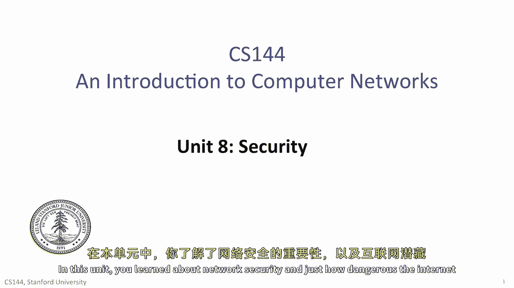
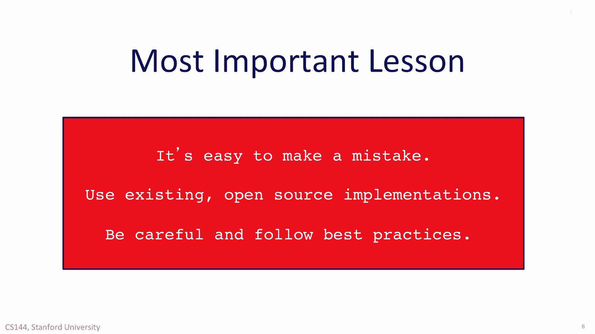

# 课程 P134：网络安全与密码学基础 🛡️

在本节课中，我们将学习网络安全的基本概念以及密码学如何帮助我们构建安全的通信系统。课程将涵盖网络威胁模型、三大安全原则，以及实现这些原则的核心密码学工具。

---

## 网络威胁模型：假设网络由对手控制 🌐

上一节我们介绍了课程概述，本节中我们来看看网络安全的根本出发点：威胁模型。

网络并非你的朋友，它由对手控制。这意味着我们必须假设通信环境是充满敌意的。

以下是网络对手可能采取的具体攻击行为：

*   **窃听**：对手可以监听你传输的任何数据。
*   **篡改**：对手可以修改或重写你的消息。
*   **抑制**：对手可以阻止你发送的消息到达目的地。
*   **欺骗**：对手可以冒充他人，也可以冒充你。
*   **中间人攻击**：对手可以拦截你的通信流量，然后再转发出去。
*   **劫持**：对手可以在不同网络层劫持通信，例如：
    *   在**第二层**通过以太网机制。
    *   在**第三层**通过ICMP或其他协议。
    *   在**第四层**通过向TCP流中注入新的数据段。

许多出于良好初衷设计的机制，在对手手中都可能变成强大的武器，用于窃取数据或拒绝网络服务。

---

## 三大安全原则：构建安全系统的基石 🔐

尽管威胁重重，但我们仍有希望。通过遵循三个基本的安全原则，我们可以在面对攻击时构建安全的系统。

### 1. 保密性

保密性让你能够进行秘密通信，即使他人可以读取你的消息。使用保密性，你可以在不受信任的网络上与另一方通信，并确信没有其他人能读懂你的流量。或者至少，对他人来说，解读你的流量在计算上是不可行的。

### 2. 完整性

完整性让你确信数据在传输途中未被篡改。你学习了密码学机制，可以让你以极低的成本验证一段数据是否被更改。

### 3. 真实性

通过真实性，你可以确信对方拥有一个秘密。这个秘密可以是你们事先共享的，也可以是对方能证明其拥有的。你当然无法完全确定对方的身份，但至少可以确信他拥有一个只有你信任的实体才有的秘密。

---

## 核心密码学工具 🧰

了解了安全原则后，我们来看看实现这些原则的具体工具。

### 对称加密

在对称加密中，通信双方共享一个秘密密钥。它主要用于实现**保密性**。

**核心公式**：`密文 = 加密算法(明文， 密钥)`；`明文 = 解密算法(密文， 密钥)`

#### 分组密码

分组密码将数据按固定大小的块进行转换。常见的模式包括：
*   **电子密码本模式**：存在安全风险，相同的明文块会产生相同的密文块，容易暴露模式。
*   **密码分组链接模式**：解决了ECB模式的问题，通过将前一个密文块与当前明文块混合，确保相同的明文块会产生不同的密文块。

### 密码学哈希函数

哈希函数具有易于计算，但攻击者难以生成一个能产生特定哈希值的输入的特性。这被称为**抗碰撞性**。它主要用于验证**完整性**。

**核心特性**：给定输出 `H(m)`，难以找到输入 `m`；难以找到两个不同的输入 `m1` 和 `m2`，使得 `H(m1) = H(m2)`。

### 消息认证码

MAC结合了密码学哈希和共享密钥，用于同时验证消息的**完整性**和**真实性**。使用MAC，你可以确信消息未被篡改，且发送者拥有密钥。

**警告**：生成MAC的简单方法充满风险，应非常小心。

---

## 密钥分发与公钥密码学 🔑

如何安全地共享秘密密钥？这引出了另一种密码学系统：公钥密码学。

在公钥密码学中，每个实体有一对密钥：一个**公钥**和一个**私钥**。用公钥加密的信息只能用对应的私钥解密。这样，你可以自由分发公钥，任何人都能向你发送只有你能解密的加密数据。

公钥密码学也可用于生成类似MAC的机制，称为**数字签名**。签名只能用私钥创建，但可以用公钥验证。

### 证书与信任链

证书是建立信任链以获取公钥的一种方式。例如，如果你信任苹果公司，那么由苹果公司签署的、告知你他人公钥的文件，你就可以信任并使用那个公钥与之通信。

**信任链模型**：`你信任的根证书 -> 签署 -> 中间证书 -> 签署 -> 目标实体的证书`

---

## 总结与最佳实践 ⚠️

本节课中我们一起学习了网络安全和密码学的基础知识。我试图让你了解这些重要机制的工作原理，其中包含大量细节。

然而，如果你要从本单元带走一个最重要的教训，那不应是分组密码具体如何工作，而应是：**在安全领域，犯错非常容易**。

因此，请遵循以下最佳实践：
*   **不要尝试自己实现这些密码学机制**。很容易忽略一个最终成为漏洞的细节。
*   **使用现有的、开源的密码系统实现**。
*   **使用经过长期检验和充分理解的方法**。
*   **始终保持谨慎，并遵循最佳实践**。

最后，请记住：**对手可能正在监听**。