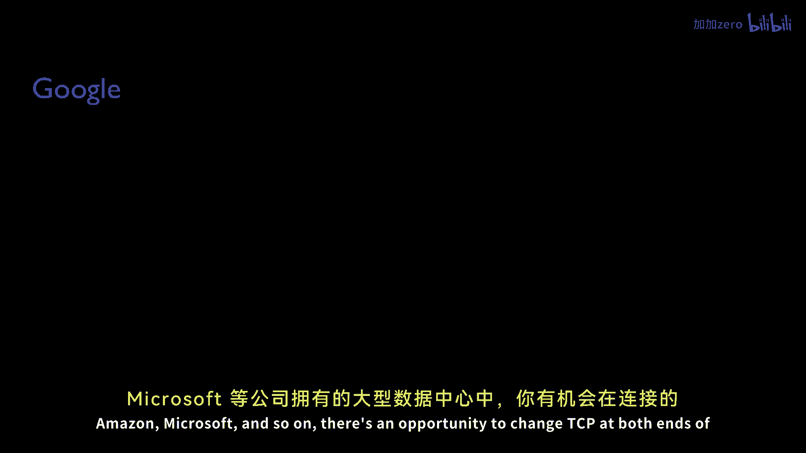
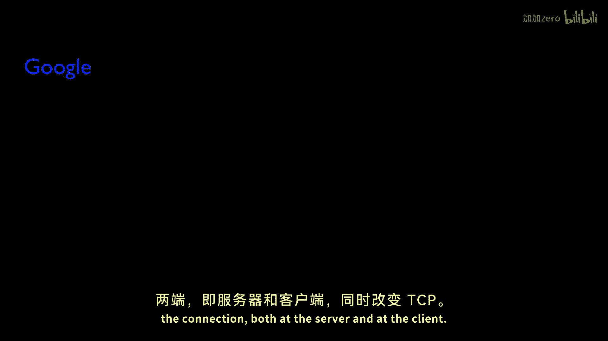

# 课程 P138：TCP拥塞控制的演进与挑战 🚀

在本节课中，我们将与Nandita Dukapati博士对话，探讨TCP及其拥塞控制算法（如TCP Reno、New Reno等）在现代网络和应用中面临的局限性，以及业界为克服这些限制所提出的改进机制。我们还将展望未来拥塞控制可能的发展方向。

---

## TCP的局限性 🔍

上一节我们介绍了课程背景，本节中我们来看看TCP及其经典拥塞控制算法（如TCP Reno、New Reno）存在哪些主要问题。

随着网络带宽的增长和各种新型应用的出现，TCP在许多方面受到了挑战。以下是几个关键问题：

*   **基于丢包的机制问题**：TCP Reno、New Reno乃至较新的Cubic等算法本质上是基于丢包的。它们持续向网络发送数据，直到网络队列溢出并触发丢包，然后才据此调整速率。问题在于，要维持高速链路（如10Gbps或200ms RTT的链路）的速率，所需的丢包率必须极低（例如每8万个报文段丢一个包）。这在十多年前物理学家通过跨洋链路传输大量数据时，就是一个大问题。
*   **短流性能不佳**：考虑Web流量或数据中心内的RPC（远程过程调用），它们通常是极短的请求-响应事务。每个TCP连接都以一个RTT的握手开销开始，如果请求或响应本身很短，这个开销就非常显著。此外，慢启动算法需要时间逐步增大拥塞窗口，这对于短流来说太慢了。测量显示，在Google服务器上，经历丢包的HTTP响应耗时大约是无丢包情况下的10倍。
*   **缓冲区大小的影响**：如今互联网交换机和路由器拥有巨大的缓冲区。早期的拥塞控制算法旨在填满缓冲区直至溢出，以追求高吞吐量。但过大的缓冲区会引入高延迟，尤其影响那些只持续一两个RTT的短事务。另一方面，缓冲区极小的设备也存在问题，它们容易导致突发性丢包，而TCP会误判为拥塞并大幅降低窗口，导致链路无法被充分利用。
*   **浏览器行为与移动网络的挑战**：现代浏览器会同时打开数十个连接以下载网页资源，这类似于“瞬时拥塞”场景，容易导致缓冲区溢出和排队延迟激增。此外，移动网络中常见的链路波动（二层问题）会欺骗TCP，使其误认为网络极度拥塞，从而触发指数退避的重传超时。

---

## 改进机制的分类 🛠️

了解了TCP的诸多挑战后，我们来看看业界提出了哪些改进机制来克服这些局限性。这些机制大致可分为三类。

以下是三类主要的改进机制：

1.  **仅需终端主机修改的机制**：这类改动只需要服务器端或客户端进行变更。例如，一系列新的拥塞控制算法，如Cubic TCP、HighSpeed TCP和Fast TCP，旨在解决大带宽延迟积网络中维持高吞吐量的问题。它们相比New Reno对丢包的反应不那么剧烈，并在有可用带宽时更快地提升速率。其中，Cubic和HighSpeed TCP仍是基于丢包的，而Fast TCP是基于延迟的算法。
2.  **仅需网络设备修改的机制**：例如，主动队列管理算法，如最近的CODEL和PIE，它们通过选择性丢包向TCP发送方发出队列正在累积的信号。
3.  **需要终端与网络协同修改的机制**：例如RCP、XCP、MaxNet或DCTCP，它们需要中间网络设备和终端系统同时更改。终端系统会获得明确的速率调整通知（如ECN的一个比特，或RCP/XCP的多字节信息）。

在这三类中，第一类（仅终端修改）最为成功，主要因为其易于部署和穿越中间设备。

---

## 针对短流和Web的优化 ⚡

上一节我们介绍了改进机制的整体分类，本节我们聚焦于第一类中那些专门为优化短流和Web性能而设计的机制。

为了加快网页加载速度，业界提出了多种机制来加速互联网上的短事务。

以下是几个关键优化示例：

*   **TCP Fast Open**：允许在TCP握手（SYN包）中携带数据。对于通常能放入一个数据包的Web请求，客户端无需等待一个完整的RTT握手完成后再发送请求，可以随SYN包一同发出，显著减少了页面加载时间。
*   **增大初始拥塞窗口**：TCP的初始拥塞窗口长期保持在3个报文段，最近在许多主流开源操作系统中已增加到10个报文段。
*   **比例速率降低**：使TCP的快速重传算法更高效。传统的快速重传算法被发现要么过于突发，要么过于保守。PRR算法平滑了快速重传和快速恢复过程，只重传确认为丢失的数据，使得短流的丢包恢复更加平滑。
*   **尾部丢包探测**：重传超时对短流的影响是灾难性的，基于RTO的恢复比快速重传/恢复慢10到100倍。TLP提案试图将RTO转化为快速重传，这对于减少短流的尾部延迟意义重大，因为短流中约70%的丢包发生在尾部。

---

## 数据中心内的TCP优化 🏢

在像Google、Facebook这样的大型数据中心中，有机会同时更改连接的两端（服务器和客户端），以解决数据中心特有的限制。

数据中心网络的问题在许多方面与互联网相似，但也有关键差异。相似点包括对延迟（尤其是尾部延迟）的极度关注，以及缓冲区过大或过小的问题。主要区别在于，在数据中心内，我们可以同时改变服务器和客户端。

以下是数据中心内的一些优化方向：

*   **更精确的定时器**：在互联网上，重传超时必须设置得非常保守（例如默认1秒），以涵盖各种网络状况。而在数据中心，网络RTT通常在微秒级，因此可以将这些定时器设置得更精确、更紧凑，这对降低RPC的尾部延迟至关重要。
*   **部署需要交换机参与的机制**：例如，微软研究院与斯坦福合作的DCTCP工作就很有意义。通过交换机提供的一个比特信息（ECN），终端主机就能更好地决策如何调整速率。

因此，更好的定时器集成（使其更紧凑）以及能够部署需要交换机参与的机制，是数据中心与互联网环境的重要区别。

---

## 未来展望：超越AIMD？ 🔮

到目前为止讨论的所有改进，都是对多年前提出的基本AIMD拥塞控制机制的修改和变体。它们都使用相同的基本机制，只是以不同方式修改滑动窗口。

那么，展望未来15到20年，我们还会继续使用今天这种慢启动加AIMD的拥塞控制吗？还是会被一个或多个工作原理迥异的新方案所取代？

这是一个很好的问题。我们真诚地希望不会仅仅继续使用基于AIMD的协议。原因在于，我们已经发现有很多方法可以做得更好。目前，我们实际上是在针对每个具体问题提供“点对点”的解决方案：

*   针对短Web流，我们优化慢启动阶段（它们很少进入AIMD阶段）。
*   针对移动网络，我们尝试不同的方法。
*   针对视频流，因其流量模式与长FTP流或短Web事务不同，我们进行特殊处理。
*   针对数据中心和移动网络，我们分别采用不同的优化。

我们真正需要的是退一步思考：能否设计出一种适用于所有网络和所有应用模式的拥塞控制，而不是把每个问题都当作特例来处理？

在这个方向上，近期MIT的Remy研究令人关注，它利用机器学习算法自适应地生成拥塞控制算法。这是一个有趣的方向，我们很期待看到这些自动生成的算法在实践中的表现。另外，尽管需要路由器协助的拥塞控制由于部署难度大而未能广泛部署，但随着OpenFlow和SDN等技术的发展，未来我们可能会看到网络在拥塞控制中扮演更积极的角色。我们对这两个方向的前景充满希望。

---

## 总结 📝

本节课中，我们一起学习了TCP拥塞控制在现代网络下面临的诸多挑战，包括基于丢包机制的局限、对短流性能的影响、缓冲区大小带来的问题以及移动网络和浏览器行为引入的新难题。我们探讨了针对这些问题的三类改进机制，并详细了解了为优化短流和Web性能而提出的具体技术，如TCP Fast Open和尾部丢包探测。我们还看到了在可控的数据中心环境中，通过调整定时器和部署如DCTCP等机制所能实现的优化。最后，我们对未来进行了展望，讨论了超越传统AIMD框架、迈向更通用和智能的拥塞控制的可能性。